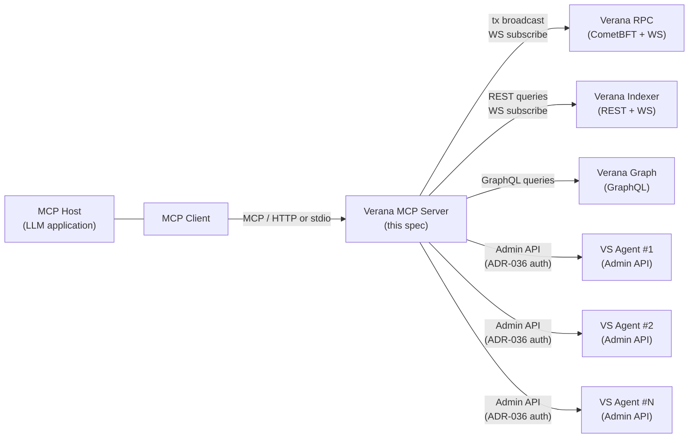

# Verana MCP Server v4 Specification

**Latest Draft:** spec v4-draft1

## Abstract

The **Verana MCP Server** is a container that exposes the full Verana stack as a [Model Context Protocol](https://modelcontextprotocol.io/) (MCP) server, enabling LLM-driven applications to programmatically operate a Corporation's Verifiable Trust footprint through a single uniform interface.

A Verana MCP Server bundles, in a single deployable unit:

- a Cosmos SDK **operator account** (derived from a BIP-39 mnemonic) bound to exactly one **Corporation** in a Verana network, acting under [`OperatorAuthorization`](https://verana-labs.github.io/verifiable-trust-vpr-spec/#operatorauthorization) grants from that Corporation;
- a **ledger client** that builds, signs, and broadcasts VPR transactions;
- an **indexer client** that issues read queries against a conformant [Verana Indexer v4](../verana-indexer/spec.md);
- a **graph client** that issues named GraphQL queries against a conformant [Verana Graph](../verana-graph/spec.md);
- a **VS-agent client** that authenticates with and drives the [Administration API](../vs-agent/spec.md#administration-api) of **every** [Verana VS Agent](../vs-agent/spec.md) operated by the bound Corporation. The set of reachable agents is enumerated dynamically from on-chain `VSOperatorAuthorization` entries owned by the bound Corporation, and each agent's Admin API origin is discovered from its DID Document per [[VSA-VTI-DIDDOC]](../vs-agent/spec.md#vsa-vti-diddoc-did-document-required-service-entries). One MCP server can drive any number of VS Agents simultaneously.

This specification defines the normative behavior of a Verana MCP Server implementation: its container configuration, its on-chain and off-chain authorization model, its transaction-confirmation contract, its transport layer, and the catalog of MCP **tools** and **resources** it exposes.

## About this Document

Reading this specification requires familiarity with:

- the [Verifiable Trust Specification](https://verana-labs.github.io/verifiable-trust-spec/);
- the [VPR Specification](https://verana-labs.github.io/verifiable-trust-vpr-spec/) — in particular the `co`, `es`, `gf`, `cs`, `pp`, `td`, `de`, `di`, `xr` modules and the [common authorization checks](https://verana-labs.github.io/verifiable-trust-vpr-spec/#authz-check-common-authorization-and-fee-grant-precondition-checks);
- the [Indexer v4 Specification](../verana-indexer/spec.md);
- the [Verana Graph Specification](../verana-graph/spec.md);
- the [VS Agent v4 Specification](../vs-agent/spec.md);
- the [Cosmos SDK `x/authz`](https://docs.cosmos.network/main/build/modules/authz) and [`x/group`](https://docs.cosmos.network/main/build/modules/group) modules;
- the [Model Context Protocol (MCP) base protocol](https://modelcontextprotocol.io/specification/2025-06-18) and its [Streamable HTTP transport](https://modelcontextprotocol.io/specification/2025-06-18/basic/transports#streamable-http) and [stdio transport](https://modelcontextprotocol.io/specification/2025-06-18/basic/transports#stdio).

All terms used in this specification are inherited from the documents above unless redefined in [Terminology](#terminology).

## Conformance

As well as sections marked as non-normative, all authoring guidelines, diagrams, examples, and notes in this specification are non-normative. Everything else in this specification is normative.

The key words MAY, MUST, MUST NOT, OPTIONAL, RECOMMENDED, REQUIRED, SHOULD, and SHOULD NOT in this document are to be interpreted as described in [BCP 14](https://datatracker.ietf.org/doc/html/bcp14) [RFC2119](https://w3c.github.io/vc-data-model/#bib-rfc2119) [RFC8174](https://w3c.github.io/vc-data-model/#bib-rfc8174) when, and only when, they appear in all capitals, as shown here.

Normative requirements are prefixed `[VMS-]` (Verana MCP Server).

### [VMS-OVR-DT] Datetime encoding

This specification inherits the datetime encoding constraint from the [Indexer v4 Specification § Datetime encoding](../verana-indexer/spec.md#datetime-encoding): every datetime value surfaced through any MCP tool or resource MUST be an ISO 8601 / RFC 3339 datetime string in UTC with the trailing `Z` designator.

## Terminology

Terms inherited from upstream specs are referenced as `[[ref: …]]`. Delta terminology specific to this specification:

- **MCP, Model Context Protocol** — the open protocol for connecting LLM applications to external tools, resources, and prompts, as specified by the [MCP base protocol](https://modelcontextprotocol.io/specification/2025-06-18).
- **MCP client** — the program (typically embedded in an LLM host application) that initiates an MCP session and consumes the server's tools and resources.
- **MCP host** — the user-facing application that hosts the LLM and the MCP client (e.g. Claude Desktop, an IDE plugin, a back-office workflow runner).
- **bound Corporation** — the unique Corporation `co` such that `co.id == VERANA_CORPORATION`, on whose behalf this MCP server acts.
- **operator account** — the Cosmos SDK account whose private key is derived from `MCP_VERANA_MNEMONIC` and which signs all on-chain transactions issued by this MCP server. Equivalent to `oauthz.operator` in [`OperatorAuthorization`](https://verana-labs.github.io/verifiable-trust-vpr-spec/#operatorauthorization).
- **delegable message** — a VPR Msg whose AUTHZ-CHECK precondition is satisfied by an `OperatorAuthorization` entry, per [[AUTHZ-CHECK-1]](https://verana-labs.github.io/verifiable-trust-vpr-spec/#authz-check-1-operator-authorization-checks).

## [VMS-OVR] Overview

*This section is non-normative.*

A Verana MCP Server is a long-lived process — typically a container — that mediates between an LLM-driven MCP client and the four runtime surfaces of the Verana stack: ledger, indexer, graph, and VS Agents.



*Figure 1 — Architecture overview. The MCP server is a single-principal mediator. Its blast radius is exactly the union of (a) on-chain Msg types granted to its operator account by the bound Corporation through `OperatorAuthorization`, and (b) the VS Agent Admin APIs that whitelist its operator account.*

### Single-principal model

A Verana MCP Server holds **exactly one** Cosmos SDK keypair, derived from `MCP_VERANA_MNEMONIC`. Every authenticated action it performs — on-chain transactions, ADR-036 challenges to VS Agent Admin APIs — is signed by this single key. The server therefore has **exactly one identity** to which both the chain and every VS Agent it talks to attribute every request.

The server is bound to **exactly one** Corporation through the `VERANA_CORPORATION` environment variable. Even if the operator account holds `OperatorAuthorization` grants from other Corporations, this MCP server instance MUST refuse to act on behalf of any Corporation other than the bound one.

### Discovery flows

The MCP server is intentionally **stateless beyond configuration**: every fact it needs at runtime is rediscovered live from the chain, the indexer, or each VS Agent's DID Document.

Three discovery flows are exercised by the server:

- **Bound Corporation resolution** — at startup, [`IDX-CO-QRY-1` Get Corporation](../verana-indexer/spec.md#idx-co-qry-1-get-corporation) is called with `VERANA_CORPORATION` to resolve the bound Corporation's `policy_address`, `did`, and `active_version`. These are cached in memory and refreshed when an indexer event indicates a `Corporation` mutation.
- **Operator capability resolution** — [`IDX-DE-QRY-1` List Operator Authorizations](../verana-indexer/spec.md#idx-de-qry-1-list-operator-authorizations) is called with `operator = own_address` and `corporation_id = VERANA_CORPORATION` to enumerate the `msg_types` this server is authorized to issue. Results are cached and refreshed on indexer events touching `OperatorAuthorization`.
- **VS Agent enumeration and admin URL resolution** — [`IDX-DE-QRY-2` List VS Operator Authorizations](../verana-indexer/spec.md#idx-de-qry-2-list-vs-operator-authorizations) with `corporation_id = VERANA_CORPORATION` enumerates the bound Corporation's `VSOperatorAuthorization` entries; for each entry, the server resolves the agent's DID Document and reads the `#vs-agent-admin-api` `LinkedDomains` service entry per [[VSA-VTI-DIDDOC]](../vs-agent/spec.md#vsa-vti-diddoc-did-document-required-service-entries) to obtain the agent's Admin API origin.

No static configuration is required for any of these — the chain and the DID layer are the source of truth.

## [VMS-CFG] Configuration

### [VMS-CFG-ENV] Container Environment Variables

The following environment variables MUST be provided when the Verana MCP Server container is started.

#### [VMS-CFG-ENV-ID] Identity and Corporation

| Variable | Required | Description |
|---|---|---|
| `MCP_VERANA_MNEMONIC` | REQUIRED | BIP-39 mnemonic used to derive the operator account that signs every on-chain transaction and every ADR-036 challenge issued by this MCP server. The derived account MUST have been granted at least one [`OperatorAuthorization`](https://verana-labs.github.io/verifiable-trust-vpr-spec/#operatorauthorization) by the bound Corporation; otherwise, all delegable Msg tools will fail [[AUTHZ-CHECK-1]](https://verana-labs.github.io/verifiable-trust-vpr-spec/#authz-check-1-operator-authorization-checks). |
| `VERANA_CORPORATION` | REQUIRED | The VPR `Corporation.id` (uint64) of the bound Corporation. The MCP server MUST refuse to issue any delegable Msg whose target Corporation is not this id, even if the operator account is also authorized by other Corporations. |

#### [VMS-CFG-ENV-NET] Network Configuration

| Variable | Required | Description |
|---|---|---|
| `VERANA_RPC` | REQUIRED | Verana CometBFT RPC endpoint URL (e.g. `https://rpc.testnet.verana.network`). The MCP server uses this for transaction broadcast, gas simulation, Cosmos SDK queries, and the CometBFT WebSocket subscription described in [[VMS-TX-WS]](#vms-tx-ws-persistent-websocket-connections). The endpoint MUST expose both the HTTPS RPC API and the corresponding WebSocket at `/websocket`. |
| `VERANA_INDEXER` | REQUIRED | Verana indexer REST API URL (e.g. `https://idx.testnet.verana.network`). The MCP server uses this for all `verana.idx.*` tool calls and for the indexer WebSocket subscription described in [[VMS-TX-WS]](#vms-tx-ws-persistent-websocket-connections). The endpoint MUST conform to [Indexer v4](../verana-indexer/spec.md). |
| `VERANA_GRAPH` | REQUIRED | Verana Graph origin URL (e.g. `https://graph.testnet.verana.network`). The MCP server uses this as the base origin for all `verana.graph.*` tool calls (resolved against the REST traversal endpoint of [[TG-QRY-5]](../verana-graph/spec.md#traversal-rest-binding) and the faceted-search REST endpoint) and for the graph block-progress WebSocket subscription described in [[VMS-TX-WS]](#vms-tx-ws-persistent-websocket-connections). The endpoint MUST conform to [Verana Graph](../verana-graph/spec.md). |
| `VERANA_CHAIN_ID` | OPTIONAL | Cosmos chain id. If unset, the MCP server SHOULD discover it via the RPC's `/status` endpoint at startup. |
| `VERANA_DENOM` | OPTIONAL | Default fee denom (e.g. `uvna`). Default: as advertised by the chain. |
| `VERANA_GAS_PRICE` | OPTIONAL | Default gas price (e.g. `0.025uvna`). Default: chain minimum. |

#### [VMS-CFG-ENV-TX] Transaction Confirmation Tuning

| Variable | Required | Description |
|---|---|---|
| `VERANA_TX_TIMEOUT_MS` | OPTIONAL | Maximum wait, in milliseconds, for a CometBFT WebSocket event confirming inclusion of a broadcast transaction in a block. If exceeded, the tool returns a `BCAST_TIMEOUT` error. Default: `30000`. |
| `VERANA_INDEXER_TIMEOUT_MS` | OPTIONAL | Hard cap, in milliseconds, on the time spent waiting for the indexer's WebSocket height cursor to reach the broadcast block height per [[VMS-TX-BARRIER]](#vms-tx-barrier-indexer-read-after-write-barrier). If exceeded, the tool returns its result with `indexer_synced: false` (the chain transaction itself has succeeded; only the read-after-write guarantee is degraded). Default: `15000`. |

#### [VMS-CFG-ENV-MCP] MCP Transport

| Variable | Required | Description |
|---|---|---|
| `MCP_TRANSPORT` | OPTIONAL | One of `http` or `stdio`. Default: `http`. See [[VMS-TRANS]](#vms-trans-transport). |
| `MCP_HTTP_PORT` | CONDITIONAL | TCP port the Streamable HTTP transport listens on. REQUIRED when `MCP_TRANSPORT=http`. Default: `3000`. |
| `MCP_HTTP_BIND` | OPTIONAL | Bind address for the HTTP listener. Default: `0.0.0.0`. |
| `MCP_BEARER_TOKEN` | CONDITIONAL | Shared secret presented by MCP clients in the `Authorization: Bearer …` header. REQUIRED when `MCP_TRANSPORT=http`. See [[VMS-AUTH-MCP]](#vms-auth-mcp-mcp-client-authentication). |

#### [VMS-CFG-ENV-LOG] Logging

| Variable | Required | Description |
|---|---|---|
| `VERANA_LOG_LEVEL` | OPTIONAL | One of `error`, `warn`, `info`, `debug`, `trace`. Default: `info`. |

## [VMS-AUTH] Authorization Model

The MCP server enforces three distinct authorization layers, in this order:

1. **MCP-client → MCP-server** — gates which callers may reach the MCP surface at all ([[VMS-AUTH-MCP]](#vms-auth-mcp-mcp-client-authentication)).
2. **Operator-account → Verana ledger** — gates which on-chain Msgs the operator may execute ([[VMS-AUTH-CHAIN]](#vms-auth-chain-on-chain-authorization)).
3. **Operator-account → VS Agent Admin API** — gates which VS Agents the operator may control and which methods on each ([[VMS-AUTH-VSA]](#vms-auth-vsa-vs-agent-admin-api-authentication)).

### [VMS-AUTH-MCP] MCP Client Authentication

The MCP transport layer authenticates the **MCP client** to the MCP server. It does NOT authenticate any human end-user behind the client.

- **HTTP transport:** every MCP request MUST carry `Authorization: Bearer <MCP_BEARER_TOKEN>`. Requests with a missing, malformed, or non-matching token MUST be rejected with HTTP 401 and MUST NOT reach any tool implementation. The token is opaque, MUST be at least 32 bytes of entropy, and MUST be protected at rest. TLS termination is the responsibility of an external reverse proxy; the MCP server itself MAY listen on plain HTTP and rely on the proxy.
- **Stdio transport:** the MCP server is launched as a subprocess by the MCP client; trust is implicit in the process model. No additional authentication is performed.

> Because the MCP server holds the operator account's private key, any party that successfully authenticates to the MCP server inherits the full set of capabilities granted to that account on chain and at every whitelisted VS Agent. Operators MUST treat `MCP_BEARER_TOKEN` and `MCP_VERANA_MNEMONIC` with equivalent secrecy.

### [VMS-AUTH-CHAIN] On-Chain Authorization

The MCP server's authority on the Verana ledger is bounded entirely by the [`OperatorAuthorization`](https://verana-labs.github.io/verifiable-trust-vpr-spec/#operatorauthorization) entries granted to its operator account by the bound Corporation.

[VMS-AUTH-CHAIN-1] At startup, and on every indexer event affecting `OperatorAuthorization` for the operator account, the MCP server MUST refresh its cached set of authorized `msg_types` via [`IDX-DE-QRY-1` List Operator Authorizations](../verana-indexer/spec.md#idx-de-qry-1-list-operator-authorizations) with `operator = own_address` and `corporation_id = VERANA_CORPORATION`.

[VMS-AUTH-CHAIN-2] For every delegable Msg tool invocation, the MCP server MUST check, before signing or broadcasting, that the corresponding `msg_type` is present in the cached authorization set. If it is not, the tool MUST fail fast with a `NOT_AUTHORIZED` error and MUST NOT submit a transaction.

[VMS-AUTH-CHAIN-3] Each delegable Msg is built with `corporation` set to the bound Corporation's `policy_address` and `operator` set to the operator account's address. Signing and broadcasting follow the chain implementation's required pattern for delegated execution (typically wrapping the inner Msg in `cosmos.authz.v1beta1.MsgExec` signed by the operator alone). The resulting on-chain checks performed by the chain are described by [[AUTHZ-CHECK]](https://verana-labs.github.io/verifiable-trust-vpr-spec/#authz-check-common-authorization-and-fee-grant-precondition-checks); the MCP server itself does not duplicate those checks beyond [VMS-AUTH-CHAIN-2].

[VMS-AUTH-CHAIN-4] If a `FeeGrant` from the bound Corporation to the operator account exists for the Msg type at hand, the MCP server SHOULD broadcast the transaction with the fee grant set as the fee payer, so that gas is paid by the bound Corporation. Discovery follows [[AUTHZ-CHECK-2]](https://verana-labs.github.io/verifiable-trust-vpr-spec/#authz-check-2-fee-grant-checks).

[VMS-AUTH-CHAIN-5] The MCP server MUST refuse any tool invocation whose target Corporation is not the bound one, even when the operator account holds an applicable `OperatorAuthorization` from another Corporation. This is a defensive boundary against accidental cross-Corporation action.

### [VMS-AUTH-VSA] VS Agent Admin API Authentication

For every `verana.vsa.*` tool invocation, the MCP server addresses one specific VS Agent identified by its DID, authenticates as the operator account, and forwards the call.

[VMS-AUTH-VSA-1] The agent's Admin API origin MUST be discovered by resolving the agent's DID Document and reading the `serviceEndpoint` of its `#vs-agent-admin-api` `LinkedDomains` entry per [[VSA-VTI-DIDDOC]](../vs-agent/spec.md#vsa-vti-diddoc-did-document-required-service-entries). Static configuration mapping `agent_did → URL` MUST NOT be required. The resolved origin MAY be cached and SHOULD be refreshed when the agent's DID Document changes.

[VMS-AUTH-VSA-2] If the agent's DID Document does not expose a `#vs-agent-admin-api` `LinkedDomains` service entry, the tool MUST fail fast with a `VSA_ADMIN_URL_NOT_FOUND` error.

[VMS-AUTH-VSA-3] Authentication to the Admin API uses an [ADR-036 signed message](https://docs.cosmos.network/main/build/architecture/adr-036-arbitrary-signature) challenge issued by the operator account, per the VS Agent's [Authentication](../vs-agent/spec.md#authentication-and-authorization) section. The MCP server MUST NOT cache long-lived bearer tokens issued by the agent across distinct tool invocations beyond their server-declared expiry.

[VMS-AUTH-VSA-4] The MCP server MUST refuse to address any VS Agent whose containing `VSOperatorAuthorization` is not owned by the bound Corporation, regardless of whether the agent's DID Document is reachable.

## [VMS-TX] Transaction Flow

This section specifies the contract by which delegable Msg tools build, sign, broadcast, and confirm a single on-chain transaction. It is invoked once per tool invocation in the `verana.ledger.*` family.

### [VMS-TX-WS] Persistent WebSocket Connections

The MCP server MUST maintain three long-lived WebSocket connections at all times:

- **CometBFT RPC WebSocket** — `wss://VERANA_RPC/websocket`. Used to subscribe, per transaction, to `tm.event='Tx' AND tx.hash='<HEX_HASH>'` filters and receive the corresponding `tx_result` event when the tx is included in a block.
- **Indexer WebSocket** — `WS VERANA_INDEXER/indexer/v1/subscribe` per [`IDX-INDEXER-SUB-1`](../verana-indexer/spec.md#idx-indexer-sub-1-subscribe-indexer-events). After the server's `ready` message, the MCP server sends `{ "action": "subscribe", "corporationId": bound_corp.id }`, where `bound_corp.id` is the stable numeric `id` of the bound `Corporation` resolved at startup. The corporation-scoped subscription delivers events for the Corporation itself, every `Ecosystem` and `Participant` it owns (transitively including their embedded sub-entities), and every `Participant` whose `validator_participant_id` resolves to a Participant owned by the bound Corporation — without any client-side DID enumeration or churn handling. Multiple MCP-server instances bound to the same Corporation therefore observe the same stream. Used as the primary signal for indexer catch-up (read-after-write barrier).
- **Graph block-progress WebSocket** — `WS VERANA_GRAPH/graph/v1/blocks/subscribe` per [[TG-BPS-1]](../verana-graph/spec.md#block-progress-subscription). After the server's `ready` message (per [[TG-BPS-2]](../verana-graph/spec.md#block-progress-subscription)) the MCP server initialises its graph height cursor from `ready.block` and advances it on every received `block` notification per [[TG-BPS-3]](../verana-graph/spec.md#block-progress-subscription). The connection is anonymous and forward-only; the MCP server sends no client-to-server payload after the WebSocket handshake. The graph height cursor is **informational only** — surfaced through [[VMS-TOOLS-WALLET]](#vms-tools-wallet-wallet-tools) and [[VMS-RES-CATALOG]](#vms-res-catalog-resource-catalog) so MCP clients can compare graph freshness to indexer freshness — and is **not** part of the read-after-write barrier of [[VMS-TX-BARRIER]](#vms-tx-barrier-indexer-read-after-write-barrier).

All three connections MUST be re-established on failure with exponential backoff (initial 1 s, max 30 s, jitter ±20 %). The indexer and graph WSs MUST treat the absence of either a `ready` or a `block` notification within `2 × blockIntervalMs` of the previously received notification as a presumed-broken connection — per [Heartbeat (indexer events)](../verana-indexer/spec.md#heartbeat-indexer-events) for the indexer and [[TG-BPS-7]](../verana-graph/spec.md#block-progress-subscription) for the graph; the CometBFT RPC WS relies on the chain implementation's transport-level keepalive and is reconnected on connection-level error. While the CometBFT WebSocket is unavailable, ledger Msg tools cannot confirm a broadcast and will eventually return `BCAST_TIMEOUT` per [[VMS-TX-BCAST]](#vms-tx-bcast-broadcast-and-chain-confirmation). While the indexer WebSocket is unavailable, the read-after-write barrier per [[VMS-TX-BARRIER]](#vms-tx-barrier-indexer-read-after-write-barrier) waits for the reconnect (whose `ready` message advances the height cursor); if the reconnect does not raise the cursor to the broadcast height within `VERANA_INDEXER_TIMEOUT_MS`, the tool returns `indexer_synced: false`. While the graph WebSocket is unavailable, the graph height cursor stales but no tool's success path is affected; `verana://own/status` reports the staleness via `graph_ws.connected = false`. There is no HTTP polling fallback for any of the three connections.

### [VMS-TX-BUILD] Message Construction and Signing

[VMS-TX-BUILD-1] For each delegable Msg tool invocation, the MCP server MUST build the inner Msg with:

- `corporation` set to `bound_corp.policy_address`;
- `operator` set to the operator account's bech32 address;
- all tool-specific fields populated from the tool's input arguments.

[VMS-TX-BUILD-2] The MCP server MUST sign the resulting transaction using the operator account's private key, following the chain implementation's required signing pattern for delegated execution. For chains that implement delegated execution through `cosmos.authz.v1beta1.MsgExec`, the inner Msg is wrapped in a `MsgExec` whose `grantee` is the operator account, the outer transaction is signed by the operator alone, and the chain's antehandler enforces [[AUTHZ-CHECK-1]](https://verana-labs.github.io/verifiable-trust-vpr-spec/#authz-check-1-operator-authorization-checks) on the inner Msg.

[VMS-TX-BUILD-3] Fee grant. Before signing, the MCP server SHOULD determine whether the bound `Corporation` has granted the operator account a fee allowance covering the current inner Msg's type, per the VPR [`FeeGrant`](https://verana-labs.github.io/verifiable-trust-vpr-spec/#feegrant) entity and the [[AUTHZ-CHECK-2]](https://verana-labs.github.io/verifiable-trust-vpr-spec/#authz-check-2-fee-grant-checks) precondition. A relevant grant exists iff a `FeeGrant` `fg` satisfies all of:

- `fg.grantor_corporation_id` equals `bound_corp.id`;
- `fg.grantee` equals the operator account;
- the current inner Msg's type is in `fg.msg_types`;
- `fg` is currently active — either `fg.expiration` is unset, or `fg.expiration` is strictly greater than `now()` (after the auto-renewal that `[AUTHZ-CHECK-2]` performs when `fg.period` is set);
- if `fg.spend_limit` is set, `fg.remaining_spend` covers the estimated transaction fees for the chosen denom.

If a relevant grant exists, the MCP server MUST set the outer transaction's `Tx.AuthInfo.Fee.granter` to `bound_corp.policy_address`. The chain's antehandler then runs `[AUTHZ-CHECK-2]` and deducts the fees from the Corporation's account. No additional Msg is added to the transaction — the Cosmos `granter`-field convention is what triggers the VPR fee-grant check.

If no relevant grant exists, the MCP server MUST leave `Tx.AuthInfo.Fee.granter` unset; the operator account pays the fees from its own balance, subject to `OperatorAuthorization.fee_spend_limit` if set.

**Discovery and freshness.** The MCP server SHOULD maintain its view of the active `FeeGrant` for `(bound_corp.id, operator)` from the indexer event stream, applying [`[MOD-DE-MSG-1]`](https://verana-labs.github.io/verifiable-trust-vpr-spec/#mod-de-msg-1-grant-fee-allowance) Grant Fee Allowance and [`[MOD-DE-MSG-2]`](https://verana-labs.github.io/verifiable-trust-vpr-spec/#mod-de-msg-2-revoke-fee-allowance) Revoke Fee Allowance events delivered by [`IDX-INDEXER-SUB-1`](../verana-indexer/spec.md#idx-indexer-sub-1-subscribe-indexer-events) to refresh the cached value. At startup the MCP server MAY bootstrap the cache from a chain-side query or from the indexer's catch-up endpoint (`/indexer/v1/events?corporation_id=<bound_corp.id>` filtered to the two Delegation-module event types).

**Fallback on antehandler rejection.** If a broadcast with `granter` set fails at the antehandler with an error indicating the grant has expired, has exhausted its `remaining_spend`, or no longer covers the message type, the MCP server SHOULD retry the same transaction exactly once with `Tx.AuthInfo.Fee.granter` unset (so the operator pays from its own balance) before returning a structured error to the caller. The retry MUST NOT recompute `tx_hash` against a different signed-body shape that has already been broadcast: the granter field is part of the signed bytes, so the retry produces a distinct `tx_hash` and a distinct CometBFT subscription per [[VMS-TX-BCAST]](#vms-tx-bcast-broadcast-and-chain-confirmation).

> The parallel `with_feegrant` path on `ParticipantAuthorizationRecord` (per [[AUTHZ-CHECK-4]](https://verana-labs.github.io/verifiable-trust-vpr-spec/#authz-check-4-vs-operator-fee-grant-checks)) applies only to vs-operator-authorized messages and is out of scope for the MCP server's general-purpose `OperatorAuthorization` flow; vs-operator-authorized broadcasting is the concern of the VS Agent.

[VMS-TX-BUILD-4] Gas estimation SHOULD use the chain's transaction simulation endpoint (`/cosmos/tx/v1beta1/simulate`). The transaction's `gas_wanted` SHOULD be set to `simulated_gas × gas_adjustment` with `gas_adjustment = 1.5` by default. Simulation MUST be performed with `Tx.AuthInfo.Fee.granter` set to the same value the broadcast will use (per [[VMS-TX-BUILD-3]](#vms-tx-build-message-construction-and-signing)) so the simulated gas reflects the fee-grant antehandler path actually exercised on broadcast.

### [VMS-TX-BCAST] Broadcast and Chain Confirmation

For each delegable Msg tool invocation, the MCP server MUST execute the following sequence in order:

1. Compute the canonical `tx_hash` of the signed transaction bytes.
2. **Pre-arm chain confirmation:** issue a `subscribe` JSON-RPC call on the CometBFT WebSocket with query `tm.event='Tx' AND tx.hash='<tx_hash>'`. This subscription MUST be in place before step 3.
3. **Broadcast** the transaction with `BROADCAST_MODE_SYNC`. If the immediate response carries a non-zero `code` (mempool rejection — for example, sequence mismatch, insufficient fees, or AUTHZ-CHECK failure detected by the antehandler), unsubscribe and return the error to the MCP client immediately, without further waiting.
4. **Wait** on the CometBFT WebSocket subscription for the tx event. The event payload includes `result.code`, `result.gas_used`, `result.gas_wanted`, `result.events`, `result.log`, and `block.height` (renamed `block_height` in the tool response). If no event arrives within `VERANA_TX_TIMEOUT_MS`, return a `BCAST_TIMEOUT` error.
5. **If `result.code != 0`** (chain rejected the tx during execution), return the error to the MCP client. No indexer barrier is required: nothing was committed.
6. **If `result.code == 0`**, proceed to [[VMS-TX-BARRIER]](#vms-tx-barrier-indexer-read-after-write-barrier).

### [VMS-TX-BARRIER] Indexer Read-After-Write Barrier

After chain confirmation at block height `B`, the MCP server MUST guarantee that any subsequent `verana.idx.*` or `verana.graph.*` tool call issued by the same MCP client through the same MCP session reflects state at height `B` or later, before returning to the MCP client.

The barrier is **WebSocket-only**, satisfied as soon as the MCP server's tracked **indexer height cursor** is `>= B`. The cursor is maintained from the running indexer WS subscription (see [[VMS-TX-WS]](#vms-tx-ws-persistent-websocket-connections) and [`IDX-INDEXER-SUB-1`](../verana-indexer/spec.md#idx-indexer-sub-1-subscribe-indexer-events)) via two signals:

- Each `block` envelope received advances the cursor to `envelope.block`. Block envelopes are emitted for **every** processed block — with empty `events[]` acting as heartbeat when no event in the bound Corporation's scope occurred at that block — so the cursor advances at the chain's block-time cadence independent of the transaction's content.
- Each `ready` message received on (re)connect advances the cursor to `ready.block - 1` (because `ready.block` is the *next* block the server will deliver, so the indexer has already finished `ready.block - 1`).

The barrier completes the first moment the cursor is `>= B`. In typical operation the cursor has already passed `B` by the time the CometBFT `tx_result` event arrives, and the barrier completes with no wait.

While the indexer WebSocket is disconnected the MCP server MUST reconnect with the exponential backoff specified in [[VMS-TX-WS]](#vms-tx-ws-persistent-websocket-connections); each successful reconnect's `ready` message refreshes the cursor and may by itself satisfy the barrier. **Polling is not an alternative**: there is no HTTP fallback path, the WebSocket is the sole signal, and ledger Msg tools simply wait on the reconnect.

If `VERANA_INDEXER_TIMEOUT_MS` elapses without the cursor reaching `B`, the MCP server MUST return the tool's normal success response with the additional field `indexer_synced: false`, indicating that the chain transaction itself succeeded but the read-after-write guarantee is degraded. It MUST NOT raise an error in this case: the chain has already committed the tx and degrading silently is preferable to misleading the LLM into believing the write failed.

> The single-signal design is enabled by two properties of [`IDX-INDEXER-SUB-1`](../verana-indexer/spec.md#idx-indexer-sub-1-subscribe-indexer-events):
>
> - Block envelopes are emitted for **every** processed block — block production itself is the heartbeat, so the cursor advances at every block regardless of whether the bound Corporation's scope produced any event.
> - The `ready` message on each (re)connect carries the next-block-to-be-delivered, which doubles as a monotonic indexer-height oracle without any extra HTTP call.
>
> Together these make the indexer WebSocket a strict superset of the height oracle that an HTTP polling path would provide.

### [VMS-TX-RESPONSE] Tool Response Envelope

A successful ledger Msg tool MUST return the following envelope to the MCP client:

```json
{
  "tx_hash": "string (HEX, 64 chars)",
  "block_height": "integer",
  "code": 0,
  "gas_used": "integer",
  "gas_wanted": "integer",
  "raw_log": "string",
  "events": "array of Cosmos events",
  "indexer_synced": "boolean"
}
```

A failed ledger Msg tool MUST return an MCP-level error per [[VMS-ERR]](#vms-err-error-model) carrying at least `tx_hash` (when broadcast was attempted), the failure stage (`build` | `simulate` | `broadcast` | `chain` | `timeout` | `barrier`), and the underlying chain error code and log when applicable.

## [VMS-BOOT] Bootstrap Sequence

When the Verana MCP Server container starts, it MUST execute the following steps in order. Any step that fails irrecoverably MUST cause the process to exit with a non-zero status code; the server MUST NOT enter the `serving` state until all REQUIRED steps have succeeded.

1. **Load configuration.** Read every environment variable defined in [[VMS-CFG]](#vms-cfg-configuration) and validate it. Missing REQUIRED variables, or REQUIRED-when-`MCP_TRANSPORT=http` variables when HTTP is selected, MUST cause an immediate exit.
2. **Derive operator account.** Derive the operator account from `MCP_VERANA_MNEMONIC` using the chain's coin type and standard BIP-44 derivation path. Log the resulting bech32 address at `info` level.
3. **Connect to chain RPC.** Issue a `/status` call against `VERANA_RPC` to validate connectivity and resolve `chain_id` (overrides `VERANA_CHAIN_ID` if both are present and consistent; aborts on mismatch). Fetch the operator account's `account_number` and current `sequence` and cache them.
4. **Resolve bound Corporation.** Call [`IDX-CO-QRY-1` Get Corporation](../verana-indexer/spec.md#idx-co-qry-1-get-corporation) with `id = VERANA_CORPORATION` against `VERANA_INDEXER`. Cache `policy_address`, `did`, `active_version`, and `language`. If no Corporation exists with that id, exit immediately with a clear diagnostic.
5. **Resolve operator capabilities.** Call [`IDX-DE-QRY-1` List Operator Authorizations](../verana-indexer/spec.md#idx-de-qry-1-list-operator-authorizations) with `corporation_id = VERANA_CORPORATION` and `operator = own_address`. If no authorization exists, log a `warn`-level message ("MCP server is unauthorised: every delegable Msg tool will fail until an `OperatorAuthorization` is granted") but continue; read-only tools (indexer, graph, Cosmos read-only) remain available.
6. **Open persistent WebSocket connections** per [[VMS-TX-WS]](#vms-tx-ws-persistent-websocket-connections). All three connections (CometBFT RPC, indexer, graph block-progress) MUST reach the `connected` state before proceeding; if any of them fails after the bootstrap retry budget, exit with a non-zero status code.
7. **Start MCP transport.** Per `MCP_TRANSPORT`, start either the Streamable HTTP listener on `MCP_HTTP_BIND:MCP_HTTP_PORT` or the stdio transport on `stdin`/`stdout`. Once the transport accepts its first MCP `initialize` request, the server is in the `serving` state.

After bootstrap, the MCP server SHOULD continuously refresh its caches (bound Corporation, operator capabilities, enumerated VS Agents) on indexer WebSocket events whose `payload.entity_type` indicates a relevant change.

## [VMS-TRANS] Transport

The MCP server MUST implement the [Model Context Protocol (MCP) base protocol](https://modelcontextprotocol.io/specification/2025-06-18) over exactly one of the following transports, selected at startup by `MCP_TRANSPORT`.

### [VMS-TRANS-HTTP] Streamable HTTP

When `MCP_TRANSPORT=http`, the MCP server MUST conform to the [MCP Streamable HTTP transport](https://modelcontextprotocol.io/specification/2025-06-18/basic/transports#streamable-http).

[VMS-TRANS-HTTP-1] The server MUST listen on `MCP_HTTP_BIND:MCP_HTTP_PORT` and expose the MCP endpoint at `POST /mcp`. The endpoint MUST accept JSON-RPC 2.0 requests in the request body, optionally upgrading the response to a Server-Sent Events stream when the client supplies `Accept: text/event-stream` per the MCP transport spec.

[VMS-TRANS-HTTP-2] Every request to `POST /mcp` MUST carry the bearer-token header `Authorization: Bearer <MCP_BEARER_TOKEN>`. Requests without a matching token MUST be rejected with HTTP 401 before any MCP handling.

[VMS-TRANS-HTTP-3] The server SHOULD implement [MCP session management](https://modelcontextprotocol.io/specification/2025-06-18/basic/transports#session-management) via the `Mcp-Session-Id` header so that a long-running MCP client maintains continuity of read-after-write guarantees across requests within the same session.

[VMS-TRANS-HTTP-4] The server SHOULD expose a liveness probe at `GET /healthz` that returns `200 OK` once bootstrap is complete and `503 Service Unavailable` otherwise. The liveness probe MUST NOT require authentication and MUST NOT expose any privileged information beyond a static success indicator.

### [VMS-TRANS-STDIO] Stdio

When `MCP_TRANSPORT=stdio`, the MCP server MUST conform to the [MCP stdio transport](https://modelcontextprotocol.io/specification/2025-06-18/basic/transports#stdio).

[VMS-TRANS-STDIO-1] The server MUST read newline-delimited JSON-RPC 2.0 messages from `stdin` and write newline-delimited JSON-RPC 2.0 responses to `stdout`. Diagnostic logs MUST be written to `stderr` only — never to `stdout`.

[VMS-TRANS-STDIO-2] No additional authentication is performed. The server inherits its trust boundary from the parent process.

[VMS-TRANS-STDIO-3] When `MCP_TRANSPORT=stdio`, the variables `MCP_HTTP_PORT`, `MCP_HTTP_BIND`, and `MCP_BEARER_TOKEN` MUST be ignored if set. The server MUST NOT open any network listening socket for MCP traffic.

## [VMS-TOOLS] Tools

This section catalogs every MCP tool exposed by the Verana MCP Server. Tools are grouped by surface; each catalog row names the tool, links to the upstream specification that defines its semantics, and indicates the on-chain authorization required (where applicable). The MCP server MUST NOT define request or response shapes that diverge from the upstream specifications referenced — its role is to expose the upstream surface verbatim, with the operator-binding rules described below.

### [VMS-TOOLS-NAMING] Naming Convention

[VMS-TOOLS-NAMING-1] Every MCP tool name MUST follow the pattern `verana.<surface>.<module>.<verb>` where:

- `<surface>` is one of `ledger`, `idx`, `graph`, `vsa`, `cosmos`, `wallet`;
- `<module>` is the upstream module identifier (e.g. `co`, `es`, `gf`, `cs`, `pp`, `td`, `de`, `di` for ledger and indexer surfaces; the entity surface for graph; the agent module for VS Agent; the Cosmos module for cosmos);
- `<verb>` is camelCase and reflects the upstream method name without redundant prefixes (e.g. `createCredentialSchema`, not `csCreateCredentialSchema`).

[VMS-TOOLS-NAMING-2] The set of tool names exposed by a conformant MCP server is exactly the union of the catalogs in [[VMS-TOOLS-LEDGER]](#vms-tools-ledger-ledger-tools-vpr-msgs), [[VMS-TOOLS-IDX]](#vms-tools-idx-indexer-tools), [[VMS-TOOLS-GRAPH]](#vms-tools-graph-graph-tools), [[VMS-TOOLS-VSA]](#vms-tools-vsa-vs-agent-tools), [[VMS-TOOLS-COSMOS]](#vms-tools-cosmos-cosmos-read-only-tools), and [[VMS-TOOLS-WALLET]](#vms-tools-wallet-wallet-tools), filtered by the operator-capability gate of [[VMS-TOOLS-ENV-FILTER]](#vms-tools-env-filter-tool-availability).

### [VMS-TOOLS-ENV] Request and Response Envelope

#### [VMS-TOOLS-ENV-INPUT] Tool Input Schema

[VMS-TOOLS-ENV-INPUT-1] Every tool's `inputSchema` (returned by MCP `tools/list`) MUST be a JSON Schema that mirrors the input shape of the upstream method referenced in the catalog row, with the following normalisations:

- For ledger Msg tools (`verana.ledger.*`), the operator-bound fields `corporation` and `operator` MUST NOT appear in the `inputSchema`. They are auto-populated per [[VMS-TX-BUILD-1]](#vms-tx-build-message-construction-and-signing).
- For indexer tools (`verana.idx.*`), parameters appearing in the upstream URL path (e.g. `{id}`) MUST appear as required JSON properties in `inputSchema`; parameters appearing in the upstream query string MUST appear as optional JSON properties unless the upstream marks them required.
- For VS Agent tools (`verana.vsa.*`), every tool MUST accept an `agent_did` string property (the DID of the target VS Agent). All remaining properties mirror the upstream Admin API method's request body.

#### [VMS-TOOLS-ENV-OUTPUT] Tool Output Schema

[VMS-TOOLS-ENV-OUTPUT-1] Every tool's response is a JSON object. Read-only tools (`verana.idx.*`, `verana.graph.*`, `verana.vsa.*` queries, `verana.cosmos.*`, `verana.wallet.*`) MUST return the upstream response body verbatim — the MCP server MUST NOT strip, rename, or augment fields.

[VMS-TOOLS-ENV-OUTPUT-2] Ledger Msg tools (`verana.ledger.*`) MUST return the envelope defined by [[VMS-TX-RESPONSE]](#vms-tx-response-tool-response-envelope).

[VMS-TOOLS-ENV-OUTPUT-3] VS Agent action tools that mutate agent state MUST return the upstream response body verbatim. The MCP server MUST NOT augment these responses with on-chain confirmation fields, since VS Agent admin actions do not in general involve a chain transaction.

#### [VMS-TOOLS-ENV-FILTER] Tool Availability

[VMS-TOOLS-ENV-FILTER-1] The MCP server MUST advertise (via MCP `tools/list`) only those `verana.ledger.*` tools whose `msg_type` is present in the cached set of `OperatorAuthorization.msg_types` resolved per [[VMS-AUTH-CHAIN-1]](#vms-auth-chain-on-chain-authorization). Tools for non-authorized Msgs MUST NOT appear in `tools/list`. The server MUST refresh the advertised set on every `OperatorAuthorization` indexer event affecting the operator account.

[VMS-TOOLS-ENV-FILTER-2] Read-only tools (`verana.idx.*`, `verana.graph.*`, `verana.cosmos.*`, `verana.wallet.*`) MUST always be advertised: they require no on-chain authorization.

[VMS-TOOLS-ENV-FILTER-3] `verana.vsa.*` tools MUST always be advertised. Discovery of the addressable VS Agent set is the caller's responsibility, surfaced through `verana.idx.de.listVSOperatorAuthorizations` and `verana://own/vs-agents` per [[VMS-RES-CATALOG]](#vms-res-catalog-resource-catalog).

### [VMS-TOOLS-LEDGER] Ledger Tools (VPR Msgs)

Ledger tools MUST follow the transaction-flow contract of [[VMS-TX]](#vms-tx-transaction-flow). The MCP server MUST expose only the **delegable** subset of VPR Msgs — those whose upstream `Signers` column is `corporation + operator` — plus `MOD-CO-MSG-1` (`createNewCorporation`) which is open to any account.

Msgs marked `governance proposal` in the upstream specification MUST NOT be exposed: they require a chain-level governance vote and are out of scope for an operator-driven MCP server.

Msgs marked `module call` (e.g. `MOD-DE-MSG-1` Grant Fee Allowance, `MOD-DE-MSG-5` Grant VS Operator Authorization) MUST NOT be exposed directly: they are reachable only through their parent delegable Msgs.

#### [VMS-TOOLS-LEDGER-CO] Corporation Module

| Tool | Upstream Msg | Description |
|---|---|---|
| `verana.ledger.co.createNewCorporation` | [`MOD-CO-MSG-1`](https://verana-labs.github.io/verifiable-trust-vpr-spec/#mod-co-msg-1-create-new-corporation) | Atomically create a Cosmos SDK group + group policy and a `Corporation` VPR entry bound to it. Open to any account; typically used during initial corporate bootstrap. The newly-created Corporation's `policy_address` becomes the on-chain account that subsequently signs as `corporation` for delegable Msgs. |
| `verana.ledger.co.updateCorporation` | [`MOD-CO-MSG-2`](https://verana-labs.github.io/verifiable-trust-vpr-spec/#mod-co-msg-2-update-corporation) | Rotate the bound Corporation's `did`. |

#### [VMS-TOOLS-LEDGER-ES] Ecosystem Module

| Tool | Upstream Msg | Description |
|---|---|---|
| `verana.ledger.es.createEcosystem` | [`MOD-ES-MSG-1`](https://verana-labs.github.io/verifiable-trust-vpr-spec/#mod-es-msg-1-create-new-ecosystem) | Create a new `Ecosystem` controlled by the bound Corporation. |
| `verana.ledger.es.updateEcosystem` | [`MOD-ES-MSG-2`](https://verana-labs.github.io/verifiable-trust-vpr-spec/#mod-es-msg-2-update-ecosystem) | Update an `Ecosystem` controlled by the bound Corporation. |
| `verana.ledger.es.archiveEcosystem` | [`MOD-ES-MSG-3`](https://verana-labs.github.io/verifiable-trust-vpr-spec/#mod-es-msg-3-archive-ecosystem) | Archive an `Ecosystem` controlled by the bound Corporation. |

#### [VMS-TOOLS-LEDGER-GF] Governance Framework Module

| Tool | Upstream Msg | Description |
|---|---|---|
| `verana.ledger.gf.addGovernanceFrameworkDocument` | [`MOD-GF-MSG-1`](https://verana-labs.github.io/verifiable-trust-vpr-spec/#mod-gf-msg-1-add-governance-framework-document) | Append a new `GovernanceFrameworkDocument` to the in-progress GFV of the bound Corporation's CGF, or of an Ecosystem's EGF. |
| `verana.ledger.gf.increaseActiveGovernanceFrameworkVersion` | [`MOD-GF-MSG-2`](https://verana-labs.github.io/verifiable-trust-vpr-spec/#mod-gf-msg-2-increase-active-governance-framework-version) | Activate the next version of the bound Corporation's CGF, or of an Ecosystem's EGF. |

#### [VMS-TOOLS-LEDGER-CS] Credential Schema Module

| Tool | Upstream Msg | Description |
|---|---|---|
| `verana.ledger.cs.createCredentialSchema` | [`MOD-CS-MSG-1`](https://verana-labs.github.io/verifiable-trust-vpr-spec/#mod-cs-msg-1-create-new-credential-schema) | Create a new `CredentialSchema` owned by an Ecosystem of the bound Corporation. |
| `verana.ledger.cs.updateCredentialSchema` | [`MOD-CS-MSG-2`](https://verana-labs.github.io/verifiable-trust-vpr-spec/#mod-cs-msg-2-update-credential-schema) | Update a `CredentialSchema` owned by an Ecosystem of the bound Corporation. |
| `verana.ledger.cs.archiveCredentialSchema` | [`MOD-CS-MSG-3`](https://verana-labs.github.io/verifiable-trust-vpr-spec/#mod-cs-msg-3-archive-credential-schema) | Archive a `CredentialSchema` owned by an Ecosystem of the bound Corporation. |

#### [VMS-TOOLS-LEDGER-PP] Participant Module

| Tool | Upstream Msg | Description |
|---|---|---|
| `verana.ledger.pp.startParticipantOp` | [`MOD-PP-MSG-1`](https://verana-labs.github.io/verifiable-trust-vpr-spec/#mod-pp-msg-1-start-participant-op) | Start a Participant Onboarding Process for a candidate Participant under the bound Corporation. |
| `verana.ledger.pp.renewParticipantOp` | [`MOD-PP-MSG-2`](https://verana-labs.github.io/verifiable-trust-vpr-spec/#mod-pp-msg-2-renew-participant-op) | Renew an in-progress Onboarding Process. |
| `verana.ledger.pp.setParticipantOpToValidated` | [`MOD-PP-MSG-3`](https://verana-labs.github.io/verifiable-trust-vpr-spec/#mod-pp-msg-3-set-participant-op-to-validated) | Mark a Participant Onboarding Process as validated, transitioning the candidate to an active `Participant`. |
| `verana.ledger.pp.cancelParticipantOpLastRequest` | [`MOD-PP-MSG-6`](https://verana-labs.github.io/verifiable-trust-vpr-spec/#mod-pp-msg-6-cancel-participant-op-last-request) | Cancel the most recent request in a Participant Onboarding Process. |
| `verana.ledger.pp.createRootParticipant` | [`MOD-PP-MSG-7`](https://verana-labs.github.io/verifiable-trust-vpr-spec/#mod-pp-msg-7-create-root-participant) | Bootstrap a permission-tree root Participant for an Ecosystem under the bound Corporation. |
| `verana.ledger.pp.setParticipantEffectiveUntil` | [`MOD-PP-MSG-8`](https://verana-labs.github.io/verifiable-trust-vpr-spec/#mod-pp-msg-8-set-participant-effective-until) | Update a Participant's `effective_until`. |
| `verana.ledger.pp.revokeParticipant` | [`MOD-PP-MSG-9`](https://verana-labs.github.io/verifiable-trust-vpr-spec/#mod-pp-msg-9-revoke-participant) | Revoke a Participant. |
| `verana.ledger.pp.createOrUpdateParticipantSession` | [`MOD-PP-MSG-10`](https://verana-labs.github.io/verifiable-trust-vpr-spec/#mod-pp-msg-10-create-or-update-participant-session) | Create or update a `ParticipantSession`. |
| `verana.ledger.pp.slashParticipantTrustDeposit` | [`MOD-PP-MSG-12`](https://verana-labs.github.io/verifiable-trust-vpr-spec/#mod-pp-msg-12-slash-participant-trust-deposit) | Slash a Participant's trust deposit. |
| `verana.ledger.pp.repayParticipantSlashedTrustDeposit` | [`MOD-PP-MSG-13`](https://verana-labs.github.io/verifiable-trust-vpr-spec/#mod-pp-msg-13-repay-participant-slashed-trust-deposit) | Repay a previously-slashed Participant trust deposit. |
| `verana.ledger.pp.selfCreateParticipant` | [`MOD-PP-MSG-14`](https://verana-labs.github.io/verifiable-trust-vpr-spec/#mod-pp-msg-14-self-create-participant) | OPEN-mode self-creation of a Participant. |
| `verana.ledger.pp.triggerResolver` | [`MOD-PP-MSG-15`](https://verana-labs.github.io/verifiable-trust-vpr-spec/#mod-pp-msg-15-trigger-resolver) | Trigger an off-chain resolver action for a Participant. |

#### [VMS-TOOLS-LEDGER-TD] Trust Deposit Module

| Tool | Upstream Msg | Description |
|---|---|---|
| `verana.ledger.td.reclaimTrustDepositYield` | [`MOD-TD-MSG-2`](https://verana-labs.github.io/verifiable-trust-vpr-spec/#mod-td-msg-2-reclaim-trust-deposit-yield) | Reclaim accrued yield from the bound Corporation's trust deposit. |
| `verana.ledger.td.repaySlashedTrustDeposit` | [`MOD-TD-MSG-6`](https://verana-labs.github.io/verifiable-trust-vpr-spec/#mod-td-msg-6-repay-slashed-trust-deposit) | Repay a previously-slashed portion of the bound Corporation's trust deposit. |

#### [VMS-TOOLS-LEDGER-DE] Delegation Module

| Tool | Upstream Msg | Description |
|---|---|---|
| `verana.ledger.de.grantOperatorAuthorization` | [`MOD-DE-MSG-3`](https://verana-labs.github.io/verifiable-trust-vpr-spec/#mod-de-msg-3-grant-operator-authorization) | Grant an `OperatorAuthorization` from the bound Corporation to an operator account, with optional `FeeGrant`. |
| `verana.ledger.de.revokeOperatorAuthorization` | [`MOD-DE-MSG-4`](https://verana-labs.github.io/verifiable-trust-vpr-spec/#mod-de-msg-4-revoke-operator-authorization) | Revoke an existing `OperatorAuthorization`. |

> Note: `MOD-DE-MSG-1` / `MOD-DE-MSG-2` (FeeGrant lifecycle) and `MOD-DE-MSG-5` / `MOD-DE-MSG-6` / `MOD-DE-MSG-9` (VS Operator Authorization lifecycle) are listed in the [VPR Modules table](https://verana-labs.github.io/verifiable-trust-vpr-spec/#modules) with `Signers = module call`, meaning they are reachable only as side-effects of their parent delegable Msgs (e.g. `MOD-DE-MSG-3`, `MOD-PP-MSG-1`, `MOD-PP-MSG-9`). They MUST NOT be exposed as standalone MCP tools.

#### [VMS-TOOLS-LEDGER-DI] Digest Module

| Tool | Upstream Msg | Description |
|---|---|---|
| `verana.ledger.di.storeDigest` | [`MOD-DI-MSG-1`](https://verana-labs.github.io/verifiable-trust-vpr-spec/#mod-di-msg-1-store-digest) | Anchor a SHA-256 digest of an off-chain governance or data document on-chain. |

### [VMS-TOOLS-IDX] Indexer Tools

Indexer tools issue HTTP GET requests against the configured `VERANA_INDEXER` endpoint. They are PUBLIC: they require no on-chain authorization and MUST always be advertised. The MCP server MUST forward upstream pagination, filter, and `At-Block-Height` semantics verbatim.

#### [VMS-TOOLS-IDX-CO] Corporation

| Tool | Upstream Query | Description |
|---|---|---|
| `verana.idx.co.getCorporation` | [`IDX-CO-QRY-1`](../verana-indexer/spec.md#idx-co-qry-1-get-corporation) | `GET /co/v1/get/{id}` — fetch a Corporation by id. |
| `verana.idx.co.listCorporations` | [`IDX-CO-QRY-2`](../verana-indexer/spec.md#idx-co-qry-2-list-corporations) | `GET /co/v1/list` — list and filter Corporations. |
| `verana.idx.co.getCorporationParams` | [`IDX-CO-QRY-3`](../verana-indexer/spec.md#idx-co-qry-3-get-corporation-params) | `GET /co/v1/params` — fetch the Corporation module parameters. |
| `verana.idx.co.getCorporationHistory` | [`IDX-CO-QRY-4`](../verana-indexer/spec.md#idx-co-qry-4-get-corporation-history) | `GET /co/v1/history/{id}` — activity timeline. |

#### [VMS-TOOLS-IDX-ES] Ecosystem

| Tool | Upstream Query | Description |
|---|---|---|
| `verana.idx.es.getEcosystem` | [`IDX-ES-QRY-1`](../verana-indexer/spec.md#idx-es-qry-1-get-ecosystem) | `GET /es/v1/get/{id}`. |
| `verana.idx.es.listEcosystems` | [`IDX-ES-QRY-2`](../verana-indexer/spec.md#idx-es-qry-2-list-ecosystems) | `GET /es/v1/list`. |
| `verana.idx.es.getEcosystemParams` | [`IDX-ES-QRY-3`](../verana-indexer/spec.md#idx-es-qry-3-get-ecosystem-params) | `GET /es/v1/params`. |
| `verana.idx.es.getEcosystemHistory` | [`IDX-ES-QRY-4`](../verana-indexer/spec.md#idx-es-qry-4-get-ecosystem-history) | `GET /es/v1/history/{id}`. |

#### [VMS-TOOLS-IDX-GF] Governance Framework

| Tool | Upstream Query | Description |
|---|---|---|
| `verana.idx.gf.getGovernanceFrameworkVersion` | [`IDX-GF-QRY-1`](../verana-indexer/spec.md#idx-gf-qry-1-get-governance-framework-version) | `GET /gf/v1/get/{id}`. |
| `verana.idx.gf.listGovernanceFrameworkVersions` | [`IDX-GF-QRY-2`](../verana-indexer/spec.md#idx-gf-qry-2-list-governance-framework-versions) | `GET /gf/v1/list`. |

#### [VMS-TOOLS-IDX-CS] Credential Schema

| Tool | Upstream Query | Description |
|---|---|---|
| `verana.idx.cs.getCredentialSchema` | [`IDX-CS-QRY-1`](../verana-indexer/spec.md#idx-cs-qry-1-get-credential-schema) | `GET /cs/v1/get/{id}`. |
| `verana.idx.cs.listCredentialSchemas` | [`IDX-CS-QRY-2`](../verana-indexer/spec.md#idx-cs-qry-2-list-credential-schemas) | `GET /cs/v1/list`. |
| `verana.idx.cs.getJsonSchema` | [`IDX-CS-QRY-3`](../verana-indexer/spec.md#idx-cs-qry-3-get-json-schema) | `GET /cs/v1/js/{id}` — fetch the underlying JSON Schema body. |
| `verana.idx.cs.getCredentialSchemaParams` | [`IDX-CS-QRY-4`](../verana-indexer/spec.md#idx-cs-qry-4-get-credential-schema-params) | `GET /cs/v1/params`. |
| `verana.idx.cs.getCredentialSchemaHistory` | [`IDX-CS-QRY-5`](../verana-indexer/spec.md#idx-cs-qry-5-get-credential-schema-history) | `GET /cs/v1/history/{id}`. |

#### [VMS-TOOLS-IDX-PP] Participant

| Tool | Upstream Query | Description |
|---|---|---|
| `verana.idx.pp.getParticipant` | [`IDX-PP-QRY-1`](../verana-indexer/spec.md#idx-pp-qry-1-get-participant) | `GET /pp/v1/get/{id}`. |
| `verana.idx.pp.listParticipants` | [`IDX-PP-QRY-2`](../verana-indexer/spec.md#idx-pp-qry-2-list-participants) | `GET /pp/v1/list`. |
| `verana.idx.pp.getParticipantHistory` | [`IDX-PP-QRY-3`](../verana-indexer/spec.md#idx-pp-qry-3-get-participant-history) | `GET /pp/v1/history/{id}`. |
| `verana.idx.pp.findBeneficiaries` | [`IDX-PP-QRY-4`](../verana-indexer/spec.md#idx-pp-qry-4-find-beneficiaries) | `GET /pp/v1/beneficiaries`. |
| `verana.idx.pp.pendingFlat` | [`IDX-PP-QRY-5`](../verana-indexer/spec.md#idx-pp-qry-5-pending-flat) | `GET /pp/v1/pending/flat`. |
| `verana.idx.pp.getParticipantSession` | [`IDX-PP-QRY-6`](../verana-indexer/spec.md#idx-pp-qry-6-get-participant-session) | `GET /pp/v1/participant-session/{id}`. |
| `verana.idx.pp.getParticipantSessionHistory` | [`IDX-PP-QRY-7`](../verana-indexer/spec.md#idx-pp-qry-7-get-participant-session-history) | `GET /pp/v1/participant-session-history/{id}`. |
| `verana.idx.pp.getParticipantParams` | [`IDX-PP-QRY-8`](../verana-indexer/spec.md#idx-pp-qry-8-get-participant-params) | `GET /pp/v1/params`. |

#### [VMS-TOOLS-IDX-TD] Trust Deposit

| Tool | Upstream Query | Description |
|---|---|---|
| `verana.idx.td.getTrustDeposit` | [`IDX-TD-QRY-1`](../verana-indexer/spec.md#idx-td-qry-1-get-trust-deposit-by-corporation) | `GET /td/v1/get/{corporation_id}`. |
| `verana.idx.td.getTrustDepositParams` | [`IDX-TD-QRY-2`](../verana-indexer/spec.md#idx-td-qry-2-get-trust-deposit-params) | `GET /td/v1/params`. |
| `verana.idx.td.getTrustDepositHistory` | [`IDX-TD-QRY-3`](../verana-indexer/spec.md#idx-td-qry-3-get-trust-deposit-history) | `GET /td/v1/history/{corporation_id}`. |

#### [VMS-TOOLS-IDX-DE] Delegation

| Tool | Upstream Query | Description |
|---|---|---|
| `verana.idx.de.listOperatorAuthorizations` | [`IDX-DE-QRY-1`](../verana-indexer/spec.md#idx-de-qry-1-list-operator-authorizations) | `GET /de/v1/operator-authorizations`. |
| `verana.idx.de.listVSOperatorAuthorizations` | [`IDX-DE-QRY-2`](../verana-indexer/spec.md#idx-de-qry-2-list-vs-operator-authorizations) | `GET /de/v1/vs-operator-authorizations`. Used internally by the MCP server to enumerate VS Agents under the bound Corporation. |
| `verana.idx.de.getOperatorAuthorization` | [`IDX-DE-QRY-3`](../verana-indexer/spec.md#idx-de-qry-3-get-operator-authorization) | `GET /de/v1/operator-authorization/{id}`. |
| `verana.idx.de.getVSOperatorAuthorization` | [`IDX-DE-QRY-4`](../verana-indexer/spec.md#idx-de-qry-4-get-vs-operator-authorization) | `GET /de/v1/vs-operator-authorization/{id}`. |

#### [VMS-TOOLS-IDX-DI] Digest

| Tool | Upstream Query | Description |
|---|---|---|
| `verana.idx.di.getDigest` | [`IDX-DI-QRY-1`](../verana-indexer/spec.md#idx-di-qry-1-get-digest) | `GET /di/v1/get/{digest}`. |

#### [VMS-TOOLS-IDX-XR] Exchange Rate

| Tool | Upstream Query | Description |
|---|---|---|
| `verana.idx.xr.getExchangeRate` | [`IDX-XR-QRY-1`](../verana-indexer/spec.md#idx-xr-qry-1-get-exchange-rate) | `GET /xr/v1/get`. |
| `verana.idx.xr.listExchangeRates` | [`IDX-XR-QRY-2`](../verana-indexer/spec.md#idx-xr-qry-2-list-exchange-rates) | `GET /xr/v1/list`. |
| `verana.idx.xr.getPrice` | [`IDX-XR-QRY-3`](../verana-indexer/spec.md#idx-xr-qry-3-get-price) | `GET /xr/v1/price` — derived oracle conversion. |

#### [VMS-TOOLS-IDX-METRICS] Metrics and Statistics

| Tool | Upstream Query | Description |
|---|---|---|
| `verana.idx.metrics.getGlobalMetrics` | [`IDX-METRICS-QRY-1`](../verana-indexer/spec.md#idx-metrics-qry-1-get-global-metrics) | `GET /metrics/v1/all`. |
| `verana.idx.stats.getStats` | [`IDX-STATS-QRY-1`](../verana-indexer/spec.md#idx-stats-qry-1-get-stats) | `GET /stats/v1/get`. |
| `verana.idx.stats.getStatsRange` | [`IDX-STATS-QRY-2`](../verana-indexer/spec.md#idx-stats-qry-2-get-stats-range) | `GET /stats/v1/stats`. |
| `verana.idx.stats.countParticipants` | [`IDX-STATS-QRY-3`](../verana-indexer/spec.md#idx-stats-qry-3-count-participants) | `GET /stats/v1/count-participants`. |

#### [VMS-TOOLS-IDX-INDEXER] Indexer Self-Inspection

| Tool | Upstream Query | Description |
|---|---|---|
| `verana.idx.indexer.getBlockHeight` | [`IDX-INDEXER-QRY-1`](../verana-indexer/spec.md#idx-indexer-qry-1-get-block-height) | `GET /indexer/v1/block-height`. |
| `verana.idx.indexer.getStatus` | [`IDX-INDEXER-QRY-2`](../verana-indexer/spec.md#idx-indexer-qry-2-get-indexer-status) | `GET /indexer/v1/status`. |
| `verana.idx.indexer.getVersion` | [`IDX-INDEXER-QRY-3`](../verana-indexer/spec.md#idx-indexer-qry-3-get-version) | `GET /indexer/v1/version`. |
| `verana.idx.indexer.getSnapshot` | [`IDX-INDEXER-QRY-4`](../verana-indexer/spec.md#idx-indexer-qry-4-get-indexer-snapshot) | `GET /indexer/v1/snapshot`. |
| `verana.idx.indexer.listChanges` | [`IDX-INDEXER-QRY-5`](../verana-indexer/spec.md#idx-indexer-qry-5-list-changes) | `GET /indexer/v1/changes`. |
| `verana.idx.indexer.listEvents` | [`IDX-INDEXER-QRY-6`](../verana-indexer/spec.md#idx-indexer-qry-6-list-indexer-events) | `GET /indexer/v1/events`. |

#### [VMS-TOOLS-IDX-VT] Verifiable Trust Resolver and TRQP

| Tool | Upstream Query | Description |
|---|---|---|
| `verana.idx.vt.resolve` | [`IDX-VT-QRY-1`](../verana-indexer/spec.md#idx-vt-qry-1-resolve) | `GET /vt/v1/resolve` — full trust resolution for a DID. |
| `verana.idx.vt.listChanges` | [`IDX-VT-QRY-2`](../verana-indexer/spec.md#idx-vt-qry-2-list-changes) | `GET /vt/v1/changes`. |
| `verana.idx.vt.listIndexedDids` | [`IDX-VT-QRY-3`](../verana-indexer/spec.md#idx-vt-qry-3-list-indexed-dids) | `GET /vt/v1/dids`. |
| `verana.idx.trqp.authorize` | [`IDX-TRQP-QRY-1`](../verana-indexer/spec.md#idx-trqp-qry-1-trqp-authorize) | `GET /trqp/v2/authorization` — TRQP authorization decision. |
| `verana.idx.trqp.recognize` | [`IDX-TRQP-QRY-2`](../verana-indexer/spec.md#idx-trqp-qry-2-trqp-recognize) | `GET /trqp/v2/recognition` — TRQP recognition decision. |

> Indexer WebSocket subscriptions (`IDX-INDEXER-SUB-1`, `IDX-VT-SUB-1`) are NOT exposed as MCP tools. The MCP server consumes them internally for cache-refresh and the indexer barrier; live event delivery to MCP clients is out of scope for this revision.

### [VMS-TOOLS-GRAPH] Graph Tools

Graph tools are PUBLIC and require no on-chain authorization. They are proxied to the configured `VERANA_GRAPH` endpoint as named queries. Each traversal tool maps to one of the canonical query selectors `A1`–`G1` defined by the [Verana Graph specification](../verana-graph/spec.md#graph-traversal-queries); each search tool maps to one of the faceted-search surfaces.

#### [VMS-TOOLS-GRAPH-DID] DID-rooted Traversals

| Tool | Upstream Query | Description |
|---|---|---|
| `verana.graph.did.trustSummary` | [A1](../verana-graph/spec.md#a-did-rooted) | Trust summary for a DID. |
| `verana.graph.did.governingChain` | [A2](../verana-graph/spec.md#a-did-rooted) | The Corporation operating the DID and the Ecosystems governing each `Participant` it holds. |
| `verana.graph.did.serviceEndpoints` | [A3](../verana-graph/spec.md#a-did-rooted) | Service endpoints exposed in the DID Document. |
| `verana.graph.did.linkedVps` | [A4](../verana-graph/spec.md#a-did-rooted) | Linked Verifiable Presentations and the VTCs they contain. |
| `verana.graph.did.heldCredentials` | [A5](../verana-graph/spec.md#a-did-rooted) | ECS credentials held by the DID, optionally filtered by `ecsSchema`. |
| `verana.graph.did.issuedCredentials` | [A6](../verana-graph/spec.md#a-did-rooted) | ECS credentials and VTCs issued by the DID, optionally filtered by `ecsSchema`. |
| `verana.graph.did.participantsByRole` | [A7](../verana-graph/spec.md#a-did-rooted) | Participants the DID belongs to, optionally filtered by `role`. |

#### [VMS-TOOLS-GRAPH-CRED] Credential-rooted Traversals

| Tool | Upstream Query | Description |
|---|---|---|
| `verana.graph.credential.issuer` | [B1](../verana-graph/spec.md#b-credential-rooted) | Issuer recovery for a credential id. |
| `verana.graph.credential.holder` | [B2](../verana-graph/spec.md#b-credential-rooted) | Holder recovery for a credential id. |

#### [VMS-TOOLS-GRAPH-ES] Ecosystem-rooted Traversals

| Tool | Upstream Query | Description |
|---|---|---|
| `verana.graph.ecosystem.ownedSchemas` | [C1](../verana-graph/spec.md#c-ecosystem-rooted) | Schemas owned by an Ecosystem. |
| `verana.graph.ecosystem.participantsByRole` | [C2](../verana-graph/spec.md#c-ecosystem-rooted) | Participating DIDs grouped by role; optional `role` and `credentialSchemaId` filters. |
| `verana.graph.ecosystem.governanceDocs` | [C3](../verana-graph/spec.md#c-ecosystem-rooted) | EGF version summary and document references. |

#### [VMS-TOOLS-GRAPH-CS] Schema-rooted Traversals

| Tool | Upstream Query | Description |
|---|---|---|
| `verana.graph.schema.credentials` | [D1](../verana-graph/spec.md#d-schema-rooted) | All credentials based on a given schema. |
| `verana.graph.schema.participantsByRole` | [D2](../verana-graph/spec.md#d-schema-rooted) | Participating DIDs for a given schema, grouped by role. |

#### [VMS-TOOLS-GRAPH-CO] Corporation-rooted Traversals

| Tool | Upstream Query | Description |
|---|---|---|
| `verana.graph.corporation.ownedDids` | [E1](../verana-graph/spec.md#e-corporation-rooted) | DIDs operated by a Corporation. |
| `verana.graph.corporation.controlledEcosystems` | [E2](../verana-graph/spec.md#e-corporation-rooted) | Ecosystems controlled by a Corporation. |
| `verana.graph.corporation.governanceDocs` | [E3](../verana-graph/spec.md#e-corporation-rooted) | CGF version summary and document references. |

#### [VMS-TOOLS-GRAPH-PATH] Path Queries

| Tool | Upstream Query | Description |
|---|---|---|
| `verana.graph.path.shortest` | [F1](../verana-graph/spec.md#f-path-queries-should) | Shortest trust path between two entities. |

#### [VMS-TOOLS-GRAPH-PP] Participant-rooted Traversals

| Tool | Upstream Query | Description |
|---|---|---|
| `verana.graph.participant.validatorChain` | [G1](../verana-graph/spec.md#g-participant-rooted) | Validator chain (root to leaf inclusive) for a Participant. |

#### [VMS-TOOLS-GRAPH-SEARCH] Faceted Search

| Tool | Upstream Surface | Description |
|---|---|---|
| `verana.graph.search.did` | [Did surface](../verana-graph/spec.md#did-surface-filters) | Hybrid faceted search returning ranked `Did` hits (the Verifiable-Service surface). |
| `verana.graph.search.ecosystem` | [Ecosystem surface](../verana-graph/spec.md#ecosystem-surface-filters) | Hybrid faceted search returning ranked `Ecosystem` hits. |
| `verana.graph.search.corporation` | [Corporation surface](../verana-graph/spec.md#corporation-surface-filters) | Hybrid faceted search returning ranked `Corporation` hits. |
| `verana.graph.search.schema` | [CredentialSchema surface](../verana-graph/spec.md#credentialschema-surface-filters) | Hybrid faceted search returning ranked `CredentialSchema` hits. |
| `verana.graph.search.serviceEndpoint` | [ServiceEndpoint surface](../verana-graph/spec.md#serviceendpoint-surface-filters) | Hybrid faceted search returning ranked `ServiceEndpoint` hits. |

### [VMS-TOOLS-VSA] VS Agent Tools

VS Agent tools authenticate to the target VS Agent's [Administration API](../vs-agent/spec.md#administration-api) using ADR-036 challenges signed by the operator account, per [[VMS-AUTH-VSA]](#vms-auth-vsa-vs-agent-admin-api-authentication). Every tool MUST accept an `agent_did` argument identifying the target VS Agent.

[VMS-TOOLS-VSA-1] If the supplied `agent_did` is not the `vs_operator` of any `VSOperatorAuthorization` owned by the bound Corporation, the tool MUST fail with `VSA_NOT_AUTHORIZED` and MUST NOT contact the VS Agent.

[VMS-TOOLS-VSA-2] If the supplied `agent_did` resolves but the resulting DID Document does not expose a `#vs-agent-admin-api` `LinkedDomains` service entry, the tool MUST fail with `VSA_ADMIN_URL_NOT_FOUND` per [[VMS-AUTH-VSA-2]](#vms-auth-vsa-vs-agent-admin-api-authentication).

#### [VMS-TOOLS-VSA-FLOW] Flow Management

| Tool | Upstream Method | Description |
|---|---|---|
| `verana.vsa.flow.listFlows` | [`listFlows`](../vs-agent/spec.md#vsa-adm-fl-list-listflows) | Enumerate active and historical flows on the agent. |
| `verana.vsa.flow.editCredentialClaims` | [`editCredentialClaims`](../vs-agent/spec.md#vsa-adm-fl-edit-editcredentialclaims) | Edit pending credential claims for a flow. |
| `verana.vsa.flow.sendOobLink` | [`sendOobLink`](../vs-agent/spec.md#vsa-adm-fl-send-sendooblink) | Re-send an OOB invitation link for a flow. |
| `verana.vsa.flow.validateFlow` | [`validateFlow`](../vs-agent/spec.md#vsa-adm-fl-validate-validateflow) | Mark a flow as validated, allowing the agent to call `MOD-PP-MSG-3` Set Participant OP To Validated on chain. |
| `verana.vsa.flow.revokeCredential` | [`revokeCredential`](../vs-agent/spec.md#vsa-adm-fl-revoke-revokecredential) | Revoke an issued credential and the corresponding Participant. |

#### [VMS-TOOLS-VSA-SE] Service Endpoint Management

| Tool | Upstream Method | Description |
|---|---|---|
| `verana.vsa.se.listServiceEndpoints` | [`listServiceEndpoints`](../vs-agent/spec.md#vsa-adm-se-list-listserviceendpoints) | List `service[]` entries currently published in the agent's DID Document. |
| `verana.vsa.se.addServiceEndpoint` | [`addServiceEndpoint`](../vs-agent/spec.md#vsa-adm-se-add-addserviceendpoint) | Append a new service entry to the agent's DID Document. |
| `verana.vsa.se.updateServiceEndpoint` | [`updateServiceEndpoint`](../vs-agent/spec.md#vsa-adm-se-update-updateserviceendpoint) | Update an existing service entry. |
| `verana.vsa.se.deleteServiceEndpoint` | [`deleteServiceEndpoint`](../vs-agent/spec.md#vsa-adm-se-delete-deleteserviceendpoint) | Remove a service entry. |

> The `#vs-agent-admin-api` and other VPR-mandated service entries (e.g. `#trqp`, `#tr-presentations`) MUST NOT be mutable through these tools per [[VSA-ADM-SE]](../vs-agent/spec.md#vsa-adm-se-service-endpoint-management); the upstream agent enforces this constraint.

### [VMS-TOOLS-COSMOS] Cosmos Read-Only Tools

Cosmos read-only tools are PUBLIC and require no on-chain authorization. They proxy queries against the configured `VERANA_RPC` endpoint to surface chain-level state (account balances, x/group state, fee grants, raw transactions, blocks) that is not covered by the indexer or the graph.

This catalog deliberately excludes Cosmos-native **write** Msgs (e.g. `cosmos.bank.MsgSend`, `cosmos.group.MsgSubmitProposal`, `cosmos.authz.MsgGrant`, `cosmos.feegrant.MsgGrantAllowance`, `cosmos.staking.*`). Any state mutation initiated by the MCP server MUST go through a delegable VPR Msg under `verana.ledger.*`; chain-level governance and treasury actions remain the responsibility of the bound Corporation's group members operating through the Cosmos SDK directly.

#### [VMS-TOOLS-COSMOS-BANK] Bank

| Tool | Upstream | Description |
|---|---|---|
| `verana.cosmos.bank.getBalance` | [`cosmos.bank.v1beta1.Query/Balance`](https://docs.cosmos.network/main/build/modules/bank#balance) | Return the balance of an `address` for a `denom`. |
| `verana.cosmos.bank.getAllBalances` | [`cosmos.bank.v1beta1.Query/AllBalances`](https://docs.cosmos.network/main/build/modules/bank#allbalances) | Return all balances of an `address`. |

#### [VMS-TOOLS-COSMOS-AUTH] Auth

| Tool | Upstream | Description |
|---|---|---|
| `verana.cosmos.auth.getAccount` | [`cosmos.auth.v1beta1.Query/Account`](https://docs.cosmos.network/main/build/modules/auth#account) | Return the on-chain account record for an `address` (sequence, account number, public key). |

#### [VMS-TOOLS-COSMOS-TX] Transactions and Blocks

| Tool | Upstream | Description |
|---|---|---|
| `verana.cosmos.tx.getTx` | [`cosmos.tx.v1beta1.Service/GetTx`](https://docs.cosmos.network/main/learn/advanced/grpc_rest#cosmos-tx-grpc-gateway-client) | Fetch a transaction's result by its hex `tx_hash`. Useful for retrieving full event logs after a `verana.ledger.*` call. |
| `verana.cosmos.tendermint.getStatus` | [Tendermint `/status`](https://docs.cometbft.com/main/rpc/) | Fetch the chain's status: latest height, block time, validator info. |
| `verana.cosmos.tendermint.getBlock` | [Tendermint `/block`](https://docs.cometbft.com/main/rpc/) | Fetch a block at a given `height`, or the latest block when `height` is omitted. |

#### [VMS-TOOLS-COSMOS-GROUP] Group

| Tool | Upstream | Description |
|---|---|---|
| `verana.cosmos.group.listProposals` | [`cosmos.group.v1.Query/ProposalsByGroupPolicy`](https://docs.cosmos.network/main/build/modules/group#proposalsbygrouppolicy) | List proposals submitted to the bound Corporation's group policy address. |
| `verana.cosmos.group.getProposal` | [`cosmos.group.v1.Query/Proposal`](https://docs.cosmos.network/main/build/modules/group#proposal) | Fetch a single proposal by id. |
| `verana.cosmos.group.listVotes` | [`cosmos.group.v1.Query/VotesByProposal`](https://docs.cosmos.network/main/build/modules/group#votesbyproposal) | List votes cast on a proposal. |

#### [VMS-TOOLS-COSMOS-AUTHZ] Authz and FeeGrant

| Tool | Upstream | Description |
|---|---|---|
| `verana.cosmos.authz.listGrants` | [`cosmos.authz.v1beta1.Query/Grants`](https://docs.cosmos.network/main/build/modules/authz#grants) | List Cosmos SDK `x/authz` grants between a `granter` and a `grantee`. Useful for inspecting the underlying authz state that backs `OperatorAuthorization` execution. |
| `verana.cosmos.feegrant.listAllowances` | [`cosmos.feegrant.v1beta1.Query/Allowances`](https://docs.cosmos.network/main/build/modules/feegrant#allowances) | List `x/feegrant` allowances of which the supplied `grantee` address is the grantee. |

### [VMS-TOOLS-WALLET] Wallet Tools

Wallet tools surface introspective information about the MCP server's own operator account and bound Corporation. They issue no chain transactions and require no on-chain authorization.

| Tool | Description |
|---|---|
| `verana.wallet.getAddress` | Return the operator account's bech32 address (and `account_number`, `sequence`, `chain_id`). |
| `verana.wallet.getCorporation` | Return the bound Corporation as resolved by the MCP server at startup and refreshed on indexer events: `{ id, policy_address, did, active_version, language, modified }`. |
| `verana.wallet.listAuthorizations` | Return the cached set of `OperatorAuthorization` entries granted by the bound Corporation to the operator account. Equivalent to `verana.idx.de.listOperatorAuthorizations` filtered by the operator's own address, but served from the in-memory cache used by [[VMS-TOOLS-ENV-FILTER]](#vms-tools-env-filter-tool-availability). |
| `verana.wallet.listVSAgents` | Return the enumerated set of VS Agents under the bound Corporation, each with its `vs_operator` address, the controlled `Participant`s, and the `#vs-agent-admin-api` URL resolved from its DID Document (or an explanatory `unreachable_reason` field if URL resolution failed). |
| `verana.wallet.getStatus` | Return the MCP server's runtime status: bootstrap completion, the three WebSocket connection states (CometBFT RPC, indexer, graph block-progress), last block height seen on each WS (the indexer WS's `last_height` is the indexer height cursor used by [[VMS-TX-BARRIER]](#vms-tx-barrier-indexer-read-after-write-barrier); the graph WS's `last_height` is the graph's `lastAppliedBlock` per [[TG-BPS-3]](../verana-graph/spec.md#block-progress-subscription) and is informational only), and the timestamp of the most recent capability cache refresh. |

## [VMS-RES] Resources

The MCP server MUST expose a small set of [MCP resources](https://modelcontextprotocol.io/specification/2025-06-18/server/resources) that surface its bound state. Resources are pre-fetched and refreshed by the server; clients consume them through the standard `resources/list` and `resources/read` MCP methods.

This catalog deliberately omits resources for arbitrary on-chain entities (corporations, ecosystems, schemas, DIDs by id). Those are reachable through the `verana.idx.*` and `verana.graph.*` tools, where the caller can supply arbitrary inputs; exposing them as resources would force the server to materialise unbounded state.

### [VMS-RES-URI] URI Scheme

[VMS-RES-URI-1] All resources exposed by the MCP server MUST use the URI scheme `verana://`. The authority MUST be `own` (resources scoped to the bound operator and Corporation).

[VMS-RES-URI-2] Every resource MUST set the MIME type `application/json`. Resource bodies MUST be UTF-8 JSON objects.

[VMS-RES-URI-3] The server MUST emit an MCP `notifications/resources/list_changed` notification whenever any of the following events causes a resource body to change:

- a chain transaction signed by the operator is confirmed;
- an indexer event affecting the bound Corporation, the operator's `OperatorAuthorization`s, or any `VSOperatorAuthorization` owned by the bound Corporation is observed;
- a previously-failed VS Agent admin URL resolution succeeds, or a previously-resolved one fails.

### [VMS-RES-CATALOG] Resource Catalog

| Resource URI | Description | Refresh trigger |
|---|---|---|
| `verana://own/operator` | The operator account: `{ address, account_number, sequence, public_key, chain_id }`. | Bootstrap; on every confirmed tx (sequence increments). |
| `verana://own/corporation` | The bound Corporation entity as resolved from the indexer: `{ id, policy_address, did, active_version, language, modified, ecosystems[] }`. The `ecosystems[]` field summarises Ecosystems controlled by this Corporation (id, did, archived). | Bootstrap; indexer events on the bound `Corporation` or any `Ecosystem` controlled by it. |
| `verana://own/authorizations` | The cached set of `OperatorAuthorization` entries granted by the bound Corporation to the operator account: `[{ id, msg_types[], expiration, fee_grant_state }]`. Used by `tools/list` filtering per [[VMS-TOOLS-ENV-FILTER]](#vms-tools-env-filter-tool-availability). | Bootstrap; indexer events on `OperatorAuthorization` entries where `grantee = operator.address`. |
| `verana://own/vs-agents` | The enumerated set of VS Agents under the bound Corporation: `[{ vs_operator, did, participants[], admin_url, admin_url_resolved_at, unreachable_reason? }]`. The `admin_url` field is resolved lazily per [[VMS-AUTH-VSA-2]](#vms-auth-vsa-vs-agent-admin-api-authentication); failed resolutions populate `unreachable_reason`. | Bootstrap; indexer events on `VSOperatorAuthorization` entries owned by the bound Corporation; periodic re-resolution of `admin_url`. |
| `verana://own/status` | The MCP server's runtime status: `{ bootstrap_complete, rpc_ws: { connected, last_height, last_event_at }, indexer_ws: { connected, last_height, last_event_at }, graph_ws: { connected, last_height, last_event_at }, capability_cache_refreshed_at, build_version }`. The indexer WS's `last_height` is the indexer height cursor used by [[VMS-TX-BARRIER]](#vms-tx-barrier-indexer-read-after-write-barrier) (advanced from block envelopes and from each reconnect's `ready` message). The graph WS's `last_height` is the graph's `lastAppliedBlock` per [[TG-BPS-3]](../verana-graph/spec.md#block-progress-subscription) (advanced from each `block` notification and from each reconnect's `ready` message); it is informational only. | Continuous; emitted on every WS heartbeat and on every capability-cache refresh. |

## [VMS-ERR] Error Model

### [VMS-ERR-FORMAT] Error Response Format

[VMS-ERR-FORMAT-1] Every tool failure MUST be returned as a JSON-RPC 2.0 error response per the [MCP base protocol](https://modelcontextprotocol.io/specification/2025-06-18/basic). The `error` object MUST conform to:

```json
{
  "code": -32000,
  "message": "<short, human-readable summary>",
  "data": {
    "stage": "<one of: input_validation | authz | build | broadcast | barrier | upstream | bootstrap>",
    "code": "<well-known error code from [VMS-ERR-CODES]>",
    "details": { /* stage-specific */ }
  }
}
```

[VMS-ERR-FORMAT-2] The JSON-RPC `code` field MUST be `-32000` for all operationally-recoverable errors and `-32602` for input-validation errors per JSON-RPC convention. The richer `data.code` field is the spec-stable identifier; clients SHOULD branch on `data.code`, not on the JSON-RPC numeric code.

[VMS-ERR-FORMAT-3] The `data.details` field MUST NOT contain unredacted secrets (mnemonic, derived private keys, bearer tokens). It MAY contain on-chain transaction hashes, account addresses, block heights, and indexer or upstream error payloads.

### [VMS-ERR-STAGE] Failure Stages

The `data.stage` field localises the failure to a specific phase of the tool's execution. It is normative: a conformant server MUST report the stage at which the failure occurred so that client recovery logic can branch correctly.

| Stage | Applies to | Meaning |
|---|---|---|
| `input_validation` | All tools | The tool's input failed JSON Schema validation, type coercion, or upstream-required precondition checks performed before any side effect. |
| `authz` | `verana.ledger.*`, `verana.vsa.*` | Authorization check failed: operator not authorized for the requested `msg_type` ([[VMS-AUTH-CHAIN]](#vms-auth-chain-on-chain-authorization)); VS Agent target not authorized ([[VMS-TOOLS-VSA-1]](#vms-tools-vsa-vs-agent-tools)); or upstream `[AUTHZ-CHECK-*]` precondition would fail. |
| `build` | `verana.ledger.*` | Tx construction or signing failed (invalid sequence, gas-estimation failure, malformed Msg). |
| `broadcast` | `verana.ledger.*` | The chain rejected or timed out the broadcast per [[VMS-TX-BCAST]](#vms-tx-bcast-broadcast-and-chain-confirmation). |
| `barrier` | `verana.ledger.*` | Confirmation succeeded but the indexer barrier ([[VMS-TX-BARRIER]](#vms-tx-barrier-indexer-read-after-write-barrier)) did not converge within the configured timeout. The tx is committed on chain; subsequent reads are eventually consistent. |
| `upstream` | All tools that proxy a downstream service | The upstream service (RPC, indexer, graph, VS Agent) returned an error or was unreachable. `data.details` MUST include the upstream's HTTP status (or gRPC status) and response body where available. |
| `bootstrap` | All tools | The MCP server is still in [[VMS-BOOT]](#vms-boot-bootstrap-sequence) and not yet ready to serve requests; clients SHOULD retry after a short backoff. |

### [VMS-ERR-CODES] Error Code Catalog

[VMS-ERR-CODES-1] Conformant servers MUST use the codes listed below for the corresponding failure modes. Implementations MAY define additional codes for vendor-specific conditions; vendor codes MUST be prefixed `VENDOR_` to avoid collision with future spec additions.

#### Bootstrap and configuration

| Code | Stage | Description |
|---|---|---|
| `BOOTSTRAP_NOT_READY` | `bootstrap` | Server still completing its [[VMS-BOOT]](#vms-boot-bootstrap-sequence) sequence. |
| `BOOTSTRAP_CORPORATION_NOT_FOUND` | `bootstrap` | `VERANA_CORPORATION` does not resolve to an existing on-chain `Corporation`. |
| `BOOTSTRAP_OPERATOR_MISMATCH` | `bootstrap` | The derived operator address is not a `grantee` on any `OperatorAuthorization` of the bound Corporation. |

#### Authorization

| Code | Stage | Description |
|---|---|---|
| `AUTHZ_NOT_GRANTED` | `authz` | The requested `msg_type` is not in any active `OperatorAuthorization` granted by the bound Corporation to the operator. |
| `AUTHZ_EXPIRED` | `authz` | The matching `OperatorAuthorization` has expired between cache refreshes. |
| `AUTHZ_REVOKED` | `authz` | The matching `OperatorAuthorization` was revoked since the last cache refresh. The server MUST refresh and emit `notifications/resources/list_changed` on `verana://own/authorizations` before returning. |
| `AUTHZ_PRECONDITION_FAILED` | `authz` | An upstream `[AUTHZ-CHECK-*]` precondition (Corporation registration, Ecosystem state, FeeGrant presence, etc.) would reject the Msg before broadcast. `data.details.precondition` MUST identify the failing check. |

#### Wallet and broadcast

| Code | Stage | Description |
|---|---|---|
| `WALLET_INSUFFICIENT_FEES` | `build` | The operator account holds insufficient `uvna` for the fee, and no `FeeGrant` is in place. |
| `WALLET_SEQUENCE_MISMATCH` | `build` / `broadcast` | The local sequence diverged from the chain. The server MUST refresh and retry once before failing. |
| `WALLET_GAS_ESTIMATION_FAILED` | `build` | Simulation failed; `data.details.simulate_error` MUST carry the upstream payload. |
| `BCAST_REJECTED` | `broadcast` | The chain returned a non-zero `code` in the `TxResult`. `data.details.code_namespace` and `data.details.chain_code` MUST mirror the Cosmos error code; `data.details.raw_log` MUST mirror the `raw_log`. |
| `BCAST_TIMEOUT` | `broadcast` | Confirmation did not arrive within `VERANA_TX_TIMEOUT_MS`. |

#### Indexer barrier

| Code | Stage | Description |
|---|---|---|
| `BARRIER_TIMEOUT` | `barrier` | Indexer did not catch up to the broadcast height within `VERANA_INDEXER_TIMEOUT_MS`. The transaction is on chain; the response envelope's `indexer_synced` field MUST be `false` and `data.details.tx_hash`, `data.details.tx_height`, `data.details.indexer_height` MUST be populated. |

#### Upstream services

| Code | Stage | Description |
|---|---|---|
| `UPSTREAM_UNREACHABLE` | `upstream` | TCP / TLS error, DNS failure, or persistent timeout against `VERANA_RPC`, `VERANA_INDEXER`, `VERANA_GRAPH`, or a VS Agent admin endpoint. `data.details.endpoint_kind` MUST be one of `rpc`, `indexer`, `graph`, `vs-agent`. |
| `UPSTREAM_HTTP_ERROR` | `upstream` | The upstream returned an HTTP error status. `data.details.status` and `data.details.body` MUST carry the upstream payload. |
| `UPSTREAM_PROTOCOL_ERROR` | `upstream` | The upstream returned a malformed or schema-incompatible response. |

#### VS Agent

| Code | Stage | Description |
|---|---|---|
| `VSA_NOT_AUTHORIZED` | `authz` | The supplied `agent_did` is not the `vs_operator` of any `VSOperatorAuthorization` owned by the bound Corporation per [[VMS-TOOLS-VSA-1]](#vms-tools-vsa-vs-agent-tools). |
| `VSA_ADMIN_URL_NOT_FOUND` | `upstream` | The agent's DID Document is reachable but does not expose a `#vs-agent-admin-api` `LinkedDomains` service entry per [[VMS-AUTH-VSA-2]](#vms-auth-vsa-vs-agent-admin-api-authentication). |
| `VSA_DID_RESOLUTION_FAILED` | `upstream` | The DID Document could not be resolved at all (network failure, DID method failure, signature validation failure on the resolved document). |
| `VSA_AUTH_FAILED` | `authz` | The ADR-036 challenge-response loop with the VS Agent failed: nonce expired, signature rejected, bearer token rejected, or the agent claims the operator is not authorized at the VS Agent layer. |

#### Input

| Code | Stage | Description |
|---|---|---|
| `INPUT_INVALID` | `input_validation` | `inputSchema` validation failed. `data.details.validation_errors[]` MUST list each violation with a JSON Pointer to the offending field. |
| `INPUT_OUT_OF_SCOPE` | `input_validation` | The supplied input references an entity (Ecosystem, Schema, Participant) that is not under the bound Corporation. The server MUST NOT proxy the call; this is a hard refusal at the MCP boundary. |

## [VMS-OBS] Observability

### [VMS-OBS-LOG] Logging

[VMS-OBS-LOG-1] All diagnostic logs MUST be written as newline-delimited JSON objects to `stderr`. Logs MUST NOT be written to `stdout` (which is reserved for the MCP transport in stdio mode per [[VMS-TRANS-STDIO-1]](#vms-trans-stdio-stdio)).

[VMS-OBS-LOG-2] Every log line MUST include the following fields at minimum:

- `time` — ISO 8601 UTC timestamp per [[VMS-OVR-DT]](#vms-ovr-dt-datetime-encoding);
- `level` — one of `debug`, `info`, `warn`, `error`;
- `msg` — short human-readable message;
- `component` — one of `bootstrap`, `mcp.transport`, `tx.builder`, `tx.broadcaster`, `tx.barrier`, `idx.client`, `graph.client`, `vsa.client`, `cosmos.ws`, `idx.ws`, `cache.authz`, `cache.vs-agents`, `cache.corporation`;
- `request_id` — when the log line is produced inside an MCP request, the JSON-RPC `id` of the request that triggered it;
- `tool` — when the log line is produced inside a tool call, the canonical tool name (e.g. `verana.ledger.es.createEcosystem`).

[VMS-OBS-LOG-3] The verbosity floor MUST be controllable through `VERANA_LOG_LEVEL` per [[VMS-CFG-ENV-LOG]](#vms-cfg-env-log-logging) without code changes.

[VMS-OBS-LOG-4] Logs MUST NOT contain the operator's mnemonic, derived private keys, MCP bearer tokens, or VS Agent admin tokens, even at `debug` level. Logs MAY contain bech32 addresses, transaction hashes, block heights, DIDs, indexer IDs, and upstream HTTP status codes.

[VMS-OBS-LOG-5] Every successful tool invocation that resulted in a chain broadcast MUST emit at least one `info`-level log line at `tx.broadcaster` carrying `tool`, `tx_hash`, `tx_height`, `gas_used`, and the resolved `msg_type`. Every barrier completion MUST emit an `info` line at `tx.barrier` carrying `tx_hash`, `tx_height`, `indexer_height`, and `indexer_synced` (boolean).

### [VMS-OBS-METRICS] Metrics

[VMS-OBS-METRICS-1] A conformant server SHOULD expose Prometheus-formatted metrics at `GET /metrics` on the same port and bind as the MCP HTTP transport (when `MCP_TRANSPORT=streamable-http`) — but on a path NOT subject to the bearer-token gate of [[VMS-AUTH-MCP]](#vms-auth-mcp-mcp-client-authentication), allowing scraping by side-car collectors. When `MCP_TRANSPORT=stdio`, the server SHOULD expose `/metrics` on a separate optional listener controlled by an implementation-defined env var; if no such listener is configured, the server MUST NOT expose metrics over the network.

[VMS-OBS-METRICS-2] The following metric names are normative when metrics are exposed. Implementations MAY define additional metrics; the namespace `verana_mcp_*` is reserved for future spec additions.

| Metric | Type | Labels | Description |
|---|---|---|---|
| `verana_mcp_bootstrap_complete` | gauge | — | `1` once [[VMS-BOOT]](#vms-boot-bootstrap-sequence) completes, `0` otherwise. |
| `verana_mcp_tools_advertised` | gauge | `surface` | Number of tools advertised in `tools/list`, broken down by surface (`ledger`, `idx`, `graph`, `vsa`, `cosmos`, `wallet`). |
| `verana_mcp_tool_calls_total` | counter | `tool`, `outcome`, `error_code` | Tool invocations. `outcome` ∈ `{ ok, error }`; `error_code` is the `data.code` from [[VMS-ERR-CODES]](#vms-err-codes-error-code-catalog) when `outcome = error`, empty otherwise. |
| `verana_mcp_tool_duration_seconds` | histogram | `tool`, `outcome` | End-to-end tool duration. |
| `verana_mcp_tx_broadcast_total` | counter | `msg_type`, `outcome` | Ledger Msg broadcasts. `outcome` ∈ `{ committed, rejected, timeout }`. |
| `verana_mcp_tx_broadcast_duration_seconds` | histogram | `msg_type` | Build + sign + broadcast + confirmation duration. |
| `verana_mcp_barrier_lag_blocks` | histogram | — | Distribution of `indexer_height − tx_height` at the moment the barrier converges. |
| `verana_mcp_barrier_outcome_total` | counter | `outcome` | `outcome` ∈ `{ converged, timeout }`. |
| `verana_mcp_ws_connected` | gauge | `endpoint` | `1` if the named WS (`endpoint` ∈ `rpc`, `indexer`) is connected, `0` otherwise. |
| `verana_mcp_ws_reconnects_total` | counter | `endpoint` | Cumulative WS reconnect count. |
| `verana_mcp_ws_last_block_height` | gauge | `endpoint` | Last block height observed on each WS. |
| `verana_mcp_authz_cache_size` | gauge | — | Number of `OperatorAuthorization` entries in the local cache. |
| `verana_mcp_authz_cache_refresh_total` | counter | `trigger` | Capability-cache refreshes; `trigger` ∈ `{ bootstrap, ws_event, periodic, manual }`. |
| `verana_mcp_vs_agents_known` | gauge | `reachable` | VS Agent count, split by `reachable` ∈ `{ true, false }`. |
| `verana_mcp_upstream_requests_total` | counter | `kind`, `outcome` | `kind` ∈ `{ rpc, indexer, graph, vs-agent }`; `outcome` ∈ `{ 2xx, 4xx, 5xx, network_error, timeout }`. |
| `verana_mcp_upstream_request_duration_seconds` | histogram | `kind` | |

### [VMS-OBS-TRACE] Tracing

[VMS-OBS-TRACE-1] Implementations MAY emit OpenTelemetry traces. When tracing is enabled, every MCP request MUST start a root span named `mcp.<method>` (e.g. `mcp.tools/call`); every tool invocation inside MUST create a child span named after the canonical tool name; every upstream HTTP call MUST create a grandchild span with the standard `http.*` semantic attributes plus `verana.upstream.kind` ∈ `{ rpc, indexer, graph, vs-agent }`.

[VMS-OBS-TRACE-2] When tracing is enabled, every outbound HTTP request to `VERANA_INDEXER`, `VERANA_GRAPH`, or a VS Agent admin URL MUST propagate `traceparent` and `tracestate` headers per [W3C Trace Context](https://www.w3.org/TR/trace-context/) so that traces compose across services.

[VMS-OBS-TRACE-3] When tracing is enabled, every confirmed transaction MUST carry the broadcast span's `tx_hash` as a span attribute (`verana.tx.hash`) and as a structured log field, so that traces and logs can be correlated through transaction hashes when inspected externally.
