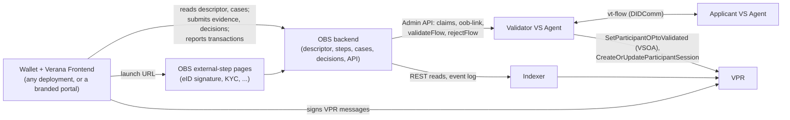
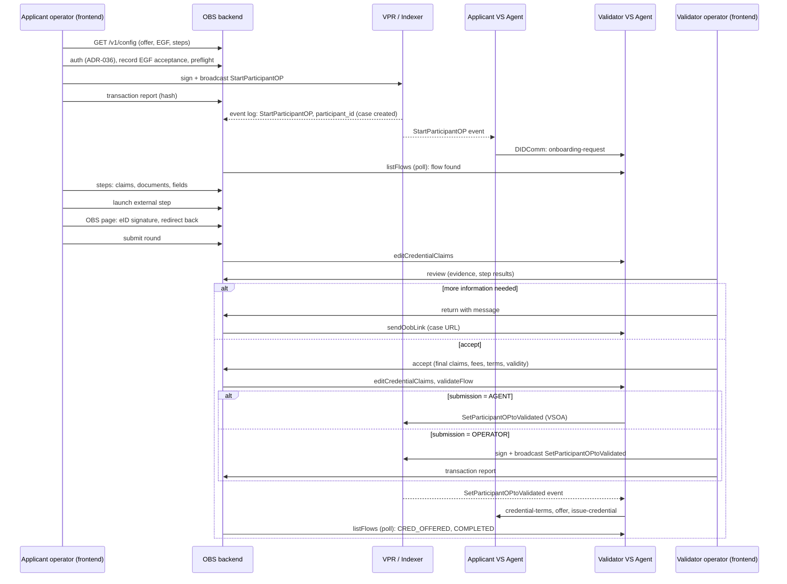

# Ecosystem Onboarding Service v4 Specification

**Latest Draft:** spec v4-draft2

## Abstract

The **Ecosystem Onboarding Service** (OBS) is the backend a validator runs for one validator-capable `Participant` entry of a Verifiable Public Registry (VPR) — an ECOSYSTEM, ISSUER_GRANTOR, VERIFIER_GRANTOR or ISSUER Participant of a Credential Schema — to onboard applicants for that schema. It publishes what can be obtained (ecosystem, schema, roles, fees, prerequisites, governance framework), keeps the record that an applicant accepted the ecosystem governance framework, collects the evidence the validator needs (credential claims, documents, fields, and the outcome of validator-specific steps such as a qualified electronic signature), lets the validator review and decide, drives the validator's VS Agent, and keeps a durable, auditable case history.

The OBS is **headless**: it has no user interface of its own except the pages behind its external steps. Its API is public and versioned, and the [Verana Frontend](../verana-frontend/spec.md) is its client: humans see the offer, provide evidence, review and decide there, and sign every VPR transaction there with their wallet. The frontend discovers an OBS from the `EcosystemOnboardingService` entry of the validator's DID Document. The OBS never signs on chain: VPR messages are signed by humans with their wallets in the client under `OperatorAuthorization` grants, except the validation transaction, which the validator agent submits under a `VSOperatorAuthorization`, with failover to a validator operator signing in the client under an `OperatorAuthorization` when the agent holds no such authorization or its submission fails ([OBS-VAL-ACCEPT-3], [OBS-VAL-TXFAIL-2]). The applicant's and the validator's [VS Agents](../vs-agent/spec.md) run the credential-acquisition flow of the [Verifiable Trust Flow Protocol](../vt-flow-protocol/spec.md) on their own, and the OBS is the out-of-band service that protocol anticipates with its `oob-link` message.

This document specifies the normative behavior of an OBS implementation: configuration and bootstrap, the public descriptor, the step model, authentication and authorization, the case model and its status derivation, the applicant and validator operations, the API, the integration contracts with the indexer and the validator agent, document handling, security and operations.

## About this Document

In order to fully understand the concepts developed in this document, you should have some basic knowledge of the [Verifiable Trust Specification v4](https://verana-labs.github.io/verifiable-trust-spec/versions/v4/), the [Verifiable Trust VPR Specification v4](https://verana-labs.github.io/verifiable-trust-vpr-spec/versions/v4/) (Participant module, delegation model, common authorization checks), the [Indexer v4 Specification](../verana-indexer/spec.md), the [VS Agent v4 Specification](../vs-agent/spec.md) (credential acquisition flows, notifications, Administration API), the [Verifiable Trust Flow Protocol](../vt-flow-protocol/spec.md) and the [Verana Frontend v4 Specification](../verana-frontend/spec.md) (corporation context, transaction execution, participant actions).

> References to the Verana Frontend v4 Specification target its v4 draft (branch `frontend-v4-spec`, pending approval). The frontend section that consumes this API, `[VFE-OBS] Onboarding cases`, is specified in that document.

## Conformance

As well as sections marked as non-normative, all authoring guidelines, diagrams, examples, and notes in this specification are non-normative. Everything else in this specification is normative.

The key words MAY, MUST, MUST NOT, OPTIONAL, RECOMMENDED, REQUIRED, SHOULD, and SHOULD NOT in this document are to be interpreted as described in [BCP 14](https://datatracker.ietf.org/doc/html/bcp14) [RFC2119](https://w3c.github.io/vc-data-model/#bib-rfc2119) [RFC8174](https://w3c.github.io/vc-data-model/#bib-rfc8174) when, and only when, they appear in all capitals, as shown here.

Normative requirements are prefixed `[OBS-]`.

## Terminology

Terms inherited from the VPR v4 specification keep their meaning there: **Corporation**, **policy_address**, **Ecosystem**, **Credential Schema**, **Participant**, **Onboarding Process (OP)**, **OperatorAuthorization**, **VSOperatorAuthorization**, **Trust Deposit**. Terms inherited from the Verana Frontend v4 specification keep their meaning there: **connected account**, **acting Corporation**, **capability**. Terms inherited from the VS Agent v4 specification keep their meaning there: **flow**, **Flow State**, **credential terms**.

- **OBS**, **the service** — one deployed Ecosystem Onboarding Service backend.
- **client** — a Verana Frontend deployment, or any other application, consuming the API on behalf of a human with a wallet.
- **validator Participant** — the `Participant` entry designated by `OBS_VALIDATOR_PARTICIPANT_ID`. Its `schema_id`, and the `ecosystem_id` of that schema, fix the ecosystem and the schema the deployment serves; its `corporation_id` is the **validator Corporation**; its `did` is the **validator DID**, the DID of the validator's VS Agent.
- **applicant role** — the `ParticipantRole` an applicant obtains through the deployment, derived from the validator Participant's role and the schema's onboarding modes ([OBS-BOOT-ROLE]).
- **applicant Corporation** — the Corporation that owns the applicant `Participant` entry of a case.
- **descriptor** — the public description of the deployment served by [OBS-DESC].
- **step** — one unit of the evidence workflow of a round, declared in the requirements file ([OBS-STEP]): rendered by the client for the data-driven types, performed on a page of the service for the `external` type.
- **case** — the service's record of one Onboarding Process: one applicant Corporation, one DID, one applicant `Participant` entry (keyed by its `participant_id`), under the validator Participant.
- **round** — one validation cycle of a case: the initial Onboarding Process, or one renewal.
- **submission** — the evidence an applicant provides for a round: proposed claims, documents, fields, step results.
- **governance framework acceptance** — the persisted record that an operator, acting for a Corporation, has read and accepted a given version of the ecosystem governance framework (EGF).
- **transaction report** — what a client tells the service about a VPR transaction it broadcast for a case; the service confirms it from the chain.
- **event cursor** — the highest indexer block height whose events the service has fully processed.

## Overview

### Positioning

### Division of responsibilities

| Concern | Who | How |
| --- | --- | --- |
| Wallet, session, corporation context, capability gate, every VPR transaction (start, renew, cancel, validate when the agent cannot, set effective until, revoke, slash, repay), participant actions, proof of trust display | Verana Frontend | `[VFE-OBS]` and the existing sections of the [Verana Frontend v4 Specification](../verana-frontend/spec.md) |
| Contact the validator, send the `onboarding-request`, accept and present the credential | applicant VS Agent | [VSA-VTI-NOTIF-PP](../vs-agent/spec.md#vsa-vti-notif-pp-participant-notifications) default handlers |
| Hold the flow, check the claims and terms, submit the validation when authorized, issue the credential | validator VS Agent | [`validateFlow`](../vs-agent/spec.md#vsa-adm-vt-fl-validate-validateflow), [VSA-VTI-FLOW-OP-ISSUE](../vs-agent/spec.md#vsa-vti-flow-op-issue-issuance-after-validation) |
| Offer, governance framework acceptance, steps, evidence, claims, review, decisions, messages, case history, external steps | OBS | this specification |
| Chain facts | VPR, read through the indexer | [Indexer v4 Specification](../verana-indexer/spec.md) |

### End-to-end sequence

The service never depends on a browser being open: cases are created and closed from the chain events, evidence and decisions are persisted as they arrive, and every state a client shows is either kept by the service or read from the chain and the validator agent.

### Discovery

- [OBS-DISC-1] The service registers, through the validator agent, a service entry of type `EcosystemOnboardingService` in the validator's DID Document ([OBS-BOOT-SVC]) whose `serviceEndpoint` is `OBS_PUBLIC_URL`. A client that knows any `Participant` entry finds the OBS of its validator by resolving the validator's DID and reading that entry.
- [OBS-DISC-2] The descriptor ([OBS-DESC]) names the validator Participant it serves. A client MUST NOT present an offer or a case as the validator's unless the descriptor's `validatorParticipantId` matches the entry whose DID Document led to the service.
- [OBS-DISC-3] A validator DID MAY carry several `EcosystemOnboardingService` entries, one per validator Participant of the DID; the entry `id` fragment is `#obs-{validator_participant_id}`.

## [OBS-CFG] Configuration

### [OBS-CFG-ENV] Container Environment Variables

The table lists every environment variable of the OBS container. The subsection of each group is normative.

| Variable | Required | Group |
| --- | --- | --- |
| [`OBS_VALIDATOR_PARTICIPANT_ID`](#obs-cfg-env-id-target) | REQUIRED | Target |
| [`OBS_APPLICANT_ROLE`](#obs-cfg-env-id-target) | OPTIONAL | Target |
| [`VERANA_CHAIN_ID`](#obs-cfg-env-net-network) | REQUIRED | Network |
| [`VERANA_INDEXER_BASE_URL`](#obs-cfg-env-net-network) | REQUIRED | Network |
| [`VS_AGENT_ADMIN_URL`](#obs-cfg-env-agent-vs-agent) | OPTIONAL | VS Agent |
| [`OBS_ACCOUNT_MNEMONIC`](#obs-cfg-env-agent-vs-agent) | CONDITIONAL | VS Agent |
| [`OBS_PUBLIC_URL`](#obs-cfg-env-pub-public-urls) | REQUIRED | Public URLs |
| [`VERANA_FRONTEND_URL`](#obs-cfg-env-pub-public-urls) | REQUIRED | Public URLs |
| [`OBS_CASE_URL_TEMPLATE`](#obs-cfg-env-pub-public-urls) | OPTIONAL | Public URLs |
| [`OBS_ALLOWED_ORIGINS`](#obs-cfg-env-pub-public-urls) | OPTIONAL | Public URLs |
| [`OBS_REQUIRED_PUBLIC_CREDENTIAL_SCHEMA_IDS`](#obs-cfg-env-policy-onboarding-policy) | OPTIONAL | Onboarding policy |
| [`OBS_CLAIMS_MODE`](#obs-cfg-env-policy-onboarding-policy) | OPTIONAL | Onboarding policy |
| [`OBS_CREDENTIAL_FORMATS`](#obs-cfg-env-policy-onboarding-policy) | OPTIONAL | Onboarding policy |
| [`OBS_LINKED_VP_POLICY`](#obs-cfg-env-policy-onboarding-policy) | OPTIONAL | Onboarding policy |
| [`OBS_REQUIREMENTS_FILE`](#obs-cfg-env-policy-onboarding-policy) | OPTIONAL | Onboarding policy |
| [`OBS_DATABASE_URL`](#obs-cfg-env-rt-runtime) | REQUIRED | Runtime |
| [`OBS_STORAGE_ENDPOINT`](#obs-cfg-env-rt-runtime) | CONDITIONAL | Runtime |
| [`OBS_STORAGE_BUCKET`](#obs-cfg-env-rt-runtime) | CONDITIONAL | Runtime |
| [`OBS_STORAGE_ACCESS_KEY`](#obs-cfg-env-rt-runtime) | CONDITIONAL | Runtime |
| [`OBS_STORAGE_SECRET_KEY`](#obs-cfg-env-rt-runtime) | CONDITIONAL | Runtime |
| [`OBS_CASE_RETENTION_DAYS`](#obs-cfg-env-rt-runtime) | OPTIONAL | Runtime |
| [`OBS_SESSION_LIFETIME_SECONDS`](#obs-cfg-env-rt-runtime) | OPTIONAL | Runtime |
| [`OBS_LAUNCH_TOKEN_TTL_SECONDS`](#obs-cfg-env-rt-runtime) | OPTIONAL | Runtime |
| [`OBS_LOG_LEVEL`](#obs-cfg-env-rt-runtime) | OPTIONAL | Runtime |
| [`OBS_EVENT_POLL_INTERVAL_MS`](#obs-cfg-env-recon-reconciliation) | OPTIONAL | Reconciliation |
| [`OBS_FLOW_POLL_INTERVAL_MS`](#obs-cfg-env-recon-reconciliation) | OPTIONAL | Reconciliation |
| [`OBS_TX_UNSEEN_AFTER_BLOCKS`](#obs-cfg-env-recon-reconciliation) | OPTIONAL | Reconciliation |

#### [OBS-CFG-ENV-ID] Target

| Variable | Required | Description |
| --- | --- | --- |
| `OBS_VALIDATOR_PARTICIPANT_ID` | REQUIRED | `Participant.id` (uint64) of the validator Participant this deployment manages. One deployment manages exactly one validator Participant, hence one Credential Schema of one Ecosystem. The entry MUST be an [active participant](https://verana-labs.github.io/verifiable-trust-vpr-spec/versions/v4/#terminology) whose `role` is `ECOSYSTEM`, `ISSUER_GRANTOR`, `VERIFIER_GRANTOR` or `ISSUER` ([OBS-BOOT-1]). |
| `OBS_APPLICANT_ROLE` | OPTIONAL | One `ParticipantRole`. Restricts the deployment to a single applicant role among those the validator Participant can validate ([OBS-BOOT-ROLE]). Only meaningful when the validator Participant is an `ECOSYSTEM` Participant, which can validate up to four roles; for the other validator roles the applicant role is unique and this variable, if set, MUST equal it. |

#### [OBS-CFG-ENV-NET] Network

| Variable | Required | Description |
| --- | --- | --- |
| `VERANA_CHAIN_ID` | REQUIRED | Chain id (e.g. `vna-testnet-1`). Served in the descriptor so that a client refuses an OBS of another network, and checked against the indexer. |
| `VERANA_INDEXER_BASE_URL` | REQUIRED | Indexer base URL (e.g. `https://idx.testnet.verana.network`). All reads and the event-log poll of [OBS-INT-IDX] use `{base}/v4/...` per the [Indexer v4 Specification](../verana-indexer/spec.md). The service uses no chain RPC. |

#### [OBS-CFG-ENV-AGENT] VS Agent

| Variable | Required | Description |
| --- | --- | --- |
| `VS_AGENT_ADMIN_URL` | OPTIONAL | Origin of the validator VS Agent's [Administration API](../vs-agent/spec.md#administration-api). When unset, the service MUST discover it from the `VsAgentAdminAPI` service entry of the validator DID Document ([VSA-VTI-DIDDOC](../vs-agent/spec.md#vsa-vti-diddoc-did-document-service-entries)) and MUST fail to start when no such entry exists. |
| `OBS_ACCOUNT_MNEMONIC` | CONDITIONAL | BIP-39 mnemonic of the Verana account the service uses to authenticate to the Admin API per [VSA-ADM-AUTH-PROTO](../vs-agent/spec.md#vsa-adm-auth-proto-account-challengeresponse). REQUIRED when the agent serves the service as an external caller (agent `ADMIN_API_AUTH_MODE` = `corporation`); the derived account MUST then be listed in the agent's `ADMIN_API_CORPORATION_ALLOWED_ACCOUNTS`. The account is never used on chain. |

#### [OBS-CFG-ENV-PUB] Public URLs

| Variable | Required | Description |
| --- | --- | --- |
| `OBS_PUBLIC_URL` | REQUIRED | Public `https://` base URL of the API (scheme, host, optional port, optional base path, no trailing slash) as browsers reach it. It is written as the `serviceEndpoint` of the `EcosystemOnboardingService` entry the service registers in the validator DID Document ([OBS-BOOT-SVC]), it is the origin of the external-step pages ([OBS-STEP-EXT]), and it is the value the service compares to the entry it finds at startup. The service MUST reject a URL that is not `https://`. |
| `VERANA_FRONTEND_URL` | REQUIRED | Base URL of the Verana Frontend deployment the validator sends applicants to: the case URL of [OBS-CFG-ENV-PUB-1] is built on it unless `OBS_CASE_URL_TEMPLATE` overrides it, and it is the default link to obtain a missing prerequisite credential ([OBS-APP-ELIG-4]). A branded portal-mode deployment of the frontend is a valid value. |
| `OBS_CASE_URL_TEMPLATE` | OPTIONAL | Template of the URL of a case in the client, with the placeholder `{participant_id}`. Default: `{VERANA_FRONTEND_URL}/participants/{participant_id}/onboarding`. |
| `OBS_ALLOWED_ORIGINS` | OPTIONAL | Comma-separated list of browser origins allowed by CORS. Default: any origin ([OBS-API-CORS]). |

- [OBS-CFG-ENV-PUB-1] The **case URL** of a case is `OBS_CASE_URL_TEMPLATE` with `{participant_id}` replaced by the case's `participant_id`. It is the URL the service sends to the applicant agent in `oob-link` messages ([OBS-INT-VSA-3]) and serves in the descriptor; the client resolves the OBS from the entry ([OBS-DISC-1]) and authenticates the human on arrival. The URL carries no secret.

#### [OBS-CFG-ENV-POLICY] Onboarding policy

| Variable | Required | Description |
| --- | --- | --- |
| `OBS_REQUIRED_PUBLIC_CREDENTIAL_SCHEMA_IDS` | OPTIONAL | Comma-separated list of `CredentialSchema.id` values. An applicant DID MUST publicly present, as Linked Verifiable Presentations, at least one credential of each listed schema to be allowed to start an Onboarding Process ([OBS-APP-ELIG]). Empty or unset: no prerequisite. |
| `OBS_CLAIMS_MODE` | OPTIONAL | Only meaningful when the applicant role is `HOLDER`, the only role for which a credential is issued ([OBS-BOOT-4]). `applicant-proposes-validator-confirms` (default): the applicant edits, or inputs when the `onboarding-request` carried none, the credential claims, and the validator confirms or adjusts them. `validator-only`: the applicant sees the claims read-only and only the validator sets them. |
| `OBS_CREDENTIAL_FORMATS` | OPTIONAL | Comma-separated list of the credential formats the validator offers, among `JSON_LD` (default, and the only value accepted in this revision). Only meaningful when the applicant role is `HOLDER`. With several values the applicant chooses one ([OBS-APP-TERMS]); the chosen value is passed to `validateFlow` as `credentialFormat`. |
| `OBS_LINKED_VP_POLICY` | OPTIONAL | Whether the issued credential is to be published by the applicant as a Linked Verifiable Presentation of its DID Document: `YES`, `NO`, `APPLICANT_DEFINED_DEFAULT_YES` (default), `APPLICANT_DEFINED_DEFAULT_NO`. Only meaningful when the applicant role is `HOLDER`. `APPLICANT_DEFINED_*` lets the applicant choose, preselected with the default ([OBS-APP-TERMS]); the resulting value is passed to `validateFlow` as `presentAsLinkedVp` and conveyed to the applicant agent by the validator agent ([`credential-terms`](../vt-flow-protocol/spec.md#credential-terms)). Constrained for ECS schemas by [OBS-BOOT-6]. This variable is the policy source of this revision; a `CredentialSchema` field is planned as the authoritative source ([vpr-spec #171](https://github.com/verana-labs/verifiable-trust-vpr-spec/issues/171)), after which the variable is dropped. |
| `OBS_REQUIREMENTS_FILE` | OPTIONAL | Path to the requirements file of [OBS-CFG-REQ]: the steps of a round, the documents and fields the applicant provides, the external steps, per-schema link overrides and instructions. When unset, a round has the implicit steps only ([OBS-STEP-1]). |

#### [OBS-CFG-ENV-RT] Runtime

| Variable | Required | Description |
| --- | --- | --- |
| `OBS_DATABASE_URL` | REQUIRED | Connection URL of the relational database holding cases, rounds, submissions, step results, decisions, transaction reports, acceptances, the event cursor and the audit log. |
| `OBS_STORAGE_ENDPOINT`, `OBS_STORAGE_BUCKET`, `OBS_STORAGE_ACCESS_KEY`, `OBS_STORAGE_SECRET_KEY` | CONDITIONAL | S3-compatible object storage for uploaded documents and external-step evidence. REQUIRED when the requirements file declares at least one document or one external step that produces evidence. The bucket MUST NOT be publicly readable. |
| `OBS_CASE_RETENTION_DAYS` | OPTIONAL | Number of days after which the documents and personal data of a case in a terminal status are deleted ([OBS-DOC-4]). Default: `365`. |
| `OBS_SESSION_LIFETIME_SECONDS` | OPTIONAL | Lifetime of a bearer session issued by [OBS-AUTH]. Default: `3600`. |
| `OBS_LAUNCH_TOKEN_TTL_SECONDS` | OPTIONAL | Lifetime of an external-step launch URL ([OBS-STEP-EXT-2]). Default: `300`, maximum `900`. |
| `OBS_LOG_LEVEL` | OPTIONAL | One of `error`, `warn`, `info`, `debug`. Default: `info`. |

#### [OBS-CFG-ENV-RECON] Reconciliation

| Variable | Required | Description |
| --- | --- | --- |
| `OBS_EVENT_POLL_INTERVAL_MS` | OPTIONAL | Interval of the indexer event-log poll of [OBS-INT-IDX-POLL]. Default: `5000`. SHOULD be close to the chain's block interval. |
| `OBS_FLOW_POLL_INTERVAL_MS` | OPTIONAL | Interval of the validator agent flow poll of [OBS-INT-VSA-POLL]. Default: `5000`. |
| `OBS_TX_UNSEEN_AFTER_BLOCKS` | OPTIONAL | Number of indexed blocks after which a reported transaction that produced no event is marked `UNSEEN` ([OBS-INT-TX-3]). Default: `120`. |

### [OBS-CFG-REQ] Requirements file

The requirements file is a JSON document that declares the evidence workflow of a round. Its normative JSON Schema is published alongside this document at [`schemas/v4/obs/requirements.schema.json`](./schemas/v4/obs/requirements.schema.json). Field names are camelCase.

- [OBS-CFG-REQ-1] The service MUST validate the file against the schema at startup and MUST refuse to start when validation fails.
- [OBS-CFG-REQ-2] `documents[]` declares the files the applicant uploads: `id` (unique, `^[a-z0-9-]+$`), `label`, `description`, `mediaTypes` (accepted IANA media types), `maxSizeBytes`, `required` (default `true`), `multiple` (default `false`).
- [OBS-CFG-REQ-3] `fields[]` declares the additional fields the applicant fills: `id`, `label`, `description`, `type` (`text`, `textarea`, `number`, `date`, `url`, `select`), `required` (default `true`), `options` (for `select`), `pattern`, `min`, `max`, `maxLength`.
- [OBS-CFG-REQ-4] `steps[]` declares the ordered steps of a round ([OBS-STEP]): `id`, `type` (`claims`, `documents`, `fields`, `external`), `for` (`applicant` default, or `validator`), `roles` (applicant roles the step applies to; default all), `required` (default `true`), `title`, `description`, and per type: `documents[]` / `fields[]` (ids declared above) for `documents` / `fields`; `external` with `completion` (`obs`) and `evidence` (`none`, `file`, `record`) for `external`. Every declared document and field MUST be referenced by exactly one step, and a `claims` step MAY appear at most once.
- [OBS-CFG-REQ-5] `credentialLinks` maps a `CredentialSchema.id` to the URL shown to an applicant that lacks a credential of that schema ([OBS-APP-ELIG-4]); `instructions.applicant` and `instructions.validator` are Markdown texts served in the descriptor. Labels, descriptions and instructions MAY be localized (an object keyed by BCP 47 language tag).

## [OBS-BOOT] Bootstrap Sequence

When the service starts, it MUST execute the following steps in order. Any REQUIRED step that fails MUST cause the process to exit with a non-zero status code with a descriptive error; the service MUST NOT serve the API before all REQUIRED steps have succeeded.

1. **Validate configuration.** Every REQUIRED variable is present and well-formed; conditional variables are consistent ([OBS-CFG-ENV]); the requirements file validates ([OBS-CFG-REQ-1]).
2. **Resolve the validator Participant.** Call [`IDX-PP-QRY-1 Get Participant`](../verana-indexer/spec.md#idx-pp-qry-1-get-participant) with `OBS_VALIDATOR_PARTICIPANT_ID`. [OBS-BOOT-1] The entry MUST exist, its `participant_state` MUST be `ACTIVE`, and its `role` MUST be one of `ECOSYSTEM`, `ISSUER_GRANTOR`, `VERIFIER_GRANTOR`, `ISSUER`. Cache `schema_id`, `corporation_id`, `did`, `validation_fees`.
3. **Resolve the schema and the ecosystem.** Call [`IDX-CS-QRY-1`](../verana-indexer/spec.md#idx-cs-qry-1-get-credential-schema) and [`IDX-ES-QRY-1`](../verana-indexer/spec.md#idx-es-qry-1-get-ecosystem). [OBS-BOOT-2] The schema MUST NOT be archived. [OBS-BOOT-3] The schema's `pricing_asset_type` MUST be `COIN` and `pricing_asset` MUST be the chain's native denom: this revision supports no other pricing asset, and the client applies the same gate ([VFE-PAGE-DISCOVER](../verana-frontend/spec.md#vfe-page-discover-discover--join)).
4. **Derive the applicant roles** ([OBS-BOOT-ROLE]). The derived set MUST be non-empty; when `OBS_APPLICANT_ROLE` is set it MUST be a member of the set, and the set is reduced to it.
5. **Determine issuance.** [OBS-BOOT-4] A credential is issued at the end of a validated round if, and only if, the applicant role set is exactly `{HOLDER}`: a `HOLDER` entry exists to receive a credential of the schema, and the validator agent takes the same decision from the validated entry's `role` ([VSA-VTI-FLOW-OP-ISSUE](../vs-agent/spec.md#vsa-vti-flow-op-issue-issuance-after-validation)). This is a chain fact, not a configuration. [OBS-BOOT-5] When the applicant role is `HOLDER`, the validator Participant MUST carry a `ParticipantAuthorizationRecord` whose `msg_types` includes `CreateOrUpdateParticipantSession` ([`IDX-DE-QRY-2`](../verana-indexer/spec.md#idx-de-qry-2-list-vs-operator-authorizations) with `participant_id`), or the service MUST log a warning that issuance will fail on chain.
6. **Determine the credential terms.** [OBS-BOOT-6] When the applicant role is `HOLDER`: `OBS_CREDENTIAL_FORMATS` MUST contain `JSON_LD` only; for the ECS Service, Organization and Persona schemas `OBS_LINKED_VP_POLICY` MUST be `YES` (VS-REQ-2 to VS-REQ-4 of the Verifiable Trust specification); for the ECS Badge and UserAgent schemas, whose credentials are AnonCreds and MUST NOT be declared in a DID Document, no credential can be issued through a flow in this revision and the service MUST refuse to start.
7. **Reach the validator agent.** Resolve the Admin API origin ([OBS-CFG-ENV-AGENT]), authenticate if required, call [`getAgentInfo`](../vs-agent/spec.md#vsa-adm-ag-info-getagentinfo). [OBS-BOOT-7] `getAgentInfo.did` MUST equal the validator DID.
8. **Register the service entry** ([OBS-BOOT-SVC]).
9. **Initialize reconciliation.** Load the persisted event cursor; on first start set it to the current indexed height ([`IDX-INDEXER-QRY-1`](../verana-indexer/spec.md#idx-indexer-qry-1-get-block-height)); start the event-log poll ([OBS-INT-IDX-POLL]) and the flow poll ([OBS-INT-VSA-POLL]).
10. **Serve the API.** The readiness probe ([OBS-OPS-2]) turns ready.

> Deployment note: the service relies on the validator agent's default handler for the `SetParticipantOPtoValidated` notification ([VSA-VTI-FLOW-OP-ISSUE](../vs-agent/spec.md#vsa-vti-flow-op-issue-issuance-after-validation)); the event type MUST NOT be listed in the agent's `VERANA_INDEXER_DEFAULT_HANDLERS_OVERRIDE` ([VSA-VTI-CFG-ENV-NET](../vs-agent/spec.md#vsa-vti-cfg-env-net-network-configuration)). Whether the agent submits the validation transaction itself depends on the `VSOperatorAuthorization` records of the validator Participant, decided by the agent at each `validateFlow` call ([OBS-VAL-ACCEPT-2]); no configuration of the service is involved.

### [OBS-BOOT-ROLE] Applicant role derivation

- [OBS-BOOT-ROLE-1] The applicant roles a validator Participant can validate follow from its `role` and from the schema's onboarding modes, exactly as the VPR permission checks of `StartParticipantOP` define them: an `ECOSYSTEM` validator validates `ISSUER_GRANTOR` (when `issuer_onboarding_mode` is `GRANTOR_ONBOARDING_PROCESS`), `ISSUER` (when it is `ECOSYSTEM_ONBOARDING_PROCESS`), `VERIFIER_GRANTOR` (when `verifier_onboarding_mode` is `GRANTOR_ONBOARDING_PROCESS`) and `VERIFIER` (when it is `ECOSYSTEM_ONBOARDING_PROCESS`); an `ISSUER_GRANTOR` validates `ISSUER`; a `VERIFIER_GRANTOR` validates `VERIFIER`; an `ISSUER` validates `HOLDER` when `holder_onboarding_mode` is `ISSUER_ONBOARDING_PROCESS`.
- [OBS-BOOT-ROLE-2] The service MUST re-evaluate the set whenever the schema changes on the indexer (the onboarding modes are immutable in v4, but the schema MAY be archived): a case MUST NOT be started for an archived schema ([OBS-APP-PRE-6]).

### [OBS-BOOT-SVC] Service entry registration

- [OBS-BOOT-SVC-1] The service MUST ensure that the validator DID Document carries a service entry with `id` fragment `#obs-{validator_participant_id}`, `type` `EcosystemOnboardingService` and `serviceEndpoint` `OBS_PUBLIC_URL`, using [`listServiceEndpoints`](../vs-agent/spec.md#vsa-adm-vt-se-list-listserviceendpoints), [`addServiceEndpoint`](../vs-agent/spec.md#vsa-adm-vt-se-add-addserviceendpoint) and [`updateServiceEndpoint`](../vs-agent/spec.md#vsa-adm-vt-se-update-updateserviceendpoint) of the validator agent. It MUST NOT create, modify or delete any other entry.
- [OBS-BOOT-SVC-2] The entry is the discovery point of [OBS-DISC-1]. DID Documents are not chain entities and produce no indexer event: the service MUST re-check the entry at every start and SHOULD re-check it periodically (at least hourly), restoring it when it is missing or wrong.

## [OBS-DESC] Descriptor

The descriptor is the public, unauthenticated description of the deployment (`GET /v1/config`, [OBS-API]). It is the only thing a client needs to render the offer and the evidence workflow.

- [OBS-DESC-1] The descriptor MUST contain: `apiVersion` ([OBS-API-VER]); `chainId`; `validatorParticipantId`, `validatorCorporationId`, `validatorDid`; `ecosystemId`, `schemaId`; `roles[]`, one entry per offered applicant role with the fee fields of `StartParticipantOP` the role can collect (`ISSUER_GRANTOR`: `validation_fees`, `issuance_fees`, `verification_fees`; `VERIFIER_GRANTOR`: validation and verification; `ISSUER`: validation, only when `holder_onboarding_mode` = `ISSUER_ONBOARDING_PROCESS`, and verification; `VERIFIER` and `HOLDER`: none, sent as 0) and the schema's validation validity period for the role; `prerequisites[]` (schema ids with titles and ecosystem ids); `claimsMode`; `credentialFormats[]` and `linkedVpPolicy` (present only when a credential is issued); `steps[]` per role, `documents[]`, `fields[]`, `credentialLinks` and `instructions` from the requirements file ([OBS-CFG-REQ]); `caseUrlTemplate`; `frontendUrl`; the active governance framework version with its documents and digests ([OBS-APP-GF]); `branding` (`name`, `logoUri`), OPTIONAL, for a client running as the validator's portal.
- [OBS-DESC-2] The descriptor MUST be served with the `ETag` of its content and MUST change only when the configuration, the requirements file, the schema or the active governance framework version change. A client MAY cache it for 60 seconds.
- [OBS-DESC-3] The descriptor MUST NOT contain secrets, accounts, or case data.

## [OBS-STEP] Steps

A round is completed by steps. The service declares them; a client renders the data-driven ones and hands off to the service for the external ones. The model lets one specification serve both a schema whose evidence is a form and a schema that requires a qualified electronic signature, a video identification or a third-party login.

- [OBS-STEP-1] Every round has the implicit steps `egf-acceptance` ([OBS-APP-GF]) first and `terms` ([OBS-APP-TERMS], `HOLDER` rounds only) second, then the declared steps in file order. A deployment without a requirements file has the implicit steps only, and, for a `HOLDER` round, the `claims` step.
- [OBS-STEP-2] Step types and how a client renders them: `claims` (a form generated from the schema's `json_schema`, following `OBS_CLAIMS_MODE`); `documents` (uploads per [OBS-CFG-REQ-2]); `fields` (inputs per [OBS-CFG-REQ-3]); `external` ([OBS-STEP-EXT]).
- [OBS-STEP-3] Each step of a round has a state, exposed on the case: `PENDING`, `COMPLETED`, `FAILED` (external steps only), with `completedAt`, `completedBy` and, for external steps, a `summary` object the service chose to expose.
- [OBS-STEP-4] Required applicant steps MUST be `COMPLETED` before the round can be submitted ([OBS-APP-SUBMIT-1]); required validator steps MUST be `COMPLETED` before the round can be accepted ([OBS-VAL-ACCEPT-1]). A step MAY be redone while its round is still open; the latest result counts.

### [OBS-STEP-EXT] External steps

- [OBS-STEP-EXT-1] An external step is performed on a page served by the service under the `OBS_PUBLIC_URL` origin. What the page does is the validator's business (a qualified electronic signature of the round summary with a national eID, an eIDAS or bank login, a video identification, an NFC document read, a payment) and is out of scope of this specification; its result is data on the case ([OBS-STEP-3]).
- [OBS-STEP-EXT-2] A client starts the step with `POST /v1/cases/{participantId}/steps/{stepId}/launch` (body: `returnUrl`, `https://` only), authenticated in the scope the step is `for`. The service answers a **launch URL** under `OBS_PUBLIC_URL` carrying a single-use token bound to the case, the step, the authenticated account and the acting Corporation, valid `OBS_LAUNCH_TOKEN_TTL_SECONDS`. The token is the only credential of the page: it MUST NOT be the bearer session, and the page MUST NOT receive or use the wallet.
- [OBS-STEP-EXT-3] The page MUST identify the validator (name and DID) and the step, MUST run over TLS, and on completion MUST record the result and redirect the browser to `returnUrl` with the query parameters `participantId` and `stepId`. The client then re-reads the case; it MUST NOT trust anything else from the redirect.
- [OBS-STEP-EXT-4] A step with `evidence` = `file` stores the produced file (for a signature: the signed container) as a document of the round, subject to [OBS-DOC]; `evidence` = `record` stores a structured result; `evidence` = `none` stores the state only. The `summary` exposed to clients MUST be limited to what the review needs (for a signature: signer name, time, validation result).
- [OBS-STEP-EXT-5] A deployment whose only declared step is an external one is valid: it is the classic out-of-band portal. Clients still provide the offer, the chain transactions and the status.

## [OBS-AUTH] Authentication

The service authenticates humans as Verana accounts with the wallet they already use to sign transactions. The mechanism is the account challenge/response of the VS Agent Administration API, reused unchanged except for its payload prefix.

- [OBS-AUTH-1] Every request to an authenticated endpoint MUST carry a bearer token in the HTTP `Authorization` header (`Bearer` scheme) obtained through [OBS-AUTH-PROTO]. The public endpoints are exactly: the authentication endpoints, the descriptor, the governance framework document proxy, the external-step pages (authenticated by their launch token) and the health probes ([OBS-OPS]).
- [OBS-AUTH-2] The service is a trusted component: unlike the Verana Frontend ([VFE-SEC-1](../verana-frontend/spec.md#vfe-sec-security-considerations)) it holds server-side sessions and personal data, and MUST be operated accordingly ([OBS-DOC], [Security Considerations](#security-considerations)).
- [OBS-AUTH-3] Sessions are bearer tokens, never cookies; a client obtains one session per OBS origin it talks to and MAY hold several at once.

### [OBS-AUTH-PROTO] Account challenge/response

- [OBS-AUTH-PROTO-1] The exchange, the sign doc, the verification rules, the single-use and expiry rules of nonces, and the token presentation rules are those of [VSA-ADM-AUTH-PROTO](../vs-agent/spec.md#vsa-adm-auth-proto-account-challengeresponse), with a different challenge payload: the `data` string that MUST be signed is `obs-auth:<OBS_PUBLIC_URL>:<nonce>`, so that a signature obtained for one service cannot be replayed to the agent's Admin API nor to another OBS. A signature computed over any other payload MUST be rejected.
- [OBS-AUTH-PROTO-2] The endpoints are `POST /v1/auth/challenge` (input `account`; output `nonce`, `expiresAt`) and `POST /v1/auth/token` (input `account`, `pubKey`, `signature`, `nonce`; output `token`, `expiresAt`, `account`). Tokens expire after `OBS_SESSION_LIFETIME_SECONDS`.

## [OBS-AUTHZ] Authorization

The service adopts the corporation context of the Verana Frontend ([VFE-CORP](../verana-frontend/spec.md#vfe-corp-corporation-context)) with one restriction: in this revision an account acts for a Corporation **only** through an `OperatorAuthorization`. Group membership and group proposals are out of scope.

- [OBS-AUTHZ-1] For an authenticated account the service MUST discover the Corporations for which it holds an active `OperatorAuthorization` ([`IDX-DE-QRY-1`](../verana-indexer/spec.md#idx-de-qry-1-list-operator-authorizations) by `operator`), cache the result for at most 60 seconds, and invalidate it on any `GrantOperatorAuthorization` / `RevokeOperatorAuthorization` event of the account ([OBS-INT-IDX-POLL-3]). Group membership ([`IDX-GR-QRY-2`](../verana-indexer/spec.md#idx-gr-qry-2-list-corporations-by-member)) MUST NOT be used.
- [OBS-AUTHZ-2] Every authenticated request MUST name the acting Corporation (`X-Acting-Corporation: <corporation_id>` header). The service MUST verify that the account holds an active `OperatorAuthorization` from that Corporation; otherwise it MUST answer `403` `FORBIDDEN`. `GET /v1/me` returns the discovered Corporations and, for each, the scopes of [OBS-AUTHZ-3].
- [OBS-AUTHZ-3] A session acts in the **validator scope** when the acting Corporation is the validator Corporation: it MAY list every case of the deployment, read every submission, document and step result, and record decisions and notes. It acts in the **applicant scope** for every case whose applicant Corporation is the acting Corporation, and for the start of a new case: it MAY read those cases, record governance framework acceptances, provide evidence, perform applicant steps, send messages and report transactions. The same account and Corporation MAY hold both scopes (the validator Corporation onboarding a service of its own).
- [OBS-AUTHZ-4] Authorization to sign is not the service's concern: the wallet signs in the client, and the chain enforces the operator grant. The service exposes the actions it offers per scope and state in `availableActions[]` ([OBS-CASE-ACT]).
- [OBS-AUTHZ-5] A request that would change a round in a state that does not admit it (per [OBS-CASE-STATUS]) MUST be refused with `409` `INVALID_STATE`.
- [OBS-AUTHZ-6] Document contents and step evidence are served only to sessions authorized on the case per [OBS-AUTHZ-3], through short-lived signed URLs or a service proxy; object-storage locations MUST never be exposed.

## [OBS-CASE] Cases

### [OBS-CASE-KEY] Identity and creation

- [OBS-CASE-1] A case is keyed by the applicant `participant_id`. A DID and a Corporation MAY have several cases in a deployment over time (one per `Participant` entry), never two open ones for the same DID and role.
- [OBS-CASE-2] The service creates the case from the `StartParticipantOP` event of the event-log poll whose `validator_participant_id` is the validator Participant ([OBS-INT-IDX-POLL-3]) or, if the flow arrives first, from the validator agent's flow ([OBS-INT-VSA-POLL-1]). A case MUST NOT be created from a client request alone.
- [OBS-CASE-3] A case record holds: `participantId`, `applicantCorporationId`, `did`, `role`, `schemaId`, `ecosystemId`, `createdAt`, `lastEventAt`, the derived `status` ([OBS-CASE-STATUS]), `availableActions[]` for the caller ([OBS-CASE-ACT]), and its rounds. A round holds: `kind` (`initial` | `renewal`), `openedAt`, the governance framework acceptance of the round ([OBS-APP-GF]), the credential terms ([OBS-APP-TERMS]), the step states ([OBS-STEP-3]), the submission state and content (proposed claims, fields, documents), the messages, the decision (final claims, fee terms, `effective_until`, `op_summary_digest`, credential terms, validity period, decided by, decided at), the agent flow snapshot (`flowState`, `connectionState`, `validation`), the transaction reports ([OBS-INT-TX]), the lifecycle events with their notes ([OBS-VAL-LIFE]), and the audit trail.
- [OBS-CASE-4] A `RenewParticipantOP` event for the case's `participant_id` (or, failing the event, the flow of the case leaving `COMPLETED` or `VALIDATED` for `VALIDATING`) MUST open a new round of kind `renewal` with submission state `NONE`; previous rounds stay readable.

### [OBS-CASE-STATUS] Status derivation

A case has no stored status: its status is **derived** from four inputs each time it is read or reconciled, and no client can set it.

| Input | Source |
| --- | --- |
| `P` | the applicant `Participant` entry as read from the indexer: `op_state`, `participant_state`, `effective_until` |
| `F` | the validator agent's flow for the case: `flowState`, `connectionState` ([VSA-VTI-FLOW-STATE](../vs-agent/spec.md#vsa-vti-flow-state-flow-state)); absent until the applicant agent has made contact |
| `S` | the current round's submission state kept by the service: `NONE`, `DRAFT`, `SUBMITTED`, `RETURNED`, `ACCEPTED`, `REFUSED`, `REJECTED` |
| `T` | the transaction reports of the round ([OBS-INT-TX]) |

- [OBS-CASE-STATUS-1] `S` transitions are: `NONE` → `DRAFT` (applicant saves), `DRAFT` → `SUBMITTED` (applicant submits), `SUBMITTED` → `RETURNED` (validator requests more information), `RETURNED` → `SUBMITTED` (applicant resubmits), `SUBMITTED` → `ACCEPTED` (validator accepts, [OBS-VAL-ACCEPT]), `SUBMITTED` → `REFUSED` (validator refuses), `REFUSED` → `RETURNED` (validator reopens), `SUBMITTED` or `REFUSED` → `REJECTED` (validator rejects, [OBS-VAL-REJECT]). `ACCEPTED` and `REJECTED` are final for the round; a failed validation transaction keeps `S` = `ACCEPTED` ([OBS-VAL-TXFAIL]); a new round starts at `NONE`.
- [OBS-CASE-STATUS-2] The status is the first row that matches, top to bottom:

| Status | Rule |
| --- | --- |
| `REPAID` | `P.participant_state` = `REPAID` |
| `SLASHED` | `P.participant_state` = `SLASHED`, or `F.flowState` = `PARTICIPANT_SLASHED` |
| `REVOKED` | `P.participant_state` = `REVOKED`, or `F.flowState` = `PARTICIPANT_REVOKED` |
| `CREDENTIAL_REVOKED` | `F.flowState` = `CRED_REVOKED` |
| `ERROR` | `F.flowState` = `ERROR` |
| `CANCELLED` | `P.op_state` = `TERMINATED`, or `F.flowState` = `TERMINATED_BY_APPLICANT`, or (round of kind `renewal` and the `CancelParticipantOPLastRequest` event of this round was seen) |
| `REJECTED` | `F.flowState` = `TERMINATED_BY_VALIDATOR`, or `S` = `REJECTED` |
| `EXPIRED` | `P.participant_state` = `EXPIRED` and `P.op_state` = `VALIDATED` (no renewal round open) |
| `COMPLETED` | `F.flowState` = `COMPLETED` |
| `ISSUING` | `F.flowState` = `CRED_OFFERED` |
| `ISSUANCE_PENDING_CLAIMS` | `F.flowState` = `VALIDATED_PENDING_CLAIMS` |
| `VALIDATED` | `P.op_state` = `VALIDATED` for the current round |
| `REFUSED` | `S` = `REFUSED` |
| `VALIDATION_FAILED` | `F.flowState` = `VALIDATION_TX_FAILED`, or `S` = `ACCEPTED` and the round's `SetParticipantOPtoValidated` report is `FAILED` or `UNSEEN` with no later report |
| `ACCEPTED_PENDING_CHAIN` | `S` = `ACCEPTED` |
| `PENDING_VALIDATOR_REVIEW` | `S` = `SUBMITTED` |
| `AWAITING_APPLICANT_DATA` | `F` is present (`AWAITING_OR`, `VALIDATING`, `OOB_PENDING`) and `S` ∈ {`NONE`, `DRAFT`, `RETURNED`} |
| `AWAITING_AGENT` | `P.op_state` = `PENDING` and `F` is absent |

- [OBS-CASE-STATUS-3] `COMPLETED`, `CANCELLED`, `REJECTED`, `REVOKED`, `SLASHED`, `REPAID`, `CREDENTIAL_REVOKED` and `ERROR` are terminal for the round; `VALIDATED` is terminal when the applicant role is not `HOLDER`. `EXPIRED` is terminal on a VPR v4 network, where `RenewParticipantOP` requires an active entry and the applicant needs a new Onboarding Process, and is left by a renewal round on a network applying VPR v5 ([verifiable-trust-vpr-spec#172](https://github.com/verana-labs/verifiable-trust-vpr-spec/pull/172)); the service tells them apart with the indexer's `corporation_available_actions[]` ([OBS-CASE-ACT-3]). `REFUSED` is not terminal: the validator MAY reopen or reject the round, and the applicant MAY cancel the Onboarding Process. `VALIDATION_FAILED` and `ISSUANCE_PENDING_CLAIMS` wait for a validator action ([OBS-VAL-TXFAIL], [OBS-VAL-CLAIMS]).
- [OBS-CASE-STATUS-4] Later on-chain changes to a closed round (`participant_state` becoming `EXPIRED`, a `SetParticipantEffectiveUntil`, a revocation of a non-HOLDER entry after completion, for which the agent defines no flow transition) are reflected by re-reading `P` when the case is read and by the event-log poll; they never require a client.
- [OBS-CASE-STATUS-5] The case exposes, next to the status, the chain facts a client renders as badges (`participant_state`, `op_state`, `op_exp`, `effective_until`, escrowed fees and deposit) as read from [`IDX-PP-QRY-1`](../verana-indexer/spec.md#idx-pp-qry-1-get-participant).

### [OBS-CASE-ACT] Available actions

- [OBS-CASE-ACT-1] Every case read returns `availableActions[]` for the caller's scope and the current status: the OBS actions the caller MAY perform now (`save-draft`, `submit`, `launch-step:{id}`, `set-terms`, `message`, `report-transaction` on the applicant side; `return`, `refuse`, `reopen`, `reject`, `accept`, `retry-validation`, `complete-claims`, `note`, `launch-step:{id}` on the validator side). The lists are derived from [OBS-CASE-STATUS], [OBS-STEP-4] and the scope; a client MUST NOT offer an action that is not listed, and the service MUST refuse one with `409` `INVALID_STATE`.
- [OBS-CASE-ACT-2] Chain actions are not in the list. A client offers them from the indexer's `corporation_available_actions[]` / `validator_available_actions[]` of the entry ([Available Actions Semantics](../verana-indexer/spec.md#available-actions-semantics)) intersected with its own capability model, as the Verana Frontend does for every Participant ([VFE-PAGE-PT](../verana-frontend/spec.md#vfe-page-pt-participants)).
- [OBS-CASE-ACT-3] The case carries `hints[]` for the client, derived by the service: `expires-soon` (the entry is `ACTIVE` with `effective_until` within the client's expiry window; the service serves the date), `expired-renewable` (status `EXPIRED` and the indexer lists `RenewParticipantOP`), `expired-restart` (status `EXPIRED` and it does not), `cancel-to-recover-escrow` (status `REFUSED` or `REJECTED`), `repay-required` (the Corporation has an unrepaid slash in the ecosystem, [OBS-APP-PRE-5]), `agent-not-contacted` (status `AWAITING_AGENT`). A client renders the matching explanation and the matching chain action.

## [OBS-APP] Applicant Operations

### [OBS-APP-GF] Governance framework acceptance

Joining an ecosystem binds the applicant to its governance framework: a `Participant` entry that does not comply with the EGF may be revoked and its deposit slashed ([Governance of a VPR](https://verana-labs.github.io/verifiable-trust-vpr-spec/versions/v4/#governance-of-a-vpr)). The service makes that binding explicit and keeps proof of it.

- [OBS-APP-GF-1] The descriptor serves the ecosystem's **active** governance framework version: `Ecosystem.active_version` and its `GovernanceFrameworkVersion` with its documents (`language`, `url`, `digest_sri`), read from [`IDX-ES-QRY-1`](../verana-indexer/spec.md#idx-es-qry-1-get-ecosystem) with `gf_data=only_active`.
- [OBS-APP-GF-2] The service MUST fetch each document server-side (`https://` only, [Security Considerations](#security-considerations)), verify it against `digest_sri` ([integrity of related resources](https://www.w3.org/TR/vc-data-model-2.0/#integrity-of-related-resources)) and serve the verified bytes through `GET /v1/governance-framework/documents/{documentId}` with the original media type, so that what a client displays is what the chain references. A document that fails verification MUST be served as an error, never as content.
- [OBS-APP-GF-3] A client records the acceptance with `POST /v1/governance-framework/acceptances` (input: `ecosystemId`, `gfvId`, `documentId`; the account and the acting Corporation come from the session). The service MUST persist a **governance framework acceptance** record with: the accepting account, the acting Corporation, `ecosystem_id`, `GovernanceFrameworkVersion.id`, `version`, the `language`, `url` and `digest_sri` of the document read, `acceptedAt`, and, once known, the round it applies to. Records are immutable and are retained with the case beyond the retention period of [OBS-DOC-4].
- [OBS-APP-GF-4] An acceptance is valid for a round iff it was recorded by an operator of the applicant Corporation for the version active at the time of `StartParticipantOP` or `RenewParticipantOP`; the pre-flight verifies it ([OBS-APP-PRE-8]). When the ecosystem activates a new version before the round's evidence is submitted, the service MUST require acceptance of the new version before it accepts the submission ([OBS-APP-SUBMIT-3]); a version change after submission does not affect the round but is exposed on the case for both parties.
- [OBS-APP-GF-5] The acceptance is part of the round summary ([OBS-DOC-3]) and therefore of the `op_summary_digest` anchored on chain by `SetParticipantOPtoValidated`; the validator review exposes it ([OBS-VAL-REVIEW-1]).
- [OBS-APP-GF-6] The validator Corporation's own governance framework (CGF) is not accepted through the service; the descriptor MAY link to it for information.

### [OBS-APP-PRE] Pre-flight

`POST /v1/cases/preflight` (input: `did`, `role`; applicant scope) evaluates, before the client leads the operator to `StartParticipantOP` or `RenewParticipantOP`, the checks a client cannot or should not perform itself, and returns the list of checks with their result and a reason for each failure. The client MAY still let the operator sign: the chain remains the authority.

1. [OBS-APP-PRE-1] **DID syntax** per [DID-CORE](https://www.w3.org/TR/did-core/).
2. [OBS-APP-PRE-2] **DID Document resolvable** and declaring a `DIDCommMessaging` service entry ([VS-SVC-2](https://verana-labs.github.io/verifiable-trust-spec/versions/v4/#vs-svc-service-declaration)). The service resolves the DID Document itself (`did:web` and `did:webvh` at minimum; it MAY delegate to the indexer's resolver).
3. [OBS-APP-PRE-3] **DID ownership** ([DID ownership invariant](https://verana-labs.github.io/verifiable-trust-vpr-spec/versions/v4/#did-ownership-invariant)): every `Participant`, `Ecosystem` or `Corporation` entry claiming the DID ([`IDX-PP-QRY-2`](../verana-indexer/spec.md#idx-pp-qry-2-list-participants) with `did`) belongs to the acting Corporation.
4. [OBS-APP-PRE-4] **Eligibility** ([OBS-APP-ELIG]).
5. [OBS-APP-PRE-5] **On-chain gates**: the validator Participant is still `ACTIVE`; no `Participant` entry of the acting Corporation for this DID, role and validator is `PENDING`, or `VALIDATED` with a null `effective_until`; the acting Corporation has no unrepaid slash in the ecosystem of the schema and no unrepaid network slash ([MOD-PP-MSG-1-2-5](https://verana-labs.github.io/verifiable-trust-vpr-spec/versions/v4/#mod-pp-msg-1-2-5-start-participant-op-unrepaid-slash-checks)); when it has, the result carries the `repay-required` hint with the entry to repay.
6. [OBS-APP-PRE-6] **Schema not archived** ([`IDX-CS-QRY-1`](../verana-indexer/spec.md#idx-cs-qry-1-get-credential-schema)).
7. [OBS-APP-PRE-7] **Cost preview**: the validation fees of the validator Participant, the trust deposit they imply at `GlobalVariables.trust_deposit_rate`, and the fee fields of the role, so that the client shows the cost before the wallet does.
8. [OBS-APP-PRE-8] **Governance framework accepted** for the currently active version by an operator of the acting Corporation ([OBS-APP-GF-4]).

### [OBS-APP-ELIG] Eligibility

- [OBS-APP-ELIG-1] When `OBS_REQUIRED_PUBLIC_CREDENTIAL_SCHEMA_IDS` is set, the service MUST resolve the DID with [`IDX-VT-QRY-1`](../verana-indexer/spec.md#idx-vt-qry-1-resolve) selecting `ecsCredentials` and `presentations`, and collect the set of `CredentialSchema.id` values publicly presented by the DID: `ecsCredentials[].credentialSchemaId` ∪ `presentations[].vtcCredentials[].credentialSchemaId`.
- [OBS-APP-ELIG-2] The applicant is eligible iff every required schema id is in that set. Only credentials presented as Linked Verifiable Presentations in the DID Document count: the check is what the resolver can verify, not what the applicant asserts.
- [OBS-APP-ELIG-3] A DID the resolver cannot evaluate (unknown DID, no credential) presents no credential; it is eligible only when no prerequisite is configured.
- [OBS-APP-ELIG-4] When credentials are missing, the result lists them by schema title (from the schema's `json_schema`) and ecosystem identity, each with a link where the applicant can obtain it: the `credentialLinks` entry of the requirements file when present, else `{VERANA_FRONTEND_URL}/ecosystems/{ecosystem_id}`.
- [OBS-APP-ELIG-5] Eligibility is evaluated at pre-flight time only; it is not re-evaluated during the round. The resolver's evaluation MAY be cached by the service for at most 60 seconds per DID.

### [OBS-APP-TERMS] Credential terms

- [OBS-APP-TERMS-1] For a `HOLDER` round, the round carries the credential terms: `credentialFormat` (one of `OBS_CREDENTIAL_FORMATS`; the only value when there is one) and `presentAsLinkedVp` (the fixed value of `OBS_LINKED_VP_POLICY`, or the applicant's choice, preselected with the default, when the policy is `APPLICANT_DEFINED_*`). A client presents the choice with the explanation that a linked VP makes the credential public in the DID Document of the service.
- [OBS-APP-TERMS-2] The terms are set with `PUT /v1/cases/{participantId}/rounds/current/terms` (applicant scope), MAY be changed until the validator accepts, are exposed to both parties, and are passed to `validateFlow` at acceptance ([OBS-VAL-ACCEPT-2]). They are not part of any VPR message.

### [OBS-APP-EVID] Evidence

- [OBS-APP-EVID-1] The round's submission is edited with `PUT /v1/cases/{participantId}/rounds/current/submission` (`claims` when `OBS_CLAIMS_MODE` allows it, `fields`), `POST .../documents` (multipart upload against a declared document requirement; the service sniffs the media type and enforces `mediaTypes` and `maxSizeBytes`) and `DELETE .../documents/{documentId}`. Saving sets `S` = `DRAFT`. Every write is validated against the requirements file; violations are returned as `422` `INVALID_INPUT` with a list of `{ path, message }`.
- [OBS-APP-EVID-2] Claims are validated against the schema's `json_schema` at submission time only ([OBS-APP-SUBMIT-2]); a draft MAY hold a partial set.
- [OBS-APP-EVID-3] The validator agent's flow is the source of the initial claims when the `onboarding-request` carried some ([VSA-VTI-FLOW-OP-OR](../vs-agent/spec.md#vsa-vti-flow-op-or-onboarding-request-composition)); the service copies them into the draft when the flow is first seen and the draft has none.

### [OBS-APP-SUBMIT] Submission

- [OBS-APP-SUBMIT-1] `POST /v1/cases/{participantId}/rounds/current/submit` (applicant scope) is accepted when `S` ∈ {`DRAFT`, `RETURNED`}, the flow of the case exists and is in `AWAITING_OR`, `VALIDATING` or `OOB_PENDING`, and every required applicant step is `COMPLETED` ([OBS-STEP-4]).
- [OBS-APP-SUBMIT-2] The service MUST validate the claims of a `HOLDER` round against the schema's `json_schema` (unless `OBS_CLAIMS_MODE` is `validator-only`), the fields against the requirements file and the documents against their requirements; violations are returned as `422` `INVALID_INPUT`.
- [OBS-APP-SUBMIT-3] The service MUST verify that the round's governance framework acceptance is for the currently active version ([OBS-APP-GF-4]); otherwise it answers `409` `GF_ACCEPTANCE_REQUIRED` with the version to accept.
- [OBS-APP-SUBMIT-4] On success `S` = `SUBMITTED`, and the proposed claims of a `HOLDER` round are written into the flow with [`editCredentialClaims`](../vs-agent/spec.md#vsa-adm-vt-fl-edit-editcredentialclaims) ([OBS-INT-VSA-2]).
- [OBS-APP-SUBMIT-5] Messages: `GET` / `POST /v1/cases/{participantId}/messages` let each party read the messages of the case and post one (Markdown, rendered as text or Markdown by clients, never as HTML). A validator message posted through `return`, `refuse` or `reject` is also sent to the applicant agent ([OBS-VAL-INFO-1]).

### [OBS-APP-TX] Transaction reports

- [OBS-APP-TX-1] After it broadcasts a VPR transaction for a case or for a start, a client SHOULD report it with `POST /v1/transactions` (input: `msgType`, `txHash`, `signerAccount`, `participantId` when known, or the start context: acting Corporation, `did`, `role`; then `PATCH /v1/transactions/{txHash}` with `height`, `code`, `rawLog` once the broadcast client returns). Reports are hints: the service confirms them from the chain ([OBS-INT-TX]).
- [OBS-APP-TX-2] A report lets the case show a pending transaction to a user who returns before the indexer has processed it, and lets a failed transaction be shown with the chain's message; nothing in the case is derived from a report alone.

## [OBS-VAL] Validator Operations

### [OBS-VAL-LIST] Case list

- [OBS-VAL-LIST-1] `GET /v1/cases?scope=validator` lists every case of the deployment with: `participantId`, `did`, `applicantCorporationId`, `role`, the derived status and the chain facts, the round kind, `lastEventAt`, the requested fee terms, and `hints[]`; filters by status; keyset cursor pagination. `GET /v1/cases/counts?scope=validator` returns the count per status, the attention indicators of a client.
- [OBS-VAL-LIST-2] The list SHOULD also include Onboarding Processes started toward the validator Participant on chain but not yet known to the agent, from [`IDX-PP-QRY-2`](../verana-indexer/spec.md#idx-pp-qry-2-list-participants) with `validator_participant_id` and `op_state=PENDING`, as `AWAITING_AGENT` cases ([OBS-INT-IDX-3]).

### [OBS-VAL-REVIEW] Review

- [OBS-VAL-REVIEW-1] `GET /v1/cases/{participantId}` in the validator scope returns the full case: the submission (claims, fields, documents with download links per [OBS-AUTHZ-6]), the step results and their evidence, the credential terms, the requested fee terms, the governance framework acceptance of the round (version, document, digest, accepted by and when, flagged when that version is no longer the active one), the on-chain facts, the messages, the decisions, the transaction reports, the lifecycle events and the `instructions.validator` text. The applicant's Proof of Trust is not served by the OBS: a client reads it from the indexer ([`IDX-VT-QRY-1`](../verana-indexer/spec.md#idx-vt-qry-1-resolve)) as the Verana Frontend does ([VFE-TRUST](../verana-frontend/spec.md#vfe-trust-trust-display)).
- [OBS-VAL-REVIEW-2] Decision actions are available while `S` = `SUBMITTED` (or `REFUSED`, for reopening or rejecting), and the actions of [OBS-VAL-TXFAIL] and [OBS-VAL-CLAIMS] while the case is `VALIDATION_FAILED` or `ISSUANCE_PENDING_CLAIMS` ([OBS-CASE-ACT-1]).

### [OBS-VAL-INFO] Requesting more information

- [OBS-VAL-INFO-1] `POST /v1/cases/{participantId}/return` (message REQUIRED, Markdown) sets `S` = `RETURNED`, records the message, and calls [`sendOobLink`](../vs-agent/spec.md#vsa-adm-vt-fl-send-sendooblink) on the validator agent with `url` = the case URL ([OBS-CFG-ENV-PUB-1]) and the message as description, so that the applicant's agent side is notified over DIDComm as well.
- [OBS-VAL-INFO-2] Requesting more information has no on-chain effect; the flow stays `VALIDATING`.

### [OBS-VAL-REFUSE] Refusing

- [OBS-VAL-REFUSE-1] `POST /v1/cases/{participantId}/refuse` (message REQUIRED) sets `S` = `REFUSED`, records the message, and sends it to the applicant agent as in [OBS-VAL-INFO-1].
- [OBS-VAL-REFUSE-2] Refusal has no on-chain counterpart: the entry stays `PENDING` with its escrow until the applicant cancels; the case carries the `cancel-to-recover-escrow` hint. `POST /v1/cases/{participantId}/reopen` returns a refused round to `RETURNED`. Refusal is reversible; a final decision is a rejection ([OBS-VAL-REJECT]).

### [OBS-VAL-REJECT] Rejecting

- [OBS-VAL-REJECT-1] `POST /v1/cases/{participantId}/reject` (message REQUIRED) calls [`rejectFlow`](../vs-agent/spec.md#vsa-adm-vt-fl-reject-rejectflow) on the validator agent with `description` = the message (default `code`), then sets `S` = `REJECTED`. The action is available only while the flow is in a state that `rejectFlow` accepts; otherwise only refusal is offered.
- [OBS-VAL-REJECT-2] Rejection has no on-chain counterpart: the entry stays `PENDING` with its escrow until the applicant cancels; the case carries the `cancel-to-recover-escrow` hint and the message for the applicant.
- [OBS-VAL-REJECT-3] A rejected round cannot be reopened: the DIDComm session is terminated. The applicant obtains a new decision only through a new Onboarding Process.

### [OBS-VAL-ACCEPT] Accepting

Accepting a round puts the validation on chain, by the validator agent itself or by the validator's wallet in the client, and it must be ordered carefully: the claims are written and checked before the transaction, since the validator agent issues the credential with the claims its flow holds when it sees the `SetParticipantOPtoValidated` event.

- [OBS-VAL-ACCEPT-1] `POST /v1/cases/{participantId}/accept` (validator scope) carries the decision: the final claims (when the applicant role is `HOLDER`; editable in both claim modes); the agreed fee terms per the role's fee fields, prefilled by the client with the applicant's request, editable on the initial round only (on a renewal the chain requires them to equal the values first agreed, [MOD-PP-MSG-3-2-1](https://verana-labs.github.io/verifiable-trust-vpr-spec/versions/v4/#mod-pp-msg-3-2-1-set-participant-op-to-validated-basic-checks)); `issuanceFeeDiscount` for `ISSUER_GRANTOR` and `ISSUER` applicants and `verificationFeeDiscount` for `VERIFIER_GRANTOR` and `VERIFIER` applicants (default 0); `effectiveUntil`, defaulting to the computed `op_exp` and bounded by it; and, for a `HOLDER` round, the optional credential validity period `credentialValidFrom` / `credentialValidUntil` ([VC Data Model 2.0](https://www.w3.org/TR/vc-data-model-2.0/#validity-period)): each, when set, later than now and `validFrom` before `validUntil`; both required when the schema's VTJSC requires the properties (the ECS Organization and Persona schemas); no other bound applies, the resolver stops trusting the credential when the entry is no longer active. It is accepted when `S` = `SUBMITTED` and every required validator step is `COMPLETED` ([OBS-STEP-4]). The service computes `op_summary_digest` ([OBS-DOC-3]).
- [OBS-VAL-ACCEPT-2] The service MUST execute the acceptance in this order: (1) persist the decision draft; (2) when the applicant role is `HOLDER`, write the final claims into the flow with [`editCredentialClaims`](../vs-agent/spec.md#vsa-adm-vt-fl-edit-editcredentialclaims), and this call MUST succeed before the next step; (3) call [`validateFlow`](../vs-agent/spec.md#vsa-adm-vt-fl-validate-validateflow) with the fee terms, the discounts, `effectiveUntil`, `opSummaryDigest`, the credential terms of the round (`credentialFormat`, `presentAsLinkedVp`) and the validity period; an `INVALID_CLAIMS` answer stops the sequence and its `violations` are returned to the client as `422` `INVALID_CLAIMS`; an `INVALID_TERMS` answer, which the checks of [OBS-BOOT-6] normally prevent, stops the sequence and is returned as `500` `DEPLOYMENT_ERROR`; (4) set `S` = `ACCEPTED`, record the answer's `validation.submission`, and return the case with it.
- [OBS-VAL-ACCEPT-3] When `validation.submission` = `AGENT`, the agent submits `SetParticipantOPtoValidated` under its `VSOperatorAuthorization`; the service follows the flow through the flow poll (`VALIDATION_TX_SUBMITTED`, then `VALIDATED` or `VALIDATION_TX_FAILED`) and records the agent's transaction ([OBS-INT-TX-4]). When it is `OPERATOR`, the client leads the validator operator to sign `SetParticipantOPtoValidated` with the same fee terms, discounts, `effectiveUntil` and `opSummaryDigest`, which the case exposes in `decision`, and reports the transaction ([OBS-APP-TX]).
- [OBS-VAL-ACCEPT-4] The service MUST NOT trigger issuance in any way other than the `validateFlow` calls of this section and of [OBS-VAL-CLAIMS]: the validator agent decides the issuance from the validated entry and its default handler runs it on the chain event ([VSA-VTI-FLOW-OP-ISSUE](../vs-agent/spec.md#vsa-vti-flow-op-issue-issuance-after-validation)); the case follows the flow to `ISSUING` and `COMPLETED`.
- [OBS-VAL-ACCEPT-5] The status stays `ACCEPTED_PENDING_CHAIN` until the indexer shows `op_state` = `VALIDATED`; the service MUST NOT present the round as validated on the strength of its own decision record.
- [OBS-VAL-ACCEPT-6] `SetParticipantOPtoValidated` MAY also be executed outside the service (another operator, the Verana Frontend without the OBS, a group proposal). The service then observes it like any chain event; when this happens before the final claims were written, the agent applies its issuance rule with the claims the flow held: with none or invalid ones the flow goes to `VALIDATED_PENDING_CLAIMS` and the case to `ISSUANCE_PENDING_CLAIMS` ([OBS-VAL-CLAIMS]). Cases validated on chain while `S` was still `SUBMITTED` carry a hint for the validator list.

### [OBS-VAL-TXFAIL] Validation transaction failure

- [OBS-VAL-TXFAIL-1] A case is `VALIDATION_FAILED` when the agent's submission ended in `VALIDATION_TX_FAILED` ([VSA-VTI-FLOW-STATE](../vs-agent/spec.md#vsa-vti-flow-state-flow-state)) or when the operator's transaction report is `FAILED` or `UNSEEN`. The case exposes the reason (`validation.tx.reason` or the report's `code`), the transaction hash when one exists, the raw chain message, and a `remedy` code: `INSUFFICIENT_FUNDS_AGENT` → fund the agent account; `INSUFFICIENT_FUNDS_CORPORATION` → fund the Corporation account (`policy_address`); `FEEGRANT_EXHAUSTED`, `FEEGRANT_EXPIRED` → renew the fee grant of the authorization record; `AUTHORIZATION_EXPIRED` → renew the `VSOperatorAuthorization`; `BROADCAST_ERROR`, `TX_FAILED`, `TX_NOT_FOUND` and an operator-side failure → the chain message. The accounts concerned are exposed so that a client shows their balances.
- [OBS-VAL-TXFAIL-2] Two actions are offered to the validator: `retry-validation`, `POST /v1/cases/{participantId}/retry-validation`, which calls [`validateFlow`](../vs-agent/spec.md#vsa-adm-vt-fl-validate-validateflow) again with the recorded inputs; and signing the transaction in the client, which is the operator path of [OBS-VAL-ACCEPT-3] and is available whatever the original submission path.
- [OBS-VAL-TXFAIL-3] Both paths may race: a transaction rejected because the entry is already `VALIDATED` is a success on either side; the service MUST NOT surface it as a failure, and the case follows `P.op_state`.

### [OBS-VAL-CLAIMS] Claims completion after validation

- [OBS-VAL-CLAIMS-1] A case in `ISSUANCE_PENDING_CLAIMS` (flow `VALIDATED_PENDING_CLAIMS`: the entry is validated on chain but the claim set is missing or invalid) offers `complete-claims`: `POST /v1/cases/{participantId}/claims` (validator scope) writes the claims with [`editCredentialClaims`](../vs-agent/spec.md#vsa-adm-vt-fl-edit-editcredentialclaims) and calls [`validateFlow`](../vs-agent/spec.md#vsa-adm-vt-fl-validate-validateflow) without inputs, which validates them and starts the issuance; an `INVALID_CLAIMS` answer is returned as `422` with its violations.

### [OBS-VAL-LIFE] Lifecycle events and notes

- [OBS-VAL-LIFE-1] Every lifecycle message on the applicant's entry (`SetParticipantEffectiveUntil`, `RevokeParticipant`, `SlashParticipantTrustDeposit`, `RepayParticipantSlashedTrustDeposit`, `CancelParticipantOPLastRequest`, `RenewParticipantOP`), by whomever executed, is recorded on the case from the event-log poll with its signer, block and transaction hash, and re-derives the status.
- [OBS-VAL-LIFE-2] `POST /v1/cases/{participantId}/notes` (input: `msgType`, `txHash` when known, `text`) lets the operator that executed one of these messages in a client attach a reason; the note is shown to both parties with the event. A client that offers the chain action ([OBS-CASE-ACT-2]) SHOULD collect the reason before the wallet opens and post it with the transaction report.
- [OBS-VAL-LIFE-3] After validation, the case exposes for a `HOLDER` round the issuance progress from the flow (`CRED_OFFERED`, `COMPLETED`) and, once issued, the credential identifier, its validity period, its `digestJCS` and the on-chain session reference exposed by [`listFlows`](../vs-agent/spec.md#vsa-adm-vt-fl-list-listflows).

## [OBS-API] API

The API follows the conventions of the VS Agent Administration API v2 ([API Conventions](../vs-agent/spec.md#api-conventions)): versioned prefix `/v1`, kebab-case paths, camelCase fields, JSON bodies, keyset cursor pagination, ISO 8601 UTC datetimes, and the `{ "error": { "code", "message" } }` envelope, extended by this API with an OPTIONAL `details` member (for example the `violations` of an `INVALID_INPUT` or `INVALID_CLAIMS` answer), with the shared codes `INVALID_INPUT` (`400`/`422`), `UNAUTHENTICATED` (`401`), `FORBIDDEN` (`403`), `NOT_FOUND` (`404`), `INVALID_STATE` (`409`) and the codes named in this document.

| Scope | Method and path | Auth | Section |
| --- | --- | --- | --- |
| Descriptor | `GET /v1/config` | public | [OBS-DESC] |
| Governance framework | `GET /v1/governance-framework/documents/{documentId}` | public | [OBS-APP-GF-2] |
| Health | `GET /v1/health/live`, `GET /v1/health/ready` | public | [OBS-OPS] |
| Auth | `POST /v1/auth/challenge`, `POST /v1/auth/token` | public | [OBS-AUTH-PROTO] |
| Session | `GET /v1/me` | session | [OBS-AUTHZ-2] |
| Acceptance | `POST /v1/governance-framework/acceptances`, `GET /v1/governance-framework/acceptances` | applicant | [OBS-APP-GF-3] |
| Pre-flight | `POST /v1/cases/preflight` | applicant | [OBS-APP-PRE] |
| Cases | `GET /v1/cases`, `GET /v1/cases/counts`, `GET /v1/cases/{participantId}`, `GET /v1/cases/{participantId}/history` | applicant, validator | [OBS-CASE], [OBS-VAL-LIST], [OBS-VAL-REVIEW] |
| Terms | `PUT /v1/cases/{participantId}/rounds/current/terms` | applicant | [OBS-APP-TERMS] |
| Evidence | `PUT .../rounds/current/submission`, `POST .../rounds/current/documents`, `DELETE .../rounds/current/documents/{documentId}`, `GET .../documents/{documentId}` | applicant (read: both) | [OBS-APP-EVID], [OBS-AUTHZ-6] |
| Steps | `POST /v1/cases/{participantId}/steps/{stepId}/launch` | applicant or validator, per step | [OBS-STEP-EXT] |
| Submission | `POST /v1/cases/{participantId}/rounds/current/submit` | applicant | [OBS-APP-SUBMIT] |
| Messages | `GET`, `POST /v1/cases/{participantId}/messages` | both | [OBS-APP-SUBMIT-5] |
| Transactions | `POST /v1/transactions`, `PATCH /v1/transactions/{txHash}` | both | [OBS-APP-TX], [OBS-INT-TX] |
| Decisions | `POST /v1/cases/{participantId}/return`, `.../refuse`, `.../reopen`, `.../reject`, `.../accept`, `.../retry-validation`, `.../claims` | validator | [OBS-VAL] |
| Notes | `POST /v1/cases/{participantId}/notes` | both | [OBS-VAL-LIFE-2] |

- [OBS-API-1] The service MUST publish an OpenAPI 3.1 description of the API at `GET /v1/openapi.json`, consistent with this section; the description is informative, this document is normative.
- [OBS-API-2] Every case response carries `status`, `availableActions[]`, `hints[]` and the chain facts of [OBS-CASE-STATUS-5], so that a client renders a case without a second read.

### [OBS-API-VER] Versioning

- [OBS-API-VER-1] `apiVersion` in the descriptor is a semantic version `MAJOR.MINOR.PATCH` of this API; the path prefix carries `MAJOR`. Additive changes increment `MINOR`; a client MUST ignore fields it does not know.
- [OBS-API-VER-2] A service MUST serve at least the current and the previous `MINOR` versions of the same `MAJOR`; a client MUST refuse a service whose `MAJOR` it does not implement and SHOULD tell the user which side needs an upgrade.

### [OBS-API-CORS] Cross-origin access

- [OBS-API-CORS-1] The API is meant to be called from browsers running the Verana Frontend at any origin. The service MUST answer CORS pre-flight requests, MUST allow the `Authorization` and `X-Acting-Corporation` headers, and, unless `OBS_ALLOWED_ORIGINS` restricts it, MUST allow any origin. Since sessions are bearer tokens and never cookies, an open origin policy does not expose them.
- [OBS-API-CORS-2] The external-step pages ([OBS-STEP-EXT]) are first-party pages of the service and are not part of the CORS surface.

## [OBS-INT] Integration Contracts

### [OBS-INT-IDX] Indexer

- [OBS-INT-IDX-1] The service reads the indexer through its REST API only. Methods used: [`IDX-PP-QRY-1`](../verana-indexer/spec.md#idx-pp-qry-1-get-participant), [`IDX-PP-QRY-2`](../verana-indexer/spec.md#idx-pp-qry-2-list-participants), [`IDX-CS-QRY-1`](../verana-indexer/spec.md#idx-cs-qry-1-get-credential-schema), [`IDX-ES-QRY-1`](../verana-indexer/spec.md#idx-es-qry-1-get-ecosystem), [`IDX-CO-QRY-1`](../verana-indexer/spec.md#idx-co-qry-1-get-corporation), [`IDX-DE-QRY-1`](../verana-indexer/spec.md#idx-de-qry-1-list-operator-authorizations), [`IDX-DE-QRY-2`](../verana-indexer/spec.md#idx-de-qry-2-list-vs-operator-authorizations), [`IDX-VT-QRY-1`](../verana-indexer/spec.md#idx-vt-qry-1-resolve), [`IDX-INDEXER-QRY-1`](../verana-indexer/spec.md#idx-indexer-qry-1-get-block-height), [`IDX-INDEXER-QRY-2`](../verana-indexer/spec.md#idx-indexer-qry-2-get-indexer-status), [`IDX-INDEXER-QRY-6`](../verana-indexer/spec.md#idx-indexer-qry-6-list-indexer-events).
- [OBS-INT-IDX-2] The service MUST NOT open the indexer WebSocket subscriptions ([`IDX-INDEXER-SUB-1`](../verana-indexer/spec.md#idx-indexer-sub-1-subscribe-indexer-events), [`IDX-VT-SUB-1`](../verana-indexer/spec.md#idx-vt-sub-1-subscribe-changes)). Its chain-event source is the event-log poll of [OBS-INT-IDX-POLL].
- [OBS-INT-IDX-3] Read-time lookups are never cached beyond 60 seconds. `IDX-PP-QRY-2` with `validator_participant_id=OBS_VALIDATOR_PARTICIPANT_ID&op_state=PENDING` MAY be polled at the flow-poll interval to surface `AWAITING_AGENT` entries the service has no case for ([OBS-VAL-LIST-2]).

#### [OBS-INT-IDX-POLL] Event-log poll

- [OBS-INT-IDX-POLL-1] Every `OBS_EVENT_POLL_INTERVAL_MS`, the service MUST call [`IDX-INDEXER-QRY-6 List Indexer Events`](../verana-indexer/spec.md#idx-indexer-qry-6-list-indexer-events) with `corporation_id` = the validator Corporation and `after_block_height` = the event cursor, paginating (raising `after_block_height` to the highest `block_height` received) until a page returns fewer events than `limit`. The corporation scope delivers every event of the validator Corporation's own resources and of every `Participant` whose validator is owned by it, i.e. every applicant entry of the deployment.
- [OBS-INT-IDX-POLL-2] Events MUST be processed in `(block_height, payload.tx_index, payload.message_index)` order and deduplicated by (`tx_hash`, `payload.message_index`). The cursor MUST be advanced only after the effects of a block's events are durably committed, so that a restart replays at most one block.
- [OBS-INT-IDX-POLL-3] For every event the service MUST match `tx_hash` against transaction reports ([OBS-INT-TX-2]). Then, by `event_type`: `StartParticipantOP` → create or link the case ([OBS-CASE-2]); `RenewParticipantOP` → open a renewal round ([OBS-CASE-4]); `SetParticipantOPtoValidated`, `CancelParticipantOPLastRequest`, `RevokeParticipant`, `SlashParticipantTrustDeposit`, `SetParticipantEffectiveUntil`, `RepayParticipantSlashedTrustDeposit` → record the lifecycle event ([OBS-VAL-LIFE-1]), refresh `P` for the case and re-derive its status; `GrantOperatorAuthorization`, `RevokeOperatorAuthorization` → invalidate the discovery cache of the accounts concerned ([OBS-AUTHZ-1]); `ArchiveCredentialSchema` on the deployment's schema → stop offering the start ([OBS-BOOT-ROLE-2]); `IncreaseActiveGovernanceFrameworkVersion` on the deployment's ecosystem → refresh the descriptor and flag open rounds ([OBS-APP-GF-4]).
- [OBS-INT-IDX-POLL-4] Alongside the poll, the service MUST read [`IDX-INDEXER-QRY-1`](../verana-indexer/spec.md#idx-indexer-qry-1-get-block-height) (for the block counts of [OBS-INT-TX-3]) and SHOULD read [`IDX-INDEXER-QRY-2`](../verana-indexer/spec.md#idx-indexer-qry-2-get-indexer-status) to surface an indexer stall (`is_crawling` = false) on the readiness probe and in the descriptor.

### [OBS-INT-TX] Transaction reports and confirmation

The service never broadcasts and never looks transactions up on a chain RPC. What it knows about a transaction comes from a client's report and from the indexer event log.

- [OBS-INT-TX-1] A transaction report holds: `txHash`, `msgType` (any VPR message a client leads to for the case: `StartParticipantOP`, `RenewParticipantOP`, `CancelParticipantOPLastRequest`, `SetParticipantOPtoValidated`, `SetParticipantEffectiveUntil`, `RevokeParticipant`, `SlashParticipantTrustDeposit`, `RepayParticipantSlashedTrustDeposit`), `context` (the case `participantId`, or the start context), `signerAccount`, `submitter` (`operator`, or `agent` for [OBS-INT-TX-4]), `reportedAt`, `status`, `height`, `code`, `rawLog`, `participantId` once known, `updatedAt`. At most one report `REPORTED` MAY exist per (`context`, `msgType`).
- [OBS-INT-TX-2] Status: `REPORTED` (hash known, no event yet), `CONFIRMED` (the event-log poll saw the transaction's event; `height` set from the event; for a `StartParticipantOP`, `participantId` = `payload.entity_id`, which links or creates the case), `FAILED` (the client reported `code` ≠ 0 or a mempool rejection, with `rawLog`), `UNSEEN` ([OBS-INT-TX-3]). A `FAILED` or `UNSEEN` report never changes `P`; the case keeps deriving from the chain.
- [OBS-INT-TX-3] A report still `REPORTED` after `OBS_TX_UNSEEN_AFTER_BLOCKS` indexed blocks since `reportedAt` MUST be set to `UNSEEN`; a later event for the hash sets it `CONFIRMED` anyway.
- [OBS-INT-TX-4] When the flow poll shows a `validation.tx.hash` for a round with no report for it, the service MUST create the `SetParticipantOPtoValidated` report with `submitter` = `agent`, `signerAccount` = the agent account, `reportedAt` = the flow's `validation.decidedAt`, and confirm it like any other; a flow in `VALIDATION_TX_FAILED` sets it `FAILED` with the flow's `validation.tx.reason` as `code` and its `error` as `rawLog`; a failed pre-flight, which broadcasts nothing, creates the report directly as `FAILED` without `txHash`.
- [OBS-INT-TX-5] Reports are retained with their case for the case's lifetime; a `StartParticipantOP` report that never resolved to a case is retained `OBS_CASE_RETENTION_DAYS`.

### [OBS-INT-VSA] Validator VS Agent

- [OBS-INT-VSA-1] The service uses the Administration API v2 of the validator agent for exactly: [`getAgentInfo`](../vs-agent/spec.md#vsa-adm-ag-info-getagentinfo) (bootstrap); [`listServiceEndpoints`](../vs-agent/spec.md#vsa-adm-vt-se-list-listserviceendpoints), [`addServiceEndpoint`](../vs-agent/spec.md#vsa-adm-vt-se-add-addserviceendpoint) and [`updateServiceEndpoint`](../vs-agent/spec.md#vsa-adm-vt-se-update-updateserviceendpoint) for its own `EcosystemOnboardingService` entry only ([OBS-BOOT-SVC]); [`listFlows`](../vs-agent/spec.md#vsa-adm-vt-fl-list-listflows); [`editCredentialClaims`](../vs-agent/spec.md#vsa-adm-vt-fl-edit-editcredentialclaims); [`sendOobLink`](../vs-agent/spec.md#vsa-adm-vt-fl-send-sendooblink); [`validateFlow`](../vs-agent/spec.md#vsa-adm-vt-fl-validate-validateflow) ([OBS-VAL-ACCEPT-2], [OBS-VAL-TXFAIL-2], [OBS-VAL-CLAIMS-1]); [`rejectFlow`](../vs-agent/spec.md#vsa-adm-vt-fl-reject-rejectflow) ([OBS-VAL-REJECT-1]). Authentication follows [OBS-CFG-ENV-AGENT].
- [OBS-INT-VSA-2] Claims are written with `editCredentialClaims` in the states the method accepts; the agent stores them without checking them, and the check happens in `validateFlow`. When the agent answers `INVALID_STATE` the service MUST keep the claims in the submission or decision and retry at the next flow poll while the flow is in an accepted state, and MUST NOT let the accept sequence of [OBS-VAL-ACCEPT-2] proceed past step (2) until the write has succeeded.
- [OBS-INT-VSA-3] Every `sendOobLink` call uses `url` = the case URL ([OBS-CFG-ENV-PUB-1]) and a `message` that is the validator's text of the round; the same URL is used for every message of a case.
- [OBS-INT-VSA-4] The service MUST NOT call `revokeFlowCredential` or any method of the DIDComm, OpenID4VC and AnonCreds scopes, and MUST NOT create, modify or delete service entries other than its own.

#### [OBS-INT-VSA-POLL] Flow poll

- [OBS-INT-VSA-POLL-1] Every `OBS_FLOW_POLL_INTERVAL_MS`, the service MUST list the validator agent's flows with `role=validator`, paginating with the Admin API's cursor, and reconcile every flow whose `participantId` belongs to the deployment: an unknown `participantId` creates a case ([OBS-CASE-2]); the flow's `flowState`, `connectionState` and `validation` update `F` and drive [OBS-INT-TX-4] and [OBS-VAL-TXFAIL]; the flow's claims and proofs, `oobLinkUrl`, and, after issuance, the credential identifier, `digestJCS` and session reference are stored on the current round.
- [OBS-INT-VSA-POLL-2] Terminal flows need not be polled at every tick once reconciled; the service SHOULD re-read them at a lower frequency to observe post-completion transitions (a new offer after `COMPLETED`, `CRED_REVOKED`).
- [OBS-INT-VSA-POLL-3] The agent exposes no push channel for flow changes in this revision; the poll is the mechanism. When the agent offers an event delivery, the service SHOULD consume it and keep the poll as the fallback.

## [OBS-DOC] Documents, Privacy and Audit

- [OBS-DOC-1] Uploaded documents, external-step evidence and the personal data of submissions MUST be stored encrypted at rest, in the object storage of [OBS-CFG-ENV-RT] for files and in the database for structured content, and served only per [OBS-AUTHZ-6]. Implementations SHOULD scan uploads for malware before making them available to the validator.
- [OBS-DOC-2] Documents and evidence never leave the service: they are not sent to the validator agent, not attached to the DIDComm session and not anchored on chain. Only the agreed claims reach the agent ([OBS-INT-VSA-2]).
- [OBS-DOC-3] For every acceptance the service MUST compute the **round summary digest** passed as `op_summary_digest`: the [JCS](https://www.rfc-editor.org/rfc/rfc8785) canonical form of `{ participantId, round, did, role, schemaId, claims, documents: [{ id, fileName, mediaType, sha384 }], fields, steps: [{ id, state, completedAt, summary }], gfAcceptance: { ecosystemId, gfvId, version, digestSri, acceptedBy, acceptedAt }, terms, decision: { feeTerms, discounts, effectiveUntil, validity, decidedBy, decidedAt } }`, hashed with SHA-384 and encoded as `sha384-<base64>`. The summary object is stored with the decision and exposed on the case, so that both parties can recompute the digest. An external step that signs the application signs this same summary, computed before the decision fields are set, and its signature is part of the step evidence.
- [OBS-DOC-4] `OBS_CASE_RETENTION_DAYS` after a round reaches a terminal status, its documents, step evidence and the personal content of its submission MUST be deleted; the case, its reports, decisions, messages, notes, acceptances and summary digests are retained.
- [OBS-DOC-5] The service MUST keep an append-only audit log of every state change with its actor (account, acting Corporation) and time: acceptances, submissions, step results, messages, decisions, report transitions, document and evidence access.
- [OBS-DOC-6] `GET /v1/cases/{participantId}/history` returns the audit trail of the case to the scopes of [OBS-AUTHZ-3], and a validator MAY export a round as a case file (summary, evidence list with digests, decisions) for its own records.

## Security Considerations

- The service holds personal data and bearer sessions; it MUST be served over TLS, with rate limiting on the public endpoints (authentication, descriptor, document proxy) and on uploads.
- ADR-036 nonces are single-use and short-lived; the service-specific payload prefix and audience prevent cross-service replay ([OBS-AUTH-PROTO-1]).
- Sessions are bearer tokens and never cookies, so the open CORS policy of [OBS-API-CORS] exposes nothing; a token MUST be sent only to the origin that issued it.
- Launch URLs of external steps are single-use, short-lived and bound to a case, a step, an account and a Corporation; the pages behind them never receive the session token nor the wallet ([OBS-STEP-EXT-2]); `returnUrl` MUST be `https://` and is the only redirect the page performs.
- DID resolution ([OBS-APP-PRE-2]), governance documents ([OBS-APP-GF-2]) and any fetch of remote content are server-side requests driven by user input: the service MUST restrict them to `https://`, MUST NOT follow redirects to other schemes, and MUST NOT reach private or link-local addresses.
- Uploads are untrusted: media types are sniffed, sizes bounded, and files served only to authorized sessions with a content-disposition that prevents inline execution.
- Everything the service returns is data for the client: claim text, messages, instructions and step summaries are rendered as text or Markdown, never as HTML ([VFE-SEC-2](../verana-frontend/spec.md#vfe-sec-security-considerations)); a client MUST NOT let a service response trigger a wallet action outside its own transaction flows.
- Authorization is per request and per case ([OBS-AUTHZ]); the validator scope never grants access to cases of other deployments, since a deployment serves one validator Participant.
- The chain, the indexer and the validator agent stay authoritative: no case is validated, issued, cancelled or created on the strength of a client report alone ([OBS-INT-TX-2], [OBS-CASE-2], [OBS-VAL-ACCEPT-5]).

## [OBS-OPS] Health and Observability

- [OBS-OPS-1] The service MUST expose an unauthenticated liveness probe (`GET /v1/health/live`) that answers `200` as soon as the HTTP listener accepts connections and does not depend on any external system.
- [OBS-OPS-2] The service MUST expose an unauthenticated readiness probe (`GET /v1/health/ready`) that answers `200` only after the bootstrap sequence has completed, and `503` with `NOT_READY` while the database, the indexer or the validator agent is unreachable. The response MUST carry no secret, DID, account or case data. An indexer stall ([OBS-INT-IDX-POLL-4]) SHOULD be reported in the body without failing the probe.
- [OBS-OPS-3] Logs are newline-delimited JSON on `stderr` with at least `time`, `level`, `msg`, `component`; they MUST NOT contain tokens, nonces, launch tokens, mnemonics, document contents or personal data of submissions.
- [OBS-OPS-4] The service SHOULD expose Prometheus metrics (cases per status, event cursor lag in blocks, flow poll age, agent call errors, report states).

## Out of Scope and Upstream Items

- User interface: the `[VFE-OBS] Onboarding cases` section of the [Verana Frontend v4 Specification](../verana-frontend/spec.md) specifies discovery, per-service sessions, the offer in Discover / Join, the case pages, the review and decision screens, the external-step handoff, transaction reporting and the branded portal-mode deployment.
- Group membership and group proposals ([VFE-CORP](../verana-frontend/spec.md#vfe-corp-corporation-context)); multi-validator deployments; payments other than chain fees; what happens on the external-step pages.
- **VS Agent**: no push channel for flow changes (the service polls `listFlows`); an event delivery to the backend is desirable.
- **Verana Indexer (v5)**: `corporation_available_actions[]` should list `RenewParticipantOP` for `EXPIRED` entries once `RenewParticipantOP` accepts them ([verifiable-trust-vpr-spec#172](https://github.com/verana-labs/verifiable-trust-vpr-spec/pull/172)).
- **VPR (v5)**: the linked VP presentation policy on `CredentialSchema` ([vpr-spec #171](https://github.com/verana-labs/verifiable-trust-vpr-spec/issues/171)), after which `OBS_LINKED_VP_POLICY` is dropped.

## References

- [Verifiable Trust Specification v4](https://verana-labs.github.io/verifiable-trust-spec/versions/v4/)
- [Verifiable Trust VPR Specification v4](https://verana-labs.github.io/verifiable-trust-vpr-spec/versions/v4/)
- [Indexer v4 Specification](../verana-indexer/spec.md)
- [VS Agent v4 Specification](../vs-agent/spec.md)
- [Verifiable Trust Flow Protocol 1.0](../vt-flow-protocol/spec.md)
- [Verana Frontend v4 Specification](../verana-frontend/spec.md)
- [ADR-036 Arbitrary signature](https://docs.cosmos.network/main/build/architecture/adr-036-arbitrary-signature)
- [RFC 8785 JSON Canonicalization Scheme](https://www.rfc-editor.org/rfc/rfc8785)
- [W3C Verifiable Credentials Data Model 2.0](https://www.w3.org/TR/vc-data-model-2.0/)
