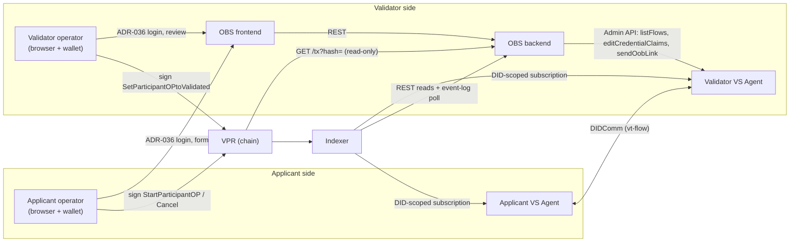

# Ecosystem Onboarding Service v4 Specification

**Latest Draft:** spec v4-draft1

## Abstract

The **Ecosystem Onboarding Service** (OBS) is the web service through which a Corporation that holds a validator-capable `Participant` entry in a Verifiable Public Registry (VPR) — an ECOSYSTEM, ISSUER_GRANTOR, VERIFIER_GRANTOR or ISSUER Participant of a Credential Schema — onboards applicants for that schema. It publishes what can be obtained (ecosystem, schema, role, fees, prerequisites), lets an applicant start an Onboarding Process from a browser with a wallet, collects out of band the evidence the validator needs (credential claims, documents, additional fields), lets the validator review and decide, and keeps a durable record of every step, including the on-chain transactions the humans sign.

The service is the out-of-band portal that the [Verifiable Trust Flow Protocol](../vt-flow-protocol/spec.md) anticipates with its `oob-link` message. It does not speak DIDComm, does not hold issuing keys and never signs on chain: the applicant's and the validator's [VS Agents](../vs-agent/spec.md) run the credential-acquisition flow on their own, humans sign VPR messages with their wallets under `OperatorAuthorization` grants, and the service records evidence and decisions, writes the agreed claims into the validator agent's flow, and reconciles its state with the chain (through the indexer) and with the agent.

This document specifies the normative behavior of an OBS implementation: container configuration and bootstrap, authentication and corporation context, the case and transaction-record models, the applicant and validator journeys, the integration contracts with the indexer, the chain RPC and the VS Agent, document handling, and the frontend requirements it inherits from the Verana Frontend specification.

## About this Document

In order to fully understand the concepts developed in this document, you should have some basic knowledge of the [Verifiable Trust Specification v4](https://verana-labs.github.io/verifiable-trust-spec/versions/v4/), the [Verifiable Trust VPR Specification v4](https://verana-labs.github.io/verifiable-trust-vpr-spec/versions/v4/) (Participant module, delegation model, common authorization checks), the [Indexer v4 Specification](../verana-indexer/spec.md), the [VS Agent v4 Specification](../vs-agent/spec.md) (notifications, credential acquisition flows, Administration API v2), the [Verifiable Trust Flow Protocol 1.0](../vt-flow-protocol/spec.md), and the [Verana Frontend v4 Specification](../verana-frontend/spec.md) (corporation context, transaction model, trust display). All terms used in this specification are inherited from those documents unless redefined in [Terminology](#terminology).

> References to the Verana Frontend v4 Specification target its v4 draft (branch `frontend-v4-spec`, pending approval).

## Conformance

As well as sections marked as non-normative, all authoring guidelines, diagrams, examples, and notes in this specification are non-normative. Everything else in this specification is normative.

The key words MAY, MUST, MUST NOT, OPTIONAL, RECOMMENDED, REQUIRED, SHOULD, and SHOULD NOT in this document are to be interpreted as described in [BCP 14](https://datatracker.ietf.org/doc/html/bcp14) [RFC2119](https://w3c.github.io/vc-data-model/#bib-rfc2119) [RFC8174](https://w3c.github.io/vc-data-model/#bib-rfc8174) when, and only when, they appear in all capitals, as shown here.

Normative requirements are prefixed `[OBS-]`.

## Terminology

Terms inherited from the VPR v4 specification keep their meaning there: **Corporation**, **policy_address**, **Ecosystem**, **Credential Schema**, **Participant**, **Onboarding Process (OP)**, **OperatorAuthorization**, **VSOperatorAuthorization**, **FeeGrant**, **Trust Deposit**. Terms inherited from the Verana Frontend v4 specification keep their meaning there: **connected account**, **acting Corporation**, **operator capability**, **guest mode**. Terms specific to this specification:

- **service**, **OBS** — the deployed Ecosystem Onboarding Service: its backend container and its frontend container together.
- **portal** — the OBS frontend, the web application the applicant and the validator use.
- **validator Participant** — the `Participant` entry designated by `OBS_VALIDATOR_PARTICIPANT_ID`. Its `schema_id`, and the `ecosystem_id` of that schema, fix the ecosystem and the schema the deployment serves; its `corporation_id` is the **validator Corporation**; its `did` is the **validator DID**, the DID of the validator's VS Agent.
- **applicant role** — the `ParticipantRole` an applicant obtains through the deployment, derived from the validator Participant's role and the schema's onboarding modes ([OBS-BOOT-ROLE]).
- **applicant Corporation** — the acting Corporation of the connected account that starts an Onboarding Process; the owner of the resulting applicant `Participant` entry.
- **case** — the service's record of one Onboarding Process: one applicant Corporation, one DID, one applicant `Participant` entry (keyed by its `participant_id`), under the validator Participant.
- **round** — one validation cycle of a case: the initial Onboarding Process, or one renewal.
- **submission** — the evidence an applicant provides for a round through the portal: proposed claims, uploaded documents, additional fields.
- **governance framework acceptance** — the persisted record that an operator, acting for a Corporation, has read and accepted a given version of the ecosystem governance framework (EGF) in the portal ([OBS-APP-GF]).
- **transaction record** — the durable record the service keeps of a VPR transaction signed from the portal.
- **flow** — the validator agent's vt-flow session for a case, as exposed by the agent's Administration API (`listFlows`).
- **event cursor** — the highest indexer block height whose events the backend has fully processed.

## Overview

*This section is non-normative.*

### Positioning

In VPR v4 an Onboarding Process is an on-chain state machine (`StartParticipantOP` → `SetParticipantOPtoValidated`) whose validation work happens off chain: after the applicant starts the process, the two parties' VS Agents open a DIDComm session and run the [vt-flow](../vt-flow-protocol/spec.md) protocol, and the validator collects "forms, documents, and other forms of disclosure" out of band before deciding. The VS Agent specification leaves that collection to a portal reached through an `oob-link`. The Ecosystem Onboarding Service is that portal, extended with the applicant's entry point.



### Division of responsibilities

| Concern | Who | How |
| --- | --- | --- |
| Start, renew, cancel an Onboarding Process | applicant operator | wallet-signed `StartParticipantOP` / `RenewParticipantOP` / `CancelParticipantOPLastRequest` under an `OperatorAuthorization` of the applicant Corporation |
| Contact the validator, send the `onboarding-request` | applicant VS Agent | its default handler for the `StartParticipantOP` / `RenewParticipantOP` events ([VSA-VTI-NOTIF-PP](../vs-agent/spec.md#vsa-vti-notif-pp-participant-notifications)) |
| Hold the flow, receive and expose claims and proofs, issue the credential | validator VS Agent | vt-flow; its default handler for the `SetParticipantOPtoValidated` event; `CreateOrUpdateParticipantSession` signed by its `vs_operator` |
| Publish the offer, show the ecosystem governance framework and record its acceptance, check eligibility, collect claims, documents and fields, keep decisions and transaction records | OBS | this specification |
| Decide and validate on chain | validator operator | wallet-signed `SetParticipantOPtoValidated` under an `OperatorAuthorization` of the validator Corporation |

### End-to-end sequence

```mermaid
sequenceDiagram
    participant AU as Applicant operator
    participant P as OBS (frontend + backend)
    participant VPR as VPR / Indexer
    participant AA as Applicant VS Agent
    participant VA as Validator VS Agent
    participant VU as Validator operator

    AU->>P: login (ADR-036), select acting Corporation
$1
    AU->>P: read and accept the active EGF version (acceptance persisted)
    AU->>P: start form (DID, fees, VSOA options)
    P->>VPR: pre-flight checks (resolve, eligibility, ownership)
    AU->>VPR: sign + broadcast StartParticipantOP
    AU->>P: transaction record (SUBMITTED)
    VPR-->>P: event log: StartParticipantOP, participant_id
    VPR-->>AA: StartParticipantOP event
    AA->>VA: DIDComm: onboarding-request
    P->>VA: listFlows (poll): flow found
    P-->>AU: case AWAITING_APPLICANT_DATA: claims, documents, fields
    AU->>P: submission
    P->>VA: editCredentialClaims (applicant claims)
    P-->>VU: case PENDING_VALIDATOR_REVIEW
    VU->>P: review (proof of trust, claims, documents)
    alt more information needed
        P->>VA: sendOobLink (case URL)
        P-->>AU: AWAITING_APPLICANT_DATA (validator message)
    else accept
        P->>VA: editCredentialClaims (final claims)
        VU->>VPR: sign + broadcast SetParticipantOPtoValidated
        VU->>P: transaction record (SUBMITTED)
        VPR-->>VA: SetParticipantOPtoValidated event
        VA->>AA: DIDComm: credential offer, session, issue-credential
        P->>VA: listFlows (poll): CRED_OFFERED, then COMPLETED
        P-->>AU: case COMPLETED
    end
```

The service never blocks on the browser: transaction records are created before broadcast and resolved by the backend from the indexer event log, and every workflow transition is either caused by the service itself or observed as a flow-state change on the validator agent.

## [OBS-CFG] Configuration

### [OBS-CFG-ENV] Backend Container Environment Variables

The table lists every environment variable of the OBS backend container. The subsection of each group is normative.

| Variable | Required | Group |
| --- | --- | --- |
| [`OBS_VALIDATOR_PARTICIPANT_ID`](#obs-cfg-env-id-target) | REQUIRED | Target |
| [`OBS_PUBLIC_URL`](#obs-cfg-env-id-target) | REQUIRED | Target |
| [`VERANA_CHAIN_ID`](#obs-cfg-env-net-network) | REQUIRED | Network |
| [`VERANA_INDEXER_BASE_URL`](#obs-cfg-env-net-network) | REQUIRED | Network |
| [`VERANA_RPC_ENDPOINT_URL`](#obs-cfg-env-net-network) | REQUIRED | Network |
| [`VERANA_FRONTEND_URL`](#obs-cfg-env-net-network) | OPTIONAL | Network |
| [`VS_AGENT_ADMIN_URL`](#obs-cfg-env-agent-vs-agent) | OPTIONAL | VS Agent |
| [`OBS_ACCOUNT_MNEMONIC`](#obs-cfg-env-agent-vs-agent) | CONDITIONAL | VS Agent |
| [`OBS_APPLICANT_ROLE`](#obs-cfg-env-policy-onboarding-policy) | OPTIONAL | Onboarding policy |
| [`OBS_REQUIRED_PUBLIC_CREDENTIAL_SCHEMA_IDS`](#obs-cfg-env-policy-onboarding-policy) | OPTIONAL | Onboarding policy |
| [`OBS_CLAIMS_MODE`](#obs-cfg-env-policy-onboarding-policy) | OPTIONAL | Onboarding policy |
| [`OBS_REQUIREMENTS_FILE`](#obs-cfg-env-policy-onboarding-policy) | OPTIONAL | Onboarding policy |
| [`OBS_DATABASE_URL`](#obs-cfg-env-rt-runtime) | REQUIRED | Runtime |
| [`OBS_STORAGE_ENDPOINT`](#obs-cfg-env-rt-runtime) | CONDITIONAL | Runtime |
| [`OBS_STORAGE_BUCKET`](#obs-cfg-env-rt-runtime) | CONDITIONAL | Runtime |
| [`OBS_STORAGE_ACCESS_KEY`](#obs-cfg-env-rt-runtime) | CONDITIONAL | Runtime |
| [`OBS_STORAGE_SECRET_KEY`](#obs-cfg-env-rt-runtime) | CONDITIONAL | Runtime |
| [`OBS_CASE_RETENTION_DAYS`](#obs-cfg-env-rt-runtime) | OPTIONAL | Runtime |
| [`OBS_SESSION_LIFETIME_SECONDS`](#obs-cfg-env-rt-runtime) | OPTIONAL | Runtime |
| [`OBS_EVENT_POLL_INTERVAL_MS`](#obs-cfg-env-recon-reconciliation) | OPTIONAL | Reconciliation |
| [`OBS_FLOW_POLL_INTERVAL_MS`](#obs-cfg-env-recon-reconciliation) | OPTIONAL | Reconciliation |
| [`OBS_TX_LOOKUP_AFTER_BLOCKS`](#obs-cfg-env-recon-reconciliation) | OPTIONAL | Reconciliation |
| [`OBS_TX_NOT_FOUND_AFTER_BLOCKS`](#obs-cfg-env-recon-reconciliation) | OPTIONAL | Reconciliation |
| [`OBS_LOG_LEVEL`](#obs-cfg-env-rt-runtime) | OPTIONAL | Runtime |

#### [OBS-CFG-ENV-ID] Target

| Variable | Required | Description |
| --- | --- | --- |
| `OBS_VALIDATOR_PARTICIPANT_ID` | REQUIRED | `Participant.id` (uint64) of the validator Participant this deployment manages. One deployment manages exactly one validator Participant, hence one Credential Schema of one Ecosystem. The entry MUST be an [active participant](https://verana-labs.github.io/verifiable-trust-vpr-spec/versions/v4/#terminology) whose `role` is `ECOSYSTEM`, `ISSUER_GRANTOR`, `VERIFIER_GRANTOR` or `ISSUER` ([OBS-BOOT-1]). |
| `OBS_PUBLIC_URL` | REQUIRED | Public `https://` origin (scheme + host + optional port, no trailing path) at which the portal is reachable. It is the base of every case URL the service sends through the validator agent (`sendOobLink`) and the `serviceEndpoint` of the service entry the service registers on the validator DID Document ([OBS-BOOT-SVC]). The backend MUST reject a URL that is not `https://` or that carries a path, a query, a username or a password. |

#### [OBS-CFG-ENV-NET] Network

| Variable | Required | Description |
| --- | --- | --- |
| `VERANA_CHAIN_ID` | REQUIRED | Chain id (e.g. `vna-testnet-1`). Used to validate that the indexer and the RPC serve the same network, and served to the frontend. |
| `VERANA_INDEXER_BASE_URL` | REQUIRED | Indexer base URL (e.g. `https://idx.testnet.verana.network`). All reads and the event-log poll of [OBS-INT-IDX] use `{base}/v4/...` per the [Indexer v4 Specification](../verana-indexer/spec.md). |
| `VERANA_RPC_ENDPOINT_URL` | REQUIRED | Chain RPC endpoint URL. The backend uses it for **read-only** transaction lookups only (`GET /tx?hash=`, [OBS-INT-RPC]); it never broadcasts and never signs. |
| `VERANA_FRONTEND_URL` | OPTIONAL | Base URL of a Verana Frontend deployment on the same network. When set, the default link of a missing prerequisite credential points to `{VERANA_FRONTEND_URL}/ecosystems/{ecosystem_id}` ([OBS-APP-ELIG-4]). |

#### [OBS-CFG-ENV-AGENT] VS Agent

| Variable | Required | Description |
| --- | --- | --- |
| `VS_AGENT_ADMIN_URL` | OPTIONAL | Origin of the validator VS Agent's [Administration API](../vs-agent/spec.md#administration-api). When unset, the backend MUST discover it from the `VsAgentAdminAPI` service entry of the validator DID Document ([VSA-VTI-DIDDOC](../vs-agent/spec.md#vsa-vti-diddoc-did-document-service-entries)) and MUST fail to start when no such entry exists. |
| `OBS_ACCOUNT_MNEMONIC` | CONDITIONAL | BIP-39 mnemonic of the Verana account the backend uses to authenticate to the Admin API per [VSA-ADM-AUTH-PROTO](../vs-agent/spec.md#vsa-adm-auth-proto-account-challengeresponse). REQUIRED when the agent serves the backend as an external caller (agent `ADMIN_API_AUTH_MODE` = `corporation`); the derived account MUST then be listed in the agent's `ADMIN_API_CORPORATION_ALLOWED_ACCOUNTS`. MUST be unset when the backend reaches the agent from one of its trusted networks. This account is never used on chain. |

#### [OBS-CFG-ENV-POLICY] Onboarding policy

| Variable | Required | Description |
| --- | --- | --- |
| `OBS_APPLICANT_ROLE` | OPTIONAL | One `ParticipantRole`. Restricts the deployment to a single applicant role among those the validator Participant can validate ([OBS-BOOT-ROLE]). Only meaningful when the validator Participant is an `ECOSYSTEM` Participant, which can validate up to four roles; for the other validator roles the applicant role is unique and this variable, if set, MUST equal it. |
| `OBS_REQUIRED_PUBLIC_CREDENTIAL_SCHEMA_IDS` | OPTIONAL | Comma-separated list of `CredentialSchema.id` values. An applicant DID MUST publicly present, as Linked Verifiable Presentations, at least one credential of each listed schema to be allowed to start an Onboarding Process ([OBS-APP-ELIG]). Empty or unset: no prerequisite. |
| `OBS_CLAIMS_MODE` | OPTIONAL | Only meaningful when the applicant role is `HOLDER`, the only role for which a credential is issued ([OBS-BOOT-4]). `applicant-proposes-validator-confirms` (default): the applicant edits, or inputs when the `onboarding-request` carried none, the credential claims, and the validator confirms or adjusts them. `validator-only`: the applicant sees the claims read-only and only the validator inputs and adjusts them. See [OBS-APP-SUBMIT] and [OBS-VAL-ACCEPT]. |
| `OBS_REQUIREMENTS_FILE` | OPTIONAL | Path to the requirements file of [OBS-CFG-REQ]: the documents and additional fields the applicant must provide, and per-schema link overrides. When unset, or when the file declares no document and no field, the evidence step of the applicant journey is omitted. |

#### [OBS-CFG-ENV-RT] Runtime

| Variable | Required | Description |
| --- | --- | --- |
| `OBS_DATABASE_URL` | REQUIRED | Connection URL of the relational database holding cases, rounds, submissions, decisions, transaction records, the event cursor and the audit log. |
| `OBS_STORAGE_ENDPOINT`, `OBS_STORAGE_BUCKET`, `OBS_STORAGE_ACCESS_KEY`, `OBS_STORAGE_SECRET_KEY` | CONDITIONAL | S3-compatible object storage for uploaded documents. REQUIRED when the requirements file declares at least one document. The bucket MUST NOT be publicly readable. |
| `OBS_CASE_RETENTION_DAYS` | OPTIONAL | Number of days after which the documents and personal data of a case in a terminal status are deleted ([OBS-DOC-4]). Default: `365`. |
| `OBS_SESSION_LIFETIME_SECONDS` | OPTIONAL | Lifetime of a bearer session issued by [OBS-AUTH]. Default: `3600`. |
| `OBS_LOG_LEVEL` | OPTIONAL | One of `error`, `warn`, `info`, `debug`. Default: `info`. |

#### [OBS-CFG-ENV-RECON] Reconciliation

| Variable | Required | Description |
| --- | --- | --- |
| `OBS_EVENT_POLL_INTERVAL_MS` | OPTIONAL | Interval of the indexer event-log poll of [OBS-INT-IDX-POLL]. Default: `5000`. SHOULD be close to the chain's block interval. |
| `OBS_FLOW_POLL_INTERVAL_MS` | OPTIONAL | Interval of the validator agent flow poll of [OBS-INT-VSA-POLL]. Default: `5000`. |
| `OBS_TX_LOOKUP_AFTER_BLOCKS` | OPTIONAL | Number of indexed blocks after which a transaction record still `SUBMITTED` is looked up on the RPC ([OBS-TX-RESOLVE-3]). Default: `3`. |
| `OBS_TX_NOT_FOUND_AFTER_BLOCKS` | OPTIONAL | Number of indexed blocks after which a transaction record that the chain does not know is set to `NOT_FOUND` ([OBS-TX-RESOLVE-4]). Default: `120`. |

### [OBS-CFG-REQ] Requirements file

The requirements file is a JSON document that declares the evidence an applicant must provide for a round, beyond the credential claims. Its normative JSON Schema is published alongside this document at [`schemas/v4/obs/requirements.schema.json`](./schemas/v4/obs/requirements.schema.json). Field names are camelCase.

- [OBS-CFG-REQ-1] The backend MUST validate the file against the schema at startup and MUST refuse to start when validation fails.
- [OBS-CFG-REQ-2] `documents[]` declares the files the applicant uploads: `id` (unique, `^[a-z0-9-]+$`), `label`, `description`, `mediaTypes` (accepted IANA media types), `maxSizeBytes`, `required` (default `true`), `multiple` (default `false`).
- [OBS-CFG-REQ-3] `fields[]` declares the additional inputs the applicant fills: `id` (unique), `label`, `description`, `type` (`text`, `textarea`, `number`, `date`, `url`, `select`), `required` (default `true`), `options` (REQUIRED for `select`), `pattern`, `maxLength`.
- [OBS-CFG-REQ-4] `credentialLinks` maps a `CredentialSchema.id` to the URL shown to an applicant that lacks a credential of that schema; it overrides the default of [OBS-APP-ELIG-4].
- [OBS-CFG-REQ-5] `instructions.applicant` and `instructions.validator` are OPTIONAL Markdown texts shown at the top of the applicant evidence step and of the validator review, rendered as Markdown, never as HTML.
- [OBS-CFG-REQ-6] Labels, descriptions and instructions are localizable: each MAY be a string or an object keyed by [BCP 47](https://www.rfc-editor.org/info/bcp47) language tag, resolved per the locale rules of [VFE-GEN-I18N](../verana-frontend/spec.md#vfe-gen-i18n-internationalization).

### [OBS-CFG-FE] Frontend Container Environment Variables

- [OBS-CFG-FE-1] The portal container takes the variables of [VFE-GEN-ENV](../verana-frontend/spec.md#vfe-gen-env-container-environment-variables) that its inherited components need (`NEXT_PUBLIC_VERANA_CHAIN_ID`, `NEXT_PUBLIC_VERANA_CHAIN_NAME`, `NEXT_PUBLIC_VERANA_RPC_ENDPOINT`, `NEXT_PUBLIC_VERANA_INDEXER_BASE_URL`, `NEXT_PUBLIC_VERANA_WEBSOCKET`, `NEXT_PUBLIC_VERANA_EXPLORER_URL`, `NEXT_PUBLIC_VERANA_SIGN_DIRECT_MODE`, `NEXT_PUBLIC_SESSION_LIFETIME_SECONDS`, `NEXT_PUBLIC_LOW_BALANCE_WARN_UVNA`, `NEXT_PUBLIC_VERANA_CHAIN_PROVIDER_*`, `NEXT_PUBLIC_APP_VERSION`) plus `NEXT_PUBLIC_OBS_API_URL`, the origin of the OBS backend API.
- [OBS-CFG-FE-2] Branding (`NEXT_PUBLIC_APP_NAME`, `NEXT_PUBLIC_APP_LOGO`) is OPTIONAL; when unset the portal shows the validator's service identity from its trust resolution ([OBS-APP-HOME-1]).
- [OBS-CFG-FE-3] Everything that describes the deployment (ecosystem, schema, applicant roles, fees, prerequisites, requirements file, claims mode) is served by the backend's public configuration endpoint and MUST NOT be duplicated in frontend variables.

## [OBS-BOOT] Bootstrap Sequence

When the backend starts, it MUST execute the following steps in order. Any REQUIRED step that fails MUST cause the process to exit with a non-zero status code with a descriptive error; the backend MUST NOT serve the API before all REQUIRED steps have succeeded.

1. **Validate configuration.** Every REQUIRED variable is present and well-formed; conditional variables are consistent ([OBS-CFG-ENV]); the requirements file validates ([OBS-CFG-REQ-1]).
2. **Resolve the validator Participant.** Call [`IDX-PP-QRY-1 Get Participant`](../verana-indexer/spec.md#idx-pp-qry-1-get-participant) with `OBS_VALIDATOR_PARTICIPANT_ID`. [OBS-BOOT-1] The entry MUST exist, its `participant_state` MUST be `ACTIVE`, and its `role` MUST be one of `ECOSYSTEM`, `ISSUER_GRANTOR`, `VERIFIER_GRANTOR`, `ISSUER`. Cache `schema_id`, `corporation_id`, `did`, `validation_fees`.
3. **Resolve the schema and the ecosystem.** Call [`IDX-CS-QRY-1`](../verana-indexer/spec.md#idx-cs-qry-1-get-credential-schema) and [`IDX-ES-QRY-1`](../verana-indexer/spec.md#idx-es-qry-1-get-ecosystem). [OBS-BOOT-2] The schema MUST NOT be archived. [OBS-BOOT-3] The schema's `pricing_asset_type` MUST be `COIN` and `pricing_asset` MUST be the chain's native denom: this revision applies the pricing gate of [VFE-TX-COSTS-2](../verana-frontend/spec.md#vfe-tx-costs-trust-fee-and-deposit-estimation) and supports no other pricing asset.
4. **Derive the applicant roles** ([OBS-BOOT-ROLE]). The derived set MUST be non-empty; when `OBS_APPLICANT_ROLE` is set it MUST be a member of the set, and the set is reduced to it.
5. **Determine issuance.** [OBS-BOOT-4] A credential is issued at the end of a validated round if, and only if, the applicant role set is exactly `{HOLDER}`: a `HOLDER` entry exists to receive a credential of the schema, and the validator agent takes the same decision from the validated entry's `role` ([VSA-VTI-NOTIF-PP](../vs-agent/spec.md#vsa-vti-notif-pp-participant-notifications)). This is a chain fact, not a configuration. When the applicant role is `HOLDER`, the validator Participant MUST carry a `ParticipantAuthorizationRecord` whose `msg_types` includes `CreateOrUpdateParticipantSession` ([`IDX-DE-QRY-2`](../verana-indexer/spec.md#idx-de-qry-2-list-vs-operator-authorizations) with `participant_id`), or the backend MUST log a warning that issuance will fail on chain.
6. **Reach the validator agent.** Resolve the Admin API origin ([OBS-CFG-ENV-AGENT]), authenticate if required, call [`getAgentInfo`](../vs-agent/spec.md#vsa-adm-ag-info-getagentinfo). [OBS-BOOT-5] `getAgentInfo.did` MUST equal the validator DID.
7. **Register the service entry** ([OBS-BOOT-SVC]).
8. **Initialize reconciliation.** Load the persisted event cursor; on first start set it to the current indexed height ([`IDX-INDEXER-QRY-1`](../verana-indexer/spec.md#idx-indexer-qry-1-get-block-height)); start the event-log poll ([OBS-INT-IDX-POLL]) and the flow poll ([OBS-INT-VSA-POLL]).
9. **Serve the API.** The readiness probe ([OBS-OPS-2]) turns ready.

> Deployment precondition: the validator agent's default handler for the `SetParticipantOPtoValidated` notification MUST be enabled (the event type MUST NOT be listed in the agent's `VERANA_INDEXER_DEFAULT_HANDLERS_OVERRIDE`, see [VSA-VTI-CFG-ENV-NET](../vs-agent/spec.md#vsa-vti-cfg-env-net-network-configuration)): the service relies on the agent progressing the flow, and never calls `validateFlow` ([OBS-INT-VSA-3]).

### [OBS-BOOT-ROLE] Applicant role derivation

The applicant role set is derived from the validator Participant's `role` and the schema's onboarding modes, per the permission checks of [MOD-PP-MSG-1-2-2](https://verana-labs.github.io/verifiable-trust-vpr-spec/versions/v4/#mod-pp-msg-1-2-2-start-participant-op-permission-checks):

| Validator role | Applicant role | Condition on the schema |
| --- | --- | --- |
| `ISSUER_GRANTOR` | `ISSUER` | `issuer_onboarding_mode` = `GRANTOR_ONBOARDING_PROCESS` |
| `VERIFIER_GRANTOR` | `VERIFIER` | `verifier_onboarding_mode` = `GRANTOR_ONBOARDING_PROCESS` |
| `ISSUER` | `HOLDER` | `holder_onboarding_mode` = `ISSUER_ONBOARDING_PROCESS` |
| `ECOSYSTEM` | `ISSUER_GRANTOR` | `issuer_onboarding_mode` = `GRANTOR_ONBOARDING_PROCESS` |
| `ECOSYSTEM` | `ISSUER` | `issuer_onboarding_mode` = `ECOSYSTEM_ONBOARDING_PROCESS` |
| `ECOSYSTEM` | `VERIFIER_GRANTOR` | `verifier_onboarding_mode` = `GRANTOR_ONBOARDING_PROCESS` |
| `ECOSYSTEM` | `VERIFIER` | `verifier_onboarding_mode` = `ECOSYSTEM_ONBOARDING_PROCESS` |

- [OBS-BOOT-ROLE-1] The set is the union of the rows whose condition holds for the validator role. An `ECOSYSTEM` validator Participant MAY therefore offer up to four roles; a deployment that wants a single one sets `OBS_APPLICANT_ROLE`.
- [OBS-BOOT-ROLE-2] The backend MUST re-evaluate the set whenever the schema changes on the indexer (the onboarding modes are immutable in v4, but the schema MAY be archived): a case MUST NOT be started for an archived schema ([OBS-APP-PRE-6]).

### [OBS-BOOT-SVC] Service entry registration

- [OBS-BOOT-SVC-1] The backend MUST ensure that the validator DID Document declares a `service` entry of type `EcosystemOnboardingService` whose `serviceEndpoint` is `OBS_PUBLIC_URL`, by reading the current entries with [`listServiceEndpoints`](../vs-agent/spec.md#vsa-adm-vt-se-list-listserviceendpoints) and calling [`addServiceEndpoint`](../vs-agent/spec.md#vsa-adm-vt-se-add-addserviceendpoint) or [`updateServiceEndpoint`](../vs-agent/spec.md#vsa-adm-vt-se-update-updateserviceendpoint) as needed. The entry `id` fragment SHOULD be `#onboarding`.
- [OBS-BOOT-SVC-2] The entry is a consumable endpoint under [VS-SVC-3](https://verana-labs.github.io/verifiable-trust-spec/versions/v4/#vs-svc-service-declaration) and requires no bootstrap over DIDComm: the portal authenticates its users with wallets ([OBS-AUTH]). Clients discover the portal of a validator from its DID alone: a Verana Frontend Pending Tasks view or Participant card MAY deep-link to `{serviceEndpoint}/cases/{participant_id}`.
- [OBS-BOOT-SVC-3] Failure to register the entry MUST be logged and MUST NOT prevent the service from starting; the backend SHOULD retry with back-off.

## [OBS-AUTH] Authentication

The portal authenticates humans as Verana accounts with the wallet they already use to sign transactions. The mechanism is the account challenge/response of the VS Agent Administration API, reused unchanged except for its payload prefix.

- [OBS-AUTH-1] Every request to an authenticated endpoint MUST carry a bearer token in the HTTP `Authorization` header (`Bearer` scheme) obtained through [OBS-AUTH-PROTO]. The public endpoints are exactly: the authentication endpoints, the deployment configuration endpoint that serves the home page ([OBS-APP-HOME]), and the health probes ([OBS-OPS]).
- [OBS-AUTH-2] The backend is a trusted component: unlike the Verana Frontend ([VFE-SEC-1](../verana-frontend/spec.md#vfe-sec-security-considerations)) it holds server-side sessions and personal data, and MUST be operated accordingly ([OBS-DOC], [Security Considerations](#security-considerations)).

### [OBS-AUTH-PROTO] Account challenge/response

- [OBS-AUTH-PROTO-1] The exchange, the sign doc, the verification rules, the single-use and expiry rules of nonces, and the token presentation rules are those of [VSA-ADM-AUTH-PROTO](../vs-agent/spec.md#vsa-adm-auth-proto-account-challengeresponse), with one difference: the challenge payload is `verana-onboarding-auth:<nonce>`. A signature over a payload with any other prefix MUST be rejected, so that a signature obtained for a VS Agent cannot be replayed against the portal and vice versa.
- [OBS-AUTH-PROTO-2] The endpoints are `POST /v1/auth/challenge` (input `account`; output `nonce`, `expiresAt`) and `POST /v1/auth/token` (input `account`, `pubKey`, `signature`, `nonce`; output `token`, `expiresAt`), with the same shapes and error codes as [`challenge`](../vs-agent/spec.md#vsa-adm-auth-challenge-challenge) and [`token`](../vs-agent/spec.md#vsa-adm-auth-token-token). Nonces expire after 120 seconds; tokens expire after `OBS_SESSION_LIFETIME_SECONDS`.
- [OBS-AUTH-PROTO-3] A challenge MUST NOT reveal whether the account can act for any Corporation; authorization is decided later per request ([OBS-AUTHZ]).
- [OBS-AUTH-PROTO-4] The sign doc is an ADR-036 arbitrary-message signature (`signArbitrary`). Extension wallets support it; some mobile wallets reached through WalletConnect do not. The portal MUST detect the absence of the capability at connect time and show an explicit "this wallet does not support message signing" notice; the public surfaces stay available in guest mode.

## [OBS-CORP] Corporation Context

The portal adopts the corporation context of the Verana Frontend ([VFE-CORP](../verana-frontend/spec.md#vfe-corp-corporation-context)) with one restriction: in this revision an account acts for a Corporation **only** through an `OperatorAuthorization`. Group membership, group proposals and the proposal fallback are out of scope.

### [OBS-CORP-DISC] Discovery

- [OBS-CORP-DISC-1] After authentication, the backend MUST discover the Corporations the connected account can act for from exactly one source: [`IDX-DE-QRY-1 List Operator Authorizations`](../verana-indexer/spec.md#idx-de-qry-1-list-operator-authorizations) with `operator=<account>&only_active=true`. Each distinct `corporation_id` is a candidate; its **capability set** is the union of `msg_types[]` over the account's active grants from that Corporation. Display data (`did`, `policy_address`) comes from [`IDX-CO-QRY-1`](../verana-indexer/spec.md#idx-co-qry-1-get-corporation); the Corporation's identity card MAY be enriched by trust resolution of its DID.
- [OBS-CORP-DISC-2] Group membership ([`IDX-GR-QRY-2`](../verana-indexer/spec.md#idx-gr-qry-2-list-corporations-by-member)) MUST NOT be used for discovery in this revision; an account that is only a group member of a Corporation is a guest for that Corporation. `VSOperatorAuthorization` grants MUST NOT be used either: `vs_operator` accounts are agent accounts.
- [OBS-CORP-DISC-3] The discovery result MAY be cached by the backend for at most 60 seconds. It MUST be recomputed on login, on session restore, when the client switches Corporation, and immediately before the portal opens the wallet for a signature ([OBS-CORP-CAPS-3]).

### [OBS-CORP-SEL] Acting Corporation selection

- [OBS-CORP-SEL-1] Whenever a wallet is connected, the portal header MUST show the acting Corporation selector of [VFE-CORP-SEL-1](../verana-frontend/spec.md#vfe-corp-sel-acting-corporation-selection): the acting Corporation's identity (resolved name, else DID), and a dropdown of every discovered Corporation. Membership-kind badges and voting weights are not shown (every entry is an operator grant), and the dropdown has no *Create new Corporation* entry: creating a Corporation belongs to the Verana Frontend, to which the portal MAY link when `VERANA_FRONTEND_URL` is set.
- [OBS-CORP-SEL-2] Exactly one Corporation is acting at a time; auto-selected when the set has one entry, prompted on first login when it has several, persisted client-side for the session lifetime, re-validated on session restore, and cleared with a blocking notice when the account can no longer act for it, per [VFE-CORP-SEL-2..4](../verana-frontend/spec.md#vfe-corp-sel-acting-corporation-selection). In-flight forms MUST NOT be submitted under a stale context.
- [OBS-CORP-SEL-3] Next to each non-acting Corporation, the selector MUST show an attention indicator when that Corporation has cases awaiting its action in this deployment: as validator, cases in `PENDING_VALIDATOR_REVIEW`; as applicant, cases in `AWAITING_APPLICANT_DATA`. The counts are served by the backend and refreshed with the case-page polling of [OBS-FE-4].

### [OBS-CORP-CAPS] Capability gate

The portal leads to four VPR delegable messages: `StartParticipantOP`, `RenewParticipantOP` and `CancelParticipantOPLastRequest` on the applicant side, `SetParticipantOPtoValidated` on the validator side.

- [OBS-CORP-CAPS-1] An action button that leads to one of these messages MUST be enabled only when **both** hold: (a) the on-chain state admits the message, as exposed by the indexer's `corporation_available_actions[]` / `validator_available_actions[]` for the applicant `Participant` entry ([Available Actions Semantics](../verana-indexer/spec.md#available-actions-semantics)) or, for `StartParticipantOP` where no entry exists yet, by the pre-flight checks of [OBS-APP-PRE]; and (b) the message type is in the capability set of the acting Corporation.
- [OBS-CORP-CAPS-2] When (a) holds but (b) does not, the portal MUST show the action disabled with the explanation that the connected account needs an `OperatorAuthorization` from the acting Corporation covering the message type, granted by that Corporation through the Verana Frontend. There is no proposal fallback ([VFE-TX-FALLBACK](../verana-frontend/spec.md#vfe-tx-fallback-proposal-fallback) does not apply) and no signing-mode icon: operator mode is the only mode.
- [OBS-CORP-CAPS-3] Immediately before opening the wallet, the portal MUST re-check the grant (fresh discovery, [OBS-CORP-DISC-3]) and MUST show the grant's expiration and spend limits when set. The chain remains authoritative: on-chain authorization rejections ([AUTHZ-CHECK-1](https://verana-labs.github.io/verifiable-trust-vpr-spec/versions/v4/#authz-check-1-operator-authorization-checks)) MUST be surfaced as such, not as generic errors ([VFE-CORP-CAPS-4](../verana-frontend/spec.md#vfe-corp-caps-capability-model)).
- [OBS-CORP-CAPS-4] Transactions executed elsewhere through a group proposal are nevertheless handled: they reach the service as chain events ([OBS-INT-IDX-POLL]) or flow-state changes ([OBS-INT-VSA-POLL]) like any other.

## [OBS-AUTHZ] Request Authorization

- [OBS-AUTHZ-1] Every authenticated request MUST name the acting Corporation (`X-Acting-Corporation: <corporation_id>` header). The backend MUST verify, against the discovery result of [OBS-CORP-DISC], that the authenticated account holds an active `OperatorAuthorization` from that Corporation; otherwise it MUST answer `403` `FORBIDDEN`.
- [OBS-AUTHZ-2] A session acts in the **validator scope** when the acting Corporation is the validator Corporation: it MAY list every case of the deployment, read every submission and document, and record decisions. It acts in the **applicant scope** for every case whose applicant Corporation is the acting Corporation: it MAY read that case, provide its evidence and start, renew or cancel its Onboarding Processes. The same account and Corporation MAY hold both scopes (the validator Corporation onboarding a service of its own): the portal then shows both sides of such a case.
- [OBS-AUTHZ-3] Authorization to sign is not the backend's concern beyond [OBS-CORP-CAPS]: the wallet signs, and the chain enforces the operator grant.
- [OBS-AUTHZ-4] A request that would change a round in a state that does not admit it (per [OBS-CASE-STATUS]) MUST be refused with `409` `INVALID_STATE`.
- [OBS-AUTHZ-5] Document contents are served only to sessions authorized on the case per [OBS-AUTHZ-2], through short-lived signed URLs or a backend proxy; object-storage locations MUST never be exposed.

## [OBS-CASE] Cases

### [OBS-CASE-KEY] Identity and creation

- [OBS-CASE-1] A case is keyed by the applicant `Participant.id`; there is exactly one case per applicant `Participant` entry under the validator Participant. An applicant Corporation MAY have several cases (one per DID it onboards, plus the cases of superseded entries).
- [OBS-CASE-2] A case MUST be created by whichever of these arrives first, and never from unverified frontend input alone: (a) a transaction record for `StartParticipantOP` resolved to a `participant_id` ([OBS-TX-RESOLVE]); (b) an event-log entry `StartParticipantOP` whose `entity_id` designates a `Participant` entry with `validator_participant_id` = `OBS_VALIDATOR_PARTICIPANT_ID` ([OBS-INT-IDX-POLL]); (c) a validator-side flow whose `participantId` is unknown to the service ([OBS-INT-VSA-POLL]). In cases (b) and (c) the backend reads the entry with [`IDX-PP-QRY-1`](../verana-indexer/spec.md#idx-pp-qry-1-get-participant) to fill the case. An entry whose `validator_participant_id` is not the validator Participant MUST be ignored.
- [OBS-CASE-3] A case record holds: `participantId`, `applicantCorporationId`, `did`, `role`, `schemaId`, `ecosystemId`, `createdAt`, `lastEventAt`, the derived `status` ([OBS-CASE-STATUS]), and its rounds. A round holds: `kind` (`initial` | `renewal`), `openedAt`, the governance framework acceptance of the round ([OBS-APP-GF]), the submission state and content (proposed claims, documents, fields), the validator messages, the decision (final claims, fee terms, `effective_until`, `op_summary_digest`, decided by, decided at), and the transaction records of the round.
- [OBS-CASE-4] A `RenewParticipantOP` event for the case's `participant_id` (or, failing the event, the flow of the case leaving `COMPLETED` or `VALIDATED` for `VALIDATING`) MUST open a new round of kind `renewal` with submission state `NONE`; previous rounds are retained read-only.

### [OBS-CASE-STATUS] Status derivation

A case has no stored status: its status is **derived** from four inputs each time it is read or reconciled, and no client can set it.

| Input | Source |
| --- | --- |
| `P` | the applicant `Participant` entry as read from the indexer: `op_state`, `participant_state`, `effective_until` |
| `F` | the validator agent's flow for the case: `flowState`, `connectionState` ([vt-flow States](../vt-flow-protocol/spec.md#states)); absent until the applicant agent has made contact |
| `S` | the current round's submission state kept by the service: `NONE`, `DRAFT`, `SUBMITTED`, `RETURNED`, `ACCEPTED`, `REFUSED` |
| `T` | the open transaction records of the case ([OBS-TX]) |

- [OBS-CASE-STATUS-1] `S` transitions are: `NONE` → `DRAFT` (applicant saves), `DRAFT` → `SUBMITTED` (applicant submits), `SUBMITTED` → `RETURNED` (validator requests more information), `RETURNED` → `SUBMITTED` (applicant resubmits), `SUBMITTED` → `ACCEPTED` (validator accepts, [OBS-VAL-ACCEPT]) or `SUBMITTED` → `REFUSED` (validator refuses), `REFUSED` → `RETURNED` (validator reopens), `ACCEPTED` → `SUBMITTED` (the validation transaction failed, [OBS-VAL-ACCEPT-6]). `ACCEPTED` is final for the round otherwise; a new round starts at `NONE`.
- [OBS-CASE-STATUS-2] The status is the first row that matches, top to bottom:

| Status | Rule |
| --- | --- |
| `SLASHED` | `P.participant_state` ∈ {`SLASHED`, `REPAID`}, or `F.flowState` = `PARTICIPANT_SLASHED` |
| `REVOKED` | `P.participant_state` = `REVOKED`, or `F.flowState` = `PARTICIPANT_REVOKED` |
| `CREDENTIAL_REVOKED` | `F.flowState` = `CRED_REVOKED` |
| `ERROR` | `F.flowState` = `ERROR` |
| `CANCELLED` | `P.op_state` = `TERMINATED`, or `F.flowState` = `TERMINATED_BY_APPLICANT`, or (round of kind `renewal` and the `CancelParticipantOPLastRequest` event of this round was seen) |
| `COMPLETED` | `F.flowState` = `COMPLETED` |
| `ISSUING` | `F.flowState` = `CRED_OFFERED` |
| `VALIDATED` | `P.op_state` = `VALIDATED` for the current round |
| `REFUSED` | `S` = `REFUSED` |
| `ACCEPTED_PENDING_CHAIN` | `S` = `ACCEPTED` |
| `PENDING_VALIDATOR_REVIEW` | `S` = `SUBMITTED` |
| `AWAITING_APPLICANT_DATA` | `F` is present (`AWAITING_OR`, `VALIDATING`, `OOB_PENDING`) and `S` ∈ {`NONE`, `DRAFT`, `RETURNED`} |
| `AWAITING_AGENT` | `P.op_state` = `PENDING` and `F` is absent |

- [OBS-CASE-STATUS-3] `COMPLETED`, `CANCELLED`, `REVOKED`, `SLASHED`, `CREDENTIAL_REVOKED` and `ERROR` are terminal for the round; `VALIDATED` is terminal when the applicant role is not `HOLDER`. `REFUSED` is not terminal: the validator MAY reopen the round, and the applicant MAY cancel the Onboarding Process ([OBS-APP-CANCEL]).
- [OBS-CASE-STATUS-4] Later on-chain changes to a closed round (`participant_state` becoming `EXPIRED`, a `SetParticipantEffectiveUntil`, a revocation of a non-HOLDER entry after completion, for which the agent defines no flow transition) are reflected by re-reading `P` when the case is displayed and by the event-log poll; they never require the browser.
- [OBS-CASE-STATUS-5] The portal renders the status with the vocabulary above and, alongside it, the on-chain badges of [VFE-TRUST-BADGE](../verana-frontend/spec.md#vfe-trust-badge-badges) (`participant_state`, `op_state`) so that the human sees both the workflow position and the chain facts.

## [OBS-TX] Transaction Records

The Verana Frontend's transaction notification is ephemeral. The portal instead keeps a **transaction record** for every VPR transaction it leads a human to sign, created before broadcast and reconciled by the backend independently of the browser, so that a user who signs and leaves finds the outcome on return.

### [OBS-TX-REC] Record

- [OBS-TX-REC-1] A record holds: `txHash` (uppercase hexadecimal SHA-256 of the signed `TxRaw` bytes, the identifier the chain reports), `msgType` (one of `StartParticipantOP`, `RenewParticipantOP`, `CancelParticipantOPLastRequest`, `SetParticipantOPtoValidated`), `context` (the case `participantId`, or, for a `StartParticipantOP`, the start-form key: acting Corporation, DID, role), `actingCorporationId`, `signerAccount`, `submittedAt`, `status`, `height`, `code`, `rawLog`, `participantId` (once known), `resolvedBy` (`frontend`, `event-log`, `rpc`), `updatedAt`.
- [OBS-TX-REC-2] At most one record with status `SUBMITTED` or `INCLUDED` MAY exist per (`context`, `msgType`); the backend MUST refuse another with `409` `INVALID_STATE`, and the portal MUST keep the corresponding action disabled while one exists.

### [OBS-TX-STATE] States

| Status | Set by | Meaning | Portal |
| --- | --- | --- | --- |
| `SUBMITTED` | frontend, before broadcast | signed, hash known, not yet seen in a block | "transaction pending" banner with the hash and its explorer link; the action stays disabled |
| `INCLUDED` | frontend from the `DeliverTxResponse`, backend from the RPC lookup | executed with `code` = 0 at `height`; the indexer may not have reached `height` | "confirmed on chain at block H, waiting for the indexer"; the action stays disabled |
| `INDEXED` | backend, when the event of the transaction is seen in the indexer event log and the case has been refreshed | the service's state reflects the transaction | banner replaced by the case status; success notification when the tab is open |
| `FAILED` | frontend from the `DeliverTxResponse`, backend from the RPC lookup | executed with `code` ≠ 0, or rejected by the mempool | persistent error banner with the chain's `rawLog`; the action is enabled again |
| `NOT_FOUND` | backend | the chain does not know the hash after `OBS_TX_NOT_FOUND_AFTER_BLOCKS` indexed blocks | "not found on chain" banner with the hash, the submission time and the explorer link; the action is enabled again |

### [OBS-TX-WRITE] Frontend write path

- [OBS-TX-WRITE-1] After the wallet has signed and **before** broadcasting, the portal MUST compute the transaction hash from the signed bytes and create the record (`POST /v1/transactions`, status `SUBMITTED`). Only then does it broadcast. If the mempool rejects the transaction (non-zero `code` on the synchronous broadcast), the portal MUST update the record to `FAILED` with the error.
- [OBS-TX-WRITE-2] When the broadcast client returns the `DeliverTxResponse` (the shared signing utilities poll the RPC until inclusion, [VFE-TX-UX](../verana-frontend/spec.md#vfe-tx-ux-broadcast-progress)), the portal MUST update the record with `height`, `code`, `rawLog` and, for a `StartParticipantOP`, the new `participantId` read from the typed message response (`MsgStartParticipantOPResponse.participantId` in `msgResponses`) or, failing that, from the `start_participant_op` event attribute `participant_id`.
- [OBS-TX-WRITE-3] Frontend updates are hints: the backend MUST record them with `resolvedBy` = `frontend` and MUST confirm them through [OBS-TX-RESOLVE] before deriving any case state from them.
- [OBS-TX-WRITE-4] The write path requires a callback between signing and broadcasting in the shared signing utilities of the Verana Frontend codebase (`signAndBroadcastManual*`), which today sign and broadcast in one call. This is a shared-component change ([Upstream Dependencies and Open Items](#upstream-dependencies-and-open-items)).

### [OBS-TX-RESOLVE] Backend resolution

- [OBS-TX-RESOLVE-1] The event-log poll ([OBS-INT-IDX-POLL]) MUST match every event's `tx_hash` against open records. A match sets `height` from `block_height`, `INCLUDED` then `INDEXED` once the case has been refreshed, `resolvedBy` = `event-log`, and, for a `StartParticipantOP`, `participantId` = `payload.entity_id`.
- [OBS-TX-RESOLVE-2] A `StartParticipantOP` record resolved to a `participantId` links, or creates ([OBS-CASE-2]), the case; the start-form context is then replaced by the `participantId`.
- [OBS-TX-RESOLVE-3] For a record still `SUBMITTED` after `OBS_TX_LOOKUP_AFTER_BLOCKS` indexed blocks since `submittedAt`, the backend MUST look the hash up on the RPC ([OBS-INT-RPC]): found with `code` = 0 → `INCLUDED` (the event-log poll completes it); found with `code` ≠ 0 → `FAILED` with the `rawLog`; not found → the record stays `SUBMITTED`. The lookup SHOULD be repeated at most once per indexed block.
- [OBS-TX-RESOLVE-4] A record not found on the chain after `OBS_TX_NOT_FOUND_AFTER_BLOCKS` indexed blocks since `submittedAt` MUST be set to `NOT_FOUND`. A transaction signed with a `timeoutHeight` MAY be set to `NOT_FOUND` as soon as the indexer passes that height.
- [OBS-TX-RESOLVE-5] Records are retained with their case for the case's lifetime; a `StartParticipantOP` record that never resolved to a case is retained `OBS_CASE_RETENTION_DAYS`.

### [OBS-TX-UX] User experience

- [OBS-TX-UX-1] Every case page and the start form MUST load the open transaction records of their context before anything else, and render the banner of [OBS-TX-STATE] for the most recent one, so that a user who signed and closed the tab sees the pending, confirmed, failed or not-found outcome immediately on return.
- [OBS-TX-UX-2] While the tab stays open, the live notifications follow the shared `NotificationProvider` sequence of [VFE-TX-UX](../verana-frontend/spec.md#vfe-tx-ux-broadcast-progress) (*in progress* → *success* or *error*); the banner is their durable counterpart and the only one that survives navigation.
- [OBS-TX-UX-3] The post-transaction refetch of indexer-backed data follows the block-wait rule of [VFE-DATA-WS-4](../verana-frontend/spec.md#vfe-data-ws-live-updates) through the shared indexer events provider; case status itself comes from the backend ([OBS-FE-4]).

## [OBS-APP] Applicant Journey

### [OBS-APP-HOME] Home

- [OBS-APP-HOME-1] The home page is public. It MUST present, from the backend's deployment configuration and from trust resolution ([OBS-INT-IDX-1]): the ecosystem identity card (resolution of the ecosystem DID, trust state and claims per [VFE-TRUST](../verana-frontend/spec.md#vfe-trust-trust-display)); the validator identity card (resolution of the validator DID, trust state, role badge, `validation_fees`); the schema (title and description from its `json_schema`, id, onboarding-mode badges); the active governance framework version and its documents ([OBS-APP-GF]); the applicant role(s) offered ([OBS-BOOT-ROLE]) with, for each, the validation validity period of the schema for that role; the cost of applying ([OBS-APP-FEES]); the prerequisites (the schemas of `OBS_REQUIRED_PUBLIC_CREDENTIAL_SCHEMA_IDS` with their titles and ecosystems); the evidence the applicant will have to provide (documents and fields of the requirements file); and, when the role is `HOLDER`, that a credential of the schema is issued at the end ([OBS-BOOT-4]).
- [OBS-APP-HOME-2] In guest mode the page shows the connect-wallet action. Once a wallet is connected and a Corporation is acting, the page MUST show that Corporation's cases in this deployment (as applicant) with their status, and the start action ([OBS-APP-START]); when the acting Corporation is the validator Corporation, it MUST additionally link to the validator list ([OBS-VAL-LIST]).
- [OBS-APP-HOME-3] The page MUST show the plain statement that the DID to be onboarded MUST be served by a running VS Agent subscribed to the indexer, since the onboarding request is sent by that agent ([VSA-VTI-NOTIF-PP](../vs-agent/spec.md#vsa-vti-notif-pp-participant-notifications)).

### [OBS-APP-GF] Governance framework acceptance

Joining an ecosystem binds the applicant to its governance framework: a `Participant` entry that does not comply with the EGF may be revoked and its deposit slashed ([Governance of a VPR](https://verana-labs.github.io/verifiable-trust-vpr-spec/versions/v4/#governance-of-a-vpr)). The portal makes that binding explicit and keeps proof of it.

- [OBS-APP-GF-1] Before the start form of a round (initial or renewal) is reachable, the portal MUST show the applicant the ecosystem's **active** governance framework version: `Ecosystem.active_version` and its `GovernanceFrameworkVersion` with its documents (`language`, `url`, `digest_sri`), read from [`IDX-ES-QRY-1`](../verana-indexer/spec.md#idx-es-qry-1-get-ecosystem) with `gf_data=only_active` and `preferred_language` set to the user's locale ([VFE-GEN-I18N](../verana-frontend/spec.md#vfe-gen-i18n-internationalization)), cached by the backend for at most 60 seconds. When documents exist in several languages the applicant chooses which one to read; the acceptance covers the version.
- [OBS-APP-GF-2] The backend MUST fetch each document server-side (`https://` only, [Security Considerations](#security-considerations)) and verify it against `digest_sri` ([integrity of related resources](https://www.w3.org/TR/vc-data-model-2.0/#integrity-of-related-resources)). The portal renders the verified bytes inline through the backend (`text/markdown` as Markdown, `application/pdf` in a viewer, `text/html` in a sandboxed frame without scripts, any other media type as a download), so that what is displayed is exactly what the chain anchors. A digest mismatch MUST block acceptance and be reported as an error of the ecosystem's publication; an unreachable document lets the applicant proceed on the on-chain reference (URL and digest) with an explicit warning, and the backend retries the fetch.
- [OBS-APP-GF-3] The applicant accepts with an explicit action ("I have read and accept version N of the governance framework of <ecosystem>"). The backend MUST persist a **governance framework acceptance** record with: the accepting account, the acting Corporation, `ecosystem_id`, `GovernanceFrameworkVersion.id`, `version`, the `language`, `url` and `digest_sri` of the document read, `acceptedAt`, and, once known, the round it applies to. Records are immutable and are retained with the case beyond the retention period of [OBS-DOC-4].
- [OBS-APP-GF-4] An acceptance is valid for a round iff it was recorded by an operator of the applicant Corporation for the version active at the time of `StartParticipantOP` or `RenewParticipantOP`; the pre-flight verifies it ([OBS-APP-PRE-8]). When the ecosystem activates a new version before the round's evidence is submitted, the portal MUST require acceptance of the new version before it accepts the submission ([OBS-APP-SUBMIT-4]); a version change after submission does not affect the round but is shown to both parties.
- [OBS-APP-GF-5] The acceptance is part of the round summary ([OBS-DOC-3]) and therefore of the `op_summary_digest` anchored on chain by `SetParticipantOPtoValidated`; the validator review shows it ([OBS-VAL-REVIEW-1]).
- [OBS-APP-GF-6] The validator Corporation's own governance framework (CGF) is not accepted through the portal; the home page MAY link to it for information.

$1

The start form is the Join wizard of the Verana Frontend ([VFE-PAGE-DISCOVER-2](../verana-frontend/spec.md#vfe-page-discover-discover--join)) with the ecosystem, the schema and the validator fixed by the deployment.

- [OBS-APP-START-1] The form is reachable only after the governance framework acceptance of [OBS-APP-GF]. It MUST collect: the applicant role (a selector when the deployment offers several, [OBS-BOOT-ROLE]); the DID of the service to onboard; the requested fee terms applicable to the role ([OBS-APP-START-3]); and, behind an advanced section, the VS-operator delegation parameters of [MOD-PP-MSG-1-1](https://verana-labs.github.io/verifiable-trust-vpr-spec/versions/v4/#mod-pp-msg-1-1-start-participant-op-parameters) (`vs_operator`, `vs_operator_authz_msg_types` restricted to the role's permitted list, spend and fee limits, `with_feegrant`, `period`) with the warning that this configuration is frozen at creation ([VFE-PAGE-DISCOVER-4](../verana-frontend/spec.md#vfe-page-discover-discover--join)).
- [OBS-APP-START-2] If the acting Corporation already has a non-terminal case for the same DID in this deployment, the form MUST show that case instead of allowing a new start. A different DID of the same Corporation MAY be started.
- [OBS-APP-START-3] The fee fields of `StartParticipantOP` (`validation_fees`, `issuance_fees`, `verification_fees`) describe what the applicant's future `Participant` entry will charge others; only the fields the role can ever collect are shown, the others are sent as 0:

| Applicant role | `validation_fees` | `issuance_fees` | `verification_fees` |
| --- | --- | --- | --- |
| `ISSUER_GRANTOR` | yes | yes | yes |
| `VERIFIER_GRANTOR` | yes | no | yes |
| `ISSUER` | only when `holder_onboarding_mode` = `ISSUER_ONBOARDING_PROCESS` | no | yes |
| `VERIFIER` | no | no | no |
| `HOLDER` | no | no | no |

- [OBS-APP-START-4] The message is built per [VFE-TX-SIGN-1](../verana-frontend/spec.md#vfe-tx-sign-signing-model): `corporation` = the acting Corporation's `policy_address`, `operator` = the connected account, `validator_participant_id` = `OBS_VALIDATOR_PARTICIPANT_ID`, `role`, `did`, the fee terms and the delegation parameters; it is signed and broadcast by the shared signing utilities with a transaction record ([OBS-TX-WRITE]).

### [OBS-APP-PRE] Pre-flight checks

Before the wallet is opened, the portal MUST run the following checks, in order, and MUST stop at the first failure with a specific message:

1. [OBS-APP-PRE-1] **DID syntax** per [DID-CORE](https://www.w3.org/TR/did-core/).
2. [OBS-APP-PRE-2] **DID Document resolvable** and declaring a `DIDCommMessaging` service entry ([VS-SVC-2](https://verana-labs.github.io/verifiable-trust-spec/versions/v4/#vs-svc-service-declaration)). The backend resolves the DID Document itself (`did:web` and `did:webvh` at minimum; it MAY delegate to a Verana resolver) and, for a DID the indexer knows, MAY use the `services[]` section of [`IDX-VT-QRY-1`](../verana-indexer/spec.md#idx-vt-qry-1-resolve) instead. A missing DIDComm endpoint is a warning, not a failure, unless the schema requires a Verifiable Service applicant; in both cases the message repeats [OBS-APP-HOME-3].
3. [OBS-APP-PRE-3] **DID ownership** ([DID ownership invariant](https://verana-labs.github.io/verifiable-trust-vpr-spec/versions/v4/#did-ownership-invariant)): every `Participant`, `Ecosystem` or `Corporation` entry claiming the DID ([`IDX-PP-QRY-2`](../verana-indexer/spec.md#idx-pp-qry-2-list-participants) with `did`, and the `corporationId` of [`IDX-VT-QRY-1`](../verana-indexer/spec.md#idx-vt-qry-1-resolve)) MUST belong to the acting Corporation.
4. [OBS-APP-PRE-4] **Eligibility** ([OBS-APP-ELIG]).
5. [OBS-APP-PRE-5] **On-chain gates**: the validator Participant is still `ACTIVE`; no `Participant` entry of the acting Corporation for this DID, role and validator is `PENDING` or `VALIDATED` with a null `effective_until` ([MOD-PP-MSG-1-2-4](https://verana-labs.github.io/verifiable-trust-vpr-spec/versions/v4/#mod-pp-msg-1-2-4-start-participant-op-overlap-checks)); no unrepaid slash of the acting Corporation in this ecosystem or on the network ([MOD-PP-MSG-1-2-5](https://verana-labs.github.io/verifiable-trust-vpr-spec/versions/v4/#mod-pp-msg-1-2-5-start-participant-op-unrepaid-slash-checks)). The portal MAY rely on transaction simulation to detect these and MUST surface the chain's error text when it does.
6. [OBS-APP-PRE-6] **Schema not archived** ([`IDX-CS-QRY-1`](../verana-indexer/spec.md#idx-cs-qry-1-get-credential-schema)).
$1
8. [OBS-APP-PRE-8] **Governance framework accepted** for the currently active version by an operator of the acting Corporation ([OBS-APP-GF-4]).

### [OBS-APP-ELIG] Eligibility

- [OBS-APP-ELIG-1] When `OBS_REQUIRED_PUBLIC_CREDENTIAL_SCHEMA_IDS` is set, the backend MUST resolve the DID with [`IDX-VT-QRY-1`](../verana-indexer/spec.md#idx-vt-qry-1-resolve) selecting `ecsCredentials` and `presentations`, and collect the set of `CredentialSchema.id` values publicly presented by the DID: `ecsCredentials[].credentialSchemaId` ∪ `presentations[].vtcCredentials[].credentialSchemaId`.
- [OBS-APP-ELIG-2] The applicant is eligible iff every required schema id is in that set. Only credentials presented as Linked Verifiable Presentations in the DID Document count: the check is what the resolver can verify, not what the applicant asserts.
- [OBS-APP-ELIG-3] A DID the resolver cannot evaluate (unknown DID, no credential) presents no credential; it is eligible only when no prerequisite is configured.
- [OBS-APP-ELIG-4] When credentials are missing, the portal MUST list them by schema title (from the schema's `json_schema`) and ecosystem identity, each with a link where the applicant can obtain it: the `credentialLinks` entry of the requirements file when present; else `{VERANA_FRONTEND_URL}/ecosystems/{ecosystem_id}` when `VERANA_FRONTEND_URL` is set; else the URL of the ecosystem's active governance framework document ([`IDX-ES-QRY-1`](../verana-indexer/spec.md#idx-es-qry-1-get-ecosystem) with `gf_data=only_active`).
- [OBS-APP-ELIG-5] Eligibility is evaluated at start time only; it is not re-evaluated during the round. The resolver's evaluation MAY be cached by the backend for at most 60 seconds per DID.

### [OBS-APP-FEES] Cost preview

- [OBS-APP-FEES-1] The preview follows [VFE-TX-COSTS-3](../verana-frontend/spec.md#vfe-tx-costs-trust-fee-and-deposit-estimation): the validator Participant's `validation_fees` plus the applicant-side trust deposit (`validation_fees` × `trust_deposit_rate` from [`IDX-TD-QRY-2`](../verana-indexer/spec.md#idx-td-qry-2-get-trust-deposit-params)), both in the native denom; the pricing gate of [OBS-BOOT-3] guarantees no conversion is needed.
- [OBS-APP-FEES-2] The preview MUST state who pays what: trust fees and trust deposit are taken from the acting Corporation's `policy_address` ([MOD-PP-MSG-1-2-3](https://verana-labs.github.io/verifiable-trust-vpr-spec/versions/v4/#mod-pp-msg-1-2-3-start-participant-op-fee-checks)); the network fee is paid by the connected account, or by the Corporation through a fee grant when [VFE-TX-FEEGRANT-1](../verana-frontend/spec.md#vfe-tx-feegrant-fee-payer-election) finds one. The portal MUST warn when the `policy_address` balance (read from the RPC by the frontend, [VFE-DATA-SRC-2](../verana-frontend/spec.md#vfe-data-src-sources)) does not cover trust fees plus deposit.
- [OBS-APP-FEES-3] The confirmation step and the broadcast follow [VFE-TX-SIM](../verana-frontend/spec.md#vfe-tx-sim-simulation-and-cost-preview): the message set signed MUST be the one previewed.

### [OBS-APP-SUBMIT] Evidence submission

When the case reaches `AWAITING_APPLICANT_DATA` (the applicant agent has contacted the validator agent and a flow exists), the case page offers the evidence step.

- [OBS-APP-SUBMIT-1] The step shows: the credential claims, when the applicant role is `HOLDER`; the documents and fields of the requirements file; and the validator's messages of the round. It is omitted entirely when the applicant role is not `HOLDER` and the requirements file declares nothing: the round then goes straight to `PENDING_VALIDATOR_REVIEW` when the flow appears, with `S` = `SUBMITTED`.
- [OBS-APP-SUBMIT-2] Claims: the form is prefilled with the claims the applicant agent sent in its `onboarding-request` (read from the flow record, [OBS-INT-VSA-POLL]). In mode `applicant-proposes-validator-confirms` the applicant MAY edit and complete them; in mode `validator-only` they are read-only. The `id` claim of the credential subject is always the case DID and is never editable. Claims MUST be validated, client- and server-side, against the `credentialSubject` properties of the schema's `json_schema`; a claim outside the schema MUST be refused.
- [OBS-APP-SUBMIT-3] Documents MUST satisfy the requirements file (media types, size, required, multiplicity); the backend MUST verify the media type from the content, not from the file name, and MUST store the SHA-384 digest of every file. Fields MUST satisfy their declared type, pattern and length.
- [OBS-APP-SUBMIT-4] The applicant MAY save a draft (`S` = `DRAFT`). On submit, the backend MUST verify that the round's governance framework acceptance covers the currently active version ([OBS-APP-GF-4]), MUST persist the submission, MUST, when the applicant edited claims, write them into the validator agent's flow with [`editCredentialClaims`](../vs-agent/spec.md#vsa-adm-vt-fl-edit-editcredentialclaims) (allowed while the flow is `VALIDATING`, [OBS-INT-VSA-2]), and set `S` = `SUBMITTED`.
- [OBS-APP-SUBMIT-5] When the validator has requested more information (`S` = `RETURNED`), the step shows the validator's message, keeps the previous content editable, and resubmission follows the same rules.

### [OBS-APP-STATUS] Case page

- [OBS-APP-STATUS-1] The applicant's case page MUST show: the transaction banner ([OBS-TX-UX-1]); the derived status ([OBS-CASE-STATUS]) and the chain badges; the on-chain facts of the entry (`op_state`, `op_exp`, escrowed fees and deposit, `effective_until`) from [`IDX-PP-QRY-1`](../verana-indexer/spec.md#idx-pp-qry-1-get-participant); the round history (submissions, validator messages, decisions, transactions); and, once issued, the credential identifier, its `digestJCS` and the on-chain session reference exposed by the flow.
- [OBS-APP-STATUS-2] In `AWAITING_AGENT` the page MUST explain that the applicant's VS Agent has not yet contacted the validator, with the statement of [OBS-APP-HOME-3].

### [OBS-APP-CANCEL] Cancelling

- [OBS-APP-CANCEL-1] The cancel action leads to `CancelParticipantOPLastRequest` ([MOD-PP-MSG-6](https://verana-labs.github.io/verifiable-trust-vpr-spec/versions/v4/#mod-pp-msg-6-cancel-participant-op-last-request)) and is enabled per [OBS-CORP-CAPS-1] while `corporation_available_actions[]` contains it. The confirmation MUST explain the effect: the escrowed validation fees are refunded and the trust-deposit share released; for an initial round the entry becomes `TERMINATED`, for a renewal the previous validation stands.
- [OBS-APP-CANCEL-2] Cancelling is the only way an applicant recovers the escrow of a refused round; the `REFUSED` status MUST say so.

## [OBS-VAL] Validator Journey

### [OBS-VAL-LIST] Case list

- [OBS-VAL-LIST-1] In the validator scope the portal MUST list every case of the deployment with: the applicant's identity (trust resolution of the case DID, [VFE-TRUST-CLAIMS](../verana-frontend/spec.md#vfe-trust-claims-ecs-claim-mapping)), the DID, the applicant Corporation, the role, the derived status with the chain badges, the round kind, `lastEventAt`, and the requested fee terms.
- [OBS-VAL-LIST-2] The list MUST offer status filters as tick boxes; by default only `PENDING_VALIDATOR_REVIEW` is ticked ("pending action from the validator"). The counts per status are the attention indicators of [OBS-CORP-SEL-3].
- [OBS-VAL-LIST-3] The list SHOULD also show Onboarding Processes started toward the validator Participant on chain but not yet known to the agent, from [`IDX-PP-QRY-2`](../verana-indexer/spec.md#idx-pp-qry-2-list-participants) with `validator_participant_id` and `op_state=PENDING`, as `AWAITING_AGENT` entries ([OBS-INT-IDX-3]).

### [OBS-VAL-REVIEW] Review

- [OBS-VAL-REVIEW-1] The review page MUST present: the applicant's full Proof of Trust from [`IDX-VT-QRY-1`](../verana-indexer/spec.md#idx-vt-qry-1-resolve) selecting `ecsCredentials`, `presentations`, `participations` and `ecosystems` (trust state, service and controller identity, every presented credential with its schema and governing ecosystem, every accreditation with its role, state and ecosystem); the flow's claims and proofs as exposed by [`listFlows`](../vs-agent/spec.md#vsa-adm-vt-fl-list-listflows); the submitted documents (downloadable per [OBS-AUTHZ-5]) and fields; the requested fee terms; the governance framework acceptance of the round (version, document, digest, accepted by and when), flagged when that version is no longer the active one; the on-chain facts of the entry; the round history; and the `instructions.validator` text of the requirements file.
- [OBS-VAL-REVIEW-2] Review actions are offered only while `S` = `SUBMITTED` (or `REFUSED`, for reopening); otherwise the page is read-only.

### [OBS-VAL-INFO] Requesting more information

- [OBS-VAL-INFO-1] The validator MAY return the round to the applicant with a message (REQUIRED, Markdown). The backend sets `S` = `RETURNED`, records the message, and calls [`sendOobLink`](../vs-agent/spec.md#vsa-adm-vt-fl-send-sendooblink) on the validator agent with `url` = `{OBS_PUBLIC_URL}/cases/{participantId}` and the message as description, so that the applicant's agent side is notified over DIDComm as well. The URL carries no secret: the portal authenticates the applicant on arrival ([OBS-AUTH], [OBS-AUTHZ-2]).
- [OBS-VAL-INFO-2] Requesting more information has no on-chain effect; the flow stays `VALIDATING`.

### [OBS-VAL-REFUSE] Refusing

- [OBS-VAL-REFUSE-1] The validator MAY refuse the round with a message (REQUIRED). The backend sets `S` = `REFUSED`, records the message, and sends it to the applicant agent with `sendOobLink` as in [OBS-VAL-INFO-1].
- [OBS-VAL-REFUSE-2] Refusal has no on-chain counterpart: the entry stays `PENDING` with its escrow until the applicant cancels ([OBS-APP-CANCEL-2]). The portal MUST tell the validator so, and MUST offer to reopen a refused round (`S` = `RETURNED`).

### [OBS-VAL-ACCEPT] Accepting

Accepting a round is the only step that leads the validator to sign on chain, and it must be ordered carefully: the validator agent issues the credential with whatever claims its flow holds at the instant it sees the `SetParticipantOPtoValidated` event.

- [OBS-VAL-ACCEPT-1] The accept form MUST collect: the final claims (when the applicant role is `HOLDER`; editable in both claim modes); the agreed fee terms per the role table of [OBS-APP-START-3], prefilled with the applicant's request, editable on the initial round only (on a renewal the chain requires them to equal the values first agreed, [MOD-PP-MSG-3-2-1](https://verana-labs.github.io/verifiable-trust-vpr-spec/versions/v4/#mod-pp-msg-3-2-1-set-participant-op-to-validated-basic-checks)); `issuance_fee_discount` for `ISSUER_GRANTOR` and `ISSUER` applicants and `verification_fee_discount` for `VERIFIER_GRANTOR` and `VERIFIER` applicants (default 0, otherwise 0 and hidden); and `effective_until`, defaulting to the computed `op_exp` and bounded by it. The `op_summary_digest` is computed by the backend ([OBS-DOC-3]) and displayed.
- [OBS-VAL-ACCEPT-2] The portal MUST execute the acceptance in this order: (1) the backend persists the decision draft; (2) when the applicant role is `HOLDER`, the backend writes the final claims into the flow with [`editCredentialClaims`](../vs-agent/spec.md#vsa-adm-vt-fl-edit-editcredentialclaims) and this call MUST succeed before the next step; (3) the portal opens the wallet for `SetParticipantOPtoValidated` built per [VFE-TX-SIGN-1](../verana-frontend/spec.md#vfe-tx-sign-signing-model) (`corporation` = the validator Corporation's `policy_address`, `operator` = the connected account, `id` = the case `participantId`, the fee terms, discounts, `effective_until`, `op_summary_digest`), with a transaction record ([OBS-TX-WRITE]); (4) the backend sets `S` = `ACCEPTED`.
- [OBS-VAL-ACCEPT-3] The service MUST NOT call `validateFlow` and MUST NOT trigger issuance in any other way: the validator agent's default handler progresses the flow on the chain event ([VSA-VTI-NOTIF-PP](../vs-agent/spec.md#vsa-vti-notif-pp-participant-notifications)), and the portal follows the flow to `ISSUING` and `COMPLETED` ([OBS-CASE-STATUS]).
- [OBS-VAL-ACCEPT-4] The status stays `ACCEPTED_PENDING_CHAIN` until the indexer shows `op_state` = `VALIDATED`; the portal MUST NOT present the round as validated on the strength of its own decision record.
- [OBS-VAL-ACCEPT-5] `SetParticipantOPtoValidated` MAY also be executed outside the portal (another operator, the Verana Frontend, a group proposal). The service then observes it like any chain event; when this happens before the portal wrote the final claims, the agent issues with the claims the flow held: the validator list SHOULD warn about rounds validated on chain while `S` was still `SUBMITTED`.
- [OBS-VAL-ACCEPT-6] When the validation transaction ends `FAILED` or `NOT_FOUND`, the backend MUST set `S` back to `SUBMITTED`, keep the decision draft, and re-enable the accept action.

### [OBS-VAL-POST] After validation

- [OBS-VAL-POST-1] When the applicant role is `HOLDER`, the case page MUST show the issuance progress from the flow (`CRED_OFFERED`, `COMPLETED`) and, once issued, the credential identifier, its `digestJCS` and the on-chain session reference exposed by [`listFlows`](../vs-agent/spec.md#vsa-adm-vt-fl-list-listflows).
- [OBS-VAL-POST-2] Later lifecycle actions on the applicant's entry (`SetParticipantEffectiveUntil`, `RevokeParticipant`, `SlashParticipantTrustDeposit`) are out of scope of this revision; the portal MUST show the entry's current on-chain state and MAY deep-link to the Verana Frontend's Participant card when `VERANA_FRONTEND_URL` is set.

## [OBS-INT] Integration Contracts

### [OBS-INT-IDX] Indexer

- [OBS-INT-IDX-1] The backend reads the indexer through its REST API only. Methods used: [`IDX-PP-QRY-1`](../verana-indexer/spec.md#idx-pp-qry-1-get-participant), [`IDX-PP-QRY-2`](../verana-indexer/spec.md#idx-pp-qry-2-list-participants), [`IDX-CS-QRY-1`](../verana-indexer/spec.md#idx-cs-qry-1-get-credential-schema), [`IDX-ES-QRY-1`](../verana-indexer/spec.md#idx-es-qry-1-get-ecosystem), [`IDX-GF-QRY-2`](../verana-indexer/spec.md#idx-gf-qry-2-list-governance-framework-versions), [`IDX-CO-QRY-1`](../verana-indexer/spec.md#idx-co-qry-1-get-corporation), [`IDX-DE-QRY-1`](../verana-indexer/spec.md#idx-de-qry-1-list-operator-authorizations), [`IDX-DE-QRY-2`](../verana-indexer/spec.md#idx-de-qry-2-list-vs-operator-authorizations), [`IDX-DE-QRY-5`](../verana-indexer/spec.md#idx-de-qry-5-list-fee-grants), [`IDX-TD-QRY-2`](../verana-indexer/spec.md#idx-td-qry-2-get-trust-deposit-params), [`IDX-VT-QRY-1`](../verana-indexer/spec.md#idx-vt-qry-1-resolve), [`IDX-INDEXER-QRY-1`](../verana-indexer/spec.md#idx-indexer-qry-1-get-block-height), [`IDX-INDEXER-QRY-2`](../verana-indexer/spec.md#idx-indexer-qry-2-get-indexer-status), [`IDX-INDEXER-QRY-6`](../verana-indexer/spec.md#idx-indexer-qry-6-list-indexer-events).
- [OBS-INT-IDX-2] The backend MUST NOT open the indexer WebSocket subscriptions ([`IDX-INDEXER-SUB-1`](../verana-indexer/spec.md#idx-indexer-sub-1-subscribe-indexer-events), [`IDX-VT-SUB-1`](../verana-indexer/spec.md#idx-vt-sub-1-subscribe-changes)). Its chain-event source is the event-log poll of [OBS-INT-IDX-POLL].
- [OBS-INT-IDX-3] Render-time reads are never cached beyond 60 seconds. `IDX-PP-QRY-2` with `validator_participant_id=OBS_VALIDATOR_PARTICIPANT_ID&op_state=PENDING` MAY be polled at the flow-poll interval to surface `AWAITING_AGENT` entries the service has no case for ([OBS-VAL-LIST-3]).

#### [OBS-INT-IDX-POLL] Event-log poll

- [OBS-INT-IDX-POLL-1] Every `OBS_EVENT_POLL_INTERVAL_MS`, the backend MUST call [`IDX-INDEXER-QRY-6 List Indexer Events`](../verana-indexer/spec.md#idx-indexer-qry-6-list-indexer-events) with `corporation_id` = the validator Corporation and `after_block_height` = the event cursor, paginating (raising `after_block_height` to the highest `block_height` received) until a page returns fewer events than `limit`. The corporation scope delivers every event of the validator Corporation's own resources and of every `Participant` whose validator is owned by it, i.e. every applicant entry of the deployment.
- [OBS-INT-IDX-POLL-2] Events MUST be processed in `(block_height, payload.tx_index, payload.message_index)` order and deduplicated by (`tx_hash`, `payload.message_index`). The cursor MUST be advanced only after the effects of a block's events are durably committed, so that a restart replays at most one block.
- [OBS-INT-IDX-POLL-3] For every event the backend MUST match `tx_hash` against open transaction records ([OBS-TX-RESOLVE-1]). Then, by `event_type`: `StartParticipantOP` → create or link the case ([OBS-CASE-2]); `RenewParticipantOP` → open a renewal round ([OBS-CASE-4]); `SetParticipantOPtoValidated`, `CancelParticipantOPLastRequest`, `RevokeParticipant`, `SlashParticipantTrustDeposit`, `SetParticipantEffectiveUntil`, `RepayParticipantSlashedTrustDeposit` → refresh `P` for the case and re-derive its status; `GrantOperatorAuthorization`, `RevokeOperatorAuthorization` → invalidate the discovery cache of the accounts concerned ([OBS-CORP-DISC-3]); `ArchiveCredentialSchema` on the deployment's schema → stop offering the start action ([OBS-BOOT-ROLE-2]); `IncreaseActiveGovernanceFrameworkVersion` and `AddGovernanceFrameworkDocument` for the deployment's ecosystem → refresh the active governance framework ([OBS-APP-GF-1]); these two arrive through the poll only when the validator Corporation controls the ecosystem, otherwise the read-time refresh of [OBS-APP-GF-1] suffices. Other event types are ignored.
- [OBS-INT-IDX-POLL-4] Alongside the poll, the backend MUST read [`IDX-INDEXER-QRY-1`](../verana-indexer/spec.md#idx-indexer-qry-1-get-block-height) (for the block counts of [OBS-TX-RESOLVE-3..4]) and SHOULD read [`IDX-INDEXER-QRY-2`](../verana-indexer/spec.md#idx-indexer-qry-2-get-indexer-status) to surface an indexer stall (`is_crawling` = false) on the readiness probe and in the portal header.

### [OBS-INT-RPC] Chain RPC

- [OBS-INT-RPC-1] The backend uses the chain RPC for exactly one purpose: looking up a transaction by hash (`GET /tx?hash=0x<txHash>`) to resolve transaction records ([OBS-TX-RESOLVE-3]). It MUST NOT broadcast, MUST NOT simulate, and MUST NOT hold any on-chain signing key. (`OBS_ACCOUNT_MNEMONIC`, when set, authenticates to the agent's Admin API and is never used on chain.)
- [OBS-INT-RPC-2] The frontend uses the RPC as the Verana Frontend does ([VFE-DATA-SRC-2](../verana-frontend/spec.md#vfe-data-src-sources)): simulation, broadcast, and account-local queries (balances, sequence).

### [OBS-INT-VSA] Validator VS Agent

- [OBS-INT-VSA-1] The backend uses the Administration API v2 of the validator agent for exactly: [`getAgentInfo`](../vs-agent/spec.md#vsa-adm-ag-info-getagentinfo) (bootstrap); [`listServiceEndpoints`](../vs-agent/spec.md#vsa-adm-vt-se-list-listserviceendpoints), [`addServiceEndpoint`](../vs-agent/spec.md#vsa-adm-vt-se-add-addserviceendpoint) and [`updateServiceEndpoint`](../vs-agent/spec.md#vsa-adm-vt-se-update-updateserviceendpoint) for its own `EcosystemOnboardingService` entry only ([OBS-BOOT-SVC]); [`listFlows`](../vs-agent/spec.md#vsa-adm-vt-fl-list-listflows); [`editCredentialClaims`](../vs-agent/spec.md#vsa-adm-vt-fl-edit-editcredentialclaims); [`sendOobLink`](../vs-agent/spec.md#vsa-adm-vt-fl-send-sendooblink). Authentication follows [OBS-CFG-ENV-AGENT].
- [OBS-INT-VSA-2] Claims are written with `editCredentialClaims` only while the flow is `VALIDATING`; when the agent answers `INVALID_STATE` the backend MUST keep the claims in the submission or decision and retry at the next flow poll while the flow is `VALIDATING`, and MUST NOT let the accept sequence of [OBS-VAL-ACCEPT-2] proceed past step (2) until the write has succeeded.
- [OBS-INT-VSA-3] The backend MUST NOT call `validateFlow` ([OBS-VAL-ACCEPT-3]), `revokeFlowCredential`, or any method of the DIDComm, OpenID4VC and AnonCreds scopes, and MUST NOT create, modify or delete service entries other than its own.
- [OBS-INT-VSA-4] Every `sendOobLink` call uses `url` = `{OBS_PUBLIC_URL}/cases/{participantId}` and a `message` that is the validator's text of the round; the same URL is used for every message of a case.

#### [OBS-INT-VSA-POLL] Flow poll

- [OBS-INT-VSA-POLL-1] Every `OBS_FLOW_POLL_INTERVAL_MS`, the backend MUST list the validator agent's flows with `role=validator`, paginating with the Admin API's cursor, and reconcile every flow whose `participantId` belongs to the deployment: an unknown `participantId` creates a case ([OBS-CASE-2]); the flow's `flowState` and `connectionState` update `F`; the flow's claims and proofs, `oobLinkUrl`, and, after issuance, the credential identifier, `digestJCS` and session reference are stored on the current round.
- [OBS-INT-VSA-POLL-2] Terminal flows (`COMPLETED`, `VALIDATED` without issuance, `CRED_REVOKED`, the `TERMINATED_*`, `ERROR`, `PARTICIPANT_*` states) need not be polled at every tick once reconciled; the backend SHOULD re-read them at a lower frequency to observe post-completion transitions (a new offer after `COMPLETED`, `CRED_REVOKED`).
- [OBS-INT-VSA-POLL-3] The agent exposes no push channel for flow changes in this revision; the poll is the mechanism. A webhook is listed under [Upstream Dependencies and Open Items](#upstream-dependencies-and-open-items).

### [OBS-INT-MSG] Wallet-signed messages

- [OBS-INT-MSG-1] The portal leads to exactly four VPR messages: `StartParticipantOP` ([MOD-PP-MSG-1](https://verana-labs.github.io/verifiable-trust-vpr-spec/versions/v4/#mod-pp-msg-1-start-participant-op)), `RenewParticipantOP` ([MOD-PP-MSG-2](https://verana-labs.github.io/verifiable-trust-vpr-spec/versions/v4/#mod-pp-msg-2-renew-participant-op)), `CancelParticipantOPLastRequest` ([MOD-PP-MSG-6](https://verana-labs.github.io/verifiable-trust-vpr-spec/versions/v4/#mod-pp-msg-6-cancel-participant-op-last-request)) and `SetParticipantOPtoValidated` ([MOD-PP-MSG-3](https://verana-labs.github.io/verifiable-trust-vpr-spec/versions/v4/#mod-pp-msg-3-set-participant-op-to-validated)). They are built, signed (Amino by default), fee-granted, simulated, previewed and broadcast per [VFE-TX](../verana-frontend/spec.md#vfe-tx-transaction-execution), by the shared signing utilities of the Verana Frontend codebase, with the transaction-record hook of [OBS-TX-WRITE].
- [OBS-INT-MSG-2] Renewal (`RenewParticipantOP`) is offered on the applicant's case page while `corporation_available_actions[]` contains it; it requires acceptance of the currently active governance framework version first ([OBS-APP-GF-4]); on success the case opens a renewal round ([OBS-CASE-4]) and the applicant journey resumes at the evidence step when the flow leaves `COMPLETED`.

## [OBS-DOC] Documents, Privacy and Audit

- [OBS-DOC-1] Uploaded documents and the personal data of submissions MUST be stored encrypted at rest, in the object storage of [OBS-CFG-ENV-RT] for files and in the database for structured content, and served only per [OBS-AUTHZ-5]. Implementations SHOULD scan uploads for malware before making them available to the validator.
- [OBS-DOC-2] Documents never leave the service: they are not sent to the validator agent, not attached to the DIDComm session and not anchored on chain. Only the agreed claims reach the agent ([OBS-INT-VSA-2]).
- [OBS-DOC-3] For every acceptance the backend MUST compute the **round summary digest** passed as `op_summary_digest`: the [JCS](https://www.rfc-editor.org/rfc/rfc8785) canonical form of `{ participantId, round, did, role, schemaId, claims, documents: [{ id, fileName, mediaType, sha384 }], fields, gfAcceptance: { ecosystemId, gfvId, version, digestSri, acceptedBy, acceptedAt }, decision: { feeTerms, effectiveUntil, decidedBy, decidedAt } }`, hashed with SHA-384 and encoded as `sha384-<base64>`. The summary object MUST be stored with the round so that the digest can be recomputed by an auditor; the digest is shown to the validator before signing.
- [OBS-DOC-4] `OBS_CASE_RETENTION_DAYS` after a round reaches a terminal status, its documents and the personal content of its submission MUST be deleted; the case, its transaction records, decisions, messages and summary digests are retained.
- [OBS-DOC-5] The backend MUST keep an append-only audit log of every state change with its actor (account, acting Corporation) and time: submissions, messages, decisions, transaction-record transitions, document access.

## [OBS-FE] Frontend Requirements

The portal is built on the Verana Frontend codebase and inherits its requirements by reference: deployment ([VFE-GEN-DEPLOY](../verana-frontend/spec.md#vfe-gen-deploy-deployment)), internationalization and layout ([VFE-GEN-I18N](../verana-frontend/spec.md#vfe-gen-i18n-internationalization), [VFE-GEN-LAYOUT](../verana-frontend/spec.md#vfe-gen-layout-layout)), wallet and session ([VFE-WALLET](../verana-frontend/spec.md#vfe-wallet-wallet-and-session)), transaction execution ([VFE-TX](../verana-frontend/spec.md#vfe-tx-transaction-execution)), data access ([VFE-DATA](../verana-frontend/spec.md#vfe-data-data-access)) and trust display ([VFE-TRUST](../verana-frontend/spec.md#vfe-trust-trust-display)). The following requirements state where the portal differs.

- [OBS-FE-1] The header selector is the one of [OBS-CORP-SEL]; the capability gate is the one of [OBS-CORP-CAPS]; [VFE-CORP-PROP](../verana-frontend/spec.md#vfe-corp-prop-group-proposals) and [VFE-TX-FALLBACK](../verana-frontend/spec.md#vfe-tx-fallback-proposal-fallback) are not implemented.
- [OBS-FE-2] Pages: home ([OBS-APP-HOME]), start form ([OBS-APP-START]), applicant case page ([OBS-APP-STATUS]), validator list ([OBS-VAL-LIST]) and review ([OBS-VAL-REVIEW]), settings ([VFE-PAGE-SET](../verana-frontend/spec.md#vfe-page-set-settings)). The case URL is `/cases/{participantId}` for both scopes.
- [OBS-FE-3] The portal keeps the shared indexer events provider ([VFE-DATA-WS](../verana-frontend/spec.md#vfe-data-ws-live-updates)) for the block-wait rule after its own transactions and for the indexed-height display; it consumes no entity events from it.
- [OBS-FE-4] Case status, transaction banners, validator messages and selector counts come from the backend API and MUST be refreshed by polling it (every 5 seconds RECOMMENDED while a case page or the validator list is open, and immediately after a transaction record changes). No indexer or agent data is read directly by the frontend for these.
- [OBS-FE-5] The transaction banner of [OBS-TX-UX] MUST be rendered before any other content of a case page or of the start form.

## [OBS-API] Backend API

*This section is a preview; the normative method specification is deferred to the next revision.*

The backend API follows the conventions of the VS Agent Administration API v2 ([API Conventions](../vs-agent/spec.md#api-conventions)): versioned prefix `/v1`, kebab-case paths, camelCase fields, keyset cursor pagination, and the `{ "error": { "code", "message" } }` envelope with the shared codes `INVALID_INPUT`, `INVALID_CURSOR`, `UNAUTHENTICATED`, `FORBIDDEN`, `UNKNOWN_ID`, `INVALID_STATE`, `INTERNAL`.

| Scope | Path prefix | Content |
| --- | --- | --- |
| Auth | `/v1/auth` | `challenge`, `token` ([OBS-AUTH-PROTO]) |
$1
| Governance framework | `/v1/governance-framework` | active EGF version and documents, digest-verified document proxy, acceptance records ([OBS-APP-GF]) |
| Corporations | `/v1/corporations` | discovery result for the session ([OBS-CORP-DISC]) and attention counts ([OBS-CORP-SEL-3]) |
| Cases | `/v1/cases` | list and read cases in the applicant or validator scope; pre-flight and eligibility checks; submissions, drafts, documents, decisions and messages of a case |
| Transactions | `/v1/transactions` | create and update transaction records ([OBS-TX-WRITE]) |
| Health | `/v1/health` | liveness and readiness ([OBS-OPS]) |

## [OBS-OPS] Health and Observability

- [OBS-OPS-1] The backend MUST expose an unauthenticated liveness probe (`GET /v1/health/live`) that answers `200` as soon as the HTTP listener accepts connections and does not depend on any external system.
- [OBS-OPS-2] The backend MUST expose an unauthenticated readiness probe (`GET /v1/health/ready`) that answers `200` only after the bootstrap sequence has completed, and `503` with `NOT_READY` while the database, the indexer or the validator agent is unreachable. The response MUST carry no secret, DID, account or case data. An indexer stall ([OBS-INT-IDX-POLL-4]) SHOULD be reported in the body without failing the probe.
- [OBS-OPS-3] Logs are newline-delimited JSON on `stderr` with at least `time`, `level`, `msg`, `component`; they MUST NOT contain tokens, nonces, mnemonics, document contents or personal data of submissions.

## Security Considerations

- The backend holds personal data and bearer sessions; it MUST be served over TLS, with rate limiting on the public endpoints (authentication, configuration) and on uploads.
- ADR-036 nonces are single-use and short-lived; the portal-specific payload prefix prevents cross-service replay ([OBS-AUTH-PROTO-1]).
- DID resolution ([OBS-APP-PRE-2]) and any fetch of remote content are server-side requests driven by user input: the backend MUST restrict them to `https://`, MUST NOT follow redirects to other schemes, and MUST NOT reach private or link-local addresses.
- Uploads are untrusted: media types are sniffed, sizes bounded, and files served only to authorized sessions with a content-disposition that prevents inline execution.
$1
- Governance framework documents are rendered only from digest-verified bytes fetched by the backend; HTML documents are shown in a sandboxed frame without scripts ([OBS-APP-GF-2]).
- Authorization is per request and per case ([OBS-AUTHZ]); the validator scope never grants access to cases of other deployments, since a deployment serves one validator Participant.
- The chain, the indexer and the validator agent stay authoritative: no case is validated, issued, cancelled or created on the strength of a frontend report alone ([OBS-TX-WRITE-3], [OBS-CASE-2], [OBS-VAL-ACCEPT-4]).

## Upstream Dependencies and Open Items

- **VS Agent**: no push channel for flow changes (the portal polls `listFlows`; a webhook or WebSocket is desirable); no method to reject a flow with `problem-report vt-flow.validation-failed` (refusal is portal-only); the default `SetParticipantOPtoValidated` handler's issuance rule (issue if, and only if, the validated entry's `role` is `HOLDER` under the agent's `ISSUER` entry, with the container given by the agent's own setup for the schema) and the role of `validateFlow` (Direct Issuance trigger) should be stated explicitly; the applicant default handler should send the `onboarding-request` without claims for schemas it has no configuration for.
- **vt-flow**: the `oob-link` field description suggests a capability token as the way to make the URL unique to the session; a per-case path satisfies the requirement without a secret.
- **Verana Frontend codebase**: a callback between signing and broadcasting in the shared signing utilities ([OBS-TX-WRITE-4]); generalization of the corporation hook from "first grant wins" to the list of active grants with the selector of [VFE-CORP-SEL].
- **Verana Frontend specification**: the Pending Tasks and Participant views may deep-link to `{serviceEndpoint}/cases/{participant_id}` of a validator's `EcosystemOnboardingService` entry ([OBS-BOOT-SVC-2]).
- **This specification**: the normative backend API ([OBS-API]) and the screen-level requirements are deferred to the next revision.

## References

- [Verifiable Trust Specification v4](https://verana-labs.github.io/verifiable-trust-spec/versions/v4/)
- [Verifiable Trust VPR Specification v4](https://verana-labs.github.io/verifiable-trust-vpr-spec/versions/v4/)
- [Indexer v4 Specification](../verana-indexer/spec.md)
- [VS Agent v4 Specification](../vs-agent/spec.md)
- [Verifiable Trust Flow Protocol 1.0](../vt-flow-protocol/spec.md)
- [Verana Frontend v4 Specification](../verana-frontend/spec.md)
- [ADR-036 Arbitrary signature](https://docs.cosmos.network/main/build/architecture/adr-036-arbitrary-signature)
- [RFC 8785 JSON Canonicalization Scheme](https://www.rfc-editor.org/rfc/rfc8785)
