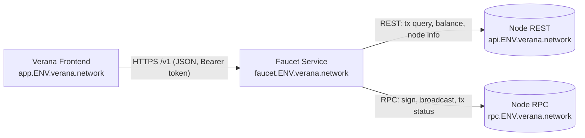
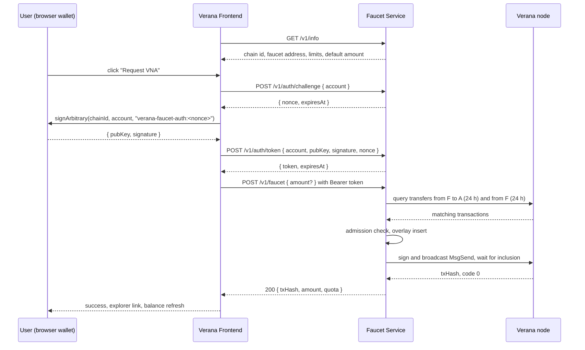

# Verana Faucet Service Specification

**Latest Draft:** spec v4-draft1

**Reference implementation:** [`verana-labs/verana-faucet`](https://github.com/verana-labs/verana-faucet)

**Replaces:** the Hologram chatbot faucet ([`verana-faucet-hologram-chatbot`](https://github.com/verana-labs/verana-faucet-hologram-chatbot)) and the internal `faucet-app` container it relied on.

## Abstract

The Verana Faucet Service dispenses test tokens (VNA) on Verana test networks to accounts that prove control of their key. A requester authenticates by signing a server-issued challenge with the wallet key of the account to be funded, using an [ADR-036](https://docs.cosmos.network/main/build/architecture/adr-036-arbitrary-signature) arbitrary message signature, then asks the service to send tokens to that same account. The service enforces per-account and global quotas over sliding one-hour and one-day windows, and derives all quota accounting from the chain's own transaction index: it keeps no database and no persistent volume.

The service is called directly by the Verana Frontend over HTTPS. This removes the dependency on Hologram Messaging, the DIDComm agent, the chatbot backend, its Postgres database, the datastore and the Artemis broker that make up the current faucet deployment.

## About This Document

This specification defines the configuration, authentication protocol, dispensing and quota rules, HTTP API, security, observability and deployment requirements of the service. The [Decision log](#decision-log) records the design choices and their rationale, and the [Open items](#open-items) section lists what is still undecided.

Two things are deliberately out of this document. Per-environment deployment values and the migration from the previous faucet are maintained in [`verana-deploy`](https://github.com/verana-labs/verana-deploy). The Verana Frontend's use of the service (its environment variable and the Get VNA flow) is specified in the [Verana Frontend specification](../verana-frontend/spec.md); the [API](#api) section here is the complete client contract.

Out of scope: proof of humanity (the previous faucet required an AvatarID credential presentation; this service relies on quotas instead, see [Security considerations](#security-considerations)), mainnet operation, and any on-ramp or purchase flow.

Reading this document requires familiarity with the Cosmos SDK transaction model and with ADR-036. The authentication exchange is the one already specified for the VS Agent Admin API ([VSA-ADM-AUTH-PROTO](../vs-agent/spec.md)); it is restated here so that this document is self-contained.

## Conformance

As with sections marked non-normative, all diagrams, examples, and notes in this specification are non-normative. Everything else is normative. The key words MAY, MUST, MUST NOT, OPTIONAL, RECOMMENDED, REQUIRED, SHOULD, and SHOULD NOT are interpreted per [BCP 14](https://datatracker.ietf.org/doc/html/bcp14) when and only when they appear in all capitals.

Normative requirements are prefixed `[VFA-]` (Verana FAucet).

## Terminology

[[def: faucet account, F]]:
~ The account whose mnemonic is configured in the service. Every dispense is sent from this account. The service is expected to be the only holder of its key.

[[def: requester account, A]]:
~ The account of the caller. Control of A is proven by an ADR-036 signature, and A is always the recipient of a dispense.

[[def: dispense]]:
~ One transfer of `DENOM` from F to A, executed as a single `MsgSend` message in its own transaction.

[[def: counted dispense]]:
~ A dispense taken into account by the quota rules, either observed on chain or held in the [[ref: overlay]] (see [Quota accounting](#quota-accounting)).

[[def: quota window, window]]:
~ A sliding time interval ending now: the **hour window** (3600 s) or the **day window** (86400 s).

[[def: overlay]]:
~ The in-memory list of dispenses broadcast by the running instance that have not yet been observed in a chain query.

[[def: challenge, nonce]]:
~ A single-use random value issued by the service, which the requester signs to prove control of A.

[[def: token]]:
~ A short-lived bearer credential issued after a successful challenge, bound to A.

Amounts are expressed in the chain's base denomination `uvna`, and 1 VNA = 1 000 000 uvna. VNA figures in this document are given for readability only; every wire value is a base-denom integer encoded as a decimal string.

## Architecture (non-normative)

### Components



The service is one stateless container. It holds three kinds of ephemeral state in memory: pending nonces, issued tokens, and the overlay of dispenses not yet visible in the chain index. Losing that state on restart is safe: clients simply re-authenticate, and the chain index already contains every included dispense.

### Why the chain is the ledger

The faucet account has a single writer, the service itself. Every dispense is therefore a `MsgSend` from F visible in the node's transaction index, with the block time as its timestamp. Summing those transfers over the last hour and the last day gives the exact quota usage without any local storage, survives restarts and redeploys, and can be audited by anyone with a block explorer. The only gap is the few seconds between a transaction being broadcast and its appearance in the index, which the overlay covers.

The cost of this design is that the node used by the service must run the CometBFT transaction indexer, and that the service is limited to a single instance per faucet account.

### Why a challenge and a token, rather than a signed request

The VS Agent Admin API already defines an ADR-036 challenge and token exchange. Reusing it unchanged (except for the payload prefix) means the frontend needs one authentication client for every Verana backend, and the verification code already exists in `@verana-labs/vs-agent-sdk`. Signing a single challenge is also the simplest wallet interaction: one prompt, then a token that covers follow-up calls such as reading the remaining quota.

### End-to-end flow



## Configuration

[VFA-CFG-1] The service MUST read its configuration from environment variables, MUST validate every value at startup, and MUST exit with a non-zero status when a required variable is missing or any value is invalid.

[VFA-CFG-2] Every amount variable is a base-denom integer encoded as a decimal string. Implementations MUST use arbitrary-precision integers (for example `BigInt`) for all amount arithmetic and MUST NOT use floating point.

[VFA-CFG-3] The service MUST refuse to start unless `DEFAULT_AMOUNT <= MAX_AMOUNT_PER_HOUR <= MAX_AMOUNT_PER_DAY <= MAX_GLOBAL_AMOUNT_PER_DAY` and every amount is strictly positive.

[VFA-CFG-4] At startup the service MUST derive the faucet address F from `FAUCET_MNEMONIC` (secp256k1, HD path `m/44'/118'/0'/0/0`, bech32 prefix `BECH32_PREFIX`), MUST log F, and MUST NOT log, expose, or persist the mnemonic anywhere.

[VFA-CFG-5] At startup the service MUST verify that the chain id reported by `RPC_ENDPOINT` and by `API_ENDPOINT` both equal `CHAIN_ID`, and MUST exit with a non-zero status otherwise. This prevents a faucet configured for one network from spending on another.

[VFA-CFG-6] At startup the service SHOULD read the balance of F and SHOULD log a warning when it is below `MIN_BALANCE`.

| Variable | Required | Default | Description |
|---|---|---|---|
| `PORT` | no | `3000` | HTTP listen port. |
| `LOG_LEVEL` | no | `info` | Log level (`trace`, `debug`, `info`, `warn`, `error`). |
| `CHAIN_ID` | yes | | Expected chain id, e.g. `vna-testnet-1`. |
| `RPC_ENDPOINT` | yes | | CometBFT RPC URL used for signing context, broadcast and inclusion polling. |
| `API_ENDPOINT` | yes | | Cosmos SDK REST (gRPC gateway) URL used for transaction queries, balance and node info. |
| `DENOM` | no | `uvna` | Base denomination dispensed and used for fees. |
| `BECH32_PREFIX` | no | `verana` | Address prefix of the chain. |
| `GAS_PRICE` | no | `0.0025uvna` | Gas price used to compute the fee (matches the validators' `minimum-gas-prices`). |
| `GAS_LIMIT` | no | `200000` | Gas limit of a dispense transaction. |
| `FAUCET_MNEMONIC` | yes | | BIP-39 mnemonic of F. Secret. |
| `FAUCET_MEMO` | no | `Verana faucet` | Memo attached to every dispense transaction. |
| `DEFAULT_AMOUNT` | no | `10000000` | Amount sent when the request omits `amount` (10 VNA). |
| `MAX_AMOUNT_PER_HOUR` | no | `50000000` | Per-account cap over the hour window (50 VNA). |
| `MAX_AMOUNT_PER_DAY` | no | `300000000` | Per-account cap over the day window (300 VNA). |
| `MAX_GLOBAL_AMOUNT_PER_DAY` | no | `5000000000` | Cap over the day window across all accounts (5000 VNA). |
| `MIN_BALANCE` | no | `100000000` | Balance floor of F below which dispensing is refused (100 VNA). |
| `AUTH_NONCE_TTL_SECONDS` | no | `120` | Lifetime of a challenge nonce. |
| `AUTH_TOKEN_TTL_SECONDS` | no | `900` | Lifetime of a bearer token. |
| `AUTH_MAX_PENDING_NONCES` | no | `1000` | Upper bound of outstanding nonces; the oldest is evicted beyond it. |
| `QUOTA_CACHE_TTL_SECONDS` | no | `30` | Maximum age of a cached chain query result used for admission. |
| `OVERLAY_TTL_SECONDS` | no | `600` | Maximum time a broadcast dispense stays in the overlay without being observed on chain. |
| `TX_QUERY_PAGE_SIZE` | no | `100` | Page size of transaction queries. |
| `TX_QUERY_MAX_PAGES` | no | `50` | Upper bound of pages fetched for one quota evaluation; beyond it the request fails closed. |
| `BROADCAST_TIMEOUT_SECONDS` | no | `60` | Maximum time to wait for inclusion after broadcast. |
| `BROADCAST_POLL_INTERVAL_SECONDS` | no | `3` | Interval between inclusion polls. |
| `RATE_LIMIT_PER_MINUTE` | no | `30` | Per-client-IP request budget across all `/v1` routes. |
| `TRUST_PROXY` | no | `true` | Whether to derive the client IP from `X-Forwarded-For` (required behind the ingress). |
| `CORS_ORIGINS` | no | empty | Comma-separated list of allowed browser origins. Empty means no cross-origin access. |

## Authentication

### [VFA-AUTH-1] Exchange

The caller proves control of A by signing a service-issued nonce with the key of A, using an ADR-036 signed message. A valid signature is exchanged for a short-lived bearer token, which the caller presents on every subsequent authenticated request. The exchange has three steps:

1. **Request a challenge.** The caller posts A to [`POST /v1/auth/challenge`](#post-v1authchallenge). The service returns a single-use `nonce` and its expiry.
2. **Sign the challenge.** The caller builds the sign doc described below over the challenge payload and signs it with the private key of A. Browser wallets expose this as `signArbitrary`.
3. **Exchange for a token.** The caller posts A, its public key, the signature and the nonce to [`POST /v1/auth/token`](#post-v1authtoken). The service verifies the signature and returns a bearer token and its expiry.

This is the exchange defined by VSA-ADM-AUTH-PROTO for the VS Agent Admin API. The only difference is the payload prefix below, which keeps signatures produced for one service from being replayed against the other.

### [VFA-AUTH-2] Challenge payload

The `data` string that MUST be signed is the fixed prefix `verana-faucet-auth:` concatenated with the issued nonce:

```
verana-faucet-auth:<nonce>
```

A signature computed over any other payload MUST be rejected.

### [VFA-AUTH-3] Sign doc

The signature MUST be produced over the canonical ADR-036 sign doc, whose fields are fixed as follows:

| Field | Value |
|---|---|
| `chain_id` | `""` (empty string) |
| `account_number` | `0` |
| `sequence` | `0` |
| `fee` | `{ "gas": "0", "amount": [] }` |
| `memo` | `""` (empty string) |
| `msgs` | exactly one message, of type `sign/MsgSignData` |

The single message MUST be:

```json
{
  "type": "sign/MsgSignData",
  "value": {
    "signer": "<account address A>",
    "data": "<base64 of the UTF-8 challenge payload>"
  }
}
```

The signer serialises the sign doc as JSON with sorted keys and no whitespace, hashes it with SHA-256, and signs that digest with the `secp256k1` key of A. This is exactly what browser wallets produce for `signArbitrary`, so a wallet-based caller needs no custom signing code.

### [VFA-AUTH-4] Verification

The service MUST reject the exchange unless all of the following hold:

1. The `nonce` is known, has not expired, and was issued to the same `account`.
2. `pubKey` is the base64 encoding of a 33-byte compressed `secp256k1` public key, and the bech32 encoding, with prefix `BECH32_PREFIX`, of the address derived from it equals `account`.
3. `signature` is the base64 encoding of a 64-byte fixed-length `secp256k1` signature that verifies over the SHA-256 digest of the serialised sign doc under `pubKey`.

### [VFA-AUTH-5] Nonce lifecycle

A nonce MUST be at least 256 bits of cryptographically secure randomness. A nonce MUST be single-use: the service MUST invalidate it as soon as it is presented, whether or not verification then succeeds. Nonces MUST expire after `AUTH_NONCE_TTL_SECONDS`. The service MUST bound the number of outstanding nonces to `AUTH_MAX_PENDING_NONCES` and evict the oldest beyond that bound.

### [VFA-AUTH-6] Token lifecycle

A token MUST be at least 256 bits of cryptographically secure randomness, MUST be bound to the account that completed the exchange, and MUST expire after `AUTH_TOKEN_TTL_SECONDS`. Tokens are held in memory only. The service MUST NOT log token values.

### [VFA-AUTH-7] Presenting the token

Authenticated requests MUST carry the token in the HTTP `Authorization` header using the `Bearer` scheme. A request whose token is missing, unknown, or expired MUST be rejected with HTTP `401` and error code `UNAUTHORIZED`.

### [VFA-AUTH-8] Account format

An `account` value MUST be a valid bech32 string with prefix `BECH32_PREFIX` and a 20-byte payload, with a valid checksum. Anything else MUST be rejected with HTTP `400` and error code `INVALID_ACCOUNT`.

### [VFA-AUTH-9] Instance locality

Nonces and tokens are local to the running instance. A restart invalidates all of them. Clients MUST treat a `401` as a signal to run the exchange again.

## Dispensing

### [VFA-DSP-1] Recipient

The recipient of a dispense is always the account bound to the presented token. The request body has no recipient field, and the service MUST NOT accept one.

### [VFA-DSP-2] Amount resolution

The request body MAY carry `amount`, a base-denom integer as a decimal string matching `^[1-9][0-9]*$`. Unknown fields MUST be ignored.

- When `amount` is present and exceeds `MAX_AMOUNT_PER_HOUR`, the service MUST reject the request with HTTP `400` and error code `INVALID_REQUEST`, since no such request can ever be admitted.
- When `amount` is present and within that bound, the resolved amount is exactly `amount`.
- When `amount` is absent, the resolved amount is `min(DEFAULT_AMOUNT, hour.remaining, day.remaining, global.remaining)` as computed in [Quota accounting](#quota-accounting). When that value is zero the request MUST be rejected with HTTP `429` and error code `QUOTA_EXCEEDED`.

### [VFA-DSP-3] Admission

A request with resolved amount `a` for account A is admitted only if all of the following hold at evaluation time:

1. `hour.used(A) + a <= MAX_AMOUNT_PER_HOUR`
2. `day.used(A) + a <= MAX_AMOUNT_PER_DAY`
3. `global.used + a <= MAX_GLOBAL_AMOUNT_PER_DAY`
4. `balance(F) - a - fee >= MIN_BALANCE`

Failure of conditions 1 to 3 MUST be reported with HTTP `429` and error code `QUOTA_EXCEEDED`, naming the binding window. Failure of condition 4 MUST be reported with HTTP `503` and error code `FAUCET_UNAVAILABLE` with reason `LOW_BALANCE`.

### [VFA-DSP-4] Transaction

An admitted dispense MUST be executed as one transaction containing exactly one `/cosmos.bank.v1beta1.MsgSend` from F to A for `a` of `DENOM`, with memo `FAUCET_MEMO`, gas limit `GAS_LIMIT`, and a fee equal to `ceil(GAS_LIMIT * GAS_PRICE)` in `DENOM`. The fee is paid by F; the recipient receives exactly `a`.

### [VFA-DSP-5] Serialisation

The service MUST process dispenses one at a time. The critical section starts at the quota evaluation of [VFA-DSP-3], includes the overlay insertion of [VFA-QTA-5] and the signing and broadcast of the transaction, and ends when the broadcast outcome is known (included, failed, or timed out). No other dispense may be evaluated or broadcast in between. This guarantees both quota consistency and a monotonic account sequence for F.

### [VFA-DSP-6] Broadcast and outcome

The service MUST broadcast the signed transaction and then poll for its inclusion every `BROADCAST_POLL_INTERVAL_SECONDS`, for at most `BROADCAST_TIMEOUT_SECONDS`. The outcome determines the response:

| Outcome | Response | Overlay |
|---|---|---|
| Included with `code == 0` | HTTP `200`, `status: "confirmed"`, `txHash`, `height` | Entry kept until observed by a chain query or until `OVERLAY_TTL_SECONDS` |
| Included with `code != 0` | HTTP `502`, error code `TX_FAILED` with `txHash`, `code`, `rawLog` | Entry removed |
| Rejected at broadcast (CheckTx error) | HTTP `502`, error code `NODE_ERROR` with the node's message | Entry removed |
| Not included within the timeout | HTTP `202`, `status: "pending"`, `txHash` | Entry kept until observed or until `OVERLAY_TTL_SECONDS` |

### [VFA-DSP-7] Sequence mismatch

A CheckTx rejection caused by an account sequence mismatch (typically because a previously timed-out transaction is still in the mempool) MUST be reported as `NODE_ERROR` and MUST NOT count against the account's quota. The service MAY retry once after `BROADCAST_POLL_INTERVAL_SECONDS` before reporting the error.

### [VFA-DSP-8] Idempotency

The service does not deduplicate requests. A client that retries a `POST /v1/faucet` after a network failure may obtain two dispenses; the quotas bound the effect. Clients SHOULD check the result of the first attempt through `GET /v1/quota` before retrying.

## Quota accounting

### [VFA-QTA-1] Source of truth

Quota usage MUST be derived from the chain's transaction index. The service MUST NOT depend on any persistent local storage (database, file, or volume) for quota accounting.

### [VFA-QTA-2] Counted dispenses

For every transaction `t` in the index with `code == 0`, and for every message `m` of type `/cosmos.bank.v1beta1.MsgSend` in `t.body.messages` with `m.from_address == F`, the service counts one dispense of `m.amount[DENOM]` to `m.to_address`, at time `t.timestamp` (the block time). Messages of any other type, messages sent from any other address, and coins in any other denomination MUST NOT be counted. Transactions with `code != 0` MUST NOT be counted.

Any transfer made from F outside the service (for example by an operator using the CLI) therefore counts against the global quota and against the recipient's quota. This is intended.

### [VFA-QTA-3] Windows and usage

With `now` the evaluation time in UTC:

- `hour.used(A)` is the sum of counted dispenses to A with `timestamp > now - 3600 s`.
- `day.used(A)` is the sum of counted dispenses to A with `timestamp > now - 86400 s`.
- `global.used` is the sum of counted dispenses to any account with `timestamp > now - 86400 s`.
- `remaining` of a window is `max(0, limit - used)`.
- `resetsAt` of a window is `timestamp of the oldest counted dispense inside the window + window length`, or `null` when `used` is zero. It is the earliest instant at which `remaining` increases.
- The **binding window** of a rejected request is the window with the smallest `remaining`; ties are broken in the order hour, day, global.

Windows are sliding. There is no calendar reset.

### [VFA-QTA-4] Query mechanism

The RECOMMENDED mechanism is the Cosmos SDK REST transaction service, `GET {API_ENDPOINT}/cosmos/tx/v1beta1/txs`, with:

- `query=transfer.sender='F' AND transfer.recipient='A'` for the per-account sums, and `query=transfer.sender='F'` for the global sum;
- `order_by=ORDER_BY_DESC`, `limit=TX_QUERY_PAGE_SIZE`, and `page` incremented from 1;
- pagination stopped as soon as the last transaction of a page has `timestamp <= now - 86400 s`, or when the page returned fewer results than the page size.

The event query is only a pre-filter (it also matches fee transfers). The sums MUST be computed by decoding the `MsgSend` messages of the returned transactions as described in [VFA-QTA-2], never from the `transfer` events themselves. One per-account query over the day window yields both the hour and the day sums.

If `TX_QUERY_MAX_PAGES` is reached before the window is covered, or if the node cannot be queried, the evaluation MUST fail closed: the request is rejected with HTTP `503` and error code `FAUCET_UNAVAILABLE`, reason `NODE_UNAVAILABLE`.

An implementation MAY instead use the CometBFT RPC `tx_search` endpoint together with block header lookups for timestamps, provided the counted set is identical.

### [VFA-QTA-5] Overlay

Every dispense the instance broadcasts MUST be inserted into the overlay before broadcast, with its recipient, amount, transaction hash and broadcast time, and MUST be counted as a dispense at that time until it is removed. An entry MUST be removed when a chain query returns a transaction with the same hash, when the transaction is known to have failed or been rejected ([VFA-DSP-6]), or when it has been in the overlay for more than `OVERLAY_TTL_SECONDS`. When a hash is present both in the overlay and in a query result, it MUST be counted once, using the chain timestamp.

### [VFA-QTA-6] Freshness

A cached chain query result MAY be reused for admission for at most `QUOTA_CACHE_TTL_SECONDS`. Because the service is the only writer of F and every own dispense is already in the overlay, a stale cache can only delay the moment at which quota is recovered, never allow over-dispensing. Any transfer made from F outside the service is taken into account at the next refresh.

### [VFA-QTA-7] Single instance

Exactly one instance of the service MUST run per faucet account at any time, including during a redeploy. With more than one instance the overlay is not shared and two instances could admit dispenses concurrently within the index lag. See [VFA-DEP-2].

### [VFA-QTA-8] Node requirements

The node behind `API_ENDPOINT` MUST run the CometBFT KV transaction indexer with event indexing enabled (the default configuration), and its REST service MUST be enabled. `RPC_ENDPOINT` and `API_ENDPOINT` SHOULD resolve to the same node, or to nodes with comparable indexing lag, since the overlay only bridges the gap for `OVERLAY_TTL_SECONDS`.

### [VFA-QTA-9] Clock

The service MUST use a UTC clock synchronised with the network, and MUST compare it with block timestamps as returned by the node without any offset adjustment.

## API

### General

[VFA-API-1] Every endpoint is served under the base path `/v1`, except `/health` and `/metrics`. Request and response bodies are JSON with `Content-Type: application/json`. Request bodies larger than 4 KiB MUST be rejected with HTTP `413`.

[VFA-API-2] Amounts are base-denom integers as decimal strings. Timestamps are RFC 3339 in UTC with a trailing `Z`. Heights are decimal strings.

[VFA-API-3] Every error response carries the envelope below. `details` is OPTIONAL and endpoint-specific.

```json
{
  "error": {
    "code": "QUOTA_EXCEEDED",
    "message": "Hourly quota exceeded",
    "details": {}
  }
}
```

| Code | HTTP status | Meaning |
|---|---|---|
| `INVALID_REQUEST` | 400 | Malformed body or invalid `amount`. |
| `INVALID_ACCOUNT` | 400 | `account` is not a valid address per [VFA-AUTH-8]. |
| `AUTH_FAILED` | 401 | Challenge verification failed ([VFA-AUTH-4]). |
| `UNAUTHORIZED` | 401 | Missing, unknown, or expired bearer token. |
| `RATE_LIMITED` | 429 | Per-IP budget exceeded. `Retry-After` header set. |
| `QUOTA_EXCEEDED` | 429 | Per-account or global quota exceeded. `details.window` names the binding window and `details.quota` carries the quota object. `Retry-After` set to the seconds until the binding window's `resetsAt` when it is not null. |
| `TX_FAILED` | 502 | Transaction included with a non-zero code. `details` carries `txHash`, `code`, `rawLog`. |
| `NODE_ERROR` | 502 | The node rejected the broadcast or returned an unexpected response. |
| `FAUCET_UNAVAILABLE` | 503 | The service cannot dispense right now. `details.reason` is `LOW_BALANCE` or `NODE_UNAVAILABLE`. |

[VFA-API-4] The service MUST apply a per-client-IP budget of `RATE_LIMIT_PER_MINUTE` requests per minute across all `/v1` routes and reject excess requests with `RATE_LIMITED`. When `TRUST_PROXY` is true the client IP is the first address of `X-Forwarded-For`.

[VFA-API-5] The service MUST answer CORS preflight requests and MUST allow cross-origin requests only from the origins listed in `CORS_ORIGINS`, for methods `GET` and `POST` with the `Authorization` and `Content-Type` headers. With an empty list no cross-origin request is allowed.

[VFA-API-6] Responses of `/v1/*` MUST carry `Cache-Control: no-store`.

### `GET /v1/info`

Public. Describes the faucet. Cached server-side for at most `QUOTA_CACHE_TTL_SECONDS`.

```json
{
  "chainId": "vna-testnet-1",
  "denom": "uvna",
  "bech32Prefix": "verana",
  "faucetAddress": "verana1f4uc3t...",
  "faucetBalance": "123456789000",
  "defaultAmount": "10000000",
  "maxAmountPerHour": "50000000",
  "maxAmountPerDay": "300000000",
  "maxGlobalAmountPerDay": "5000000000",
  "global": { "limit": "5000000000", "used": "120000000", "remaining": "4880000000", "resetsAt": "2026-09-16T08:12:00Z" },
  "available": true,
  "unavailableReason": null,
  "auth": { "challengePrefix": "verana-faucet-auth:", "nonceTtlSeconds": 120, "tokenTtlSeconds": 900 }
}
```

`available` is false, with `unavailableReason` set to `LOW_BALANCE` or `NODE_UNAVAILABLE`, when [VFA-DSP-3] condition 4 cannot be met or the node cannot be reached.

### `POST /v1/auth/challenge`

Public. Body: `{ "account": "verana1..." }`.

Response `200`:

```json
{ "nonce": "Vt3r9m4p...", "expiresAt": "2026-09-15T14:05:22Z" }
```

Errors: `INVALID_ACCOUNT`, `RATE_LIMITED`.

### `POST /v1/auth/token`

Public. Body:

```json
{
  "account": "verana1...",
  "pubKey": "A0c3...base64...",
  "signature": "MEUC...base64...",
  "nonce": "Vt3r9m4p..."
}
```

Response `200`:

```json
{ "token": "b7Qx...", "expiresAt": "2026-09-15T14:18:22Z", "account": "verana1..." }
```

Errors: `INVALID_REQUEST`, `INVALID_ACCOUNT`, `AUTH_FAILED`, `RATE_LIMITED`.

### `GET /v1/quota`

Authenticated. Returns the quota object for the token's account.

```json
{
  "account": "verana1...",
  "hour":   { "limit": "50000000",   "used": "10000000", "remaining": "40000000",   "resetsAt": "2026-09-15T14:58:10Z" },
  "day":    { "limit": "300000000",  "used": "10000000", "remaining": "290000000",  "resetsAt": "2026-09-16T13:58:10Z" },
  "global": { "limit": "5000000000", "used": "120000000", "remaining": "4880000000", "resetsAt": "2026-09-16T08:12:00Z" },
  "nextAmount": "10000000",
  "evaluatedAt": "2026-09-15T14:03:22Z"
}
```

`nextAmount` is the amount a `POST /v1/faucet` without `amount` would send now, `"0"` when nothing can be sent.

Errors: `UNAUTHORIZED`, `FAUCET_UNAVAILABLE`, `RATE_LIMITED`.

### `POST /v1/faucet`

Authenticated. Body: `{ "amount": "10000000" }` or `{}`.

Response `200` (included, `code == 0`):

```json
{
  "status": "confirmed",
  "txHash": "0B90A74FB6BEC5A0080AB9FF919B35809D7199A7D30ED31AFBA1C68A1C937EBE",
  "height": "1234567",
  "recipient": "verana1...",
  "amount": "10000000",
  "denom": "uvna",
  "quota": { "...": "the quota object, re-evaluated after the dispense" }
}
```

Response `202` (broadcast, not yet included):

```json
{
  "status": "pending",
  "txHash": "0B90...",
  "recipient": "verana1...",
  "amount": "10000000",
  "denom": "uvna"
}
```

Errors: `INVALID_REQUEST`, `UNAUTHORIZED`, `QUOTA_EXCEEDED`, `TX_FAILED`, `NODE_ERROR`, `FAUCET_UNAVAILABLE`, `RATE_LIMITED`.

Example `429`:

```json
{
  "error": {
    "code": "QUOTA_EXCEEDED",
    "message": "Hourly quota exceeded",
    "details": {
      "window": "hour",
      "requested": "10000000",
      "quota": { "...": "the quota object" }
    }
  }
}
```

### `GET /health`

Public, no rate limit. Always `200` while the process is alive; `status` is `ok` or `degraded`.

```json
{
  "status": "ok",
  "chainId": "vna-testnet-1",
  "height": "1234567",
  "faucetAddress": "verana1...",
  "faucetBalance": "123456789000",
  "checks": { "rpc": "ok", "api": "ok", "balance": "ok" },
  "overlaySize": 0
}
```

### `GET /metrics`

Public, no rate limit. Prometheus text format, see [Observability](#observability).

## Security considerations

[VFA-SEC-1] The mnemonic MUST reach the process only through the `FAUCET_MNEMONIC` environment variable, sourced from a Kubernetes secret. It MUST NOT appear in images, charts, logs, error messages, or health output. The faucet account SHOULD hold only the test-token budget it needs.

[VFA-SEC-2] The public origin of the service MUST be served over TLS. Tokens are bearer credentials and MUST NOT be logged; nonces MAY be logged at debug level.

[VFA-SEC-3] An ADR-036 signature proves control of a key, not that a human is behind it. Anyone can generate many keys, so the per-account quotas alone do not bound the drain of the faucet. The bound is `MAX_GLOBAL_AMOUNT_PER_DAY`, complemented by the per-IP budget of [VFA-API-4]. Operators SHOULD watch the `faucet_dispensed_total` and `faucet_balance` metrics and SHOULD lower the global cap or add a challenge such as a CAPTCHA if abuse appears (see [Open items](#open-items)).

[VFA-SEC-4] The service MUST bind nonces and tokens to the account that requested them, and MUST reject a token presented for any purpose other than the account it was issued to. The recipient of a dispense is never taken from the request ([VFA-DSP-1]).

[VFA-SEC-5] The challenge prefix `verana-faucet-auth:` is a domain separator. A signature obtained by another Verana service (for example a VS Agent Admin API challenge) MUST NOT be accepted here, which [VFA-AUTH-2] guarantees.

[VFA-SEC-6] The service MUST apply request timeouts and body limits, MUST bound the size of its in-memory nonce, token and overlay maps, and MUST NOT allocate per-request memory proportional to attacker-controlled input beyond the 4 KiB body.

[VFA-SEC-7] The service MUST validate `CHAIN_ID` against both endpoints at startup ([VFA-CFG-5]), so that a misconfigured deployment cannot spend the wrong network's funds.

[VFA-SEC-8] The service MUST NOT expose any endpoint that reads or changes its configuration at runtime.

## Observability

[VFA-OBS-1] The service MUST emit structured JSON logs with at least a request id, the route, the status code, the latency, and for dispenses the recipient, the amount, the transaction hash and the outcome.

[VFA-OBS-2] The service MUST expose Prometheus metrics on `GET /metrics`, including at least:

| Metric | Type | Labels | Meaning |
|---|---|---|---|
| `faucet_dispense_total` | counter | `outcome` (`confirmed`, `pending`, `failed`, `rejected`) | Dispense attempts by outcome. |
| `faucet_dispensed_total` | counter | | Total base-denom amount dispensed (confirmed). |
| `faucet_quota_rejections_total` | counter | `window` (`hour`, `day`, `global`) | Rejections by binding window. |
| `faucet_auth_total` | counter | `result` (`ok`, `failed`) | Token exchanges by result. |
| `faucet_balance` | gauge | | Current balance of F in base denom. |
| `faucet_global_used` | gauge | | `global.used` at last evaluation. |
| `faucet_overlay_size` | gauge | | Entries currently in the overlay. |
| `faucet_tx_query_duration_seconds` | histogram | | Latency of chain queries. |

[VFA-OBS-3] `GET /health` MUST report `degraded` when either endpoint is unreachable, when the chain id check fails after startup, or when the balance of F is below `MIN_BALANCE`.

[VFA-OBS-4] Operators SHOULD alert on `faucet_balance` falling below twice `MIN_BALANCE` and on `faucet_global_used` approaching `MAX_GLOBAL_AMOUNT_PER_DAY`.

## Deployment

### [VFA-DEP-1] Container

The service ships as a single container image, tagged with semantic versions, built from a maintained Node.js LTS base image, running as a non-root user, listening on `PORT`.

### [VFA-DEP-2] Single instance

A deployment MUST run exactly one instance of the service per faucet account at any time, including during a rollout ([VFA-QTA-7]). On Kubernetes this means one replica and a `Recreate` update strategy. No persistent volume is needed ([VFA-QTA-1]). The mnemonic MUST reach the container through a secret ([VFA-SEC-1]). Readiness and liveness probes SHOULD use `GET /health`.

### [VFA-DEP-3] Node

The node endpoints used by the service MUST satisfy [VFA-QTA-8].

The reference implementation publishes a Helm chart that satisfies these requirements. Per-environment values, hosts and the migration from the previous faucet are maintained in [`verana-deploy`](https://github.com/verana-labs/verana-deploy).

## Client integration (non-normative)

The [API](#api) is the complete client contract; nothing in this document constrains a client's user interface. The Verana Frontend's Get VNA flow, its `NEXT_PUBLIC_VERANA_FAUCET_URL` variable and its user-facing behaviour are specified in the [Verana Frontend specification](../verana-frontend/spec.md) ([VFE-PAGE-ACCT-3] and following).

A browser client typically reads `GET /v1/info`, requests a challenge for the connected account, signs `challengePrefix + nonce` with the wallet's `signArbitrary`, exchanges the returned public key and signature for a token, and posts the dispense with the bearer token. The token can be kept in memory for its lifetime, so a follow-up request or a quota read does not prompt the wallet again. Wallet support for `signArbitrary` varies; a client should surface a clear message when the connected wallet cannot sign messages.

## Implementation notes (non-normative)

The reference implementation is [`verana-labs/verana-faucet`](https://github.com/verana-labs/verana-faucet): TypeScript on Node.js, Fastify with `@fastify/cors` and `@fastify/rate-limit`, `zod`, `pino`, `prom-client`, and `@cosmjs/*` for signing, broadcast and ADR-036 verification, with the tooling of the 2060-io TypeScript template (pnpm, Biome, Vitest).

- The ADR-036 verifier is the same thirty lines as `verifyAdr036Signature` in `@verana-labs/vs-agent-sdk`, vendored so that the service does not depend on the whole SDK.
- `SigningStargateClient.signAndBroadcast` implements the poll-until-included behaviour of [VFA-DSP-6], including the timeout error that carries the transaction hash.
- Module layout: `config`, `chain` (RPC signing client, REST transaction-index client), `auth` (nonces, tokens, verifier), `quota` (windows, overlay, cache), `dispense` (mutex, outcomes), `http` (routes, error envelope), `services` (info, health), `metrics`.
- Tests cover the sign doc against wallet-produced signatures, window sums with overlay merge and hash deduplication, the four admission conditions, and the confirmed, pending, failed and rejected broadcast outcomes with a fake node.

## Open items

1. **Wallet coverage of `signArbitrary`.** Keplr and Leap browser extensions support it. Support through WalletConnect and on Ledger devices must be confirmed before release.
2. **Bot abuse.** If the global cap is exhausted by scripted accounts, options are a CAPTCHA (for example Cloudflare Turnstile) on the challenge endpoint, a per-IP daily amount, or a minimum account age. None is specified yet.
3. **Batching.** Several dispenses could be bundled in one transaction to raise throughput beyond one per block. Not needed at the expected volume.
4. **Idempotency keys** on `POST /v1/faucet` ([VFA-DSP-8]).

## Decision log

| Date | Decision | Rationale |
|---|---|---|
| 2026-09-15 | Replace the Hologram chatbot faucet with a backend called directly by the Verana Frontend. | Removes five workloads, a shared broker and three secrets per environment. The frontend already holds the wallet that can prove control of the account to fund. |
| 2026-09-15 | Reuse the VS Agent ADR-036 challenge and token exchange, with the payload prefix `verana-faucet-auth:`. | One authentication client in the frontend serves every Verana backend, and the verifier already exists. The prefix is a domain separator against cross-service replay. |
| 2026-09-15 | The recipient is always the authenticated account. | A zero-balance account can sign ADR-036, so self-funding needs no bootstrap step, and one key cannot fund arbitrary addresses. |
| 2026-09-15 | Limits: 10 VNA default, 50 VNA per hour and 300 VNA per day per account, 5000 VNA per day globally. | Enough for development use. The global cap is what bounds the drain, since a wallet signature proves key control, not humanity. |
| 2026-09-15 | Quota accounting is derived from the chain's transaction index with an in-memory overlay; no database, no volume. | The faucet account has a single writer, so the index is exact, restart-safe and auditable, and the overlay covers the seconds before indexing. The Verana Indexer was considered and set aside: it exposes no transfer API, would add a dependency, and reads the node's index itself. |

## References

- [ADR-036: Arbitrary Message Signature Specification](https://docs.cosmos.network/main/build/architecture/adr-036-arbitrary-signature)
- [VS Agent specification, Admin API authentication (VSA-ADM-AUTH-PROTO)](../vs-agent/spec.md)
- [Verana Frontend specification](../verana-frontend/spec.md)
- [Reference implementation: verana-labs/verana-faucet](https://github.com/verana-labs/verana-faucet)
- [Cosmos SDK transaction service, `GetTxsEvent`](https://docs.cosmos.network/main/build/modules/auth/tx)
- [CometBFT transaction indexing](https://docs.cometbft.com/main/explanation/core/indexing)
- [verana-deploy](https://github.com/verana-labs/verana-deploy)
