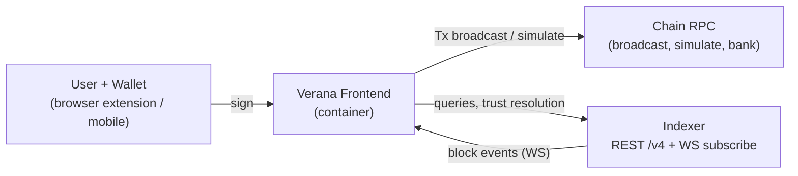

# Verana Frontend v4 Specification

**Latest Draft:** spec v4-draft1

## Abstract

The **Verana Frontend** is the web dashboard through which humans operate the Verana Verifiable Public Registry: create and govern Corporations, control Ecosystems and their Credential Schemas, run and validate Onboarding Processes, manage trust deposits, and discover the trust network.

In VPR v4, every registry resource is owned by a **Corporation** — an entity anchored on a Cosmos SDK `x/group` policy account — and individual accounts act on those resources only through delegated authorizations or group proposals. The frontend is therefore not an account-centric wallet UI: after connecting a wallet, the user selects an **acting Corporation** among those their account can represent, and every list, action, and transaction is scoped to it.

This document specifies the normative behavior of the Verana Frontend: its container configuration, wallet and session model, Corporation context management (discovery, selection, creation, group proposals), transaction execution model (delegable messages, fee grants, cost previews), data access (indexer REST, WebSocket, trust resolution), trust display rules, and the functional requirements of each page.

## About this Document

In order to fully understand the concepts developed in this document, you should have some basic knowledge of the [Verifiable Trust Specification v4](https://verana-labs.github.io/verifiable-trust-spec/versions/v4/), the [Verifiable Trust VPR Specification v4](https://verana-labs.github.io/verifiable-trust-vpr-spec/versions/v4/), the [Indexer v4 Specification](../verana-indexer/spec.md), and the Cosmos SDK `x/group` module. All terms used in this specification are defined in the [Terminology](#terminology) section or inherited from those documents.

The frontend manages **on-chain state only**. Credential exchange — DIDComm connections, credential issuance and presentation, linked-VP publication — is the responsibility of the [VS Agent](../vs-agent/spec.md) and the [vt-flow protocol](../vt-flow-protocol/spec.md); this frontend surfaces the on-chain side of those flows (Onboarding Processes, Participants, sessions) and MAY deep-link to agent-provided interfaces, but never speaks DIDComm itself.

## Conformance

As well as sections marked as non-normative, all authoring guidelines, diagrams, examples, and notes in this specification are non-normative. Everything else in this specification is normative.

The key words MAY, MUST, MUST NOT, OPTIONAL, RECOMMENDED, REQUIRED, SHOULD, and SHOULD NOT in this document are to be interpreted as described in [BCP 14](https://datatracker.ietf.org/doc/html/bcp14) [RFC2119](https://w3c.github.io/vc-data-model/#bib-rfc2119) [RFC8174](https://w3c.github.io/vc-data-model/#bib-rfc8174) when, and only when, they appear in all capitals, as shown here.

## Terminology

Terms inherited from the VPR v4 specification keep their meaning there: **Corporation**, **policy_address**, **Ecosystem**, **Credential Schema**, **Participant**, **Onboarding Process (OP)**, **OperatorAuthorization**, **VSOperatorAuthorization**, **FeeGrant**, **Trust Deposit**. Frontend-specific terminology:

- **connected account** — the Verana account of the wallet currently connected to the frontend. Never itself the owner of any VPR resource.
- **acting Corporation** — the Corporation the connected account has selected to represent for the current session. All corporation-scoped queries and every transaction's `corporation` signer field are bound to it.
- **operator capability** — the set of VPR delegable Msg types the connected account may execute on behalf of a Corporation, as granted by that Corporation's `OperatorAuthorization` entries.
- **group member** — an account listed as a member (weight > 0) of the `x/group` group anchoring a Corporation's `policy_address`. Group members can submit, vote on, and execute group proposals.
- **guest mode** — the frontend state when no wallet is connected, or the connected account can act for no Corporation. Read-only surfaces remain available.

## Architecture Overview

*This section is non-normative.*

The frontend is a containerized web application talking to exactly two backends:

- the **Verana chain RPC** endpoint — transaction simulation and broadcast, plus ABCI state queries that are strictly account-local (bank balances, account sequence);
- the **Verana indexer** — every registry read (REST `/v4/...`), trust resolution (`/v4/verifiable-trust/resolve`), and real-time events (`WS /v4/indexer/subscribe`).

The user journey is: connect wallet → discover Corporations the account can act for → select the acting Corporation → operate (browse, transact, validate, propose, vote). Accounts with no Corporation can browse public data and create a new Corporation.

## [VFE-GEN] General

### [VFE-GEN-DEPLOY] Deployment

- [VFE-GEN-DEPLOY-1] The frontend MUST be delivered as a container image, versioned and published to a public registry (Docker Hub).
- [VFE-GEN-DEPLOY-2] Documentation MUST be provided for running the container with Docker and for deploying it to Kubernetes; a Helm chart MUST be provided.
- [VFE-GEN-DEPLOY-3] All configuration MUST be injectable at container start (runtime environment), so that one image serves any network (mainnet, testnet, devnet) without rebuild.

### [VFE-GEN-ENV] Container Environment Variables

| Variable | Required | Description |
|---|---|---|
| `NEXT_PUBLIC_VERANA_CHAIN_ID` | REQUIRED | Chain id (e.g. `vna-testnet-1`). |
| `NEXT_PUBLIC_VERANA_CHAIN_NAME` | REQUIRED | Human-readable chain name shown in the UI. |
| `NEXT_PUBLIC_VERANA_RPC_ENDPOINT` | REQUIRED | Chain RPC endpoint URL. |
| `NEXT_PUBLIC_VERANA_INDEXER_BASE_URL` | REQUIRED | Indexer base URL (e.g. `https://idx.testnet.verana.network`). All REST paths are `{base}/v4/...` per the [Indexer v4 Specification](../verana-indexer/spec.md); the WebSocket endpoint is derived as `wss://{host}/v4/indexer/subscribe` unless overridden. |
| `NEXT_PUBLIC_VERANA_WEBSOCKET` | OPTIONAL | Explicit WebSocket URL override for `/v4/indexer/subscribe`. |
| `NEXT_PUBLIC_VERANA_EXPLORER_URL` | REQUIRED | Block explorer base URL, used for transaction and account links. |
| `NEXT_PUBLIC_VERANA_VISUALIZER_URL` | OPTIONAL | Read-only explorer/visualizer base URL, used for entity deep links. |
| `NEXT_PUBLIC_VERANA_TOPUP_VS` | OPTIONAL | DID of the Verifiable Service used by the Get VNA flow ([VFE-PAGE-ACCT]). |
| `NEXT_PUBLIC_VERANA_SIGN_DIRECT_MODE` | OPTIONAL | `true` to prefer SIGN_MODE_DIRECT when the wallet supports it; defaults to Amino for wallet compatibility. |
| `NEXT_PUBLIC_SESSION_LIFETIME_SECONDS` | OPTIONAL | Session persistence lifetime. Default 86400. |
| `NEXT_PUBLIC_LOW_BALANCE_WARN_UVNA` | OPTIONAL | Balance threshold (uvna) under which a low-balance warning is shown. |
| `NEXT_PUBLIC_SHOW_PARTICIPANT_EXPIRE_BEFORE_DAYS` | OPTIONAL | Days before `effective_until` at which a Participant is flagged "expires soon". Default 30. |
| `NEXT_PUBLIC_VERANA_CHAIN_PROVIDER_*` | OPTIONAL | WalletConnect project id, relay URL, and dApp metadata. |
| `NEXT_PUBLIC_APP_VERSION` | OPTIONAL | Version string surfaced on the Dashboard. |

### [VFE-GEN-I18N] Internationalization

- [VFE-GEN-I18N-1] All user-visible copy MUST be centralized in per-locale dictionaries keyed by stable content keys. English (`en`) is the REQUIRED default locale.
- [VFE-GEN-I18N-2] Locale resolution: user-selected locale from Settings; else browser locale; else same-language default; else `en`.
- [VFE-GEN-I18N-3] Right-to-left scripts MUST be supported by the layout.
- [VFE-GEN-I18N-4] Language selection fields (e.g. governance framework document language) MUST use [BCP 47](https://www.rfc-editor.org/info/bcp47) language tags.

### [VFE-GEN-LAYOUT] Layout

- [VFE-GEN-LAYOUT-1] The layout MUST be fully responsive; no page may require horizontal scrolling of the page body. Wide content (tables, JSON, trees) MUST scroll within its own container.
- [VFE-GEN-LAYOUT-2] The header MUST contain: app logo and name; the **acting Corporation selector** ([VFE-CORP-SEL]) when a wallet is connected; settings access; light/dark theme toggle; and the wallet/account zone (connect button, or connected-account chip with address copy, explorer link, and disconnect).
- [VFE-GEN-LAYOUT-3] A navigation menu MUST expose the pages of [VFE-PAGE]; on small screens it collapses behind a menu button. Entries requiring a connection or an acting Corporation MUST be hidden or disabled in guest mode.
- [VFE-GEN-LAYOUT-4] Light and dark themes MUST both be supported; theme choice persists.

### [VFE-GEN-SRV] Server Routes

- [VFE-GEN-SRV-1] The frontend MUST provide a server-side digest route that fetches an `https` URL and returns its Subresource Integrity digest (`sha384-...`), used to compute `digest_sri` values for governance framework documents at form time without CORS constraints. The route MUST restrict fetches to `http(s)` URLs and MUST NOT follow redirects to non-`http(s)` schemes.

## [VFE-WALLET] Wallet and Session

- [VFE-WALLET-1] The frontend MUST integrate Cosmos wallets through a multi-wallet kit supporting at least one browser-extension wallet and WalletConnect-based mobile wallets, on the chain described by `NEXT_PUBLIC_VERANA_CHAIN_*`.
- [VFE-WALLET-2] If a previously-granted wallet is detected on load, the frontend MUST reconnect silently and restore the session (including the acting Corporation, subject to [VFE-CORP-SEL-3]).
- [VFE-WALLET-3] The connected account's keys never leave the wallet: the frontend MUST NOT request, store, or transmit private key material. All signing goes through the wallet's signer interface.
- [VFE-WALLET-4] Session state (locale, acting Corporation, list filters) MUST be persisted client-side with a lifetime of `NEXT_PUBLIC_SESSION_LIFETIME_SECONDS` and MUST be invalidated on wallet disconnect or account switch.
- [VFE-WALLET-5] When the connected account's spendable balance falls below `NEXT_PUBLIC_LOW_BALANCE_WARN_UVNA` **and** the pending action's fees are not covered by a FeeGrant ([VFE-TX-FEEGRANT]), the frontend MUST warn the user before broadcast.

## [VFE-CORP] Corporation Context

*This is the structural core of the v4 frontend. In VPR v4, resources belong to Corporations; a connected account is only ever an operator and/or a group member of Corporations.*

### [VFE-CORP-DISC] Membership Discovery

- [VFE-CORP-DISC-1] On wallet connect (and on the refresh triggers of [VFE-CORP-DISC-4]), the frontend MUST discover every Corporation the connected account can act for, from exactly two sources:
  1. **Operator grants** — [`IDX-DE-QRY-1 List Operator Authorizations`](../verana-indexer/spec.md#idx-de-qry-1-list-operator-authorizations) with `operator=<account>&only_active=true`: each entry yields a `corporation_id` and the account's authorized `msg_types[]` for it.
  2. **Group membership** — [`IDX-GR-QRY-2 List Corporations By Member`](../verana-indexer/spec.md#idx-gr-qry-2-list-corporations-by-member) with `account=<account>`: each entry yields a `corporation_id` and the member's voting `weight`.
- [VFE-CORP-DISC-2] The discovered set is the union of both sources. For each Corporation, the frontend MUST resolve display data via [`IDX-CO-QRY-1 Get Corporation`](../verana-indexer/spec.md#idx-co-qry-1-get-corporation) and record the account's **membership kinds**: *Operator* (source 1), *Member* (source 2), or both.
- [VFE-CORP-DISC-3] VS-operator grants (`VSOperatorAuthorization`) MUST NOT be used for discovery: `vs_operator` accounts are agent accounts and are out of the frontend's audience.
- [VFE-CORP-DISC-4] Discovery MUST be re-run when: the wallet account changes; a `GrantOperatorAuthorization` / `RevokeOperatorAuthorization` or group-membership event (`UpdateGroupMembers`, `payload.module = "group"`) involving the connected account or the acting Corporation is received on the event stream ([VFE-DATA-WS]); or the user explicitly refreshes.

### [VFE-CORP-SEL] Acting Corporation Selection

- [VFE-CORP-SEL-1] When the discovered set is non-empty, the header MUST show the acting Corporation selector: the current acting Corporation's name/DID, and a dropdown listing every discovered Corporation with its membership-kind badges (*Operator*, *Member*) and, for members, their voting weight.
- [VFE-CORP-SEL-2] Exactly one Corporation is acting at a time. Switching MUST re-scope every corporation-bound surface (pages of [VFE-PAGE], event subscription of [VFE-DATA-WS], capability gates of [VFE-CORP-CAPS]) without requiring a reload. If the set has exactly one entry, it is auto-selected; if several, the frontend MUST prompt for selection on first connect and persist the choice per [VFE-WALLET-4].
- [VFE-CORP-SEL-3] On session restore, the persisted acting Corporation MUST be re-validated against a fresh discovery pass; if the account can no longer act for it, the selection MUST be cleared and the user re-prompted.
- [VFE-CORP-SEL-4] If mid-session the acting Corporation becomes unrepresentable (last operator grant revoked/expired and account removed from the group), the frontend MUST surface a blocking notice and return the user to selection or guest mode. In-flight forms MUST NOT silently broadcast under a stale context.
- [VFE-CORP-SEL-5] The selector MUST show, next to each **non-acting** discovered Corporation, an attention indicator when that Corporation has work waiting: pending validator tasks (count from [`IDX-PP-QRY-5`](../verana-indexer/spec.md#idx-pp-qry-5-pending-flat) with that `corporation_id`) and/or proposals awaiting the connected account's vote ([`IDX-GR-QRY-3`](../verana-indexer/spec.md#idx-gr-qry-3-list-proposals) with `pending_voter=<account>` and that `corporation_id`). Counts are initialized at discovery and kept fresh event-driven per [VFE-DATA-WS-1] / [VFE-DATA-WS-3].

### [VFE-CORP-CAPS] Capability Model

- [VFE-CORP-CAPS-1] For the acting Corporation, the frontend MUST maintain the **operator capability set**: the union of `msg_types[]` across the connected account's active `OperatorAuthorization` entries from that Corporation.
- [VFE-CORP-CAPS-2] An action button that leads to a delegable VPR Msg MUST be enabled only when **both** hold: (a) the entity-level `*_available_actions[]` returned by the indexer (per [Available Actions Semantics](../verana-indexer/spec.md#available-actions-semantics)) contains the Msg for the acting Corporation's role on the entity, and (b) the Msg type is in the operator capability set.
- [VFE-CORP-CAPS-3] When (a) holds but (b) does not and the account is a group member, the frontend MUST offer the **proposal fallback** ([VFE-TX-FALLBACK]) instead of hiding the action: "submit as group proposal".
- [VFE-CORP-CAPS-4] Capability data is a UI affordance only. The chain remains authoritative: the frontend MUST surface on-chain authorization rejections as such, not as generic errors.

### [VFE-CORP-CREATE] Corporation Creation

- [VFE-CORP-CREATE-1] Any connected account MUST be able to create a Corporation through a wizard driving [`MOD-CO-MSG-1 Create New Corporation`](https://verana-labs.github.io/verifiable-trust-vpr-spec/versions/v4/#mod-co-msg-1-create-new-corporation), collecting: **members** (addresses + weights, at least one), **decision policy** (threshold or percentage, voting period, min execution period), **Corporation DID**, **primary language** (BCP 47), and the **CGF v1 document** (URL + `digest_sri` computed via [VFE-GEN-SRV-1]).
- [VFE-CORP-CREATE-2] The review step MUST show the cost preview per [VFE-TX-SIM] and state plainly that the creating account retains **no ongoing privileges**: governance belongs to the group, and day-to-day operation requires an `OperatorAuthorization` granted by group proposal.
- [VFE-CORP-CREATE-3] On success the frontend MUST re-run discovery; if the creator included themselves as a member, it SHOULD offer the guided next step "propose an OperatorAuthorization for your account" (pre-filled proposal per [VFE-CORP-PROP-4]).

### [VFE-CORP-PROP] Group Proposals

*Available when the connected account is a group member of the acting Corporation. Everything a Corporation must sign itself — operator grants, member and policy changes, non-delegable Msgs — travels through `x/group` proposals on its `policy_address`.*

- [VFE-CORP-PROP-1] The Corporation page MUST include a **Proposals** view listing the acting Corporation's proposals from [`IDX-GR-QRY-3 List Proposals`](../verana-indexer/spec.md#idx-gr-qry-3-list-proposals) (`corporation_id=<acting>`), filterable by `status`, showing per row: id, submit time, proposers, status, `voting_period_end`, executor result, and the running `tally` against the group's decision policy.
- [VFE-CORP-PROP-2] The navigation MUST show a **pending-proposals badge**: the count from `IDX-GR-QRY-3` with `pending_voter=<connected account>`, updated in real time via the `x/group` events of the corporation-scoped subscription ([VFE-DATA-WS]).
- [VFE-CORP-PROP-3] The proposal detail view ([`IDX-GR-QRY-4`](../verana-indexer/spec.md#idx-gr-qry-4-get-proposal), votes via [`IDX-GR-QRY-5`](../verana-indexer/spec.md#idx-gr-qry-5-list-votes)) MUST render the decoded `messages[]` (`@type` + fields) so a voter can read exactly what will execute, and MUST offer, gated on proposal state and the account's role: **Vote** (`MsgVote`: yes / no / abstain / no-with-veto), **Execute** (`MsgExec`, when accepted), and **Withdraw** (`MsgWithdrawProposal`, for a proposer).
- [VFE-CORP-PROP-4] A **proposal composer** MUST let a group member submit `MsgSubmitProposal` on the Corporation's `policy_address` wrapping at least the following catalog: `GrantOperatorAuthorization` / `RevokeOperatorAuthorization` (with msg-type picker, optional spend limits, expiration, optional fee grant); `MsgUpdateGroupMembers` (add/remove/re-weight members); decision-policy update; `UpdateCorporation` (DID rotation); CGF document addition / active-version increase; and a generic entry accepting any delegable VPR Msg the composer supports, for corporations that prefer proposal-per-action governance.
- [VFE-CORP-PROP-5] Group write operations (`MsgSubmitProposal`, `MsgVote`, `MsgExec`, `MsgWithdrawProposal`) are ordinary transactions signed by the connected account and broadcast per [VFE-TX]; they require group membership, not operator capability.

## [VFE-TX] Transaction Execution

### [VFE-TX-SIGN] Signing Model

- [VFE-TX-SIGN-1] For **delegable VPR Msgs**, the frontend MUST populate the Msg's `corporation` field with the acting Corporation's `policy_address` and its `operator` field with the connected account, and have the connected account sign. The frontend MUST NOT attempt to produce a signature for the `policy_address` itself.
- [VFE-TX-SIGN-2] For **group Msgs** ([VFE-CORP-PROP-5]) the connected account is the only signer.
- [VFE-TX-SIGN-3] Amino signing MUST be supported for broad wallet compatibility; SIGN_MODE_DIRECT SHOULD be used when `NEXT_PUBLIC_VERANA_SIGN_DIRECT_MODE` is enabled and the wallet supports it. Account-sequence-mismatch errors MUST be retried once with the expected sequence before failing to the user.

### [VFE-TX-FEEGRANT] Fee Payer Election

- [VFE-TX-FEEGRANT-1] Before broadcasting a delegable Msg, the frontend MUST check [`IDX-DE-QRY-5 List Fee Grants`](../verana-indexer/spec.md#idx-de-qry-5-list-fee-grants) with `grantor_corporation_id=<acting>&grantee=<account>&msg_type=<Msg>&only_active=true`. If an active grant covers the Msg type (and its `remaining_spend`, when limited, covers the estimated fee), the transaction's fee `granter` MUST be set to the Corporation's `policy_address`; otherwise the connected account pays.
- [VFE-TX-FEEGRANT-2] The cost preview ([VFE-TX-SIM]) MUST state who pays the network fee (corporation via fee grant, or the connected account).

### [VFE-TX-SIM] Simulation and Cost Preview

- [VFE-TX-SIM-1] Every transaction flow MUST show, before broadcast, a confirmation step with: a plain-language description of the effect, the estimated **network fee** (gas simulation against RPC), the estimated **trust fees and trust deposit** per [VFE-TX-COSTS] where applicable, the fee payer per [VFE-TX-FEEGRANT], and any irreversibility warning (revoke, slash, archive).
- [VFE-TX-SIM-2] Cancel MUST abort without side effects; Confirm broadcasts exactly the previewed Msg set.

### [VFE-TX-COSTS] Trust Fee and Deposit Estimation

Trust-economics previews MUST be computed from live chain parameters — never hardcoded:

- [VFE-TX-COSTS-1] Rates and unit values from [`IDX-TD-QRY-2 Get Trust Deposit Params`](../verana-indexer/spec.md#idx-td-qry-2-get-trust-deposit-params) (`trust_deposit_rate`, `trust_deposit_share_value`, agent reward rates), module deposits from [`IDX-ES-QRY-3`](../verana-indexer/spec.md#idx-es-qry-3-get-ecosystem-params), [`IDX-CS-QRY-4`](../verana-indexer/spec.md#idx-cs-qry-4-get-credential-schema-params), and [`IDX-CO-QRY-3`](../verana-indexer/spec.md#idx-co-qry-3-get-corporation-params).
- [VFE-TX-COSTS-2] **Supported pricing assets.** This revision of the frontend supports trust fee and trust deposit payments **only** for Credential Schemas priced in the chain's native Coin: `pricing_asset_type = COIN` with `pricing_asset` equal to the native denom (VNA, i.e. `uvna` base units). For schemas priced in **TU**, **FIAT**, or a non-native Coin, fee-bearing actions (start/renew an Onboarding Process, self-create with fees, set validated) MUST be disabled and the UI MUST show an explicit "pricing asset not yet supported" notice; such schemas remain fully browsable. TU and FIAT support — including [`IDX-XR-QRY-3 Get Price`](../verana-indexer/spec.md#idx-xr-qry-3-get-price) conversion — is deferred to a future revision of this specification.
- [VFE-TX-COSTS-3] Starting or renewing an Onboarding Process MUST preview: the validator Participant's `validation_fees` (in native denom, per [VFE-TX-COSTS-2]) plus the applicant-side trust deposit (`validation fees × trust_deposit_rate`, also in native denom), per [`MOD-PP-MSG-1`](https://verana-labs.github.io/verifiable-trust-vpr-spec/versions/v4/#mod-pp-msg-1-start-participant-op) fee semantics.
- [VFE-TX-COSTS-4] Where a fee distribution preview involves the Participant tree (issuance/verification pricing shown on Participant detail), the beneficiary set MUST be obtained from [`IDX-PP-QRY-4 Find Beneficiaries`](../verana-indexer/spec.md#idx-pp-qry-4-find-beneficiaries) with the issuer and/or verifier Participant id (at-least-one arity).

### [VFE-TX-UX] Broadcast Progress

- [VFE-TX-UX-1] Transaction progress MUST be surfaced as a non-blocking notification: *in progress* (broadcasting) → *processing* (tx hash known, linked to `NEXT_PUBLIC_VERANA_EXPLORER_URL`) → *success* or *error* (human-readable message; raw chain error preserved in details).
- [VFE-TX-UX-2] After a successful broadcast, data refresh MUST follow the block-wait rule [VFE-DATA-WS-4] so the UI never shows pre-transaction state as if current.

### [VFE-TX-FALLBACK] Proposal Fallback

- [VFE-TX-FALLBACK-1] When an action is blocked only by missing operator capability ([VFE-CORP-CAPS-3]), the frontend MUST offer to wrap the exact previewed Msg (with `corporation` and Msg-specific fields already populated; the `operator` concept does not apply — the group policy executes it) into a `MsgSubmitProposal` on the acting Corporation's `policy_address`, reusing the composer flow of [VFE-CORP-PROP-4].

## [VFE-DATA] Data Access

### [VFE-DATA-SRC] Sources

- [VFE-DATA-SRC-1] All registry reads MUST use the Indexer v4 REST API; trust resolution MUST use [`IDX-VT-QRY-1 Resolve`](../verana-indexer/spec.md#idx-vt-qry-1-resolve) or the inline `trust_data` enrichment; real-time updates MUST use [`IDX-INDEXER-SUB-1 Subscribe Indexer Events`](../verana-indexer/spec.md#idx-indexer-sub-1-subscribe-indexer-events). The frontend MUST NOT depend on a chain LCD/REST node: the only chain-facing endpoint is the RPC of [VFE-DATA-SRC-2].
- [VFE-DATA-SRC-2] The chain RPC is used for: transaction simulation and broadcast, and account-local ABCI queries (bank balances, account number/sequence).

### [VFE-DATA-IDX] Indexer Conventions

- [VFE-DATA-IDX-1] List views MUST use the indexer's keyset pagination (`limit`, `min_id` / `max_id`, `sort=±id`) with **cursor-style** prev/next paging. Numbered page controls MUST NOT be shown (no total counts exist). Client-side sorting/filtering of a fetched window is permitted and MUST be labeled as scoped to loaded results when partial.
- [VFE-DATA-IDX-2] Card and list trust enrichment MUST use the `trust_data=summary|full` parameter of the corporation/ecosystem/participant methods rather than issuing one resolve call per row.
- [VFE-DATA-IDX-3] The `At-Block-Height` header MAY be used to pin multi-request page loads to one consistent height; the frontend otherwise reads latest state.
- [VFE-DATA-IDX-4] Entity history panels MUST use the corresponding `*History` methods (`ActivityTimelineResponse`), rendered newest-first with per-item changed fields.

### [VFE-DATA-WS] Live Updates

- [VFE-DATA-WS-1] While a wallet is connected, the frontend MUST maintain event subscriptions to `/v4/indexer/subscribe` covering **every discovered Corporation** ([VFE-CORP-DISC]) — not only the acting one — so that activity in a non-acting Corporation can surface as an attention indicator in the selector ([VFE-CORP-SEL-5]). Under the [`IDX-INDEXER-SUB-1`](../verana-indexer/spec.md#idx-indexer-sub-1-subscribe-indexer-events) contract (one `corporationId` per subscription) this means one subscription per discovered Corporation; the subscription set MUST track discovery changes ([VFE-CORP-DISC-4]). In guest mode the socket MAY be held unsubscribed or closed.
- [VFE-DATA-WS-2] The client MUST implement the protocol per [`IDX-INDEXER-SUB-1`](../verana-indexer/spec.md#idx-indexer-sub-1-subscribe-indexer-events): consume `ready`, treat per-block envelopes as heartbeat (liveness timeout `2 × blockIntervalMs`), detect gaps (`block > previous + 1`), reconnect with exponential backoff, and catch up via [`IDX-INDEXER-QRY-6 List Indexer Events`](../verana-indexer/spec.md#idx-indexer-qry-6-list-indexer-events) with `corporation_id` + `after_block_height` before resuming, deduplicating by `(tx_hash, message_index)`.
- [VFE-DATA-WS-3] Events for the **acting** Corporation MUST drive targeted refreshes: Participant events refresh participant views and the pending-tasks badge; Delegation and `payload.module = "group"` events trigger [VFE-CORP-DISC-4] and the proposals badge [VFE-CORP-PROP-2]; Corporation/Ecosystem/Schema events refresh the corresponding views when open. Events for a **non-acting** discovered Corporation MUST at minimum refresh that Corporation's selector indicator counts ([VFE-CORP-SEL-5]); full view refreshes for it are deferred until it becomes acting.
- [VFE-DATA-WS-4] **Block-wait rule:** after broadcasting a transaction accepted at height `H`, corporation-scoped refetches MUST be deferred until the subscription has delivered the block envelope for height ≥ `H` (with a bounded timeout falling back to [`IDX-INDEXER-QRY-1 Get Block Height`](../verana-indexer/spec.md#idx-indexer-qry-1-get-block-height) polling), so refetched data includes the transaction's effects.

### [VFE-DATA-RESOLVE] Trust Resolution

- [VFE-DATA-RESOLVE-1] Detail pages that render a DID's trust context MUST call `POST /v4/verifiable-trust/resolve` selecting only the sections they render (typically `ecsCredentials`, optionally `services` / `presentations`).
- [VFE-DATA-RESOLVE-2] Resolve results MAY be cached client-side with a short TTL and in-flight deduplication; a cache entry MUST be invalidated when a `trust`-relevant event for that DID arrives on the subscription.

## [VFE-TRUST] Trust Display

### [VFE-TRUST-STATE] Trust States

- [VFE-TRUST-STATE-1] A DID's displayed trust state MUST derive exclusively from resolver data: **trusted** iff `trusted: true` and (`expiresAtTime` is null or in the future); **untrusted** iff the resolver evaluated the DID and it is not trusted — including the case where a persisted `expiresAtTime` has passed; **unresolved** when no resolver evaluation is available.
- [VFE-TRUST-STATE-2] The three states MUST be visually distinct (trusted: green certificate motif; untrusted: warning motif; unresolved: neutral question motif) and MUST be shown wherever a Verifiable Service identity is rendered as a card (ecosystem cards, validator cards, service providers).

### [VFE-TRUST-CLAIMS] ECS Claim Mapping

- [VFE-TRUST-CLAIMS-1] Card and header identity data MUST come from the resolver's `ecsCredentials[].credentialSubject` claims, using the v4 ECS attribute names:

| UI element | Source |
|---|---|
| Service name / description | `ServiceCredential` `name`, `description` (honoring `descriptionFormat`) |
| Service logo | `ServiceCredential` `logoUri` |
| Minimum age | `ServiceCredential` `minimumAgeRequired` (rendered as `18+`, `0+`, …) |
| Terms / privacy links | `ServiceCredential` `termsAndConditionsUri`, `privacyPolicyUri` |
| Organization name / logo | `OrganizationCredential` `name`, `logoUri` |
| Country flag | `OrganizationCredential` `countryCode` (ISO 3166-1 alpha-2 → flag) |
| Organization address / registry id | `OrganizationCredential` `address`, `registryId` |
| Persona name / avatar | `PersonaCredential` `name`, `avatarUri` |
| Credential issuer link | the credential's `issuerParticipantId` → issuer Participant → its `did` |

- [VFE-TRUST-CLAIMS-2] When a logo/avatar claim is absent or fails to load, the frontend MUST render a deterministic placeholder derived from the DID; external image failures MUST NOT break the card.

### [VFE-TRUST-BADGE] Badges

- [VFE-TRUST-BADGE-1] Participant **role badges** MUST use a consistent per-role palette across the whole app: ECOSYSTEM purple, ISSUER_GRANTOR blue, VERIFIER_GRANTOR slate, ISSUER green, VERIFIER orange, HOLDER pink (light backgrounds with dark text in light theme, and the dark-theme equivalents).
- [VFE-TRUST-BADGE-2] Participant **state badges** MUST render the indexer-derived `participant_state`: ACTIVE (green; blue variant permitted in detail headers), FUTURE and INACTIVE (neutral), EXPIRED / REVOKED (gray), SLASHED (strong red), REPAID (muted red). An ACTIVE Participant whose `effective_until` falls within `NEXT_PUBLIC_SHOW_PARTICIPANT_EXPIRE_BEFORE_DAYS` MUST additionally show an "expires soon" (yellow) indicator.
- [VFE-TRUST-BADGE-3] Onboarding-process state (`op_state`) badges: PENDING (yellow), VALIDATED (green), TERMINATED (gray) — always displayed distinctly from `participant_state`.

## [VFE-PAGE] Pages

### [VFE-PAGE-NAV] Navigation

- [VFE-PAGE-NAV-1] Primary navigation: **Dashboard**, **Account**, **Corporation**, **My Ecosystems**, **Discover & Join**, **Pending Tasks** (with combined badge: pending validations + proposals awaiting the user's vote), **Settings**.
- [VFE-PAGE-NAV-2] Guest mode exposes Dashboard, Discover (read-only), and Settings; Account requires a connected wallet; Corporation, My Ecosystems, and Pending Tasks require an acting Corporation.

### [VFE-PAGE-DASH] Dashboard

- [VFE-PAGE-DASH-1] MUST show network-wide metrics from [`IDX-METRICS-QRY-1`](../verana-indexer/spec.md#idx-metrics-qry-1-get-global-metrics) (active ecosystems, active schemas, participants, locked trust value, issued/verified credentials) and the connected network's identity.
- [VFE-PAGE-DASH-2] MUST show component health/versions: chain (via RPC status), indexer ([`IDX-INDEXER-QRY-1/2/3`](../verana-indexer/spec.md#idx-indexer-qry-1-get-block-height)), and the frontend's own `NEXT_PUBLIC_APP_VERSION`, including last indexed block height and an indexer-stalled indicator when `is_crawling` is false.

### [VFE-PAGE-ACCT] Account

*Scope: the connected account itself. Corporation-owned economics live on the Corporation page.*

- [VFE-PAGE-ACCT-1] MUST show the account address (copy, QR, explorer link) and its bank balance via RPC; the low-balance warning follows [VFE-WALLET-5].
- [VFE-PAGE-ACCT-2] MUST list the account's memberships (from [VFE-CORP-DISC]) with membership-kind badges, linking each to the Corporation page after switching context.
- [VFE-PAGE-ACCT-3] **Get VNA**: when `NEXT_PUBLIC_VERANA_TOPUP_VS` is set, MUST present the top-up Verifiable Service — trust-resolved per [VFE-DATA-RESOLVE] and displayed per [VFE-TRUST] — with a QR encoding the service DID and the account address for completion in the user's mobile wallet.

### [VFE-PAGE-CORP] Corporation

*Scope: the acting Corporation.*

- [VFE-PAGE-CORP-1] **Profile**: Corporation id, DID, `policy_address`, language, created/modified; trust state of the DID per [VFE-TRUST]; DID rotation via `UpdateCorporation` (capability-gated, proposal fallback per [VFE-TX-FALLBACK]); activity timeline ([`IDX-CO-QRY-4`](../verana-indexer/spec.md#idx-co-qry-4-get-corporation-history)).
- [VFE-PAGE-CORP-2] **Governance (CGF)**: versions and documents (via `gf_data`); add document and increase active version (`MOD-GF-MSG-1/2` with no `ecosystem_id`), computing `digest_sri` per [VFE-GEN-SRV-1]; only future versions are editable.
- [VFE-PAGE-CORP-3] **Trust Deposit**: from [`IDX-TD-QRY-1`](../verana-indexer/spec.md#idx-td-qry-1-get-trust-deposit-by-corporation): `deposit` and slash history; **Repay slashed deposit** (`MsgRepaySlashedTrustDeposit`, shown only when an unrepaid slash exists, with the exact required amount). The UI MUST reflect that v4 trust deposits are non-withdrawable — no withdraw affordance exists — and yield display / reclaim (`claimable`, `MsgReclaimTrustDepositYield`) MUST NOT be surfaced in this revision: tokenomics change significantly in v5, and yield handling is deferred to that revision.
- [VFE-PAGE-CORP-4] **Members**: the group's member list, total weight, and decision policy from [`IDX-GR-QRY-1`](../verana-indexer/spec.md#idx-gr-qry-1-get-corporation-group); membership and policy changes are proposal-only ([VFE-CORP-PROP-4]).
- [VFE-PAGE-CORP-5] **Operators**: active `OperatorAuthorization` entries ([`IDX-DE-QRY-1`](../verana-indexer/spec.md#idx-de-qry-1-list-operator-authorizations) by `corporation_id`) with msg types, limits, expiration; associated fee grants from [`IDX-DE-QRY-5`](../verana-indexer/spec.md#idx-de-qry-5-list-fee-grants); grant/revoke via [VFE-CORP-CAPS-2] gating with proposal fallback.
- [VFE-PAGE-CORP-6] **VS Operators**: the Corporation's active `VSOperatorAuthorization` entries ([`IDX-DE-QRY-2`](../verana-indexer/spec.md#idx-de-qry-2-list-vs-operator-authorizations) with `corporation_id=<acting>&only_active=true`), one row per `vs_operator` account with its `ParticipantAuthorizationRecord[]` — per record: the target Participant (linked to its detail card, with schema/ecosystem context via its `ecosystem_id`), `msg_types[]`, spend and fee limits, `with_feegrant`, and `expiration`. This view is **read-only**: per VPR, VSOA records are created, updated, and revoked exclusively by the Participant-module flows (`StartParticipantOP` / `SelfCreateParticipant` / `CreateRootParticipant` declare them; revocation/slash/cancel remove them), so the frontend MUST NOT offer direct grant/revoke actions here.
- [VFE-PAGE-CORP-7] **Proposals**: per [VFE-CORP-PROP], visible to group members.

### [VFE-PAGE-ES-LIST] My Ecosystems

- [VFE-PAGE-ES-LIST-1] MUST list the Ecosystems of the acting Corporation via [`IDX-ES-QRY-2`](../verana-indexer/spec.md#idx-es-qry-2-list-ecosystems) with `participant_corporation_id=<acting>` (control **or** active participation), `trust_data=full` for card identity, distinguishing *controlled* from *joined* (role badges from the Corporation's ACTIVE Participants, [`IDX-PP-QRY-2`](../verana-indexer/spec.md#idx-pp-qry-2-list-participants) with `corporation_id` + `ecosystem_id`).
- [VFE-PAGE-ES-LIST-2] Cards MUST show: service/organization identity per [VFE-TRUST-CLAIMS], trust state, active schema count, participant count, locked trust value (`weight`), issued/verified counters, archived watermark when archived. Filters: show archived, controlled/joined, text filter (client-side over the loaded window per [VFE-DATA-IDX-1]).
- [VFE-PAGE-ES-LIST-3] **Create Ecosystem** (`MOD-ES-MSG-1`): DID, language, EGF v1 document URL with computed `digest_sri`; capability-gated with proposal fallback.

### [VFE-PAGE-ES] Ecosystem

- [VFE-PAGE-ES-1] Header: ecosystem identity per [VFE-TRUST-CLAIMS] + trust state; controller Corporation; archived badge. Data: [`IDX-ES-QRY-1`](../verana-indexer/spec.md#idx-es-qry-1-get-ecosystem) with `gf_data` and `trust_data`.
- [VFE-PAGE-ES-2] **EGF section**: versions/documents list with per-version state (draft / active since / superseded); add document and activate version (`MOD-GF-MSG-1/2` with `ecosystem_id`); controller-only, capability-gated.
- [VFE-PAGE-ES-3] **Configuration**: DID rotation (`MOD-ES-MSG-2`) and archive/unarchive (`MOD-ES-MSG-3`, single Msg with boolean); archived ecosystems remain browsable.
- [VFE-PAGE-ES-4] **Credential Schemas**: cards from [`IDX-CS-QRY-2`](../verana-indexer/spec.md#idx-cs-qry-2-list-credential-schemas) with `ecosystem_id`, "show archived" toggle, per-card: title/description (from the JSON Schema), the acting Corporation's role badges, participants/issued/verified counters, links to schema page and participants tree. **New Schema** (`MOD-CS-MSG-1`) MUST collect the JSON Schema (validated client-side, size ≤ `credential_schema_schema_max_size`), the five validity periods, the three onboarding modes, and `digest_algorithm`, and MUST warn that everything except validity periods is immutable after creation. Per [VFE-TX-COSTS-2], the pricing asset MUST be fixed to `(COIN, <native denom>)` and MUST NOT be user-selectable; TU and FIAT options are not offered in this revision.
- [VFE-PAGE-ES-5] Activity timeline from [`IDX-ES-QRY-4`](../verana-indexer/spec.md#idx-es-qry-4-get-ecosystem-history).

### [VFE-PAGE-CS] Credential Schema

- [VFE-PAGE-CS-1] From [`IDX-CS-QRY-1`](../verana-indexer/spec.md#idx-cs-qry-1-get-credential-schema): header (title, description, archived badge, onboarding-mode badges for issuer/verifier/holder), immutable facts (id, ecosystem, pricing asset, digest algorithm), counters. A schema whose pricing asset is not the native Coin MUST carry the unsupported-pricing notice of [VFE-TX-COSTS-2].
- [VFE-PAGE-CS-2] **Mutable configuration**: the five `*_validation_validity_period` values, editable via `MOD-CS-MSG-2` (bounded by module params); archive/unarchive via `MOD-CS-MSG-3`; both capability-gated with proposal fallback.
- [VFE-PAGE-CS-3] The canonical JSON Schema MUST be displayed (pretty-printed, copyable), sourced from [`IDX-CS-QRY-3`](../verana-indexer/spec.md#idx-cs-qry-3-get-json-schema); history from [`IDX-CS-QRY-5`](../verana-indexer/spec.md#idx-cs-qry-5-get-credential-schema-history).

### [VFE-PAGE-PT] Participants

- [VFE-PAGE-PT-1] For a Credential Schema, MUST render the Participant tree built from [`IDX-PP-QRY-2`](../verana-indexer/spec.md#idx-pp-qry-2-list-participants) (`schema_id=…`, all states) using `validator_participant_id` linkage: ECOSYSTEM roots → role-directory nodes (Issuer Grantors / Issuers / Verifier Grantors / Verifiers / Holders) → Participant nodes. Directories show member counts and a **join** affordance labeled with the schema's onboarding mode for that role.
- [VFE-PAGE-PT-2] Tree nodes MUST show: authority indicator (full control when the acting Corporation owns the Participant or is an ancestor validator; read-only otherwise), display identity (service/organization from `trust_data`; DID fallback), and the state badge per [VFE-TRUST-BADGE-2]. Chevron/indicator clicks expand; label clicks select. Large sibling sets MUST lazy-load ("show more").
- [VFE-PAGE-PT-3] The **Participant detail card** (from [`IDX-PP-QRY-1`](../verana-indexer/spec.md#idx-pp-qry-1-get-participant)) MUST present: identity (DID with copy/visualizer links, owning `corporation_id`, id, `ecosystem_id`, deposit, effective window, counters); lifecycle timestamps; onboarding process (op_state badge, `op_exp`, escrowed fees/deposit, `op_summary_digest`); business fees (`validation_fees`, `issuance_fees`, `verification_fees`, shown in the schema's pricing asset with the [VFE-TX-COSTS-2] support gate applied); slashing (slashed/repaid amounts and dates); and the activity timeline ([`IDX-PP-QRY-3`](../verana-indexer/spec.md#idx-pp-qry-3-get-participant-history)).
- [VFE-PAGE-PT-4] Detail-card actions MUST be driven by the indexer's `corporation_available_actions[]` / `validator_available_actions[]` intersected with the capability model ([VFE-CORP-CAPS-2]): renew (`MsgRenewParticipantOP`), cancel request (`MsgCancelParticipantOPLastRequest`), set validated (`MsgSetParticipantOPtoValidated`, with agreed fees on first validation), set effective until (`MsgSetParticipantEffectiveUntil`), revoke (`MsgRevokeParticipant`), slash (`MsgSlashParticipantTrustDeposit`, with irreversibility warning), repay (`MsgRepayParticipantSlashedTrustDeposit`). Root-Participant creation (`MsgCreateRootParticipant`) MUST be offered to the schema's controlling Corporation when no active ECOSYSTEM Participant covers the requested window.

### [VFE-PAGE-DISCOVER] Discover & Join

- [VFE-PAGE-DISCOVER-1] MUST list all non-archived Ecosystems (`IDX-ES-QRY-2`, `trust_data=full`) with their schema cards (`IDX-CS-QRY-2` grouped by `ecosystem_id`), each ecosystem card carrying identity, trust state, EGF link, counters, and the acting Corporation's existing role badges. Ordering (e.g. by locked trust value) and text search operate client-side over the loaded window per [VFE-DATA-IDX-1].
- [VFE-PAGE-DISCOVER-2] The **Join wizard** MUST guide: (1) review ecosystem (identity, EGF, trust state); (2) pick schema; (3) pick role (ISSUER / VERIFIER / ISSUER_GRANTOR / VERIFIER_GRANTOR / HOLDER); (4) apply the pricing gate of [VFE-TX-COSTS-2] — for a schema not priced in the native Coin, the wizard MUST stop here with the unsupported-pricing notice — then resolve the path from the schema's onboarding mode for that role, per the VPR mode tables: `OPEN` (issuer/verifier) → **Self-create** (`MsgSelfCreateParticipant`) with DID, effective window, optional fees; `GRANTOR_ONBOARDING_PROCESS` / `ECOSYSTEM_ONBOARDING_PROCESS` (and HOLDER under `ISSUER_ONBOARDING_PROCESS`) → **validator selection**: candidate validators of the required role from `IDX-PP-QRY-2` (`schema_id`, `role`, `participant_state=ACTIVE`, `trust_data=summary`), shown as trust cards with their `validation_fees`; then **Start OP** (`MsgStartParticipantOP`) with the cost preview of [VFE-TX-COSTS-3]; (5) after broadcast, show the created Participant (op_state PENDING) and state that validation continues between the Corporations' VS Agents over DIDComm ([vt-flow](../vt-flow-protocol/spec.md)) — the frontend tracks progress via Participant events.
- [VFE-PAGE-DISCOVER-3] For HOLDER on a `PERMISSIONLESS` schema, the wizard MUST explain that no on-chain onboarding is required and issuance happens directly against an authorized issuer's Verifiable Service.
- [VFE-PAGE-DISCOVER-4] The optional VS-operator delegation parameters of `MsgStartParticipantOP` / `MsgSelfCreateParticipant` (`vs_operator`, `vs_operator_authz_*`) MAY be exposed behind an advanced section for corporations operating a VS Agent; the frontend MUST warn that this configuration is frozen at creation.

### [VFE-PAGE-PENDING] Pending Tasks

- [VFE-PAGE-PENDING-1] MUST list the acting Corporation's open validator tasks from [`IDX-PP-QRY-5 Pending Flat`](../verana-indexer/spec.md#idx-pp-qry-5-pending-flat) (`corporation_id=<acting>`, `trust_data=summary`), grouped Ecosystem → Credential Schema → pending Participants, with per-group counts; selecting a task opens the Participant detail card of [VFE-PAGE-PT-3] with its actions.
- [VFE-PAGE-PENDING-2] The navigation badge combines this count with the pending-proposals count ([VFE-CORP-PROP-2]); both refresh in real time per [VFE-DATA-WS-3].
- [VFE-PAGE-PENDING-3] Where applicant evidence review happens agent-side, the frontend MUST NOT pretend to hold it: the task view surfaces the on-chain facts and the on-chain actions, and MAY deep-link to the Corporation's VS Agent tooling.

### [VFE-PAGE-SET] Settings

- [VFE-PAGE-SET-1] MUST offer locale selection ([VFE-GEN-I18N]) and theme; MUST display the connected network (chain id, endpoints). Settings persist per [VFE-WALLET-4] and work in guest mode.

## [VFE-SEC] Security Considerations

- [VFE-SEC-1] The frontend holds no secrets and no server-side user state; all authority derives from wallet signatures verified on-chain. It MUST NOT proxy or replay signed payloads for any purpose other than the user-confirmed broadcast.
- [VFE-SEC-2] Rendered remote content (logos, avatars, governance documents) is untrusted: images MUST be sandboxed to image rendering (no SVG script execution), document links open externally, and claim text MUST be rendered as text/markdown per `descriptionFormat` — never as HTML.
- [VFE-SEC-3] The confirmation step of [VFE-TX-SIM] is the trust boundary for user intent: the Msg set signed MUST be byte-equivalent to what the preview described, and wallet-displayed content SHOULD be meaningful (Amino msg readability is one reason Amino remains the default signing mode).
- [VFE-SEC-4] The digest route of [VFE-GEN-SRV-1] MUST NOT be usable as an open proxy: it returns digests only, never fetched content, and SHOULD rate-limit.

## Indexer Method Dependencies

*This section is non-normative: a traceability summary of the indexer surface this specification consumes.*

| Frontend concern | Indexer methods |
|---|---|
| Membership discovery | `IDX-DE-QRY-1` (operator), `IDX-GR-QRY-2` (group member), `IDX-CO-QRY-1/2` |
| Corporation page | `IDX-CO-QRY-1/3/4`, `IDX-TD-QRY-1/2/3`, `IDX-GR-QRY-1`, `IDX-DE-QRY-1/2/5` |
| Proposals | `IDX-GR-QRY-3/4/5` + `x/group` event routing of `IDX-INDEXER-SUB-1` |
| Ecosystems | `IDX-ES-QRY-1/2/3/4`, `IDX-GF-QRY-1/2` |
| Credential Schemas | `IDX-CS-QRY-1/2/3/4/5` |
| Participants & Pending Tasks | `IDX-PP-QRY-1/2/3/5`, `IDX-PP-QRY-4` (fee previews) |
| Fee & cost previews | `IDX-TD-QRY-2`, `IDX-ES-QRY-3`, `IDX-CS-QRY-4`, `IDX-CO-QRY-3`, `IDX-DE-QRY-5` (`IDX-XR-QRY-3` reserved for future TU/FIAT support per [VFE-TX-COSTS-2]) |
| Trust display | `IDX-VT-QRY-1`, `trust_data` enrichment |
| Live updates & block-wait | `IDX-INDEXER-SUB-1`, `IDX-INDEXER-QRY-1/2/3/6` |

## References

- [Verifiable Trust Specification v4](https://verana-labs.github.io/verifiable-trust-spec/versions/v4/)
- [Verifiable Trust VPR Specification v4](https://verana-labs.github.io/verifiable-trust-vpr-spec/versions/v4/)
- [Indexer v4 Specification](../verana-indexer/spec.md)
- [VS Agent v4 Specification](../vs-agent/spec.md)
- [Verifiable Trust Flow Protocol 1.0](../vt-flow-protocol/spec.md)
- [Cosmos SDK `x/group` module](https://docs.cosmos.network/main/build/modules/group)
