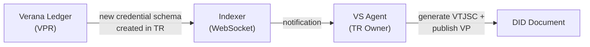
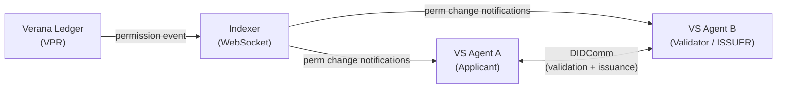
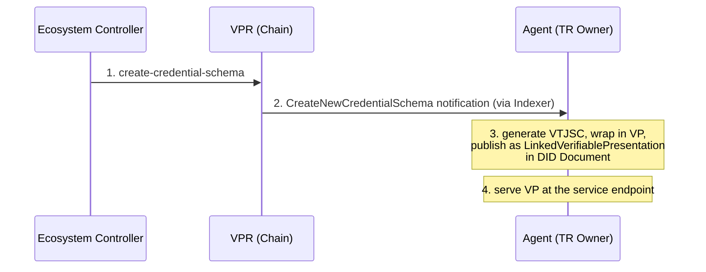
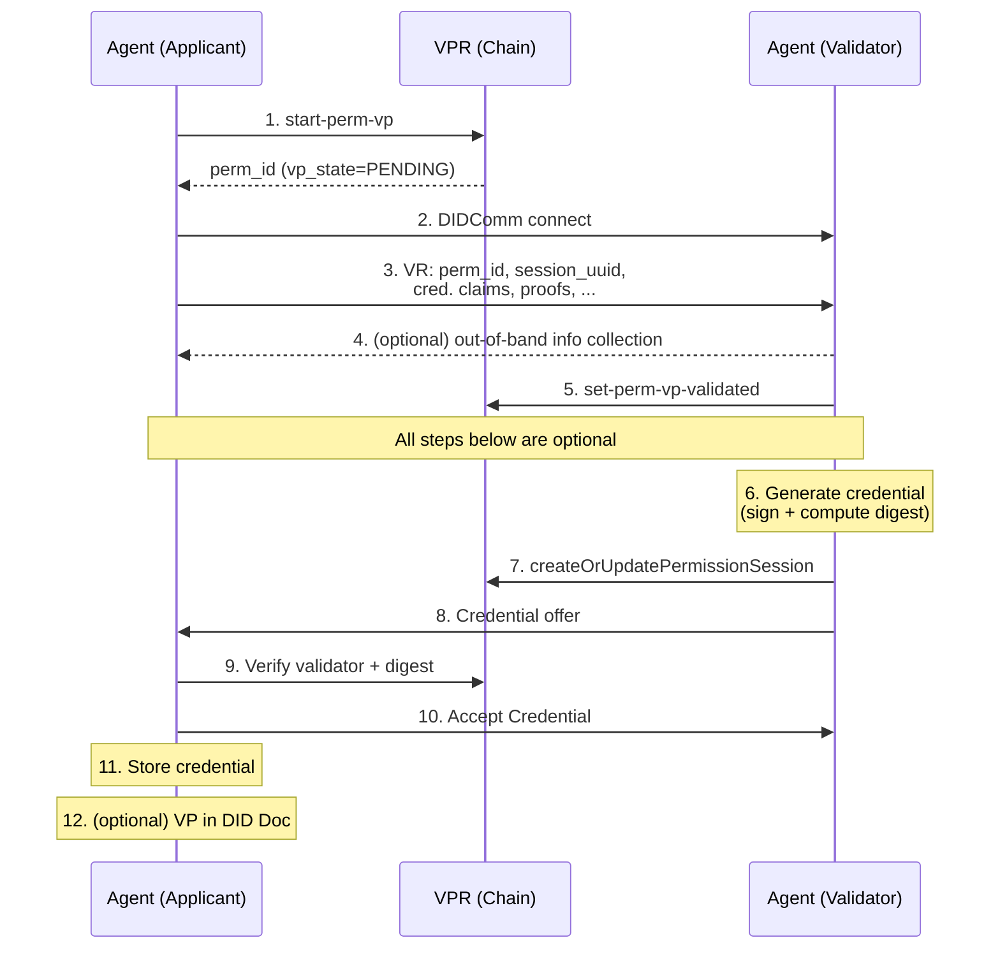
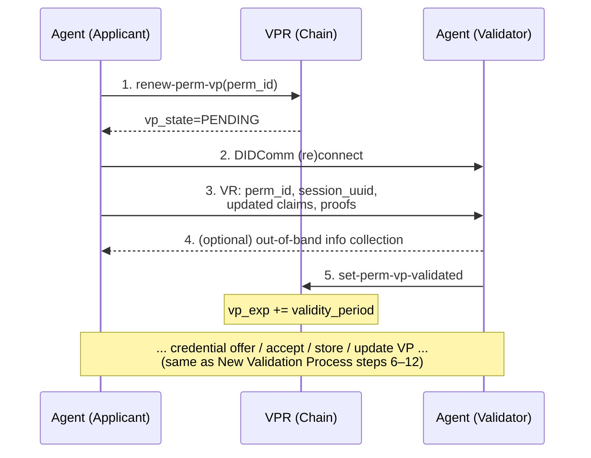
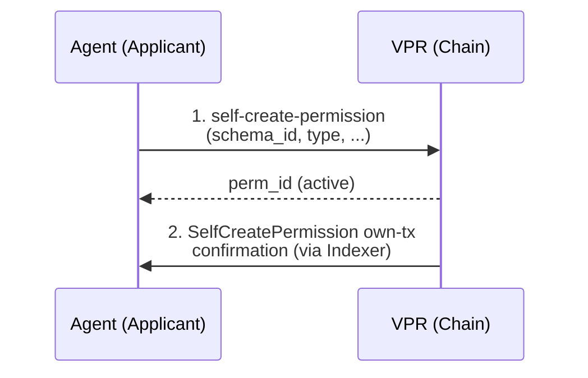
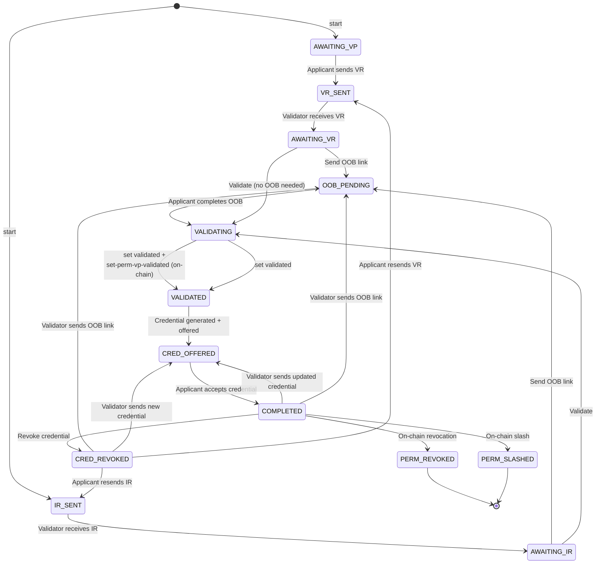

# VS Agent v4 Specification

**Latest Draft:** spec v4-draft1

## Abstract

The **VS Agent** is a container that provides the full stack required to operate a Verifiable Service. It bundles, in a single deployable unit:

- **Decentralized identity** — a resolvable DID whose DID Document is signed by the agent's keys and attested by `LinkedVerifiablePresentation` entries wrapping W3C Verifiable Credentials Data Model credentials that establish the operator, purpose, and governance context of the service.
- **DIDComm stack** — a full DIDComm implementation for establishing secure agent-to-agent communication channels with any other DIDComm-compatible peer.
- **Service endpoint declaration** — publishing one or more concrete service endpoints (DIDComm messaging, MCP, A2A, HTTP / website, and similar) in the agent's DID Document under a single resolvable DID.
- **Service bootstrap over DIDComm** — an initial exchange over the DIDComm channel through which peers obtain the credentials, access tokens, or configuration needed to consume any of the declared service endpoints.

By combining these components, the VS Agent allows backends to expose identified, verifiable, and governance-aware services without implementing DID resolution, credential lifecycle management, DIDComm encryption, or trust-layer integration themselves. The VS Agent is intentionally service-shape-agnostic: conversational chatbots integrated with messaging applications such as the [Hologram Messaging App](https://hologram.chat) are one of several deployment patterns, alongside MCP tool servers, A2A agents, and plain HTTP APIs.

This document specifies the normative behavior of a VS Agent implementation: its container configuration and bootstrap, its DID Document management, its credential acquisition and issuance flows, its indexer subscription and event model, its administration API, and its conformance to the Verifiable Trust specification.

## About this Document

In order to fully understand the concepts developed in this document, you should have some basic knowledge of DID, DIDComm, AnonCreds, the Verifiable Trust model, and the [ToIP stack](https://www.trustoverip.org/toip-model/). All terms used in this specification are defined in the [Terminology](#terminology) section.

## Conformance

As well as sections marked as non-normative, all authoring guidelines, diagrams, examples, and notes in this specification are non-normative. Everything else in this specification is normative.

The key words MAY, MUST, MUST NOT, OPTIONAL, RECOMMENDED, REQUIRED, SHOULD, and SHOULD NOT in this document are to be interpreted as described in [BCP 14](https://datatracker.ietf.org/doc/html/bcp14) [RFC2119](https://w3c.github.io/vc-data-model/#bib-rfc2119) [RFC8174](https://w3c.github.io/vc-data-model/#bib-rfc8174) when, and only when, they appear in all capitals, as shown here.

## Terminology

- **AnonCreds** — Anonymous Credentials, a privacy-preserving verifiable credential format supporting selective disclosure and unlinkability.
- **decentralized identifier (DID, DIDs)** — A decentralized identifier, as specified in [DID-CORE](https://www.w3.org/TR/did-core/).
- **DIDComm** — A peer-to-peer messaging protocol built on DIDs, as specified by the [DIDComm Messaging Specification](https://identity.foundation/didcomm-messaging/spec/).
- **Verifiable Public Registry (VPR, VPRs)** — A decentralized registry used to publish and resolve trust-related resources (credential schemas, trust registries, governance frameworks, etc.), as specified by the [Verifiable Trust VPR specification](https://github.com/verana-labs/verifiable-trust-vpr-spec).
- **Verifiable Service (Verifiable Services)** — A service that identifies its operator, purpose, and governance context through verifiable credentials, as defined in the [Verifiable Trust specification](https://github.com/verana-labs/verifiable-trust-spec).
- **Verifiable Trust** — The open, decentralized trust layer specified at [verana-labs/verifiable-trust-spec](https://github.com/verana-labs/verifiable-trust-spec).
- **VS Agent** — The runtime component specified by this document, which hosts a Verifiable Service and exposes a REST API and event model to backend implementations.
- **VTJSC, Verifiable Trust JSON Schema Credential** — A W3C `JsonSchemaCredential` issued by an Ecosystem DID that references a `CredentialSchema` entry in a Verifiable Public Registry, cryptographically binding that schema to the Ecosystem that controls the Trust Registry in which the schema is defined. Specified in [VT-JSON-SCHEMA-CRED-W3C](https://github.com/verana-labs/verifiable-trust-spec/blob/main/spec.md#vt-json-schema-cred-w3c-verifiable-trust-json-schema-credential) of the Verifiable Trust Specification.
- **W3C Verifiable Credentials Data Model (W3C VC Data Model)** — The W3C Recommendation defining a standard data model for verifiable credentials, as specified in [W3C Verifiable Credentials Data Model v2.0](https://www.w3.org/TR/vc-data-model/).

## Verifiable Trust Integration

### Introduction

*This section is not normative.*

Resources created in a VPR (like the Verana ledger) are linked to DIDs that represent VS Agents. For this reason, a VS Agent MUST receive notifications of changes in the ledger that are directly or indirectly linked to its DID, and update its state accordingly.

**Examples:**

- **Trust registry schema addition** — A new credential schema is created for a trust registry. The VS Agent whose DID owns that trust registry is notified and automatically creates the corresponding VTJSC, publishing it in its DID Document.
- **Validation process lifecycle** — An applicant initiates a validation process to obtain a HOLDER permission from an ISSUER for a given credential schema. The applicant creates the Validation Process on the Verana ledger. The VS Agents of both applicant and validator (ISSUER) are notified and begin a userland validation flow over DIDComm. As the on-chain permission state changes, the respective VS Agents receive further notifications and execute follow-up tasks (e.g., continuing the DIDComm exchange, issuing the credential).



*Figure 1a — Trust registry schema addition. A new credential schema is created on-chain; the Indexer notifies the owning VS Agent, which generates the corresponding VTJSC and publishes it in its DID Document.*



*Figure 1b — Validation process lifecycle. The applicant creates a Validation Process on-chain; both VS Agents are notified and coordinate over DIDComm. As the on-chain permission state changes, further notifications trigger follow-up tasks.*

Additionally, a Corporation controller needs to remotely query and manage the state of its VS Agents directly from the Verana frontend. To enable this, each VS Agent MUST expose a secure Administration API accessible to Verana accounts that have been granted administrative rights over the agent by the Corporation.

### Corporation and Account Model

#### Corporation (VPR Group)

As defined in the VPR Specification v4:

> A **corporation** is a VPR **group** which is the owner of a specific resource in the VPR.

Resources in the VPR (trust registries, credential schemas, permissions, permission sessions) are owned by an **corporation** (group), not by individual accounts. Individual Verana accounts operate on behalf of an corporation through delegated authorizations.

The `VERANA_CORPORATION` environment variable identifies the VPR group this agent belongs to.

#### Agent Account (vs_operator)

The agent's Verana account, derived from `AGENT_VERANA_MNEMONIC`, acts as the `vs_operator` for on-chain operations.

#### Agent Account Authorizations

The `vs_operator` account SHOULD have been granted appropriate authorizations by the `VERANA_CORPORATION` group:

RECOMMENDED:

- **`VSOperatorAuthorization`**: Grants the agent the right to execute `CreateOrUpdatePermissionSession`, `TriggerResolver`, `SetPermissionVPToValidated` on behalf of the corporation, for specific permissions. See VPR Spec [AUTHZ-CHECK-3].
  - If `vs_operator_authz_with_feegrant` is `true` on the relevant permission, the corporation's account covers transaction fees and the agent account does not need to be independently funded.
  - If `vs_operator_authz_with_feegrant` is `false`, the agent account MUST have sufficient balance to pay transaction fees.

### Configuration and Bootstrap

#### Container Environment Variables

The following environment variables MUST be provided when the VS Agent container is started.

##### Identity and Corporation

| Variable | Required | Description |
|---|---|---|
| `VERANA_CORPORATION` | REQUIRED | The VPR group identifier of the corporation this agent belongs to. All on-chain resources (permissions, trust registries,...) are owned by this corporation. |
| `AGENT_VERANA_MNEMONIC` | REQUIRED | BIP-39 mnemonic used to derive the agent's Verana blockchain account. This account MUST have been granted a `VSOperatorAuthorization` by the `VERANA_CORPORATION` group for the permissions it operates under.|

##### Network Configuration

| Variable | Required | Description |
|---|---|---|
| `VERANA_RPC` | REQUIRED | Verana blockchain RPC endpoint URL (e.g., `https://rpc.testnet.verana.network`). |
| `VERANA_INDEXER` | REQUIRED | Verana indexer API URL (e.g., `https://idx.testnet.verana.network`). |
| `VERANA_CHAIN_ID` | OPTIONAL | Chain ID. |

##### Agent Configuration Mode

Agent mode depends on whether you want the agent to obtain an ECS-Organization or ECS-Persona credential (standalone): Verifiable Trust VS-REQ-3; or delegated Verifiable Trust VS-REQ-4.

See [comparison between VS-REQ-3 and VS-REQ-4](https://verana-labs.github.io/verifiable-trust-spec/#vs-req-verifiable-service-basic-requirements-and-linked-vps).

| Variable | Required | Description |
|---|---|---|
| `VS_AGENT_MODE` | OPTIONAL | One of `standalone` or `delegated`. Default: `standalone`. See [ECS Standalone Mode](#ecs-standalone-mode). |
| `VS_DELEGATED_ISSUER_DID` | CONDITIONAL | DID of the parent Verifiable Service to contact for obtaining a Service credential. REQUIRED when `VS_AGENT_MODE` = `delegated`. |

### Notifications

The agent MUST maintain a permanent WebSocket connection to the VPR indexer and subscribe to notifications related to:

- its own `DID`.
- its verana account `vs_account`.

The indexer tracks all on-chain objects where `did` matches the agent's DID including Trust Registries, Credential Schemas (within those Trust Registries), and objects that match `vs_account`, like Permissions, Permission Sessions, Authorizations — and emits a notification whenever any of these objects is created or modified by a transaction.

If the WebSocket connection is lost, the agent MUST reconnect with exponential backoff and re-synchronize by querying the indexer REST API for any events missed during the disconnection.

The following table lists all VPR transactions that produce a notification for the subscribed agent, grouped by the agent's role.

Each notification must be associated with a specific handler interface in the VS Agent. A default implementation will be provided to handle the most important notifications. Developers can implement their own handlers to override VS Agent default handlers (or provide an implementation for notifications not handled by the default implementation).

#### Trust Registry Owner Notifications

These notifications are emitted when objects in a Trust Registry owned by the agent's DID (`TrustRegistry.did` = agent DID) are created or modified.

| VPR Transaction | Description | Default Handler Implementation |
| --- | --- | --- |
| `CreateNewTrustRegistry` [MOD-TR-MSG-1] | A new Trust Registry has been created with the agent's DID. | N/A. |
| `UpdateTrustRegistry` [MOD-TR-MSG-4] | The Trust Registry has been updated. | N/A. |
| `AddGovernanceFrameworkDocument` [MOD-TR-MSG-2] | A Governance Framework document has been added to the Trust Registry. | N/A. |
| `IncreaseActiveGFVersion` [MOD-TR-MSG-3] | The active Governance Framework version has been incremented. | N/A. |
| `CreateNewCredentialSchema` [MOD-CS-MSG-1] | A new Credential Schema has been created in the agent's Trust Registry. | Trigger automatic VTJSC publication (see [VTJSC Management](#vtjsc-management)). |
| `UpdateCredentialSchema` [MOD-CS-MSG-2] | A Credential Schema has been updated (e.g., validation validity periods). | N/A. |
| `ArchiveCredentialSchema` [MOD-CS-MSG-3] | A Credential Schema has been archived or unarchived. | N/A. |

#### Permission Notifications

All notifications are sent both to the Applicant and Validator matching `applicant_permission.vs_agent` or `validator_permission.vs_agent`.

| VPR Transaction | Description | Default Handler Implementation |
| --- | --- | --- |
| `StartPermissionVP` [MOD-PERM-MSG-1] | An applicant has started a new Validation Process targeting the DID of this agent. | For Validator: N/A. For Applicant: Progress the credential acquisition flow (see [new validation process](#new-validation-process)). |
| `RenewPermissionVP` [MOD-PERM-MSG-2] | An applicant has renewed an existing Validation Process. | For Validator: N/A. For Applicant: Progress the credential acquisition flow (see [renew validation process](#renew-validation-process)). |
| `SetPermissionVPToValidated` [MOD-PERM-MSG-3] | Validator has set the agent's permission `vp_state` to `VALIDATED`. | For Validator: Progress the credential acquisition flow (see [new validation process](#new-validation-process)). For Applicant: N/A. |
| `AdjustPermission` [MOD-PERM-MSG-8] | Validator or ancestor has adjusted the agent's permission `effective_until`. | N/A. |
| `RevokePermission` [MOD-PERM-MSG-9] | Validator, ancestor, or TR controller has revoked the agent's permission. | Remove linked VP from DID Document if exists, delete credential if exists. |
| `SlashPermissionTrustDeposit` [MOD-PERM-MSG-12] | Validator or TR controller has slashed the agent's permission trust deposit. | Clean up the associated flow state. |
| `RepayPermissionSlashedTrustDeposit` [MOD-PERM-MSG-13] | The agent's slashed trust deposit has been repaid (confirmation of own tx). | N/A. |
| `CancelPermissionVPLastRequest` [MOD-PERM-MSG-6] | An applicant has cancelled a pending Validation Process. | Clean up the associated flow state. |

#### Authorization Notifications

These notifications are emitted whenever an authorization or fee grant whose `operator`, `vs_operator`, or `grantee` is the agent's `vs_account` is created, modified, or revoked (see [Authorization and Fee Grants](https://verana-labs.github.io/verifiable-trust-vpr-spec/#authorization-and-fee-grants) in the VPR Specification).

| VPR Transaction | Description | Default Handler Implementation |
| --- | --- | --- |
| `GrantOperatorAuthorization` [MOD-DE-MSG-3] | The corporation has granted the agent's `vs_account` an `OperatorAuthorization` covering one or more `msg_types`. | Refresh the cached `OperatorAuthorization` for `vs_account`. |
| `RevokeOperatorAuthorization` [MOD-DE-MSG-4] | An `OperatorAuthorization` previously granted to the agent's `vs_account` has been revoked. | Invalidate the cached `OperatorAuthorization`. Stop submitting transactions whose `msg_type` is no longer authorized. |
| `GrantVSOperatorAuthorization` [MOD-DE-MSG-5] | The corporation has granted the agent's `vs_account` a `VSOperatorAuthorization` for one or more permissions. | Refresh the cached `VSOperatorAuthorization`; `CreateOrUpdatePermissionSession` and `TriggerResolver` MAY now be signed for the newly authorized permissions. |
| `RevokeVSOperatorAuthorization` [MOD-DE-MSG-6] | The agent's `VSOperatorAuthorization` has been revoked. | Invalidate the cached `VSOperatorAuthorization`. Stop signing `CreateOrUpdatePermissionSession` and `TriggerResolver` for the affected permissions until a new authorization is granted. |
| `GrantFeeAllowance` [MOD-DE-MSG-1] | A fee grant has been created where the agent's `vs_account` is the `grantee`; the corporation account now pays transaction fees within the grant's scope. | Refresh the cached fee-grant state. |
| `RevokeFeeAllowance` [MOD-DE-MSG-2] | A fee grant where the agent's `vs_account` is the `grantee` has been revoked. | Invalidate the cached fee-grant state. Subsequent transactions submitted by the agent MUST be paid from the agent account's own balance. |

#### Bootstrap Sequence

When the VS Agent starts, it MUST execute the following steps in order:

1. **Validate configuration**: All REQUIRED environment variables MUST be present and well-formed. If any variable is missing or invalid, the agent MUST fail with a descriptive error.

2. **Derive Verana account**: Derive the blockchain account from `AGENT_VERANA_MNEMONIC` and store the derived address as the agent's `vs_operator` account.

3. **Connect to indexer WebSocket**: Establish a persistent WebSocket connection to the VPR indexer and subscribe to DID-related notifications for real-time awareness of on-chain changes (see [indexer subscription](#indexer-websocket-subscription)). Subscription returns a `block-height`. Query the indexer for all objects linked to the agent's DID at `block-height - 1` to initialize the agent's state. Start processing WebSocket notifications from `block-height`.

4. **Start DIDComm message processor**: Begin listening for incoming DIDComm messages, including validation and issuance requests, revocation notifications, and credential updates,...

> If no `VSOperatorAuthorization` has been granted to this VS Agent AND account balance of `vs_account` is equal to 0, a warning should be printed in the log.

### VTJSC Management

Each Verifiable Trust Ecosystem publishes one or more Credential Schemas in its Trust Registry. For each such schema, the Ecosystem controller (the VS Agent whose DID owns the Trust Registry) MUST attach to its own DID Document a corresponding VTJSC — a JSON Schema Credential that binds the on-chain schema definition to the controlling Ecosystem DID (see [VT-JSON-SCHEMA-CRED-W3C](https://verana-labs.github.io/verifiable-trust-spec/#vt-json-schema-cred-w3c-verifiable-trust-json-schema-credential) and [VT-ECOSYSTEM-DIDDOC](https://verana-labs.github.io/verifiable-trust-spec/#vt-ecosystem-diddoc-ecosystem-did-document)).

The VS Agent takes care of the full VTJSC lifecycle automatically. The flow is entirely driven by on-chain events — no Applicant, no Validator, and no DIDComm session is involved.



**Step-by-step**:

1. The Ecosystem controller submits a [`CreateCredentialSchema`](https://verana-labs.github.io/verifiable-trust-vpr-spec/#mod-cs-msg-1-create-credential-schema) transaction on-chain, referencing the Trust Registry owned by the agent's DID. Credential Schemas in the VPR are immutable once created, so this event is a one-off trigger per schema.

2. The VPR indexer emits a `CreateNewCredentialSchema` notification (see [Trust Registry Owner Notifications](#trust-registry-owner-notifications)) to the Trust Registry owner — i.e., the agent.

3. The agent MUST automatically produce and publish the corresponding VTJSC (see [Automatic VTJSC Maintenance](#automatic-vtjsc-maintenance) for the normative requirements):
   - Generate a VTJSC conforming to [VT-JSON-SCHEMA-CRED-W3C], whose `credentialSubject.jsonSchema.$ref` points to the on-chain `CredentialSchema` entry and whose `credentialSubject.digestSRI` carries the SRI digest of the referenced JSON schema content. The VTJSC is signed with the Ecosystem's DID key.
   - Wrap the VTJSC in a Verifiable Presentation signed by the same Ecosystem DID.
   - Add a `LinkedVerifiablePresentation` service entry to the Ecosystem's DID Document, with a fragment that starts with `#vpr-schemas-` and ends with `-vtjsc-vp`, as required by [VT-ECOSYSTEM-DIDDOC].

4. The agent MUST serve the VP at its declared `serviceEndpoint` so that any wallet, issuer, or verifier resolving the Ecosystem DID can retrieve and verify the VTJSC.

> Because `CredentialSchema` entries in the VPR are **immutable**, the agent never has to update an existing VTJSC — it only generates a new one whenever a new schema is created in the Trust Registry it owns.

### Permission and Credential Acquisition Logic

Ecosystems create trust registry in a VPR and define one or more credential schemas. Credential schemas have different configuration modes. These modes defines how applicants onboard the ecosystem, and have a direct effect on the workflows used.

Configuration modes are [defined here](https://verana-labs.github.io/verifiable-trust-vpr-spec/#credential-schemas-and-permissions).

#### ECS Permissions and Credentials

To be a Verifiable Service, an agent MUST obtain permissions and/or credentials from a trusted ECS Trust Registry. The vs-agent implements two modes, as specified in the Verifiable Trust spec. They are configured via the `VS_AGENT_MODE` env variable.

> For ECS-Organization, ECS-Persona, and ECS-Service credentials schemas, `holder_onboarding_mode` is always set to `ISSUER_VALIDATION_PROCESS`. See [spec](https://verana-labs.github.io/verifiable-trust-spec/#vt-ecs-json-schema-vpr-config-essential-schema-vpr-configuration)

##### ECS Standalone Mode

In standalone mode:

1. Applicant starts a [validation process flow](#new-validation-process) to obtains an **ECS-Organization** or **ECS-Persona** credential schema HOLDER permission and its corresponding credential via DIDComm from an authorized ISSUER registered under a trusted ECS Trust Registry.
2. Applicant starts a [validation process flow](#new-validation-process) to obtain an ISSUER permission for the **Service** credential schema from the same trusted ECS Trust Registry.

> As defined in [VS-CONN-VS](https://verana-labs.github.io/verifiable-trust-spec/#vs-conn-vs-requirements-for-a-vs-to-accept-a-connection-from-another-service), validator agent CAN accept connections of not yet verifiable agent, if and only if the purpose of the connection is the issuance of [VT-ECS-ORG-CRED-W3C] or [VT-ECS-PERSONA-CRED-W3C] or [VT-ECS-SERVICE-CRED-W3C] credentials

##### ECS Delegated Mode

In delegated mode, the agent contacts the parent VS specified by `VS_DELEGATED_ISSUER_DID` to obtain its Service credential:

1. Applicant starts a [validation process flow](#new-validation-process) to obtain a HOLDER permission and its corresponding **Service credential** from the parent VS via DIDComm.

The parent VS (`VS_DELEGATED_ISSUER_DID`) MUST already possess an ISSUER permission for the Service schema and MUST be a Verifiable Service. If the agent cannot reach the parent VS or the parent VS rejects the request, or if the parent agent IS NOT verifiable, the agent MUST fail with a descriptive error.

#### Logic for Other Permissions and Credentials

To obtain a permission and/or credential from a specific issuer of a Credential Schema `cs` of a specific Ecosystem trust registry, flow to choose depends on:

- the credential schema configuration
- the type of permission the Applicant will request.

**Important**: refer to [Credential Schemas and Permissions](https://verana-labs.github.io/verifiable-trust-vpr-spec/#credential-schemas-and-permissions) in the VPR spec.

The flows described in the next section provide a list of Possible Applicant/Validator combinations for which they are relevant.

### Permission and Credential Acquisition Flows

In all flows below, actors represented as Applicant and Validator can be: an agent, or any operator of a corporation that has been granted (authorized) the execution of corresponding VPR Messages .

> Applicant is always the peer that initiates a connection to a Validator.

#### Validation Processes

Possible Applicant/Validator combinations:

| Applicant | Validator | Schema Mode Condition |
|---|---|---|
| ISSUER_GRANTOR | ECOSYSTEM | Issuer onboarding mode = `GRANTOR_VALIDATION_PROCESS` |
| VERIFIER_GRANTOR | ECOSYSTEM | Verifier onboarding mode = `GRANTOR_VALIDATION_PROCESS` |
| ISSUER | ISSUER_GRANTOR | Issuer onboarding mode = `GRANTOR_VALIDATION_PROCESS` |
| ISSUER | ECOSYSTEM | Issuer onboarding mode = `ECOSYSTEM_VALIDATION_PROCESS` |
| VERIFIER | VERIFIER_GRANTOR | Verifier onboarding mode = `GRANTOR_VALIDATION_PROCESS` |
| VERIFIER | ECOSYSTEM | Verifier onboarding mode = `ECOSYSTEM_VALIDATION_PROCESS` |
| HOLDER | ISSUER | Holder onboarding mode = `ISSUER_VALIDATION_PROCESS` |

##### New Validation Process



**Step-by-step**:

1. The applicant submits `start-perm-vp` on-chain, referencing the validator permission's `validator_perm_id`, and all other required attributes as specified in [start permission VP](https://verana-labs.github.io/verifiable-trust-vpr-spec/#mod-perm-msg-1-start-permission-vp). This creates a permission with `vp_state=PENDING` and return its id, `perm_id`. Vs-agent is notified.

2. The agent connects to the validator via DIDComm (see [didcomm-message-summary-for-vt_flow](#didcomm-message-summary-for-vt_flow)). The validator MUST verify that the connecting agent is compliant with [VS-CONN-VS] before accepting the connection.

3. The applicant sends a **VR (Validation Request)** message containing the following (to be used later for `createOrUpdatePermissionSession`):
   - `perm_id`: The applicant permission ID.
   - `session_uuid`: A UUID for the permission session.

   The applicant MAY also include credential claims (if flow should issue a credential), and supporting proofs, if already available. The validator MUST either accept the information and proceed, or refuse it with an error code and descriptive error message. If refused, the applicant MAY retry with corrected information.

> Note: this validation request must be executed when a new validation process is started or if an existing validation process is renewed.

4. If the validator requires additional information to generate the credential (e.g., missing claims or proofs), the validator MAY send a link to the applicant for an out-of-DIDComm flow (such as a web form or portal) to collect the missing data.

5. After validation, the validator calls `set-perm-vp-validated` on-chain, changing `vp_state` to `VALIDATED`. Vs-agent is notified.

All steps below are optional and executed only if the validator issues a credential.

6. The validator generates and signs the credential, and computes the digest.

7. The **validator** calls `createOrUpdatePermissionSession` on-chain (see [Agent Account Authorizations](#agent-account-authorizations)). The credential MUST NOT be delivered until this transaction succeeds.

8. The validator delivers the signed credential to the applicant via the existing DIDComm session.

9. The applicant MUST verify the received credential before accepting it:
   - Verify the validator is authorized by the ecosystem to issue credentials for this schema.
   - Recompute the credential's digest and verify it matches the digest recorded on-chain in the permission session created in step 7.
   - If either check fails, the applicant MUST reject the credential and log the error.

10. The applicant sends a **CRED_ACCEPT** message to the validator, confirming that the credential has been verified and accepted.

11. The applicant stores the credential in its credential store.

12. **Optionally**, the applicant links the credential as a `LinkedVerifiablePresentation` in its DID Document per [VT-CRED-W3C-LINKED-VP]. This is required for ECS credentials but optional for other credential types.

13. **Optionally**, the applicant calls `TriggerResolver` on-chain to refresh its Verifiable Service resolution state. The applicant SHOULD call `TriggerResolver` when:
    - it has just become a Verifiable Service by newly complying with [VS-REQ](https://verana-labs.github.io/verifiable-trust-spec/#vs-req-verifiable-service-basic-requirements-and-linked-vps); or
    - it has added or removed a `LinkedVerifiablePresentation` entry in its DID Document.

##### Renew Validation Process

This flow is used when the Applicant wants to extend the validity of an existing Permission whose `vp_state` is `VALIDATED`, by re-running a Validation Process with the same Validator.



**Preconditions**:

- `applicant_perm.vp_state` MUST be `VALIDATED`. Renewal cannot be initiated while a previous request is still `PENDING` — the Applicant MUST first cancel the pending request (see [Cancel VP Last Request](#cancel-vp-last-request)).
- Permission cannot be either slashed, repaid, or revoked.
- `applicant_perm.validator_perm_id` MUST still be an [active permission](https://verana-labs.github.io/verifiable-trust-vpr-spec/#term:active-permission). If the Validator's permission is no longer active, the Applicant MUST start a [New Validation Process](#new-validation-process) with another Validator instead.
- Renewal MUST NOT change `validation_fees`, `issuance_fees`, `verification_fees`, `issuance_fee_discount`, or `verification_fee_discount`. To change any of these, the Applicant MUST start a [New Validation Process](#new-validation-process).

**Step-by-step**:

1. The Applicant submits `renew-perm-vp` on-chain referencing its own permission `perm_id`, as specified in [renew permission VP](https://verana-labs.github.io/verifiable-trust-vpr-spec/#mod-perm-msg-2-renew-permission-vp). On success, `vp_state` returns to `PENDING`, and the corresponding validation trust deposit and (if any) validation fees are re-escrowed.

2. The Applicant connects to the same Validator via DIDComm (see [didcomm-message-summary-for-vt_flow](#didcomm-message-summary-for-vt_flow)). If a DIDComm session was kept open from the previous flow, that session SHOULD be reused. The Validator MUST verify that the connecting agent is compliant with [VS-CONN-VS] before accepting the connection.

3. The Applicant sends a **VR (Validation Request)** message containing `perm_id` and (RECOMMENDED) a fresh `session_uuid`. The Applicant MAY include updated credential claims and supporting proofs. The Validator MUST recognise that `perm_id` corresponds to a renewal (its previous flow was `COMPLETED`) and reuse / update the associated flow state rather than create a new one.

4. If the Validator requires fresh information for the renewal (e.g., re-confirming identity, updated documentation), it MAY send an `OOB_LINK` to the Applicant for an out-of-DIDComm flow.

5. After validation, the Validator calls `set-perm-vp-validated` on-chain. For a renewal, the VPR enforces that `validation_fees`, `issuance_fees`, `verification_fees`, and fee discounts MUST equal the values originally agreed; any modification will be rejected on-chain. On success, `vp_state` returns to `VALIDATED` and `vp_exp` is extended by the schema-defined `validity_period`.

Steps 6–13 are identical to those of [New Validation Process](#new-validation-process) and are executed only if the Validator chooses to issue an updated credential as part of the renewal. If a credential is delivered:

- The Applicant MUST replace the previously stored credential with the updated one in its credential store and delete any previously created linked-vp linked to the old credential.
- **Optionally**, the Applicant create the corresponding `LinkedVerifiablePresentation` entry in its DID Document.
- **Optionally**, the Applicant calls `TriggerResolver` on-chain to refresh its Verifiable Service resolution state. The Applicant SHOULD call `TriggerResolver` when:
  - it has just become a Verifiable Service by newly complying with [VS-REQ](https://verana-labs.github.io/verifiable-trust-spec/#vs-req-verifiable-service-basic-requirements-and-linked-vps); or
  - it has added or removed a `LinkedVerifiablePresentation` entry in its DID Document.

##### Cancel VP Last Request

This flow describes what happens when the Applicant cancels the in-flight Validation Request (either a `start-perm-vp` or a `renew-perm-vp`) before the Validator has set `vp_state` to `VALIDATED`. On-chain cancellation is exclusively driven by the [`CancelPermissionVPLastRequest`](https://verana-labs.github.io/verifiable-trust-vpr-spec/#mod-perm-msg-6-cancel-permission-vp-last-request) message and is only valid when `applicant_perm.vp_state` is `PENDING`.

```mermaid
sequenceDiagram
    participant Applicant as Agent (Applicant)
    participant VPR as VPR (Chain)
    participant Validator as Agent (Validator)

    Applicant->>VPR: 1. cancel-perm-vp-last-request(perm_id)
    Note over VPR: vp_current_fees refunded;<br/>vp_current_deposit released;<br/>vp_state = TERMINATED<br/>(or VALIDATED if vp_exp != null)
    VPR->>Validator: 2. CancelPermissionVPLastRequest event (via Indexer)
    VPR->>Applicant: 3. own-tx confirmation (via Indexer)
    Applicant-->>Validator: 4. (optional) informational message over DIDComm
    Applicant-->>Validator: 5. (if TERMINATED) close DIDComm session
```

**Preconditions**:

- `applicant_perm.vp_state` MUST be `PENDING`.
- `applicant_perm.deposit` MUST NOT be in a slashed-and-unrepaid state.

**On-chain effect** (executed atomically by [MOD-PERM-MSG-6](https://verana-labs.github.io/verifiable-trust-vpr-spec/#mod-perm-msg-6-cancel-permission-vp-last-request)):

- If `applicant_perm.vp_exp` is `null` (the permission was never validated — i.e., the cancellation targets a `start-perm-vp`): `vp_state` is set to `TERMINATED`.
- If `applicant_perm.vp_exp` is not `null` (the permission had previously been `VALIDATED` — i.e., the cancellation targets a `renew-perm-vp`): `vp_state` is restored to `VALIDATED` and the previous validation result still stands.
- Escrowed `vp_current_fees` are refunded to the Applicant's `corporation`.
- `vp_current_deposit` is removed from the Applicant's trust deposit.

**Applicant behaviour**:

1. Submit `cancel-perm-vp-last-request` on-chain referencing `perm_id`.
2. On confirmation, the Applicant receives a `CancelPermissionVPLastRequest` notification for its own transaction (see [Permission Notifications](#permission-notifications)). The handler updates local Flow State based on the resulting on-chain `vp_state`:
   - **`TERMINATED`** (cancelled a `start-perm-vp`): set Connection State to `TERMINATED` and Flow State to `TERMINATED_BY_APPLICANT`. The Applicant MAY send a final `ERROR` (or otherwise informational) message to the Validator over DIDComm before closing the session.
   - **`VALIDATED`** (cancelled a `renew-perm-vp`): keep Connection State as `ESTABLISHED` and Flow State as `COMPLETED`. The DIDComm session SHOULD remain open for future Validator updates (revocation notices, credential refresh, etc.).
3. Clean up any local resources associated with the cancelled request (pending `OOB_LINK` URLs, draft claim data, etc.).

**Validator behaviour**:

1. The Validator receives the `CancelPermissionVPLastRequest` notification from the indexer for an `applicant_perm_id` matching one of its in-flight flows (see [Permission Notifications](#permission-notifications)).
2. The Validator MUST stop any pending validation work for this flow:
   - Abort off-chain validation tasks.
   - Invalidate any outstanding `OOB_LINK` URL.
   - Discard any pre-generated credential that has not yet been delivered.
3. Update local Flow State based on the resulting on-chain `vp_state`:
   - **`TERMINATED`**: set Connection State to `TERMINATED` and Flow State to `TERMINATED_BY_APPLICANT`. The Validator MAY close the DIDComm session.
   - **`VALIDATED`**: keep Connection State as `ESTABLISHED` and Flow State as `COMPLETED`. No further action toward the Applicant is required; the previous credential (if any) remains valid.

> There is no dedicated DIDComm message for cancellation. Both peers learn about it via the on-chain `CancelPermissionVPLastRequest` notification delivered by the indexer. Any DIDComm message exchanged between the peers after cancellation is informational only.

##### Revoke Permission / Slash Permission Trust Deposit

Possible Applicant/Validator combinations: All.

`RevokePermission` ([MOD-PERM-MSG-9](https://verana-labs.github.io/verifiable-trust-vpr-spec/#mod-perm-msg-9-revoke-permission)) and `SlashPermissionTrustDeposit` ([MOD-PERM-MSG-12](https://verana-labs.github.io/verifiable-trust-vpr-spec/#mod-perm-msg-12-slash-permission-trust-deposit)) cause an existing Permission to become permanently unusable. From the perspective of VS Agents, both messages are handled in the same way: the affected Permission can no longer be used as the basis for any flow, and any credential that was issued under it MUST be treated as revoked.

The two messages differ only on-chain:

| Aspect | RevokePermission | SlashPermissionTrustDeposit |
| --- | --- | --- |
| On-chain state change | `applicant_perm.revoked = now` | `applicant_perm.slashed = now`; `slashed_deposit += amount`; trust deposit burned |
| Authorized initiators | ancestor validator, grantee `corporation`, or Trust Registry controller | ancestor validator or Trust Registry controller (NOT the grantee) |
| Permission must be active | yes | no — MAY be applied to expired or revoked permissions |
| VS Operator Authorization (ISSUER / VERIFIER only) | revoked | revoked |

Either message produces an indexer notification (see [Permission Notifications](#permission-notifications)) delivered to every VS Agent whose DID is implicated in the permission tree:

- The grantee (Applicant) of the affected Permission.
- Each ancestor Validator in the permission chain (including the Trust Registry controller).

```mermaid
sequenceDiagram
    participant Initiator as Initiator<br/>(any authorized party)
    participant VPR as VPR (Chain)
    participant Others as Other VS Agents in the<br/>permission chain

    Initiator->>VPR: 1. revoke-permission(id) OR<br/>slash-permission-trust-deposit(id, amt)
    Note over VPR: perm marked revoked / slashed;<br/>VS Operator Authz revoked<br/>(ISSUER/VERIFIER)
    VPR->>Others: 2. Revoke / Slash notification (via Indexer)
    Initiator-->>Others: 3. (optional, validator-initiated)<br/>inform peer via DIDComm<br/>(CRED_STATE_CHANGE)
```

**Applicant (grantee) behaviour** — when the affected Permission is one held by the agent's `corporation`:

1. The Applicant receives the `RevokePermission` / `SlashPermissionTrustDeposit` notification from the indexer.
2. The Applicant MUST mark the affected Permission as no longer usable:
   - **HOLDER permission**: treat the corresponding credential as revoked. Remove (or update) the `LinkedVerifiablePresentation` entry that wraps that credential in the agent's DID Document, then call `TriggerResolver` so the resolver pipeline re-resolves the agent's trust state.
   - **ISSUER / VERIFIER permission**: stop offering the corresponding service immediately. The on-chain VS Operator Authorization for this Permission has been revoked, so any subsequent transaction the agent attempts to sign on its behalf will be rejected by the chain.
3. For each in-flight or completed flow tied to the affected Permission:
   - Set Connection State to `TERMINATED` and Flow State to `PERM_REVOKED` (after `RevokePermission`) or `PERM_SLASHED` (after `SlashPermissionTrustDeposit`).
   - The agent MAY send an `ERROR` (or, for credential-issuance flows, `CRED_STATE_CHANGE`) message to each affected peer over DIDComm before closing the session.
4. **Slash only**: the agent MUST track that the corporation's `slashed_deposit` for this Permission is outstanding. Until [`RepayPermissionSlashedTrustDeposit`](https://verana-labs.github.io/verifiable-trust-vpr-spec/#mod-perm-msg-13-repay-permission-slashed-trust-deposit) is executed, the corporation cannot obtain new permissions in the same ecosystem.

**Validator behaviour** — when the affected Permission is the Applicant-side of a flow where the agent acted as Validator (or as an ancestor in the permission chain):

1. The Validator receives the `RevokePermission` / `SlashPermissionTrustDeposit` notification from the indexer for an `applicant_perm_id` matching one of its flows (active or completed).
2. If the Validator is itself the Initiator (e.g., it has just submitted `revoke-permission` against an Applicant whose credential it had previously issued), it SHOULD send a `CRED_STATE_CHANGE` message to the Applicant over the existing DIDComm session before (or immediately after) the on-chain transaction, so the Applicant can clean up locally without waiting for the indexer notification.
3. Update local Flow State for the affected flow:
   - Connection State: `TERMINATED`.
   - Flow State: `PERM_REVOKED` or `PERM_SLASHED`.
4. Discard any pending out-of-band resources for this flow (`OOB_LINK` URLs, draft credentials, etc.).

> Revocation and slashing are irreversible from the agent's perspective: a revoked or slashed Permission cannot be revived. To resume operating, the corporation MUST obtain a new Permission via a new validation process — and, for slashed permissions, MUST first repay the slashed trust deposit.

#### Credential Direct Issuance

This flow is used when an applicant wants to obtain a credential that can be issued directly without an on-chain validation process.

Possible Applicant/Validator combinations:

| Applicant | Validator | Schema Mode Condition |
|---|---|---|
| HOLDER | ISSUER | PERMISSIONLESS |


**Step-by-step**:

1. The agent connects to the validator via DIDComm. The validator MUST verify that the connecting agent is a Verifiable Service as specified in [VS-CONN-VS] before accepting the connection.

2. The applicant sends an **IR (Issuance Request)** message containing the desired credential `schema_id`, along with the following session parameters (to be used later for `createOrUpdatePermissionSession`):
   - `session_uuid`: A UUID for the permission session.

   The applicant MAY also include credential claims and supporting proofs if already available. The validator MUST either accept the information and proceed, or refuse it with an error code and descriptive error message. If refused, the applicant MAY retry with corrected information.

3. If the validator requires additional information to generate the credential (e.g., missing claims or proofs), the validator MAY send a link to the applicant for an out-of-DIDComm flow (such as a web form or portal) to collect the missing data.

4. The validator generates and signs the credential, and computes the digest.

5. The **validator** calls `createOrUpdatePermissionSession` on-chain (see [authorization](#authorization)). The credential MUST NOT be delivered until this transaction succeeds.

6. The validator delivers the signed credential to the applicant via the DIDComm session.

7. The applicant MUST verify the received credential before accepting it:
   - Verify the validator is authorized by the ecosystem to issue credentials for this schema (query the VPR via the indexer to confirm the validator has an active ISSUER permission).
   - Recompute the credential's digest and verify it matches the digest recorded on-chain in the permission session created in step 5.
   - If either check fails, the applicant MUST reject the credential and log the error.

8. The applicant sends a **CRED_ACCEPT** message to the validator, confirming that the credential has been verified and accepted.

9. The applicant stores the credential in its credential store.

10. **Optionally**, the applicant links the credential as a `LinkedVerifiablePresentation` in its DID Document per [VT-CRED-W3C-LINKED-VP].

11. **Optionally**, the applicant calls `TriggerResolver` on-chain to refresh its Verifiable Service resolution state. The applicant SHOULD call `TriggerResolver` when:
    - it has just become a Verifiable Service by newly complying with [VS-REQ](https://verana-labs.github.io/verifiable-trust-spec/#vs-req-verifiable-service-basic-requirements-and-linked-vps); or
    - it has added or removed a `LinkedVerifiablePresentation` entry in its DID Document.

> Note: revocation status of a credential issued without a corresponding HOLDER permission must be managed by the validator with a separated revocation list.

#### Validator Updates

Possible Applicant/Validator combinations: All

Validator MAY send update messages to the applicant through the persistent DIDComm session. The following updates are defined:

The validator sends a `CRED_STATE_CHANGE` message when the credential's status changes. Supported states:

- **REVOKED**: The credential has been permanently revoked by the validator. The applicant MUST:
  1. Remove the corresponding `LinkedVerifiablePresentation` from its DID Document (if present).
  2. Delete the credential from the credential store.

> Note: DIDComm connection can be maintained for future updates: a revocation of a credential doesn't imply the end of the flow.

:::warning
A revocation of a credential is distinct from a revocation of a permission. When a credential has been revoked, a new one can be requested by re-executing the Credential Direct Issuance flow.
:::

#### Permission Self Creation

This flow is used when a Credential Schema's onboarding mode for the requested permission type is `OPEN`. The Applicant self-creates its permission directly on-chain via [`SelfCreatePermission`](https://verana-labs.github.io/verifiable-trust-vpr-spec/#mod-perm-msg-14-self-create-permission); no Validator is involved, no DIDComm session is opened, and no Flow State is maintained on the agent.

Possible cases:

| Applicant | Schema Mode Condition |
|---|---|
| ISSUER | Issuer onboarding mode = `OPEN` |
| VERIFIER | Verifier onboarding mode = `OPEN` |



**Step-by-step**:

1. The Applicant submits `self-create-permission` on-chain referencing the target `schema_id`, the permission `type` (ISSUER or VERIFIER), and the other required attributes (DID, `effective_from`, fees, optional VS operator authorization parameters) as specified in [Self Create Permission](https://verana-labs.github.io/verifiable-trust-vpr-spec/#mod-perm-msg-14-self-create-permission). On success, the new permission is immediately active — no `vp_state`, no escrow, no Validator.

2. The Applicant receives the `SelfCreatePermission` notification from the indexer for its own transaction (see [Permission Notifications](#permission-notifications)) and records the resulting `perm_id` for later use.

> Permission Self Creation does not open a DIDComm session, does not create any Flow State entry, and does not involve a Validator. The corporation MUST nevertheless ensure that its self-created permission complies with the ecosystem's EGF — an OPEN-mode permission CAN still be revoked or slashed by ecosystem governance (see [Revoke Permission / Slash Permission Trust Deposit](#revoke-permission--slash-permission-trust-deposit)).

#### DIDComm Message Summary for `vt_flow`

The following table lists all DIDComm message types exchanged within a `vt_flow` session:

| Type | Name | Sender | Description |
| --- | --- | --- | --- |
| `VR` | Validation Request | Applicant | Requests validation process. Contains `perm_id`, `session_uuid`, and optionally credential claims and proofs. |
| `IR` | Issuance Request | Applicant | Requests direct issuance of a credential of a given schema. Contains `schema_id`, `session_uuid`, and optionally credential claims and proofs. |
| `OOB_LINK` | Out-of-Band Link | Validator | Provides a URL for out-of-DIDComm information collection (e.g., web form or portal) when additional data is needed to generate the credential, and a descriptive message. |
| `VALIDATING` | In validation process | Validator | Requested additional information submitted by the applicant via the OOB link; currently under validation. |
| `CRED_OFFER` | Credential Offer | Validator | Delivers the signed credential to the applicant after on-chain `createOrUpdatePermissionSession` succeeds. |
| `CRED_ACCEPT` | Accept Credential Offer | Applicant | Confirms the applicant has verified and accepted the offered credential (validator authorization + digest match). |
| `CRED_STATE_CHANGE` | Credential State Change | Validator | Notifies the applicant of a credential status change. Includes the new state (`REVOKED`) and a reason (see [Validator Updates](#validator-updates) for credential-level revocations and [Revoke Permission / Slash Permission Trust Deposit](#revoke-permission--slash-permission-trust-deposit) for permission-level events). |
| `ERROR` | Generic Error Message | Applicant or Validator | Contains one of the following error codes and a descriptive error message: `IR_REQUIRED`, `VR_REQUIRED`, `INVALID_CLAIMS`, `INVALID_SCHEMA`, `INVALID_PERM_ID`, `INVALID_AGENT_PERM_ID`, `INVALID_WALLET_AGENT_PERM_ID` (sent by the Validator during flow setup); `FLOW_CANCELLED` (sent by the Applicant after [Cancel VP Last Request](#cancel-vp-last-request)); `PERM_REVOKED`, `PERM_SLASHED` (sent by either peer following [Revoke Permission / Slash Permission Trust Deposit](#revoke-permission--slash-permission-trust-deposit)). |

#### Additional Considerations

- **Credential update**: At any time, the validator MAY send an updated credential to the applicant via a `CRED_OFFER` message through the existing DIDComm session. Upon receiving an updated credential, the applicant MUST delete the old credential from the credential store, replace it with the new one, and update the corresponding `LinkedVerifiablePresentation` in its DID Document if the credential was previously linked.
- **Out-of-band requests**: At any time, the validator MAY send an `OOB_LINK` message — for example, to revalidate applicant information, to extend a permission lifetime, or to collect additional data before issuing an updated credential.
- **Reconnection**: If the applicant reconnects to the validator after a connection has been closed, it MUST resend a `VR` or `IR` message. The validator MUST identify that the message is related to an existing flow and reassign the flow to the new connection.
- **Validation renewal**: When a validation process must be renewed, the applicant MUST first execute the required VPR on-chain transaction and then resend a `VR` message to the validator to re-trigger validation.

#### Flow State

Each credential acquisition flow has two orthogonal state dimensions that can be queried through the Administration API:

- **Connection State**: State of the DIDComm connection (`NOT_CONNECTED`, `ESTABLISHED` or `TERMINATED`).
- **Flow State**: Current stage of the credential acquisition flow.

| Connection State | Flow State | Role | Flow | Description |
| --- | --- | --- | --- | --- |
| `NOT_CONNECTED` | `AWAITING_VP` | Applicant | [New Validation Process](#new-validation-process) | Waiting for the applicant to start/renew an on-chain VP. |
| `ESTABLISHED` | `VR_SENT` | Applicant | [New Validation Process](#new-validation-process) | VR sent to validator. |
| `ESTABLISHED` | `AWAITING_VR` | Validator | [New Validation Process](#new-validation-process) | VR expected but not yet received, or last VR was rejected with error (applicant may retry). |
| `ESTABLISHED` | `IR_SENT` | Applicant | [Credential Direct Issuance](#credential-direct-issuance) | IR sent to validator. |
| `ESTABLISHED` | `AWAITING_IR` | Validator | [Credential Direct Issuance](#credential-direct-issuance) | IR expected but not yet received, or last IR was rejected with error (applicant may retry). |
| `ESTABLISHED` | `OOB_PENDING` | Both | Both | Validator sent an `OOB_LINK` for out-of-band information collection; awaiting applicant completion. |
| `ESTABLISHED` | `VALIDATING` | Both | [New Validation Process](#new-validation-process) | Validator is performing off-chain validation of the applicant. |
| `ESTABLISHED` | `VALIDATED` | Both | [New Validation Process](#new-validation-process) | Validator called `set-perm-vp-validated` on-chain; `vp_state` is now `VALIDATED`. |
| `ESTABLISHED` | `CRED_OFFERED` | Both | Both | Credential offered to applicant; awaiting `CRED_ACCEPT`. |
| `ESTABLISHED` | `COMPLETED` | Both | Both | Credential accepted, stored, and optionally linked as VP in DID Document. Connection remains open for future validator updates (see [Validator Updates](#validator-updates), [Additional Considerations](#additional-considerations)). |
| `TERMINATED` | `TERMINATED_BY_VALIDATOR` | Both | Both | Flow terminated by the validator (e.g., rejection, timeout, or policy decision). |
| `TERMINATED` | `TERMINATED_BY_APPLICANT` | Both | Both | Flow terminated by the applicant (e.g., cancellation or timeout). |
| `TERMINATED` | `ERROR` | Both | Both | Unrecoverable error occurred; connection closed. |
| `TERMINATED` | `PERM_REVOKED` | Both | [New Validation Process](#new-validation-process) | On-chain permission has been revoked; validator closed the connection (see [Permission Notifications](#permission-notifications)). |
| `TERMINATED` | `PERM_SLASHED` | Both | [New Validation Process](#new-validation-process) | On-chain permission has been slashed; validator closed the connection (see [Permission Notifications](#permission-notifications)). |
| `ESTABLISHED` | `CRED_REVOKED` | Both | Both | Credential permanently revoked by validator (see [Validator Updates](#validator-updates)). |




*Figure 2 — Flow state transitions. Solid arrows represent state changes triggered by Administration API actions, DIDComm messages, or on-chain events. Terminal states are shown converging to the end node.*

## Administration API

The VS Agent MUST expose a secure Administration API that allows authorized members of the agent's Corporation to remotely query and manage the agent's state — for example, from the Verana frontend, or from a backend container connected to agent.

For each API method, one or several access mode can be configured:

- INTERNAL: by containers of the same pod or deployment. No authentication needed.
- ACCOUNT_WHITELIST: by a verana account listed in the `ADMIN_API_ACCOUNT_WHITELIST` env variable.
- CORPORATE: by any verana account that has at least  to the `VERANA_CORPORATION` group.

::todo
TBD
:::

### Authentication and Authorization

::todo
TBD
:::

1. The VS Agent MUST authenticate callers using a Verana-account-based mechanism (e.g., ADR-036 signature challenge) and verify that the authenticated account belongs to the same Corporation as the agent's configured `VERANA_CORPORATION`.
2. Authenticated users MAY perform **read** operations (queries) on the Administration API.
3. **Write** operations (actions) MUST additionally require that the caller's Verana account has been granted an `OperatorAuthorization` by the Corporation for the relevant scope.

### Queries

::todo
TBD
:::

The VS Agent MUST provide read-only query endpoints that expose the agent's configuration, cached on-chain state, and runtime state. All endpoints MUST support filtering and pagination where applicable, and MUST NOT expose secret material such as `AGENT_VERANA_MNEMONIC` or raw private keys.

- listFlows(role: Applicant/Validator, schema_id, flowState, connectionState peerDID, )
- getFlow

- **List flows** — List and inspect existing flows. MUST support filtering by agent role (applicant or validator), Connection State, Flow State, peer DID, `perm_id`, `schema_id`, and `session_uuid` (see [Flow State](#flow-state)). Each result MUST include peer DID, the applicable `perm_id`s, `schema_id`, `session_uuid`, last-event timestamp, submitted credential claims and proofs, any outstanding `OOB_LINK` URL, and — once a credential is generated — the offered credential identifier, its digest, and the on-chain `PermissionSession` reference.

#### Actions

::todo
TBD
:::

The Administration API MUST expose the following write operations, scoped by the agent's role in the flow. All actions MUST be logged and linked to the Verana account that performed them. Some actions submit on-chain transactions to the VPR. Each one either starts/terminates a credential acquisition flow, or is a mandatory on-chain step without which an in-flight flow cannot progress. The Administration API MUST reject the call when `vs_account` does not hold a `VSOperatorAuthorization` covering the message and permission in scope (see [Agent Account Authorizations](#agent-account-authorizations)). All submitted transactions MUST be linked to the flow they relate to (when applicable) and to the Verana account that initiated them.

> Ledger based methods can be used to build services that automatically fully handle flows on their own. Example: an ECS-Organization issuer service that connects to organization registry and is able to request digital signature to prove signature of legal representatives.

##### Validator actions

**Flow only methods** (does not require a specific authorization on the ledger):

- **Edit credential claims** — Create, modify, or override the credential claims submitted by the applicant.
- **Send OOB link** — Send or resend an `OOB_LINK` message to the applicant requesting additional information (see [didcomm-message-summary-for-vt_flow](#didcomm-message-summary-for-vt_flow)).
- **Validate** — Mark the applicant's documentation as validated. When a Validation Process is involved, this is independent from the on-chain `set-perm-vp-validated` transaction and MAY trigger credential issuance (see [new-validation-process](#new-validation-process) steps 6–8).
- **Revoke credential** — Revoke a previously issued credential. The agent MUST notify the applicant via a `CRED_STATE_CHANGE` message over DIDComm (see [Validator Updates](#validator-updates)).
- **Terminate flow** — Close the DIDComm session and terminate the credential acquisition flow. Applicable to Direct Issuance flows only; for Validation Process flows, termination is performed on-chain.

**Ledger methods** (requires authorization)

- **Set VP Validated** — Submit `SetPermissionVPValidated` for an Applicant Permission currently being validated by this agent. Required to advance a [New Validation Process](#new-validation-process) or [Renew Validation Process](#renew-validation-process) past `VALIDATING`; no credential can be offered until this transaction succeeds.

> Note: some VS Agent implementations may not support all actions, or may prefer sending the user to a portal for providing proofs, etc... using the OOB link.

##### Applicant actions


## Service Endpoint Management

### Administration API

- listServiceEndpoints
- deleteServiceEndpoint
- addServiceEndpoint
- updateServiceEndpoint

