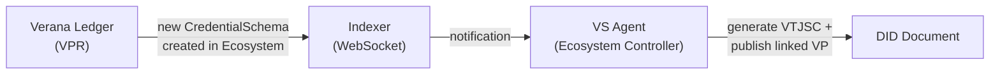
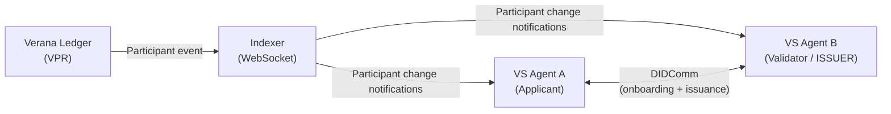
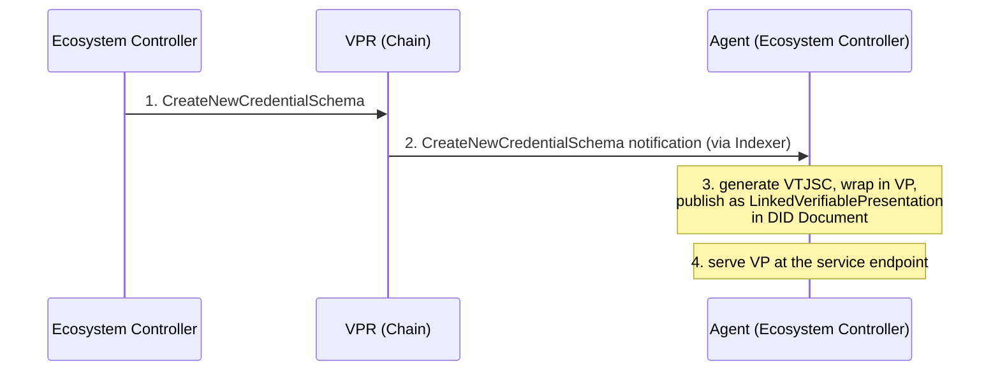
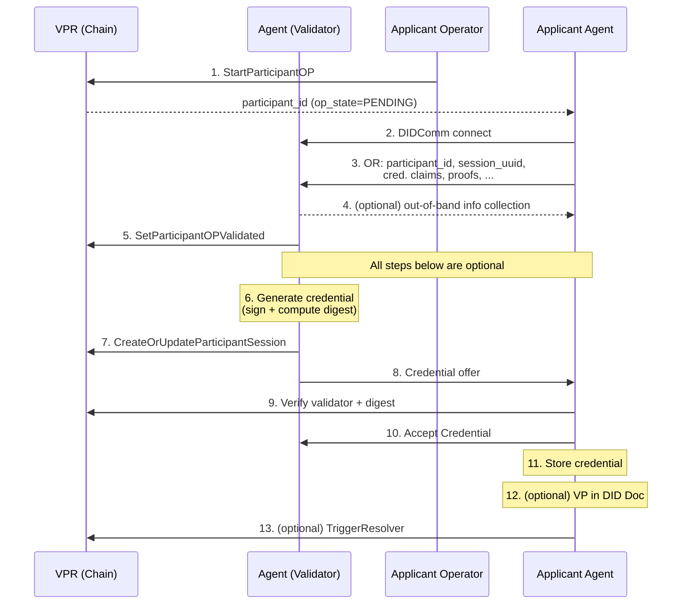
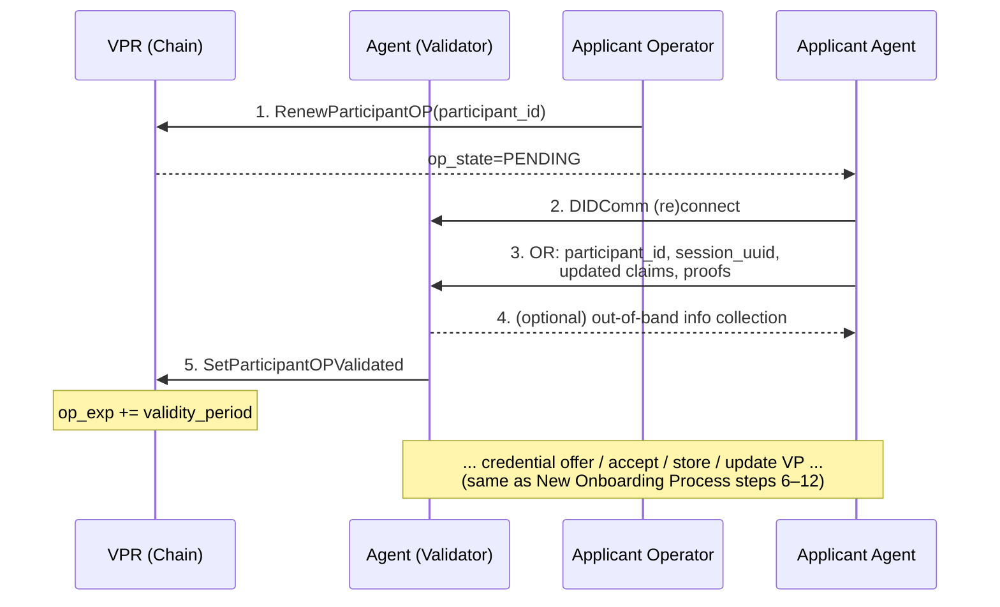
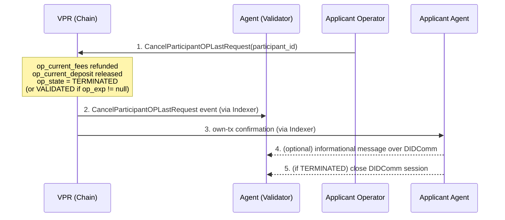
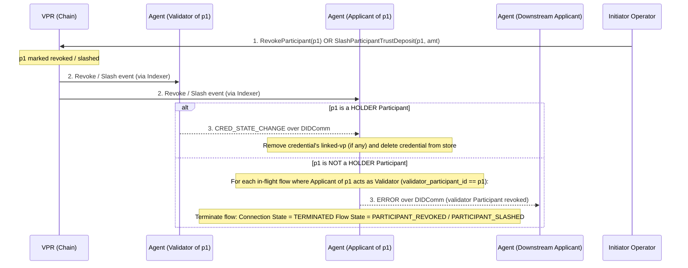
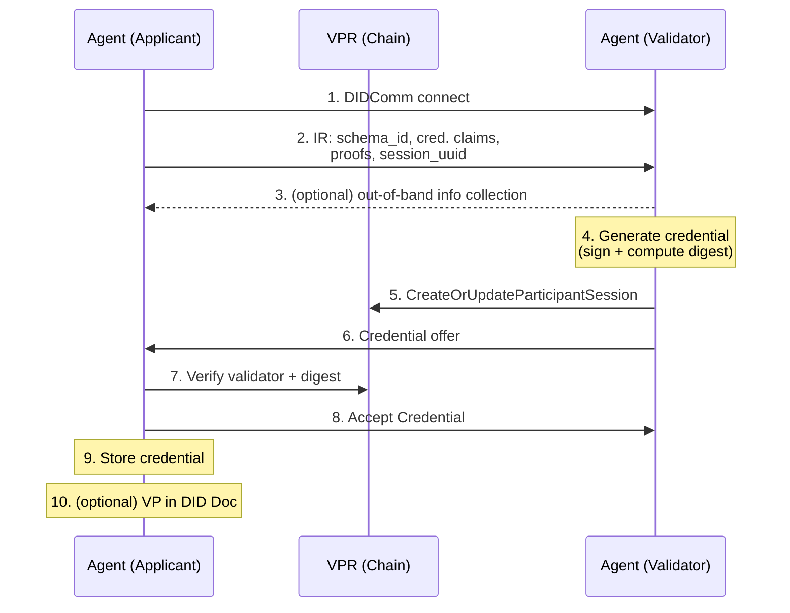
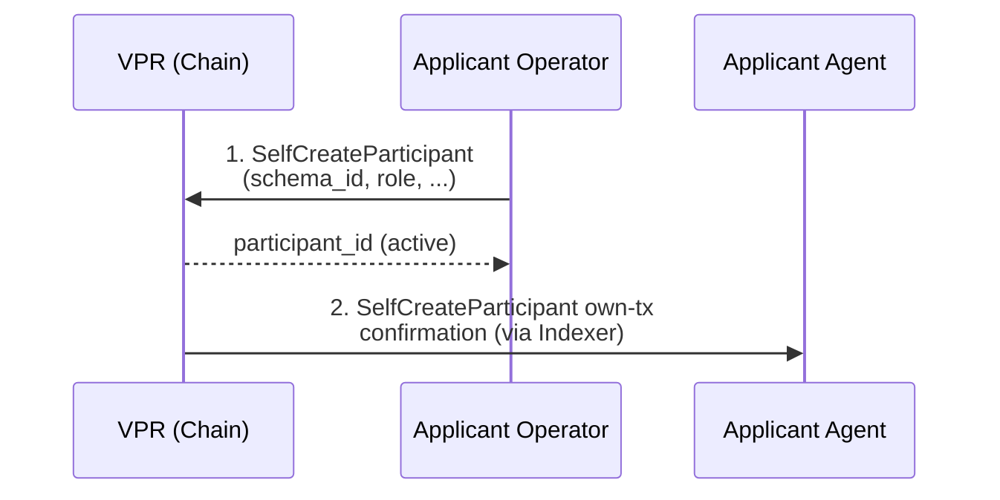
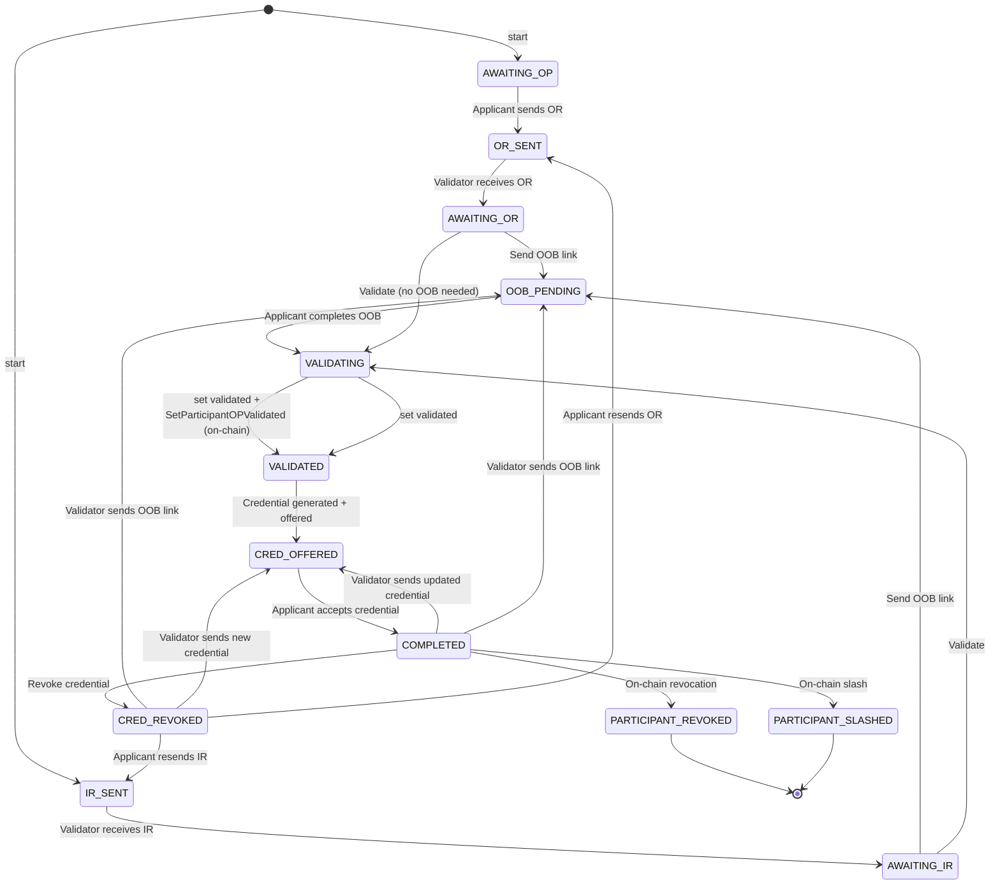

# VS Agent v4 Specification

**Latest Draft:** spec v4-draft2

## Abstract

The **VS Agent** is a container that provides the full stack required to operate a Verifiable Service. It bundles, in a single deployable unit:

- **Decentralized identity** — a resolvable DID whose DID Document is signed by the agent's keys and attested by `LinkedVerifiablePresentation` entries wrapping W3C Verifiable Credentials Data Model credentials that establish the operator, purpose, and governance context of the service.
- **DIDComm stack** — a full DIDComm implementation for establishing secure agent-to-agent communication channels with any other DIDComm-compatible peer.
- **Service endpoint declaration** — publishing one or more concrete service endpoints (DIDComm messaging, MCP, A2A, HTTP / website, and similar) in the agent's DID Document under a single resolvable DID.
- **Service bootstrap over DIDComm** — an initial exchange over the DIDComm channel through which peers obtain the credentials, access tokens, or configuration needed to consume any of the declared service endpoints.

By combining these components, the VS Agent allows backends to expose identified, verifiable, and governance-aware services without implementing DID resolution, credential lifecycle management, DIDComm encryption, or trust-layer integration themselves. The VS Agent is intentionally service-shape-agnostic: conversational chatbots integrated with messaging applications such as the [Hologram Messaging App](https://hologram.chat) are one of several deployment patterns, alongside MCP tool servers, A2A agents, and plain HTTP APIs.

This document specifies the normative behavior of a VS Agent implementation: its container configuration and bootstrap, its DID Document management, its credential acquisition and issuance flows, its indexer subscription and event model, its administration API, and its conformance to the Verifiable Trust specification.

## About this Document

In order to fully understand the concepts developed in this document, you should have some basic knowledge of DID, DIDComm, AnonCreds, the Verifiable Trust model, and the [ToIP stack](https://www.trustoverip.org/toip-model/). All terms used in this specification are defined in the [Terminology](#terminology) section.

## Conformance

As well as sections marked as non-normative, all authoring guidelines, diagrams, examples, and notes in this specification are non-normative. Everything else in this specification is normative.

The key words MAY, MUST, MUST NOT, OPTIONAL, RECOMMENDED, REQUIRED, SHOULD, and SHOULD NOT in this document are to be interpreted as described in [BCP 14](https://datatracker.ietf.org/doc/html/bcp14) [RFC2119](https://w3c.github.io/vc-data-model/#bib-rfc2119) [RFC8174](https://w3c.github.io/vc-data-model/#bib-rfc8174) when, and only when, they appear in all capitals, as shown here.

## Terminology

- **AnonCreds** — Anonymous Credentials, a privacy-preserving verifiable credential format supporting selective disclosure and unlinkability.
- **decentralized identifier (DID, DIDs)** — A decentralized identifier, as specified in [DID-CORE](https://www.w3.org/TR/did-core/).
- **DIDComm** — A peer-to-peer messaging protocol built on DIDs, as specified by the [DIDComm Messaging Specification](https://identity.foundation/didcomm-messaging/spec/).
- **Verifiable Public Registry (VPR, VPRs)** — A decentralized registry used to publish and resolve trust-related resources (Corporations, Ecosystems, Credential Schemas, Participants, Governance Frameworks, etc.), as specified by the [Verifiable Trust VPR specification](https://github.com/verana-labs/verifiable-trust-vpr-spec).
- **Verifiable Service (Verifiable Services)** — A service that identifies its operator, purpose, and governance context through verifiable credentials, as defined in the [Verifiable Trust specification](https://github.com/verana-labs/verifiable-trust-spec).
- **Verifiable Trust** — The open, decentralized trust layer specified at [verana-labs/verifiable-trust-spec](https://github.com/verana-labs/verifiable-trust-spec).
- **VS Agent** — The runtime component specified by this document, which hosts a Verifiable Service and exposes a REST API and event model to backend implementations.
- **VTJSC, Verifiable Trust JSON Schema Credential** — A W3C `JsonSchemaCredential` issued by an Ecosystem DID that references a `CredentialSchema` entry in a Verifiable Public Registry, cryptographically binding that schema to the Ecosystem in which it is defined. Specified in [VT-JSON-SCHEMA-CRED-W3C](https://github.com/verana-labs/verifiable-trust-spec/blob/main/spec.md#vt-json-schema-cred-w3c-verifiable-trust-json-schema-credential) of the Verifiable Trust Specification.
- **W3C Verifiable Credentials Data Model (W3C VC Data Model)** — The W3C Recommendation defining a standard data model for verifiable credentials, as specified in [W3C Verifiable Credentials Data Model v2.0](https://www.w3.org/TR/vc-data-model/).

## Verifiable Trust Integration

### Introduction

*This section is not normative.*

Resources created in a VPR (like the Verana ledger) are linked to DIDs that represent VS Agents. For this reason, a VS Agent MUST receive notifications of changes in the ledger that are directly or indirectly linked to its DID, and update its state accordingly.

**Examples:**

- **Ecosystem schema addition** — A new `CredentialSchema` is created in an Ecosystem. The VS Agent whose DID is the Ecosystem's `did` is notified and automatically generates the corresponding VTJSC, publishing it as a `LinkedVerifiablePresentation` in its DID Document.
- **Onboarding process lifecycle** — An applicant initiates an Onboarding Process to obtain a HOLDER `Participant` entry from an ISSUER for a given Credential Schema. The applicant creates the on-chain `Participant` entry (with `op_state = PENDING`) on the Verana ledger. The VS Agents of both applicant and validator (ISSUER) are notified and begin a userland onboarding flow over DIDComm. As the on-chain `Participant` state changes, the respective VS Agents receive further notifications and execute follow-up tasks (e.g., continuing the DIDComm exchange, issuing the credential).



*Figure 1a — Ecosystem schema addition. A new `CredentialSchema` is created on-chain; the Indexer notifies the owning VS Agent (the Ecosystem controller), which generates the corresponding VTJSC and publishes it in its DID Document.*



*Figure 1b — Onboarding process lifecycle. The applicant creates a `Participant` entry on-chain; both VS Agents are notified and coordinate over DIDComm. As the on-chain `Participant.op_state` changes, further notifications trigger follow-up tasks.*

Additionally, a Corporation controller needs to remotely query and manage the state of its VS Agents directly from the Verana frontend. To enable this, each VS Agent MUST expose a secure Administration API accessible to Verana accounts that have been granted administrative rights over the agent by the Corporation.

### Corporation and Account Model

#### Corporation

*This section is not normative.*

As defined in the [VPR Specification v4](https://verana-labs.github.io/verifiable-trust-vpr-spec/#corporation):

> A `Corporation` is the VPR-level entity representing an authority that acts in the registry. It carries a DID, a governance framework, and lifecycle attributes, and is anchored on-chain by a `policy_address` account that signs on its behalf. A Corporation may control [[ref: participants]] in zero or more [[ref: ecosystems]] and may itself be the controller of zero or more [[ref: ecosystems]].

A `Corporation` has, among other fields:

- `id` (uint64) — server-assigned, globally unique primary key.
- `policy_address` (account) — globally unique cosmos account that signs Msgs on behalf of the Corporation (typically a Cosmos SDK `group_policy_address`).
- `did` (string) — globally unique DID of the Corporation; the same DID MUST NOT be `Corporation.did` of two distinct Corporation entries.
- `language`, `active_version`.

Resources in the VPR (Ecosystems, Credential Schemas, Participants, Participant Sessions, Trust Deposits, Authorizations, Fee Grants) are owned by a Corporation, not by individual accounts. Individual Verana accounts operate on behalf of a Corporation through delegated authorizations (see [[AUTHZ-CHECK-1]] and [[AUTHZ-CHECK-3]] in the VPR specification).

The `VERANA_CORPORATION` environment variable identifies the Corporation this agent belongs to (by its `id`, uint64). The agent SHOULD resolve the rest of the Corporation entry — `policy_address`, `did`, `active_version` — from the indexer at startup.

#### Agent Account (vs_operator)

*This section is not normative.*

The agent's Verana account, derived from `AGENT_VERANA_MNEMONIC`, acts as the `vs_operator` for on-chain operations. Each `Participant` entry the agent operates on carries a `vs_operator` field (see [[Participant]](https://verana-labs.github.io/verifiable-trust-vpr-spec/#participant)) that MUST equal the agent's account.

#### Agent Account Authorizations

*This section is not normative.*

The `vs_operator` account should have been granted appropriate authorizations by the `VERANA_CORPORATION` Corporation:

recommended:

- **`VSOperatorAuthorization`** (see [[VSOperatorAuthorization]](https://verana-labs.github.io/verifiable-trust-vpr-spec/#vsoperatorauthorization) and [[ParticipantAuthorizationRecord]](https://verana-labs.github.io/verifiable-trust-vpr-spec/#participantauthorizationrecord)): groups one or more `ParticipantAuthorizationRecord` entries, each keyed by `participant_id`, that grant the agent the right to execute, on behalf of the Corporation and in the context of that specific `Participant`, the message types declared in `record.msg_types` (typically `CreateOrUpdateParticipantSession`, `TriggerResolver`, `SetParticipantOPValidated`). See [[AUTHZ-CHECK-3]](https://verana-labs.github.io/verifiable-trust-vpr-spec/#authz-check-3-vs-operator-authorization-checks).
  - If `record.with_feegrant` is `true` for the relevant `Participant`, the Corporation's `policy_address` covers transaction fees via an on-chain `FeeGrant` and the agent account does not need to be independently funded.
  - If `record.with_feegrant` is `false`, the agent account MUST have sufficient balance to pay transaction fees.

> If no `VSOperatorAuthorization` record exists for a `Participant`, the VS Agent MUST have VNA balance in its `vs_operator` account to cover transaction and trust fees, and the Corporation `policy_address` MUST co-sign every message that targets that `Participant`.

### [VSA-VTI-CFG] Configuration

#### [VSA-VTI-CFG-ENV] Container Environment Variables

The following environment variables MUST be provided when the VS Agent container is started.

##### [VSA-VTI-CFG-ENV-ID] Identity and Corporation

| Variable | Required | Description |
|---|---|---|
| `VERANA_CORPORATION` | REQUIRED | The VPR `Corporation.id` (uint64) of the Corporation this agent belongs to. All on-chain resources (Ecosystems, Credential Schemas, Participants, Participant Sessions, ...) are owned by this Corporation. The agent SHOULD resolve the Corporation's `policy_address`, `did`, and `active_version` from the indexer at startup. |
| `AGENT_VERANA_MNEMONIC` | REQUIRED | BIP-39 mnemonic used to derive the agent's Verana blockchain account (the agent's `vs_operator`). This account MUST have been granted a `VSOperatorAuthorization` by the `VERANA_CORPORATION` Corporation, with one `ParticipantAuthorizationRecord` per `Participant` it operates under. |

##### [VSA-VTI-CFG-ENV-NET] Network Configuration

| Variable | Required | Description |
|---|---|---|
| `VERANA_RPC` | REQUIRED | Verana blockchain RPC endpoint URL (e.g., `https://rpc.testnet.verana.network`). |
| `VERANA_INDEXER` | REQUIRED | Verana indexer API URL (e.g., `https://idx.testnet.verana.network`). |
| `VERANA_CHAIN_ID` | OPTIONAL | Chain ID. |

##### [VSA-VTI-CFG-ENV-MODE] Agent Configuration Mode

Agent mode depends on whether you want the agent to obtain an ECS-Organization or ECS-Persona credential (standalone): Verifiable Trust VS-REQ-3; or delegated Verifiable Trust VS-REQ-4.

See [comparison between VS-REQ-3 and VS-REQ-4](https://verana-labs.github.io/verifiable-trust-spec/#vs-req-verifiable-service-basic-requirements-and-linked-vps).

| Variable | Required | Description |
|---|---|---|
| `VS_AGENT_MODE` | OPTIONAL | One of `standalone` or `delegated`. Default: `standalone`. See [ECS Standalone Mode](#ecs-standalone-mode). |
| `VS_DELEGATED_ISSUER_DID` | CONDITIONAL | DID of the parent Verifiable Service to contact for obtaining a Service credential. REQUIRED when `VS_AGENT_MODE` = `delegated`. |

### [VSA-VTI-NOTIF] Notifications

The agent MUST maintain a permanent WebSocket connection to the VPR indexer's [`IDX-INDEXER-SUB-1` Subscribe Indexer Events](https://verana-labs.github.io/verana-spec/v4/verana-indexer/spec/#idx-indexer-sub-1-subscribe-indexer-events) endpoint, scoped to its own DID:

```text
WS {VERANA_INDEXER}/indexer/v1/subscribe?did={agent DID}
```

Each connection is bound to exactly one DID. The indexer streams one [`IndexerTransactionEvent`](https://verana-labs.github.io/verana-spec/v4/verana-indexer/spec/#idx-indexer-qry-6-list-indexer-events) JSON message per indexed event affecting that DID, in block-and-tx order. An `IndexerTransactionEvent` carries `type: "indexer-event"`, `event_type` (Cosmos action name, e.g. `StartParticipantOP`), `did`, `block_height`, `tx_hash`, `timestamp`, and `payload: { module, action, message_type, tx_index, message_index, sender, related_dids[], entity_type, entity_id }`.

The indexer tracks all on-chain entities where the agent's DID is `Corporation.did`, `Ecosystem.did`, or `Participant.did` — transitively covering the embedded `CredentialSchema`, `GovernanceFrameworkVersion`, `ParticipantSession`, `VSOperatorAuthorization`, and `FeeGrant` entries that reference those parents — and emits an event whenever any of those entities is created or modified by a transaction.

**Catch-up and resume:** The WebSocket stream does not deliver historical events on connect. The agent MUST persist the highest `block_height` it has fully processed and, on (re)connect, MUST first call [`GET /indexer/v1/events?did=<DID>&after_block_height=<last_seen_block>`](https://verana-labs.github.io/verana-spec/v4/verana-indexer/spec/#idx-indexer-qry-6-list-indexer-events) to drain any missed events to exhaustion **before** processing new WebSocket messages. Events that have already been processed (same `tx_hash` + `message_index`) MUST be discarded as idempotent duplicates.

If the WebSocket connection is lost, the agent MUST reconnect with exponential backoff and re-apply the catch-up pattern above.

The following tables list all VPR transactions that produce an `IndexerTransactionEvent` for the subscribed agent's DID, grouped by the role the agent plays in each event. The `event_type` column matches the `IndexerTransactionEvent.event_type` field.

Each notification must be associated with a specific handler interface in the VS Agent. A default implementation will be provided to handle the most important notifications. Developers can implement their own handlers to override VS Agent default handlers (or provide an implementation for notifications not handled by the default implementation).

Other `event_type` values not listed below COULD be received and SHOULD be ignored.

> Independently from the indexer event stream above, the agent MAY also subscribe to the [Verifiable Trust Resolver subscription](https://verana-labs.github.io/verana-spec/v4/verana-indexer/spec/#idx-vt-sub-1-subscribe-changes) at `WS {VERANA_INDEXER}/vt/v1/subscribe` to receive aggregated trust-resolution change envelopes about its DID (e.g., when its `trusted` boolean flips). The two streams are complementary: `/indexer/v1/subscribe` is the source of truth for on-chain transactions; `/vt/v1/subscribe` is a derived, debounced view of the resolver state.

#### [VSA-VTI-NOTIF-CO] Corporation Notifications

These notifications are emitted when the agent's DID is the `did` of a `Corporation` entry (`Corporation.did = agent DID`). Per the per-Corporation `did` uniqueness invariant, at most one Corporation entry exists for the agent's DID.

| `event_type` | Description | Default Handler Implementation |
| --- | --- | --- |
| `CreateNewCorporation` [[MOD-CO-MSG-1]](https://verana-labs.github.io/verifiable-trust-vpr-spec/#mod-co-msg-1-create-new-corporation) | A new Corporation has been created with the agent's DID. | N/A. |
| `UpdateCorporation` [[MOD-CO-MSG-2]](https://verana-labs.github.io/verifiable-trust-vpr-spec/#mod-co-msg-2-update-corporation) | The Corporation has been updated (DID rotation, language, etc.). | If `Corporation.did` rotation moves the binding away from this agent's DID, the agent SHOULD log a warning and stop processing further events on the previous DID. |
| `AddGovernanceFrameworkDocument` [[MOD-GF-MSG-1]](https://verana-labs.github.io/verifiable-trust-vpr-spec/#mod-gf-msg-1-add-governance-framework-document) | A Governance Framework Document has been added to the Corporation's CGF. | N/A. |
| `IncreaseActiveGovernanceFrameworkVersion` [[MOD-GF-MSG-2]](https://verana-labs.github.io/verifiable-trust-vpr-spec/#mod-gf-msg-2-increase-active-governance-framework-version) | The Corporation's active CGF version has been incremented. | N/A. |

#### [VSA-VTI-NOTIF-ES] Ecosystem Controller Notifications

These notifications are emitted when objects in an Ecosystem controlled by the agent's DID (`Ecosystem.did = agent DID`) are created or modified. A single DID MAY be the `did` of several Ecosystem entries.

| `event_type` | Description | Default Handler Implementation |
| --- | --- | --- |
| `CreateNewEcosystem` [[MOD-ES-MSG-1]](https://verana-labs.github.io/verifiable-trust-vpr-spec/#mod-es-msg-1-create-new-ecosystem) | A new Ecosystem has been created with the agent's DID. | N/A. |
| `UpdateEcosystem` [[MOD-ES-MSG-2]](https://verana-labs.github.io/verifiable-trust-vpr-spec/#mod-es-msg-2-update-ecosystem) | The Ecosystem has been updated. | N/A. |
| `ArchiveEcosystem` [[MOD-ES-MSG-3]](https://verana-labs.github.io/verifiable-trust-vpr-spec/#mod-es-msg-3-archive-ecosystem) | The Ecosystem has been archived or unarchived. | N/A. |
| `AddGovernanceFrameworkDocument` [[MOD-GF-MSG-1]](https://verana-labs.github.io/verifiable-trust-vpr-spec/#mod-gf-msg-1-add-governance-framework-document) | A Governance Framework Document has been added to the Ecosystem's EGF. | N/A. |
| `IncreaseActiveGovernanceFrameworkVersion` [[MOD-GF-MSG-2]](https://verana-labs.github.io/verifiable-trust-vpr-spec/#mod-gf-msg-2-increase-active-governance-framework-version) | The Ecosystem's active EGF version has been incremented. | N/A. |
| `CreateNewCredentialSchema` [[MOD-CS-MSG-1]](https://verana-labs.github.io/verifiable-trust-vpr-spec/#mod-cs-msg-1-create-new-credential-schema) | A new Credential Schema has been created in an Ecosystem the agent controls. | Trigger automatic VTJSC publication (see [VTJSC Management](#vsa-vti-vtjsc-vtjsc-management)). |
| `UpdateCredentialSchema` [[MOD-CS-MSG-2]](https://verana-labs.github.io/verifiable-trust-vpr-spec/#mod-cs-msg-2-update-credential-schema) | A Credential Schema has been updated (e.g., onboarding validity periods). | N/A. |
| `ArchiveCredentialSchema` [[MOD-CS-MSG-3]](https://verana-labs.github.io/verifiable-trust-vpr-spec/#mod-cs-msg-3-archive-credential-schema) | A Credential Schema has been archived or unarchived. | N/A. |

#### [VSA-VTI-NOTIF-PP] Participant Notifications

These notifications are emitted when a `Participant` entry whose `did` equals the agent's DID is created or transitions state, and when an event affecting such a `Participant` is emitted toward an upstream/downstream `Participant`. All notifications are sent both to the **Applicant** (the `Participant` whose `did` matches the agent's DID) and to the **Validator** (the upstream `Participant` referenced by `applicant_participant.validator_participant_id`, if its `did` also matches the agent's DID for the validator's own subscription).

| `event_type` | Description | Default Handler Implementation |
| --- | --- | --- |
| `StartParticipantOP` [[MOD-PP-MSG-1]](https://verana-labs.github.io/verifiable-trust-vpr-spec/#mod-pp-msg-1-start-participant-op) | An applicant has started a new Onboarding Process targeting a validator `Participant` of this agent. | For Validator: N/A. For Applicant: Progress the credential acquisition flow (see [new onboarding process](#vsa-vti-flow-op-new-new-onboarding-process)). |
| `RenewParticipantOP` [[MOD-PP-MSG-2]](https://verana-labs.github.io/verifiable-trust-vpr-spec/#mod-pp-msg-2-renew-participant-op) | An applicant has renewed an existing Onboarding Process. | For Validator: N/A. For Applicant: Progress the credential acquisition flow (see [renew onboarding process](#vsa-vti-flow-op-renew-renew-onboarding-process)). |
| `SetParticipantOPValidated` [[MOD-PP-MSG-3]](https://verana-labs.github.io/verifiable-trust-vpr-spec/#mod-pp-msg-3-set-participant-op-to-validated) | Validator has set the agent's `Participant.op_state` to `VALIDATED`. | For Validator: Progress the credential acquisition flow (see [new onboarding process](#vsa-vti-flow-op-new-new-onboarding-process)). For Applicant: N/A. |
| `CreateRootParticipant` [[MOD-PP-MSG-7]](https://verana-labs.github.io/verifiable-trust-vpr-spec/#mod-pp-msg-7-create-root-participant) | A root `Participant` (no validator parent) has been created with the agent's DID. | N/A. |
| `SetParticipantEffectiveUntil` [[MOD-PP-MSG-8]](https://verana-labs.github.io/verifiable-trust-vpr-spec/#mod-pp-msg-8-set-participant-effective-until) | Validator or ancestor has set or adjusted the agent's `Participant.effective_until`. | N/A. |
| `RevokeParticipant` [[MOD-PP-MSG-9]](https://verana-labs.github.io/verifiable-trust-vpr-spec/#mod-pp-msg-9-revoke-participant) | Validator, ancestor, or Ecosystem controller has revoked the agent's `Participant` entry. | Remove the corresponding linked VP from the DID Document (if any) and delete the credential from the credential store (HOLDER `Participant` only). For non-HOLDER `Participant`, terminate every in-flight downstream flow it serves as Validator for (see [Revoke Participant / Slash Participant Trust Deposit](#vsa-vti-flow-op-revoke-revoke-participant--slash-participant-trust-deposit)). |
| `SlashParticipantTrustDeposit` [[MOD-PP-MSG-12]](https://verana-labs.github.io/verifiable-trust-vpr-spec/#mod-pp-msg-12-slash-participant-trust-deposit) | Validator, ancestor, or Ecosystem controller has slashed the agent's `Participant.deposit`. | Same as `RevokeParticipant`: clean up linked VP / credential / downstream flow state. |
| `RepayParticipantSlashedTrustDeposit` [[MOD-PP-MSG-13]](https://verana-labs.github.io/verifiable-trust-vpr-spec/#mod-pp-msg-13-repay-participant-slashed-trust-deposit) | The agent's slashed trust deposit has been repaid (confirmation of own tx). | N/A. |
| `CancelParticipantOPLastRequest` [[MOD-PP-MSG-6]](https://verana-labs.github.io/verifiable-trust-vpr-spec/#mod-pp-msg-6-cancel-participant-op-last-request) | An applicant has cancelled a pending Onboarding Process. | Clean up the associated flow state (see [Cancel OP Last Request](#vsa-vti-flow-op-cancel-cancel-op-last-request)). |
| `SelfCreateParticipant` [[MOD-PP-MSG-14]](https://verana-labs.github.io/verifiable-trust-vpr-spec/#mod-pp-msg-14-self-create-participant) | The agent's `Participant` entry has been self-created on-chain (OPEN onboarding mode). | Record the resulting `participant_id` for later use (see [Participant Self Creation](#vsa-vti-flow-self-participant-self-creation)). |
| `TriggerResolver` [[MOD-PP-MSG-15]](https://verana-labs.github.io/verifiable-trust-vpr-spec/#mod-pp-msg-15-trigger-resolver) | A trust-resolution refresh has been triggered for the agent's `Participant` entry. | N/A (off-chain consumers may react). |

#### [VSA-VTI-NOTIF-AUTH] Authorization Notifications

These notifications are emitted whenever a `VSOperatorAuthorization` whose `vs_operator` is the agent's `vs_operator` account is created, modified, or revoked, **and** the affected `ParticipantAuthorizationRecord` references a `Participant` whose `did` is the agent's DID. They reach the agent through the same DID-scoped indexer subscription via the parent `Participant` event (see [Participant Notifications](#vsa-vti-notif-pp-participant-notifications)).

| `event_type` | Description | Default Handler Implementation |
| --- | --- | --- |
| `GrantVSOperatorAuthorization` [[MOD-DE-MSG-5]](https://verana-labs.github.io/verifiable-trust-vpr-spec/#mod-de-msg-5-grant-vs-operator-authorization) | The Corporation has granted the agent's `vs_operator` one or more `ParticipantAuthorizationRecord` entries within a `VSOperatorAuthorization`. | Refresh the cached `VSOperatorAuthorization`; `CreateOrUpdateParticipantSession`, `TriggerResolver`, and `SetParticipantOPValidated` MAY now be signed for the newly authorized `Participant` entries. |
| `RevokeVSOperatorAuthorization` [[MOD-DE-MSG-6]](https://verana-labs.github.io/verifiable-trust-vpr-spec/#mod-de-msg-6-revoke-vs-operator-authorization) | One or more of the agent's `ParticipantAuthorizationRecord` entries have been revoked. The parent `VSOperatorAuthorization` is deleted when its last record is removed. | Invalidate the cached records. Stop signing `CreateOrUpdateParticipantSession`, `TriggerResolver`, and `SetParticipantOPValidated` for the affected `Participant` entries until a new authorization is granted. |
| `UpdateVSOperatorAuthorizationExpiration` [[MOD-DE-MSG-9]](https://verana-labs.github.io/verifiable-trust-vpr-spec/#mod-de-msg-9-update-vs-operator-authorization-expiration) | A `ParticipantAuthorizationRecord.expiration` has been updated. | Refresh the cached record; recompute remaining feegrant validity if `record.with_feegrant` is true. |

### [VSA-VTI-BOOT] Bootstrap Sequence

When the VS Agent starts, it SHOULD execute the following steps in order:

1. **Validate configuration**: All REQUIRED environment variables MUST be present and well-formed. If any variable is missing or invalid, the agent MUST fail with a descriptive error.

2. **Derive Verana account**: Derive the blockchain account from `AGENT_VERANA_MNEMONIC` and store the derived address as the agent's `vs_operator` account.

3. **Start DIDComm message processor**: Enable DIDComm for outgoing messages.

4. **Catch up missed events**: Call [`GET {VERANA_INDEXER}/indexer/v1/events?did=<agent DID>&after_block_height=<last_seen_block>`](https://verana-labs.github.io/verana-spec/v4/verana-indexer/spec/#idx-indexer-qry-6-list-indexer-events), paginating to exhaustion, where `last_seen_block` is the highest block height the agent has fully processed in its persistent state (0 on first start). Process each `IndexerTransactionEvent` returned, then advance `last_seen_block` to the highest `block_height` observed.

5. **Connect to indexer WebSocket**: Establish a persistent WebSocket connection to [`WS {VERANA_INDEXER}/indexer/v1/subscribe?did=<agent DID>`](https://verana-labs.github.io/verana-spec/v4/verana-indexer/spec/#idx-indexer-sub-1-subscribe-indexer-events) for real-time awareness of on-chain changes (see [Notifications](#vsa-vti-notif-notifications)). Process incoming `IndexerTransactionEvent` messages in block-and-tx order. Any event with `block_height <= last_seen_block` MUST be discarded as a duplicate. These actions may trigger outgoing DIDComm messages.

6. **Start processing the queued incoming DIDComm messages**.

> If no `VSOperatorAuthorization` has been granted to this VS Agent AND the account balance of `vs_operator` is equal to 0, a warning SHOULD be printed in the log.

### [VSA-VTI-VTJSC] VTJSC Management

Each Verifiable Trust Ecosystem publishes one or more `CredentialSchema` entries within its Ecosystem (`Ecosystem.id`). For each such schema, the Ecosystem controller (the VS Agent whose DID is `Ecosystem.did`) MUST attach to its own DID Document a corresponding VTJSC — a JSON Schema Credential that binds the on-chain schema definition to the controlling Ecosystem DID (see [VT-JSON-SCHEMA-CRED-W3C](https://verana-labs.github.io/verifiable-trust-spec/#vt-json-schema-cred-w3c-verifiable-trust-json-schema-credential) and [VT-ECOSYSTEM-DIDDOC](https://verana-labs.github.io/verifiable-trust-spec/#vt-ecosystem-diddoc-ecosystem-did-document)).

The VS Agent takes care of the full VTJSC lifecycle automatically. The flow is entirely driven by on-chain events — no Applicant, no Validator, and no DIDComm session is involved.



**Step-by-step**:

1. The Ecosystem controller submits a [`CreateNewCredentialSchema` (MOD-CS-MSG-1)](https://verana-labs.github.io/verifiable-trust-vpr-spec/#mod-cs-msg-1-create-new-credential-schema) transaction on-chain, referencing the Ecosystem (`Ecosystem.id`) controlled by the agent's DID. `CredentialSchema` entries in the VPR are immutable once created, so this event is a one-off trigger per schema.

2. The VPR indexer emits a `CreateNewCredentialSchema` event (see [Ecosystem Controller Notifications](#vsa-vti-notif-es-ecosystem-controller-notifications)) to the Ecosystem controller — i.e., the agent.

3. The agent MUST automatically produce and publish the corresponding VTJSC:
   - Generate a VTJSC conforming to [VT-JSON-SCHEMA-CRED-W3C], whose `credentialSubject.jsonSchema.$ref` points to the on-chain `CredentialSchema` entry and whose `credentialSubject.digestSRI` carries the SRI digest of the referenced JSON schema content. The VTJSC is signed with the Ecosystem's DID key.
   - Wrap the VTJSC in a Verifiable Presentation signed by the same Ecosystem DID.
   - Add a `LinkedVerifiablePresentation` service entry to the Ecosystem's DID Document, with a fragment that starts with `#vpr-schemas-` and ends with `-vtjsc-vp`, as required by [VT-ECOSYSTEM-DIDDOC].

4. The agent MUST serve the VP at its declared `serviceEndpoint` so that any wallet, issuer, or verifier resolving the Ecosystem DID can retrieve and verify the VTJSC.

> Because `CredentialSchema` entries in the VPR are **immutable**, the agent never has to update an existing VTJSC — it only generates a new one whenever a new schema is created in an Ecosystem it controls.

### Participant and Credential Acquisition Logic

*This section is non normative.*

Ecosystems are created in a VPR and define one or more `CredentialSchema` entries. Credential Schemas have different onboarding modes (`issuer_onboarding_mode`, `verifier_onboarding_mode`, `holder_onboarding_mode`). These modes define how applicants onboard the ecosystem, and have a direct effect on the workflows used.

Onboarding modes are [defined here](https://verana-labs.github.io/verifiable-trust-vpr-spec/#credential-schemas-and-participants).

#### ECS Participants and Credentials

*This section is non normative.*

To be a Verifiable Service, an agent MUST obtain `Participant` entries (HOLDER and/or ISSUER) and the corresponding ECS credentials from a trusted ECS Ecosystem. The vs-agent implements two modes, as specified in the Verifiable Trust spec. They are configured via the `VS_AGENT_MODE` env variable.

> For ECS-Organization, ECS-Persona, and ECS-Service credential schemas, `holder_onboarding_mode` is always set to `ISSUER_ONBOARDING_PROCESS`. See [[VT-ECS-JSON-SCHEMA-VPR-CONFIG]](https://verana-labs.github.io/verifiable-trust-spec/#vt-ecs-json-schema-vpr-config-essential-schema-vpr-configuration).

##### ECS Standalone Mode

In standalone mode:

1. Applicant starts a [new onboarding process flow](#vsa-vti-flow-op-new-new-onboarding-process) to obtain an **ECS-Organization** or **ECS-Persona** HOLDER `Participant` and its corresponding credential via DIDComm from an authorized ISSUER registered under a trusted ECS Ecosystem.
2. Applicant starts a [new onboarding process flow](#vsa-vti-flow-op-new-new-onboarding-process) to obtain an ISSUER `Participant` for the **Service** credential schema from the same trusted ECS Ecosystem.

> As defined in [[VS-CONN-VS]](https://verana-labs.github.io/verifiable-trust-spec/#vs-conn-vs-requirements-for-a-vs-to-accept-a-connection-from-another-service), a validator agent CAN accept connections from a not-yet-verifiable agent if and only if the purpose of the connection is the issuance of [VT-ECS-ORG-CRED-W3C], [VT-ECS-PERSONA-CRED-W3C], or [VT-ECS-SERVICE-CRED-W3C] credentials.

##### ECS Delegated Mode

In delegated mode, the agent contacts the parent VS specified by `VS_DELEGATED_ISSUER_DID` to obtain its Service credential:

1. Applicant starts a [new onboarding process flow](#vsa-vti-flow-op-new-new-onboarding-process) to obtain a HOLDER `Participant` and its corresponding **Service credential** from the parent VS via DIDComm.

The parent VS (`VS_DELEGATED_ISSUER_DID`) MUST already hold an ISSUER `Participant` for the Service schema and MUST be a Verifiable Service. If the agent cannot reach the parent VS, or the parent VS rejects the request, or the parent agent IS NOT verifiable, the agent MUST fail with a descriptive error.

#### Logic for Other Participants and Credentials

*This section is non normative.*

To obtain a `Participant` entry and/or credential from a specific issuer of a `CredentialSchema` `cs` in a specific Ecosystem, the flow to choose depends on:

- the Credential Schema configuration (`issuer_onboarding_mode`, `verifier_onboarding_mode`, `holder_onboarding_mode`).
- the `role` of the `Participant` the Applicant will request.

**Important**: refer to [Credential Schemas and Participants](https://verana-labs.github.io/verifiable-trust-vpr-spec/#credential-schemas-and-participants) in the VPR spec.

The flows described in the next section provide a list of possible Applicant/Validator combinations for which they are relevant.

### Participant and Credential Acquisition Flows

*This section is non normative.*

In all flows below, actors represented as Applicant and Validator can be: an agent, or any operator of a corporation that has been granted (authorized) the execution of the corresponding VPR Messages.

> Applicant is always the peer that initiates a connection to a Validator.

#### [VSA-VTI-FLOW-OP] Onboarding Processes

Possible Applicant/Validator combinations:

| Applicant `role` | Validator `role` | Schema Mode Condition |
|---|---|---|
| ISSUER_GRANTOR | ECOSYSTEM | `issuer_onboarding_mode` = `GRANTOR_ONBOARDING_PROCESS` |
| VERIFIER_GRANTOR | ECOSYSTEM | `verifier_onboarding_mode` = `GRANTOR_ONBOARDING_PROCESS` |
| ISSUER | ISSUER_GRANTOR | `issuer_onboarding_mode` = `GRANTOR_ONBOARDING_PROCESS` |
| ISSUER | ECOSYSTEM | `issuer_onboarding_mode` = `ECOSYSTEM_ONBOARDING_PROCESS` |
| VERIFIER | VERIFIER_GRANTOR | `verifier_onboarding_mode` = `GRANTOR_ONBOARDING_PROCESS` |
| VERIFIER | ECOSYSTEM | `verifier_onboarding_mode` = `ECOSYSTEM_ONBOARDING_PROCESS` |
| HOLDER | ISSUER | `holder_onboarding_mode` = `ISSUER_ONBOARDING_PROCESS` |

##### [VSA-VTI-FLOW-OP-NEW] New Onboarding Process



**Step-by-step**:

1. The applicant submits `StartParticipantOP` on-chain, referencing the validator's `validator_participant_id` and all other required attributes as specified in [[MOD-PP-MSG-1] Start Participant OP](https://verana-labs.github.io/verifiable-trust-vpr-spec/#mod-pp-msg-1-start-participant-op). This creates a `Participant` entry with `op_state=PENDING` and returns its `id` (`participant_id`). The VS Agent is notified.

2. The agent connects to the validator via DIDComm (see [DIDComm Message Summary](#vsa-vti-flow-didcomm-didcomm-message-summary)). The validator MUST verify that the connecting agent is compliant with [[VS-CONN-VS]](https://verana-labs.github.io/verifiable-trust-spec/#vs-conn-vs-requirements-for-a-vs-to-accept-a-connection-from-another-service) before accepting the connection.

3. The applicant sends an **OR (Onboarding Request)** message containing the following (to be used later for `CreateOrUpdateParticipantSession`):
   - `participant_id`: The applicant `Participant.id`.
   - `session_uuid`: A UUID for the `ParticipantSession`.

   The applicant MAY also include credential claims (if the flow should issue a credential) and supporting proofs, if already available. The validator MUST either accept the information and proceed, or refuse it with an error code and descriptive error message. If refused, the applicant MAY retry with corrected information.

> Note: this onboarding request must be executed when a new onboarding process is started or if an existing onboarding process is renewed.

4. If the validator requires additional information to generate the credential (e.g., missing claims or proofs), the validator MAY send a link to the applicant for an out-of-DIDComm flow (such as a web form or portal) to collect the missing data.

5. After validation, the validator calls `SetParticipantOPValidated` ([[MOD-PP-MSG-3]](https://verana-labs.github.io/verifiable-trust-vpr-spec/#mod-pp-msg-3-set-participant-op-to-validated)) on-chain, changing `op_state` to `VALIDATED`. The VS Agent is notified.

All steps below are optional and executed only if the validator issues a credential.

6. The validator generates and signs the credential, and computes the digest.

7. The **validator** calls `CreateOrUpdateParticipantSession` ([[MOD-PP-MSG-10]](https://verana-labs.github.io/verifiable-trust-vpr-spec/#mod-pp-msg-10-create-or-update-participant-session)) on-chain (see [Agent Account Authorizations](#agent-account-authorizations)). The credential MUST NOT be delivered until this transaction succeeds.

8. The validator delivers the signed credential to the applicant via the existing DIDComm session.

9. The applicant MUST verify the received credential before accepting it:
   - Verify the validator is authorized by the ecosystem to issue credentials for this schema (`validator_participant.role` is `ISSUER` and the `Participant` is active).
   - Recompute the credential's digest and verify it matches the digest recorded on-chain in the `ParticipantSession` updated in step 7.
   - If either check fails, the applicant MUST reject the credential and log the error.

10. The applicant sends a **CRED_ACCEPT** message to the validator, confirming that the credential has been verified and accepted.

11. The applicant stores the credential in its credential store.

12. **Optionally**, the applicant links the credential as a `LinkedVerifiablePresentation` in its DID Document per [[VT-CRED-W3C-LINKED-VP]](https://verana-labs.github.io/verifiable-trust-spec/#vt-cred-w3c-linked-vp-w3c-vtc-linked-vp). This is required for ECS credentials but optional for other credential types.

13. **Optionally**, the applicant calls `TriggerResolver` ([[MOD-PP-MSG-15]](https://verana-labs.github.io/verifiable-trust-vpr-spec/#mod-pp-msg-15-trigger-resolver)) on-chain to refresh its Verifiable Service resolution state. The applicant SHOULD call `TriggerResolver` when:
    - it has just become a Verifiable Service by newly complying with [[VS-REQ]](https://verana-labs.github.io/verifiable-trust-spec/#vs-req-verifiable-service-basic-requirements-and-linked-vps); or
    - it has added or removed a `LinkedVerifiablePresentation` entry in its DID Document.

##### [VSA-VTI-FLOW-OP-RENEW] Renew Onboarding Process

This flow is used when the Applicant wants to extend the validity of an existing `Participant` whose `op_state` is `VALIDATED`, by re-running an Onboarding Process with the same Validator.



**Preconditions**:

- `applicant_participant.op_state` MUST be `VALIDATED`. Renewal cannot be initiated while a previous request is still `PENDING` — the Applicant MUST first cancel the pending request (see [Cancel OP Last Request](#vsa-vti-flow-op-cancel-cancel-op-last-request)).
- The `Participant` cannot be slashed, repaid, or revoked.
- `applicant_participant.validator_participant_id` MUST still be an [active Participant](https://verana-labs.github.io/verifiable-trust-vpr-spec/#term:active-participant). If the Validator's `Participant` is no longer active, the Applicant MUST start a [New Onboarding Process](#vsa-vti-flow-op-new-new-onboarding-process) with another Validator instead.
- Renewal MUST NOT change `validation_fees`, `issuance_fees`, `verification_fees`, `issuance_fee_discount`, or `verification_fee_discount`. To change any of these, the Applicant MUST start a [New Onboarding Process](#vsa-vti-flow-op-new-new-onboarding-process).

**Step-by-step**:

1. The Applicant submits `RenewParticipantOP` on-chain referencing its own `participant_id`, as specified in [[MOD-PP-MSG-2] Renew Participant OP](https://verana-labs.github.io/verifiable-trust-vpr-spec/#mod-pp-msg-2-renew-participant-op). On success, `op_state` returns to `PENDING`, and the corresponding validation trust deposit and (if any) validation fees are re-escrowed.

2. The Applicant connects to the same Validator via DIDComm (see [DIDComm Message Summary](#vsa-vti-flow-didcomm-didcomm-message-summary)). If a DIDComm session was kept open from the previous flow, that session SHOULD be reused. The Validator MUST verify that the connecting agent is compliant with [[VS-CONN-VS]](https://verana-labs.github.io/verifiable-trust-spec/#vs-conn-vs-requirements-for-a-vs-to-accept-a-connection-from-another-service) before accepting the connection.

3. The Applicant sends an **OR (Onboarding Request)** message containing `participant_id` and (RECOMMENDED) a fresh `session_uuid`. The Applicant MAY include updated credential claims and supporting proofs. The Validator MUST recognise that `participant_id` corresponds to a renewal (its previous flow was `COMPLETED`) and reuse / update the associated flow state rather than create a new one.

4. If the Validator requires fresh information for the renewal (e.g., re-confirming identity, updated documentation), it MAY send an `OOB_LINK` to the Applicant for an out-of-DIDComm flow.

5. After validation, the Validator calls `SetParticipantOPValidated` on-chain. For a renewal, the VPR enforces that `validation_fees`, `issuance_fees`, `verification_fees`, and fee discounts MUST equal the values originally agreed; any modification will be rejected on-chain. On success, `op_state` returns to `VALIDATED` and `op_exp` is extended by the schema-defined `validity_period`.

Steps 6–13 are identical to those of [New Onboarding Process](#vsa-vti-flow-op-new-new-onboarding-process) and are executed only if the Validator chooses to issue an updated credential as part of the renewal. If a credential is delivered:

- The Applicant MUST replace the previously stored credential with the updated one in its credential store and delete any previously created linked-VP linked to the old credential.
- **Optionally**, the Applicant creates the corresponding `LinkedVerifiablePresentation` entry in its DID Document.
- **Optionally**, the Applicant calls `TriggerResolver` on-chain to refresh its Verifiable Service resolution state. The Applicant SHOULD call `TriggerResolver` when:
  - it has just become a Verifiable Service by newly complying with [[VS-REQ]](https://verana-labs.github.io/verifiable-trust-spec/#vs-req-verifiable-service-basic-requirements-and-linked-vps); or
  - it has added or removed a `LinkedVerifiablePresentation` entry in its DID Document.

##### [VSA-VTI-FLOW-OP-CANCEL] Cancel OP Last Request

This flow describes what happens when the Applicant cancels the in-flight Onboarding Request (either a `StartParticipantOP` or a `RenewParticipantOP`) before the Validator has set `op_state` to `VALIDATED`. On-chain cancellation is exclusively driven by the [`CancelParticipantOPLastRequest`](https://verana-labs.github.io/verifiable-trust-vpr-spec/#mod-pp-msg-6-cancel-participant-op-last-request) message and is only valid when `applicant_participant.op_state` is `PENDING`.



**Preconditions**:

- `applicant_participant.op_state` MUST be `PENDING`.
- `applicant_participant.deposit` MUST NOT be in a slashed-and-unrepaid state.

**On-chain effect** (executed atomically by [[MOD-PP-MSG-6]](https://verana-labs.github.io/verifiable-trust-vpr-spec/#mod-pp-msg-6-cancel-participant-op-last-request)):

- If `applicant_participant.op_exp` is `null` (the `Participant` was never validated — i.e., the cancellation targets a `StartParticipantOP`): `op_state` is set to `TERMINATED`.
- If `applicant_participant.op_exp` is not `null` (the `Participant` had previously been `VALIDATED` — i.e., the cancellation targets a `RenewParticipantOP`): `op_state` is restored to `VALIDATED` and the previous validation result still stands.
- Escrowed `op_current_fees` are refunded to the Applicant's `corporation`.
- `op_current_deposit` is removed from the Applicant's trust deposit.

**Applicant behaviour**:

1. Submit `CancelParticipantOPLastRequest` on-chain referencing `participant_id`.
2. On confirmation, the Applicant receives a `CancelParticipantOPLastRequest` notification for its own transaction (see [Participant Notifications](#vsa-vti-notif-pp-participant-notifications)). The handler updates local Flow State based on the resulting on-chain `op_state`:
   - **`TERMINATED`** (cancelled a `StartParticipantOP`): set Connection State to `TERMINATED` and Flow State to `TERMINATED_BY_APPLICANT`. The Applicant MAY send a final `ERROR` (or otherwise informational) message to the Validator over DIDComm before closing the session.
   - **`VALIDATED`** (cancelled a `RenewParticipantOP`): keep Connection State as `ESTABLISHED` and Flow State as `COMPLETED`. The DIDComm session SHOULD remain open for future Validator updates (revocation notices, credential refresh, etc.).
3. Clean up any local resources associated with the cancelled request (pending `OOB_LINK` URLs, draft claim data, etc.).

**Validator behaviour**:

1. The Validator receives the `CancelParticipantOPLastRequest` notification from the indexer for an `applicant_participant_id` matching one of its in-flight flows (see [Participant Notifications](#vsa-vti-notif-pp-participant-notifications)).
2. The Validator MUST stop any pending validation work for this flow:
   - Abort off-chain validation tasks.
   - Invalidate any outstanding `OOB_LINK` URL.
   - Discard any pre-generated credential that has not yet been delivered.
3. Update local Flow State based on the resulting on-chain `op_state`:
   - **`TERMINATED`**: set Connection State to `TERMINATED` and Flow State to `TERMINATED_BY_APPLICANT`. The Validator MAY close the DIDComm session.
   - **`VALIDATED`**: keep Connection State as `ESTABLISHED` and Flow State as `COMPLETED`. No further action toward the Applicant is required; the previous credential (if any) remains valid.

> There is no dedicated DIDComm message for cancellation. Both peers learn about it via the on-chain `CancelParticipantOPLastRequest` notification delivered by the indexer. Any DIDComm message exchanged between the peers after cancellation is informational only.

##### [VSA-VTI-FLOW-OP-REVOKE] Revoke Participant / Slash Participant Trust Deposit

Possible Applicant/Validator combinations: All.

`RevokeParticipant` ([[MOD-PP-MSG-9]](https://verana-labs.github.io/verifiable-trust-vpr-spec/#mod-pp-msg-9-revoke-participant)) and `SlashParticipantTrustDeposit` ([[MOD-PP-MSG-12]](https://verana-labs.github.io/verifiable-trust-vpr-spec/#mod-pp-msg-12-slash-participant-trust-deposit)) cause an existing `Participant` entry `p1` to become permanently unusable. Both messages are handled identically by VS Agents — `p1` can no longer be used as the basis for any flow, and any in-flight flow that depends on `p1` MUST be terminated.

The two messages differ only on-chain:

| Aspect | RevokeParticipant | SlashParticipantTrustDeposit |
| --- | --- | --- |
| On-chain state change | `p1.revoked = now` | `p1.slashed = now`; `slashed_deposit += amount`; trust deposit burned |
| Authorized initiators | ancestor validator, grantee `corporation`, or Ecosystem controller | ancestor validator or Ecosystem controller (NOT the grantee) |
| `Participant` must be active | yes | no — MAY be applied to expired or revoked Participants |
| VS Operator Authorization (ISSUER / VERIFIER only) | revoked | revoked |

When `p1` is revoked or slashed, an indexer event (see [Participant Notifications](#vsa-vti-notif-pp-participant-notifications)) is delivered to:

- the **Applicant of `p1`** (the grantee whose `Participant` has been revoked); and
- the **Validator of `p1`** (the validator that originally issued `p1`, plus every ancestor validator and the Ecosystem controller).



**Behaviour by `Participant` role**:

- **If `p1` is a HOLDER `Participant`** (the credential issued under `p1` is held by the Applicant of `p1`):
  - The **Validator of `p1`** SHOULD send a `CRED_STATE_CHANGE` message to the Applicant of `p1` over the existing DIDComm session.
  - The **Applicant of `p1`** MUST:
    - remove the corresponding `LinkedVerifiablePresentation` entry from its DID Document if the credential was published as a linked VP;
    - delete the credential from its credential store.

- **If `p1` is NOT a HOLDER `Participant`** (i.e., `p1.role` is `ISSUER`, `VERIFIER`, `ISSUER_GRANTOR`, `VERIFIER_GRANTOR`, or `ECOSYSTEM`):
  - The **Applicant of `p1`** MUST terminate every in-flight flow in which it acts as Validator under `p1` — i.e., every flow whose `validator_participant_id == p1` and whose Flow State is not `COMPLETED`. For each such flow, the Applicant of `p1` MUST:
    - send an `ERROR` DIDComm message to the downstream Applicant indicating that the validator `Participant` has been revoked and the flow cannot continue;
    - set Connection State to `TERMINATED` and Flow State to `PARTICIPANT_REVOKED` (after `RevokeParticipant`) or `PARTICIPANT_SLASHED` (after `SlashParticipantTrustDeposit`);
    - discard any pending out-of-band resources for the flow (`OOB_LINK` URLs, draft credentials, etc.).
  - The Applicant of `p1` MUST NOT cascade-revoke any `Participant` entries or credentials it had previously issued under `p1`. Credentials delivered before the revocation remain valid; their lifecycle is governed independently.

> Revocation and slashing are irreversible from the agent's perspective: a revoked or slashed `Participant` cannot be revived. To resume operating, the corporation MUST obtain a new `Participant` entry via a new onboarding process — and, for slashed Participants, MUST first repay the slashed trust deposit ([[MOD-PP-MSG-13]](https://verana-labs.github.io/verifiable-trust-vpr-spec/#mod-pp-msg-13-repay-participant-slashed-trust-deposit)).

#### [VSA-VTI-FLOW-DI] Credential Direct Issuance

This flow is used when an applicant wants to obtain a credential that can be issued directly without an on-chain onboarding process.

Possible Applicant/Validator combinations:

| Applicant | Validator | Schema Mode Condition |
|---|---|---|
| HOLDER | ISSUER | `holder_onboarding_mode` = `PERMISSIONLESS` |



**Step-by-step**:

1. The agent connects to the validator via DIDComm. The validator MUST verify that the connecting agent is a Verifiable Service as specified in [[VS-CONN-VS]](https://verana-labs.github.io/verifiable-trust-spec/#vs-conn-vs-requirements-for-a-vs-to-accept-a-connection-from-another-service) before accepting the connection.

2. The applicant sends an **IR (Issuance Request)** message containing the desired credential `schema_id`, along with the following session parameters (to be used later for `CreateOrUpdateParticipantSession`):
   - `session_uuid`: A UUID for the `ParticipantSession`.

   The applicant MAY also include credential claims and supporting proofs if already available. The validator MUST either accept the information and proceed, or refuse it with an error code and descriptive error message. If refused, the applicant MAY retry with corrected information.

3. If the validator requires additional information to generate the credential (e.g., missing claims or proofs), the validator MAY send a link to the applicant for an out-of-DIDComm flow (such as a web form or portal) to collect the missing data.

4. The validator generates and signs the credential, and computes the digest.

5. The **validator** calls `CreateOrUpdateParticipantSession` ([[MOD-PP-MSG-10]](https://verana-labs.github.io/verifiable-trust-vpr-spec/#mod-pp-msg-10-create-or-update-participant-session)) on-chain (see [Agent Account Authorizations](#agent-account-authorizations)). The credential MUST NOT be delivered until this transaction succeeds.

6. The validator delivers the signed credential to the applicant via the DIDComm session.

7. The applicant MUST verify the received credential before accepting it:
   - Verify the validator is authorized by the ecosystem to issue credentials for this schema (query the VPR via the indexer to confirm the validator has an active ISSUER `Participant` entry).
   - Recompute the credential's digest and verify it matches the digest recorded on-chain in the `ParticipantSession` updated in step 5.
   - If either check fails, the applicant MUST reject the credential and log the error.

8. The applicant sends a **CRED_ACCEPT** message to the validator, confirming that the credential has been verified and accepted.

9. The applicant stores the credential in its credential store.

10. **Optionally**, the applicant links the credential as a `LinkedVerifiablePresentation` in its DID Document per [[VT-CRED-W3C-LINKED-VP]](https://verana-labs.github.io/verifiable-trust-spec/#vt-cred-w3c-linked-vp-w3c-vtc-linked-vp).

11. **Optionally**, the applicant calls `TriggerResolver` on-chain to refresh its Verifiable Service resolution state. The applicant SHOULD call `TriggerResolver` when:
    - it has just become a Verifiable Service by newly complying with [[VS-REQ]](https://verana-labs.github.io/verifiable-trust-spec/#vs-req-verifiable-service-basic-requirements-and-linked-vps); or
    - it has added or removed a `LinkedVerifiablePresentation` entry in its DID Document.

> Note: revocation status of a credential issued without a corresponding HOLDER `Participant` entry must be managed by the validator via a separate revocation list.

#### [VSA-VTI-FLOW-UPD] Validator Updates

Possible Applicant/Validator combinations: All

Validator MAY send update messages to the applicant through the persistent DIDComm session. The following updates are defined:

The validator sends a `CRED_STATE_CHANGE` message when the credential's status changes. Supported states:

- **REVOKED**: The credential has been permanently revoked by the validator. The applicant MUST:
  1. Remove the corresponding `LinkedVerifiablePresentation` from its DID Document (if present).
  2. Delete the credential from the credential store.

> Note: DIDComm connection can be maintained for future updates: a revocation of a credential doesn't imply the end of the flow.

:::warning
A revocation of a credential is distinct from a revocation of a `Participant` entry. When a credential has been revoked, a new one can be requested by re-executing the Credential Direct Issuance flow.
:::

#### [VSA-VTI-FLOW-SELF] Participant Self Creation

This flow is used when a `CredentialSchema`'s onboarding mode for the requested `Participant` role is `OPEN`. The Applicant self-creates its `Participant` entry directly on-chain via [`SelfCreateParticipant`](https://verana-labs.github.io/verifiable-trust-vpr-spec/#mod-pp-msg-14-self-create-participant); no Validator is involved, no DIDComm session is opened, and no Flow State is maintained on the agent.

Possible cases:

| Applicant `role` | Schema Mode Condition |
|---|---|
| ISSUER | `issuer_onboarding_mode` = `OPEN` |
| VERIFIER | `verifier_onboarding_mode` = `OPEN` |



**Step-by-step**:

1. The Applicant submits `SelfCreateParticipant` on-chain referencing the target `schema_id`, the `Participant.role` (ISSUER or VERIFIER), and the other required attributes (DID, `effective_from`, fees, optional `ParticipantAuthorizationRecord` parameters) as specified in [[MOD-PP-MSG-14] Self Create Participant](https://verana-labs.github.io/verifiable-trust-vpr-spec/#mod-pp-msg-14-self-create-participant). On success, the new `Participant` is immediately active — `op_state = VALIDATED`, no escrow, no Validator.

2. The Applicant receives the `SelfCreateParticipant` event from the indexer for its own transaction (see [Participant Notifications](#vsa-vti-notif-pp-participant-notifications)) and records the resulting `participant_id` for later use.

> Participant Self Creation does not open a DIDComm session, does not create any Flow State entry, and does not involve a Validator. The corporation MUST nevertheless ensure that its self-created `Participant` complies with the Ecosystem's EGF — an OPEN-mode `Participant` CAN still be revoked or slashed by ecosystem governance (see [Revoke Participant / Slash Participant Trust Deposit](#vsa-vti-flow-op-revoke-revoke-participant--slash-participant-trust-deposit)).

#### [VSA-VTI-FLOW-DIDCOMM] DIDComm Message Summary

The following table lists all DIDComm message types exchanged:

| Type | Name | Sender | Description |
| --- | --- | --- | --- |
| `OR` | Onboarding Request | Applicant | Requests an onboarding process. Contains `participant_id`, `session_uuid`, and optionally credential claims and proofs. |
| `IR` | Issuance Request | Applicant | Requests direct issuance of a credential of a given schema. Contains `schema_id`, `session_uuid`, and optionally credential claims and proofs. |
| `OOB_LINK` | Out-of-Band Link | Validator | Provides a URL for out-of-DIDComm information collection (e.g., web form or portal) when additional data is needed to generate the credential, and a descriptive message. |
| `VALIDATING` | In onboarding process | Validator | Requested additional information submitted by the applicant via the OOB link; currently under validation. |
| `CRED_OFFER` | Credential Offer | Validator | Delivers the signed credential to the applicant after on-chain `CreateOrUpdateParticipantSession` succeeds. |
| `CRED_ACCEPT` | Accept Credential Offer | Applicant | Confirms the applicant has verified and accepted the offered credential (validator authorization + digest match). |
| `CRED_STATE_CHANGE` | Credential State Change | Validator | Notifies the applicant of a credential status change. Includes the new state (`REVOKED`) and a reason (see [Validator Updates](#vsa-vti-flow-upd-validator-updates) for credential-level revocations and [Revoke Participant / Slash Participant Trust Deposit](#vsa-vti-flow-op-revoke-revoke-participant--slash-participant-trust-deposit) for `Participant`-level events). |
| `ERROR` | Generic Error Message | Applicant or Validator | Contains one of the following error codes and a descriptive error message: `IR_REQUIRED`, `OR_REQUIRED`, `INVALID_CLAIMS`, `INVALID_SCHEMA`, `INVALID_PARTICIPANT_ID`, `INVALID_AGENT_PARTICIPANT_ID`, `INVALID_WALLET_AGENT_PARTICIPANT_ID` (sent by the Validator during flow setup); `FLOW_CANCELLED` (sent by the Applicant after [Cancel OP Last Request](#vsa-vti-flow-op-cancel-cancel-op-last-request)); `PARTICIPANT_REVOKED`, `PARTICIPANT_SLASHED` (sent by either peer following [Revoke Participant / Slash Participant Trust Deposit](#vsa-vti-flow-op-revoke-revoke-participant--slash-participant-trust-deposit)). |

#### [VSA-VTI-FLOW-MISC] Additional Considerations

- **Credential update**: At any time, the validator MAY send an updated credential to the applicant via a `CRED_OFFER` message through the existing DIDComm session. Upon receiving an updated credential, the applicant MUST delete the old credential from the credential store, replace it with the new one, and update the corresponding `LinkedVerifiablePresentation` in its DID Document if the credential was previously linked.
- **Out-of-band requests**: At any time, the validator MAY send an `OOB_LINK` message — for example, to revalidate applicant information, to extend a `Participant`'s lifetime, or to collect additional data before issuing an updated credential.
- **Reconnection**: If the applicant reconnects to the validator after a connection has been closed, it MUST resend an `OR` or `IR` message. The validator MUST identify that the message is related to an existing flow and reassign the flow to the new connection.
- **Onboarding renewal**: When an onboarding process must be renewed, the applicant MUST first execute the required VPR on-chain transaction (`RenewParticipantOP`) and then resend an `OR` message to the validator to re-trigger validation.

#### [VSA-VTI-FLOW-STATE] Flow State

Each credential acquisition flow has two orthogonal state dimensions that can be queried through the Administration API:

- **Connection State**: State of the DIDComm connection (`NOT_CONNECTED`, `ESTABLISHED` or `TERMINATED`).
- **Flow State**: Current stage of the credential acquisition flow.

| Connection State | Flow State | Role | Flow | Description |
| --- | --- | --- | --- | --- |
| `NOT_CONNECTED` | `AWAITING_OP` | Applicant | [New Onboarding Process](#vsa-vti-flow-op-new-new-onboarding-process) | Waiting for the applicant to start/renew an on-chain OP. |
| `ESTABLISHED` | `OR_SENT` | Applicant | [New Onboarding Process](#vsa-vti-flow-op-new-new-onboarding-process) | OR sent to validator. |
| `ESTABLISHED` | `AWAITING_OR` | Validator | [New Onboarding Process](#vsa-vti-flow-op-new-new-onboarding-process) | OR expected but not yet received, or last OR was rejected with error (applicant may retry). |
| `ESTABLISHED` | `IR_SENT` | Applicant | [Credential Direct Issuance](#vsa-vti-flow-di-credential-direct-issuance) | IR sent to validator. |
| `ESTABLISHED` | `AWAITING_IR` | Validator | [Credential Direct Issuance](#vsa-vti-flow-di-credential-direct-issuance) | IR expected but not yet received, or last IR was rejected with error (applicant may retry). |
| `ESTABLISHED` | `OOB_PENDING` | Both | Both | Validator sent an `OOB_LINK` for out-of-band information collection; awaiting applicant completion. |
| `ESTABLISHED` | `VALIDATING` | Both | [New Onboarding Process](#vsa-vti-flow-op-new-new-onboarding-process) | Validator is performing off-chain validation of the applicant. |
| `ESTABLISHED` | `VALIDATED` | Both | [New Onboarding Process](#vsa-vti-flow-op-new-new-onboarding-process) | Validator called `SetParticipantOPValidated` on-chain; `op_state` is now `VALIDATED`. |
| `ESTABLISHED` | `CRED_OFFERED` | Both | Both | Credential offered to applicant; awaiting `CRED_ACCEPT`. |
| `ESTABLISHED` | `COMPLETED` | Both | Both | Credential accepted, stored, and optionally linked as VP in DID Document. Connection remains open for future validator updates (see [Validator Updates](#vsa-vti-flow-upd-validator-updates), [Additional Considerations](#vsa-vti-flow-misc-additional-considerations)). |
| `TERMINATED` | `TERMINATED_BY_VALIDATOR` | Both | Both | Flow terminated by the validator (e.g., rejection, timeout, or policy decision). |
| `TERMINATED` | `TERMINATED_BY_APPLICANT` | Both | Both | Flow terminated by the applicant (e.g., cancellation or timeout). |
| `TERMINATED` | `ERROR` | Both | Both | Unrecoverable error occurred; connection closed. |
| `TERMINATED` | `PARTICIPANT_REVOKED` | Both | [New Onboarding Process](#vsa-vti-flow-op-new-new-onboarding-process) | On-chain `Participant` has been revoked; validator closed the connection (see [Participant Notifications](#vsa-vti-notif-pp-participant-notifications)). |
| `TERMINATED` | `PARTICIPANT_SLASHED` | Both | [New Onboarding Process](#vsa-vti-flow-op-new-new-onboarding-process) | On-chain `Participant` has been slashed; validator closed the connection (see [Participant Notifications](#vsa-vti-notif-pp-participant-notifications)). |
| `ESTABLISHED` | `CRED_REVOKED` | Both | Both | Credential permanently revoked by validator (see [Validator Updates](#vsa-vti-flow-upd-validator-updates)). |




*Figure 2 — Flow state transitions. Solid arrows represent state changes triggered by Administration API actions, DIDComm messages, or on-chain events. Terminal states are shown converging to the end node.*

## Administration API

The VS Agent MUST expose a secure Administration API that allows authenticated and authorized entities to remotely query and manage the agent's state: for example, from the Verana frontend, or from a backend container connected to agent.

### Authentication and Authorization

#### Authentication

1. The VS Agent MUST authenticate callers using a Verana-account-based mechanism (e.g., ADR-036 signature challenge).
2. Authenticated users MAY be authorized to perform queries and action on the Administration API. See [Authorization](#authorization).

#### Authorization

For each API method, one or several authorization access mode can be configured:

- INTERNAL: by containers of the same pod or deployment. No authentication needed.
- CORPORATION: by a Verana account that is granted an `OperatorAuthorization` (see [[OperatorAuthorization]](https://verana-labs.github.io/verifiable-trust-vpr-spec/#operatorauthorization)) by the `VERANA_CORPORATION` Corporation. For CORPORATION mode, each API method defines the `OperatorAuthorization` message type that it requires.

Example for a method:

- method name: listFlows
- required scope: `OperatorAuthorization` with msgType = `SetParticipantOPValidated`

### Container Environment Variables

The following environment variables MUST be provided when the VS Agent container is started.

| Variable | Required | Description |
|---|---|---|
| `ADMIN_API_ENABLE_CORPORATION` | REQUIRED | Enable access for accounts that hold `OperatorAuthorization` entries from the `VERANA_CORPORATION` Corporation. |
| `ADMIN_API_CORPORATION_ACCOUNT_WHITELIST` | OPTIONAL | If set, limit corporation access to accounts from this list. Has no effect if `ADMIN_API_ENABLE_CORPORATION` is set to false. |
| `ADMIN_API_ENABLE_INTERNAL` | REQUIRED | Enable full API access for containers of the same pod or deployment. No authentication needed. |

### Flow Management

The following methods list and progress credential-acquisition flows handled by the agent (see [[VSA-VTI-FLOW-STATE] Flow State](#vsa-vti-flow-state-flow-state)).

| Module | Method Name | Relative REST API path | Type | Requirements | Authz |
| --- | --- | --- | --- | --- | --- |
| Flow Management | `listFlows` | | Query | | INTERNAL, CORPORATION (`SetParticipantOPValidated` or `StartParticipantOP` or `RenewParticipantOP`) |
| Flow Management | `editCredentialClaims` | | Action | | INTERNAL, CORPORATION |
| Flow Management | `sendOobLink` | | Action | | INTERNAL, CORPORATION (`SetParticipantOPValidated`) |
| Flow Management | `validateFlow` | | Action | | INTERNAL, CORPORATION (`SetParticipantOPValidated`) |
| Flow Management | `revokeCredential` | | Action | | INTERNAL, CORPORATION (`RevokeParticipant`) |

> Note: some VS Agent implementations may not support all actions, or may prefer sending the user to a portal for providing proofs, etc., using the OOB link.

#### listFlows

Lists and inspects existing credential-acquisition flows handled by the agent.

**Inputs** (all OPTIONAL filters):

- `role` — filter by agent role in the flow: `applicant` or `validator`.
- `connectionState` — one of the Connection State values defined in [Flow State](#vsa-vti-flow-state-flow-state).
- `flowState` — one of the Flow State values defined in [Flow State](#vsa-vti-flow-state-flow-state).
- `peerDID` — DID of the remote peer.
- `participant_id` — applicant or validator `Participant` identifier. If `role` is `applicant`, `participant_id` is the validator `Participant`. If `role` is `validator`, `participant_id` is the applicant `Participant`.
- `schema_id` — credential schema identifier.
- `session_uuid` — DIDComm session identifier.

**Output**: an array of flow records. Each record MUST include at minimum:

- peer DID;
- the applicable `participant_id`(s);
- `schema_id`;
- `session_uuid`;
- last-event timestamp;
- submitted credential claims and proofs;
- any outstanding `OOB_LINK` URL;
- once a credential has been generated: the offered credential identifier, its digest, and the on-chain `ParticipantSession` reference.

**Requirements**: none beyond caller authentication and corporation-scoped authorization.

#### editCredentialClaims

Creates, modifies, or overrides the credential claims submitted by the applicant for a given flow.

**Inputs**:

- `session_uuid` (REQUIRED) — identifier of the target flow.
- `claims` (REQUIRED) — replacement or patch set for the credential claims.

**Output**: the updated claim set as stored on the flow.

**Requirements**:

- MUST be called by an account holding `OperatorAuthorization` with msgType = `SetParticipantOPValidated` for the `Participant` in scope.
- MUST refuse when connection is not in `ESTABLISHED` state.
- MUST refuse when the flow is not `VALIDATING` or `CRED_REVOKED` (see [Flow State](#vsa-vti-flow-state-flow-state)).

**Errors**:

- `NOT_FOUND` — no flow with the given `session_uuid`.
- `INVALID_STATE` — the flow is not in `VALIDATING` or `CRED_REVOKED` state.

#### sendOobLink

Sends or resends an `OOB_LINK` DIDComm message to the applicant for out-of-DIDComm information collection (see [[VSA-VTI-FLOW-DIDCOMM] DIDComm Message Summary](#vsa-vti-flow-didcomm-didcomm-message-summary)).

**Inputs**:

- `session_uuid` (REQUIRED) — identifier of the target flow.
- `url` (REQUIRED) — the OOB URL to send.
- `message` (OPTIONAL) — descriptive text shown to the applicant.

**Output**: confirmation that the message was dispatched.

**Requirements**:

- MUST be called by an account holding `OperatorAuthorization` with msgType = `SetParticipantOPValidated` for the `Participant` in scope.
- MUST refuse when the flow's Connection State is not `ESTABLISHED`.

**Errors**:

- `NOT_FOUND` — no flow with the given `session_uuid`.
- `INVALID_STATE` — the flow's Connection State is not `ESTABLISHED`.

#### validateFlow

Marks the applicant's documentation as validated for a given flow. When an Onboarding Process is involved, this is independent from the on-chain `SetParticipantOPValidated` transaction and MAY trigger credential issuance (see [[VSA-VTI-FLOW-OP-NEW] New Onboarding Process](#vsa-vti-flow-op-new-new-onboarding-process) steps 6–8).

**Inputs**:

- `session_uuid` (REQUIRED) — identifier of the target flow.

**Output**: the updated flow record.

**Requirements**:

- MUST be called by an account holding `OperatorAuthorization` with msgType = `SetParticipantOPValidated` for the `Participant` in scope.

**Errors**:

- `NOT_FOUND` — no flow with the given `session_uuid`.
- `INVALID_STATE` — the flow is not in a state where validation is expected.

#### revokeCredential

Revokes a previously issued credential for a given flow. The agent MUST notify the applicant via a `CRED_STATE_CHANGE` message over DIDComm (see [[VSA-VTI-FLOW-UPD] Validator Updates](#vsa-vti-flow-upd-validator-updates)).

**Inputs**:

- `session_uuid` (REQUIRED) — identifier of the target flow.
- `reason` (OPTIONAL) — human-readable reason for the revocation.

**Output**: confirmation of revocation.

**Requirements**:

- MUST be called by an account holding `OperatorAuthorization` with msgType = `RevokeParticipant` for the `Participant` in scope.
- MUST send a `CRED_STATE_CHANGE` DIDComm message to the applicant.

**Errors**:

- `NOT_FOUND` — no flow with the given `session_uuid`.

> Applicant-side methods — requiring `OperatorAuthorization` with msgType = `StartParticipantOP` and msgType = `RenewParticipantOP` — are to be specified.

### [VSA-ADM-SE] Service Endpoint Management

The following methods manage the **additional consumable** service entries declared in the agent's DID Document — i.e., the entries added under [[VS-SVC-3]](https://verana-labs.github.io/verifiable-trust-spec/#vs-svc-service-declaration), such as `MCP`, `A2A`, `LinkedDomains`, or any other ecosystem-defined consumable type.

| Module | Method Name | Relative REST API path | Type | Requirements | Authz |
| --- | --- | --- | --- | --- | --- |
| Service Endpoint Management | `listServiceEndpoints` | /se/v1/list | Query | [see](#vsa-adm-se-list-listserviceendpoints) | INTERNAL |
| Service Endpoint Management | `deleteServiceEndpoint` | /se/v1/delete | Action | [see](#vsa-adm-se-delete-deleteserviceendpoint) | INTERNAL |
| Service Endpoint Management | `addServiceEndpoint` | /se/v1/add | Action | [see](#vsa-adm-se-add-addserviceendpoint) | INTERNAL |
| Service Endpoint Management | `updateServiceEndpoint` | /se/v1/update | Action | [see](#vsa-adm-se-update-updateserviceendpoint) | INTERNAL |

These methods MUST NOT be used to manipulate:

- `DIDCommMessaging` entries: the mandatory bootstrap channel required by [[VS-SVC-2]](https://verana-labs.github.io/verifiable-trust-spec/#vs-svc-service-declaration) is derived from the agent's container configuration and is maintained automatically by the agent.
- `LinkedVerifiablePresentation` entries: per [[VS-SVC-6]](https://verana-labs.github.io/verifiable-trust-spec/#vs-svc-service-declaration), those are part of the identity layer and are produced and maintained automatically by the agent through [[VSA-VTI-VTJSC] VTJSC Management](#vsa-vti-vtjsc-vtjsc-management) and the credential acquisition flows.

For every successful mutation (`addServiceEndpoint`, `updateServiceEndpoint`, `deleteServiceEndpoint`):

- the agent MUST publish the updated DID Document;
- the agent SHOULD call `TriggerResolver` on-chain so the agent's trust-resolution state reflects the change.

#### [VSA-ADM-SE-LIST] listServiceEndpoints

Returns every consumable service entry currently declared in the agent's DID Document.

**Inputs**: none.

**Output**: an array of service entries, each containing:

- `id` — DID-relative URL of the entry (e.g., `did:example:agent#mcp`).
- `type` — service type.
- `serviceEndpoint` — URI string or object as defined in [DID-CORE].

**Requirements**:

- MUST exclude entries whose `type` is `DIDCommMessaging` or `LinkedVerifiablePresentation` (managed automatically by the agent — see preamble).
- MUST reflect the currently published DID Document.

#### [VSA-ADM-SE-DELETE] deleteServiceEndpoint

Removes a consumable service entry from the agent's DID Document.

**Inputs**:

- `id` (REQUIRED) — identifier of the entry to remove (DID-relative fragment such as `#mcp`, or full DID URL).

**Output**: the deleted entry.

**Requirements**:

- MUST refuse if `id` refers to a `DIDCommMessaging` or `LinkedVerifiablePresentation` entry (managed automatically by the agent — see preamble).

**Errors**:

- `NOT_FOUND` — no entry with the given `id`.
- `DIDCOMM_ENTRY` — `id` refers to a `DIDCommMessaging` entry.
- `LINKED_VP_ENTRY` — `id` refers to a `LinkedVerifiablePresentation` entry.

#### [VSA-ADM-SE-ADD] addServiceEndpoint

Adds a new consumable service entry to the agent's DID Document.

**Inputs**:

- `type` (REQUIRED) — service type (e.g., `MCP`, `A2A`, `LinkedDomains`). MUST NOT be `DIDCommMessaging` or `LinkedVerifiablePresentation`.
- `serviceEndpoint` (REQUIRED) — URI string or object per [DID-CORE].
- `id` (OPTIONAL) — DID-relative fragment for the new entry. If omitted, the agent MUST generate a unique fragment.

**Output**: the resulting service entry.

**Requirements**:

- MUST refuse `type = DIDCommMessaging` or `type = LinkedVerifiablePresentation` (managed automatically by the agent — see preamble).
- MUST refuse if the resulting `id` collides with an existing entry in the DID Document.
- MUST validate the shape of `serviceEndpoint` per [DID-CORE] before publishing.

**Errors**:

- `DUPLICATE_ID` — an entry with the given/derived `id` already exists.
- `INVALID_SERVICE_ENDPOINT` — `serviceEndpoint` does not conform to [DID-CORE].
- `DIDCOMM_ENTRY` — caller attempted to add a `DIDCommMessaging` entry.
- `LINKED_VP_ENTRY` — caller attempted to add a `LinkedVerifiablePresentation` entry.

#### [VSA-ADM-SE-UPDATE] updateServiceEndpoint

Updates the `type` and/or `serviceEndpoint` of an existing consumable service entry in the agent's DID Document.

**Inputs**:

- `id` (REQUIRED) — identifier of the entry to update.
- `type` (OPTIONAL) — new service type.
- `serviceEndpoint` (OPTIONAL) — new endpoint value.

At least one of `type` or `serviceEndpoint` MUST be provided.

**Output**: the updated service entry.

**Requirements**:

- MUST refuse to update an entry whose existing `type` is `DIDCommMessaging` or `LinkedVerifiablePresentation`, and MUST refuse to change an entry's `type` to `DIDCommMessaging` or `LinkedVerifiablePresentation` (managed automatically by the agent — see preamble).
- MUST validate the new `serviceEndpoint` shape per [DID-CORE] before publishing.

**Errors**:

- `NOT_FOUND` — no entry with the given `id`.
- `DIDCOMM_ENTRY` — `id` refers to a `DIDCommMessaging` entry, or the requested change would produce one.
- `LINKED_VP_ENTRY` — `id` refers to a `LinkedVerifiablePresentation` entry, or the requested change would produce one.
- `INVALID_SERVICE_ENDPOINT` — `serviceEndpoint` does not conform to [DID-CORE].
