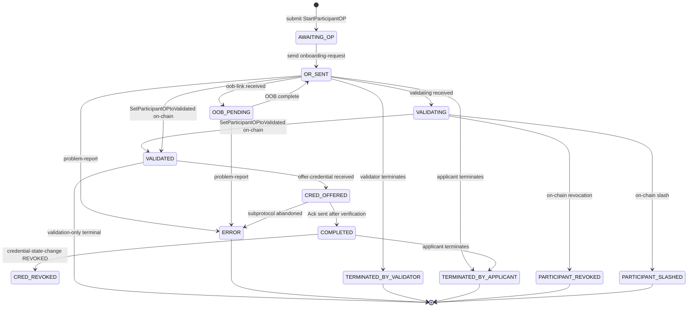
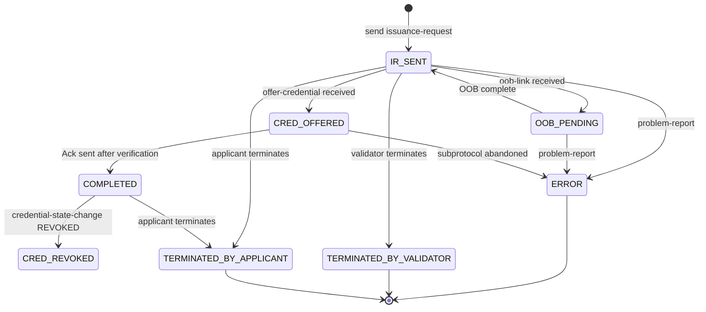
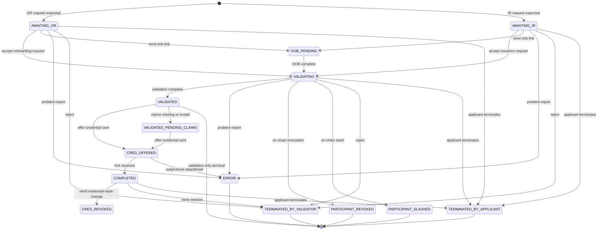
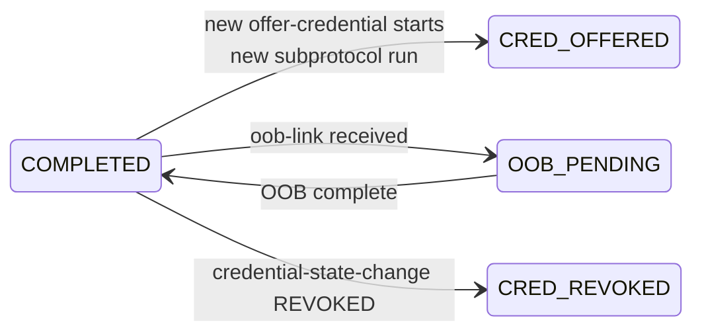

# Verifiable Trust Flow Protocol 1.0 (vt-flow)

- **Status:** DRAFT
- **Parent specification:** [VS Agent Specification](../vs-agent/spec.md) — this document specifies the DIDComm wire protocol for the credential acquisition flows defined there.
- **DIDComm Envelope Compatibility:** Envelope-agnostic — a single v1.0 protocol carried by either DIDComm v1 (Aries-style) or DIDComm v2 envelopes. See [DIDComm Envelope Compatibility](#didcomm-envelope-compatibility).

## Summary

This document is the **normative DIDComm protocol definition** for the Participant and credential acquisition flows specified in the [VS Agent Specification](../vs-agent/spec.md). It extracts the wire-level protocol detail into a self-contained reference so that implementers can focus on DIDComm message formats, state machines, and error semantics independently of agent-level behaviour.

The **Verifiable Trust Flow Protocol** (`vt-flow`) is a DIDComm superprotocol that orchestrates the acquisition of a Verifiable Trust Credential between an **Applicant** and a **Validator**. It carries VPR-specific state (`participant_id`, `participant_session_id`, `agent_participant_id`, `wallet_agent_participant_id`) across a multi-step flow and delegates credential delivery to the [Issue Credential V2 protocol (RFC 0453)][rfc0453] as a subprotocol, linked via the DIDComm thread / parent-thread mechanism (per [RFC 0008][rfc0008] in v1 envelopes, and equivalent `thid`/`pthid` fields in v2 envelopes).

`vt-flow` covers two flow variants defined in the [VS Agent Specification](../vs-agent/spec.md):

- **Onboarding Process** ([VSA-VTI-FLOW-OP](../vs-agent/spec.md#vsa-vti-flow-op-onboarding-processes)) — required when a Credential Schema's onboarding mode is `GRANTOR_ONBOARDING_PROCESS` or `ECOSYSTEM_ONBOARDING_PROCESS`. The Applicant first creates an on-chain Onboarding Process (`StartParticipantOP`) before DIDComm interaction. The Validator performs off-chain validation, transitions the on-chain `Participant` to `VALIDATED` (`SetParticipantOPtoValidated`), then issues a credential when the validated `Participant` role is `HOLDER`, and issues none for any other role (see [Issuance After Validation](../vs-agent/spec.md#vsa-vti-flow-op-issue-issuance-after-validation)). Validation-only outcomes are the terminal states of the other roles.
- **Credential Direct Issuance** ([VSA-VTI-FLOW-DI](../vs-agent/spec.md#vsa-vti-flow-di-credential-direct-issuance)) — used when the Applicant is a `HOLDER`, the Validator is an `ISSUER`, and the schema permits direct issuance (`holder_onboarding_mode` = `PERMISSIONLESS`). No on-chain Onboarding Process is required.

Both variants share the same state machine, message set, and error model. They differ only in the initial request message (`onboarding-request` vs `issuance-request`) and in whether an on-chain Onboarding Process precedes credential delivery.

## Motivation

Verana VS onboarding and credential issuance require coordination between DIDComm sessions and on-chain transactions. The `vt-flow` protocol addresses this by defining a DIDComm protocol that:

- Authenticates both sides as Verifiable Services (see [[VS-CONN-VS]][vt-spec-conn-vs]) before data exchange.
- Carries `participant_id` / `participant_session_id` / `agent_participant_id` / `wallet_agent_participant_id` in-band so both agents can coordinate on-chain transactions against a shared session.
- Delegates credential delivery to [Issue Credential V2][rfc0453], reusing its format negotiation, attachment machinery, and state handling without reimplementation.
- Adopts [Problem Report (RFC 0035)][rfc0035] for errors so existing DIDComm tooling handles them uniformly.
- Keeps the DIDComm connection open after `COMPLETED` so the Validator can push credential state changes (e.g., `CRED_REVOKED`) through the same authenticated channel.

## Protocol Definition

### Name and Version

- **Protocol Name:** `vt-flow`
- **Version:** 1.0
- **Protocol URI:** `https://didcomm.org/vt-flow/1.0`

Message type URIs follow the pattern:
```
https://didcomm.org/vt-flow/1.0/<message-name>
```

### Protocol Identification

The protocol is identified by the message type URI of the first vt-flow message received on the connection (`onboarding-request` or `issuance-request`).

### Key Concepts

| Concept | Description |
|---|---|
| **Verifiable Trust Credential (VTC)** | A W3C Verifiable Credential (JSON-LD) governed by a Verana Credential Schema. |
| **Credential Schema** | An on-chain resource in the VPR that defines the format and validation rules for a credential. Each schema has onboarding modes (`issuer_onboarding_mode`, `verifier_onboarding_mode`, `holder_onboarding_mode`) that determine whether an Onboarding Process is required. |
| **Participant** | An on-chain record granting a DID a specific role (`ISSUER`, `VERIFIER`, `HOLDER`, `ISSUER_GRANTOR`, `VERIFIER_GRANTOR`) for a schema. Obtained either directly (`OPEN` mode) or through an Onboarding Process. |
| **Onboarding Process (OP)** | An on-chain state transition used when a Credential Schema requires validator approval. Initiated with `StartParticipantOP`, transitioned to `VALIDATED` with `SetParticipantOPtoValidated`. |
| **Participant Session** | An on-chain record created by `CreateOrUpdateParticipantSession` that binds a specific credential issuance to a validator's Participant. Identified by `participant_session_id`. |
| **vt-flow session** | A DIDComm conversation between an Applicant and a Validator identified by the `thid` of the first vt-flow message. |
| **Superprotocol / Subprotocol** | Per [RFC 0003][rfc0003], `vt-flow` is the outer (super)protocol; Issue Credential V2 runs nested inside a vt-flow session and is linked via `~thread.pthid`. |

### Two Identifiers, Two Purposes

Two identifiers carry session semantics in vt-flow. They serve different layers and **MUST NOT** be conflated:

| Identifier | Layer | Purpose |
|---|---|---|
| `thid` (DIDComm `~thread.thid`) | DIDComm correlation | Links all vt-flow messages in one session, and carried as `pthid` on all Issue Credential V2 subprotocol messages. Equals the `@id` of the initial `onboarding-request` or `issuance-request`. |
| `participant_session_id` (vt-flow message body field) | On-chain / VPR | Identifier used for `CreateOrUpdateParticipantSession`. Also used by the Validator to re-attach an existing flow to a new DIDComm connection on reconnection (see [Reconnection](#reconnection)). |

### Roles

Two roles participate in `vt-flow`:

- **Applicant** — the party requesting a credential. Always initiates the DIDComm connection. The Applicant may be any of: `ISSUER_GRANTOR`, `VERIFIER_GRANTOR`, `ISSUER`, `VERIFIER`, or `HOLDER`, depending on the schema and target Participant role.
- **Validator** — the party authorized to validate and, when the Applicant is a `HOLDER`, issue the credential. The Validator may be an `ECOSYSTEM` controller, `ISSUER_GRANTOR`, `VERIFIER_GRANTOR`, or `ISSUER`.

The valid Applicant/Validator pairings are enumerated in the [VS Agent Specification](../vs-agent/spec.md#vsa-vti-flow-op-onboarding-processes).

### Verifiable Service Identity Check

Per [[VS-CONN-VS]][vt-spec-conn-vs], both parties **MUST** verify the peer is a Verifiable Service at the protocol level:

- The **Validator MUST** perform the check **on receipt of the first vt-flow message** (`onboarding-request` or `issuance-request`).
- The **Applicant MUST** perform the check **before sending** the first vt-flow message.

On check failure, the failing party **MUST** terminate the session with `problem-report` code `vt-flow.not-a-verifiable-service` (Flow State transitions to `ERROR`).

Implementations MAY cache VS-CONN-VS results to avoid redundant trust resolution if the result was obtained recently.

The DIDComm-version-specific binding mechanism (e.g., DID Exchange Request DID under v1, `from_prior` header under v2) is independent of vt-flow itself and is not normative for this protocol. Under DIDComm v1, a Validator MAY perform the VS-CONN-VS check earlier (before sending the DID Exchange response) as an optimisation to avoid establishing a connection that will be terminated immediately.

### States

Each vt-flow session has **two orthogonal state dimensions**:

1. **Connection State** — state of the underlying DIDComm connection.
2. **Flow State** — stage of the vt-flow credential acquisition flow.

#### Connection State

| Value | Description |
|---|---|
| `NOT_CONNECTED` | No DIDComm connection established, handshake in progress, or the existing connection is closed. |
| `ESTABLISHED` | DIDComm connection fully open; vt-flow messages can be exchanged. For the Validator, the VS-CONN-VS check has also passed. |
| `TERMINATED` | Connection permanently closed (handshake abandoned, or the connection record was deleted). |

#### Flow State

All states enumerated below are normative.

| Flow State | Applies to | Flow | Description |
|---|---|---|---|
| `AWAITING_OP` | Applicant | Onboarding Process | `NOT_CONNECTED`. Waiting for the Applicant to submit or renew a `StartParticipantOP` / `RenewParticipantOP`. |
| `OR_SENT` | Applicant | Onboarding Process | `ESTABLISHED`. `onboarding-request` sent to Validator. |
| `AWAITING_OR` | Validator | Onboarding Process | `ESTABLISHED`. `onboarding-request` expected but not yet received, or last request was rejected (Applicant may retry). |
| `IR_SENT` | Applicant | Direct Issuance | `ESTABLISHED`. `issuance-request` sent to Validator. |
| `AWAITING_IR` | Validator | Direct Issuance | `ESTABLISHED`. `issuance-request` expected but not yet received, or last request was rejected (Applicant may retry). |
| `OOB_PENDING` | Both | Both | `ESTABLISHED`. Validator sent an `oob-link`; awaiting Applicant completion. |
| `VALIDATING` | Both | Both | `ESTABLISHED`. Validator performing off-chain validation (Onboarding Process) or processing an accepted issuance request (Direct Issuance). |
| `VALIDATED` | Both | Onboarding Process | `ESTABLISHED`. Validator called `SetParticipantOPtoValidated` on-chain; `op_state` is now `VALIDATED`. Terminal state when the validated `Participant` role is not `HOLDER`: no credential is issued. When the role is `HOLDER`, the Validator sends `offer-credential` (transition to `CRED_OFFERED`), or moves to `VALIDATED_PENDING_CLAIMS` when it holds no claim set that satisfies the schema (see [Issuance After Validation](../vs-agent/spec.md#vsa-vti-flow-op-issue-issuance-after-validation)). |
| `VALIDATED_PENDING_CLAIMS` | Validator | Onboarding Process | `ESTABLISHED`. `op_state` is `VALIDATED` and the role is `HOLDER`, but the Validator holds no claim set that satisfies the schema. The Validator obtains the claims out of band, then sends `offer-credential`. The Applicant stays in `VALIDATED`. |
| `CRED_OFFERED` | Both | Both | `ESTABLISHED`. Issue Credential V2 subprotocol in flight. Applicant verifies on-chain digest while in this state; acceptance transitions to `COMPLETED`. |
| `COMPLETED` | Both | Both | `ESTABLISHED`. Credential delivered, verified, and accepted (Issue Credential V2 Ack sent). Connection remains open for future updates. |
| `CRED_REVOKED` | Both | Both | `ESTABLISHED`. Validator sent `credential-state-change` with `state=REVOKED`. Applicant removed the linked VP, if any, and deleted the credential. Connection remains open. |
| `TERMINATED_BY_VALIDATOR` | Both | Both | `TERMINATED`. Validator explicitly terminated the flow (rejection, timeout, or policy decision). |
| `TERMINATED_BY_APPLICANT` | Both | Both | `TERMINATED`. Applicant explicitly terminated the flow. |
| `ERROR` | Both | Both | `TERMINATED`. Unrecoverable protocol error (subprotocol `abandoned`, VS-CONN-VS failure, unreachable peer). |
| `PARTICIPANT_REVOKED` | Both | Onboarding Process | `TERMINATED`. On-chain Participant revoked (notification via indexer); Validator closed the connection. |
| `PARTICIPANT_SLASHED` | Both | Onboarding Process | `TERMINATED`. On-chain Participant slashed; Validator closed the connection. |

#### Error Handling

All protocol errors are modelled with the adopted `problem-report` message (see [Problem Report (adopted)](#problem-report-adopted)). Errors that allow retry (e.g., `vt-flow.invalid-claims`) return the Validator to `AWAITING_OR` / `AWAITING_IR` and allow the Applicant to resend a corrected request. Fatal errors **MUST** transition both parties' Flow State to `ERROR` and Connection State to `TERMINATED`.

Errors during the Issue Credential V2 subprotocol use the subprotocol's own `problem-report` message. The vt-flow Flow State transitions to `ERROR` when the subprotocol exchange transitions to `abandoned`.

### Flow Variants

#### Onboarding Process Flow

```text
Applicant                          VPR (Chain)                    Validator
    │                                  │                              │
    │ 1. StartParticipantOP            │                              │
    │ ────────────────────────────────>│                              │
    │ ← participant_id (op_state=PENDING) │                           │
    │                                  │                              │
    │ 2. DIDComm implicit invitation   │                              │
    │ ───────────────────────────────────────────────────────────────>│
    │                                  │                              │
    │ ─── vt-flow protocol begins ─────────────────────────────────── │
    │                                  │                              │
    │ 3. onboarding-request            │                              │
    │ ───────────────────────────────────────────────────────────────>│
    │    (Validator runs VS-CONN-VS check on receipt)                 │
    │                                  │                              │
    │   (optional) oob-link            │                              │
    │ <───────────────────────────────────────────────────────────────│
    │                                  │                              │
    │   (optional) validating          │                              │
    │ <───────────────────────────────────────────────────────────────│
    │                                  │                              │
    │                                  │ 4. SetParticipantOPtoValidated │
    │                                  │<─────────────────────────────│
    │                                  │                              │
    │   Flow State: VALIDATED (terminal unless role is HOLDER)        │
    │                                  │                              │
    │ ────── steps 5-10: only when the validated role is HOLDER       │
    │                                  │                              │
    │                                  │ 5. Generate credential       │
    │                                  │                              │
    │   5b. credential-terms           │                              │
    │ <───────────────────────────────────────────────────────────────│
    │                                  │                              │
    │ ┌────── Issue Credential V2 subprotocol (pthid = vt-flow thid) ─┐
    │ │ 6. offer-credential            │                              │ │
    │ │ <──────────────────────────────────────────────────────────── │ │
    │ │ 7. request-credential          │                              │ │
    │ │ ──────────────────────────────────────────────────────────────>│
    │ │                                  │                              │ │
    │ │                                  │ 8. CreateOrUpdate            │ │
    │ │                                  │    ParticipantSession        │ │
    │ │                                  │    MUST succeed BEFORE       │ │
    │ │                                  │    sending issue-credential  │ │
    │ │                                  │<─────────────────────────────│ │
    │ │                                  │                              │ │
    │ │ 9. issue-credential            │                              │ │
    │ │    (with ~please_ack)          │                              │ │
    │ │ <──────────────────────────────────────────────────────────── │ │
    │ │                                  │                              │ │
    │ │  Applicant MUST verify validator   │                              │ │
    │ │  authorization + recompute digest   │                              │ │
    │ │  against on-chain session record    │                              │ │
    │ │                                  │                              │ │
    │ │ 10. ack                        │                              │ │
    │ │ ──────────────────────────────────────────────────────────────>│
    │ └───────────────────────────────────────────────────────────────┘
    │                                  │                              │
    │  Flow State: COMPLETED                                          │
    │  Connection remains OPEN for future credential-state-change     │
```

#### Direct Issuance Flow

```text
Applicant                          VPR (Chain)                    Validator
    │                                  │                              │
    │ 1. DIDComm implicit invitation   │                              │
    │ ───────────────────────────────────────────────────────────────>│
    │                                  │                              │
    │ ─── vt-flow protocol begins ─────────────────────────────────── │
    │                                  │                              │
    │ 2. issuance-request              │                              │
    │ ───────────────────────────────────────────────────────────────>│
    │    (Validator runs VS-CONN-VS check on receipt)                 │
    │                                  │                              │
    │   (optional) oob-link            │                              │
    │ <───────────────────────────────────────────────────────────────│
    │                                  │                              │
    │                                  │ 3. Generate credential       │
    │                                  │                              │
    │   3b. credential-terms           │                              │
    │ <───────────────────────────────────────────────────────────────│
    │                                  │                              │
    │ ┌────── Issue Credential V2 subprotocol (pthid = vt-flow thid) ─┐
    │ │ 4. offer-credential            │                              │ │
    │ │ <──────────────────────────────────────────────────────────── │ │
    │ │ 5. request-credential          │                              │ │
    │ │ ──────────────────────────────────────────────────────────────>│
    │ │                                  │                              │ │
    │ │                                  │ 6. CreateOrUpdate            │ │
    │ │                                  │    ParticipantSession        │ │
    │ │                                  │    MUST succeed BEFORE       │ │
    │ │                                  │    sending issue-credential  │ │
    │ │                                  │<─────────────────────────────│ │
    │ │                                  │                              │ │
    │ │ 7. issue-credential            │                              │ │
    │ │ <──────────────────────────────────────────────────────────── │ │
    │ │ 8. ack                         │                              │ │
    │ │ ──────────────────────────────────────────────────────────────>│
    │ └───────────────────────────────────────────────────────────────┘
    │                                  │                              │
    │  Flow State: COMPLETED                                          │
```

Both variants converge on the Issue Credential V2 subprotocol when issuance occurs. The subprotocol runs on its own `thid` but every message carries `~thread.pthid` pointing to the vt-flow session's `thid`. Both agents use `pthid` to correlate subprotocol messages with the outer vt-flow state machine.

**Normative precondition for credential delivery:** The `issue-credential` subprotocol message **MUST NOT** be sent until the Validator's `CreateOrUpdateParticipantSession` transaction has succeeded on-chain. The preceding subprotocol messages (`offer-credential`, `request-credential`) MAY happen before the on-chain session is created — only the credential delivery itself is blocked on it.

## Messages

All vt-flow messages use DIDComm v1 envelope format with `@type`, `@id`, and `~thread` decorators. Message fields are top-level alongside these decorators (not nested in a `body` object). See [DIDComm Envelope Compatibility](#didcomm-envelope-compatibility) for the v2 mapping.

### onboarding-request

Sent by the Applicant to initiate an Onboarding Process flow. **MUST** be the first vt-flow message sent in this variant. The message's `@id` becomes the vt-flow session's `thid`.

```json
{
  "@type": "https://didcomm.org/vt-flow/1.0/onboarding-request",
  "@id": "<uuid>",
  "~thread": {
    "thid": "<same as @id>"
  },
  "participant_id": "<applicant Participant id, from StartParticipantOP>",
  "participant_session_id": "<applicant-generated uuid for the ParticipantSession>",
  "agent_participant_id": "<see field descriptions>",
  "wallet_agent_participant_id": "<see field descriptions>",
  "claims": {},
  "proofs~attach": [
    {
      "@id": "<attachment identifier>",
      "mime-type": "application/json",
      "format": "aries/ld-proof-vp@v1.0",
      "data": { "base64": "<bytes for base64>" }
    }
  ]
}
```

**Field descriptions:**

| Field | Type | Required | Description |
|---|---|---|---|
| `participant_id` | string | REQUIRED | The Applicant's on-chain `Participant.id` created via `StartParticipantOP`. The Validator validates this on-chain before transitioning to `VALIDATING`. |
| `participant_session_id` | string (UUIDv4) | REQUIRED | UUIDv4 generated by the Applicant for the eventual on-chain `ParticipantSession`. Used by the Validator to re-attach an existing flow on reconnection. |
| `agent_participant_id` | string | REQUIRED | If the Applicant's Service credential was issued by another agent (delegated mode), the `validator_participant_id` of the Applicant's Participant for that Service credential's validator. If the Service credential is self-issued (standalone mode), the `id` of the Applicant's own Service credential ISSUER Participant. |
| `wallet_agent_participant_id` | string | REQUIRED | Wallet counterpart of `agent_participant_id`, same semantics. |
| `claims` | object | OPTIONAL | Credential claims the Applicant proposes. Validator MAY override. |
| `proofs~attach` | array | OPTIONAL | Supporting proofs as DIDComm attachments ([RFC 0017][rfc0017]). See [`proofs~attach` Format Registry](#proofsattach-format-registry). |

Upon receipt, the Validator **MUST** either accept and transition Flow State to `VALIDATING`, or reject with `problem-report` using a code from the [Error Codes](#error-codes) registry.

### issuance-request

Sent by the Applicant to initiate a Direct Issuance flow. Same shape as `onboarding-request` but carries `schema_id` instead of `participant_id`.

```json
{
  "@type": "https://didcomm.org/vt-flow/1.0/issuance-request",
  "@id": "<uuid>",
  "~thread": { "thid": "<same as @id>" },
  "schema_id": "<VPR credential schema id>",
  "participant_session_id": "<applicant-generated uuid>",
  "agent_participant_id": "<see onboarding-request>",
  "wallet_agent_participant_id": "<see onboarding-request>",
  "claims": {},
  "proofs~attach": []
}
```

| Field | Type | Required | Description |
|---|---|---|---|
| `schema_id` | string | REQUIRED | The VPR Credential Schema ID of the desired credential. |
| *others* | | | As in `onboarding-request`. |

### oob-link

Sent by the Validator when additional information outside of DIDComm is required.

```json
{
  "@type": "https://didcomm.org/vt-flow/1.0/oob-link",
  "@id": "<uuid>",
  "~thread": { "thid": "<vt-flow thid>" },
  "url": "https://example.com/verify/abc123",
  "description": "Please upload a proof of residence (PDF or image).",
  "expires_time": "2026-04-26T12:00:00Z"
}
```

| Field | Type | Required | Description |
|---|---|---|---|
| `url` | string | REQUIRED | Absolute HTTPS URL where the Applicant completes the OOB step. **MUST** be unique to this session (e.g., include a capability token). |
| `description` | string | REQUIRED | Human-readable explanation. Follows DIDComm l10n conventions ([RFC 0043][rfc0043]). |
| `expires_time` | string (ISO 8601) | OPTIONAL | Deadline after which the URL becomes invalid. |

`oob-link` **MAY** be sent multiple times during a session, including after `COMPLETED` for revalidation or extension.

### validating

Informational message sent by the Validator after a request is accepted and validation is in progress.

```json
{
  "@type": "https://didcomm.org/vt-flow/1.0/validating",
  "@id": "<uuid>",
  "~thread": { "thid": "<vt-flow thid>" },
  "comment": "Validating applicant documentation."
}
```

| Field | Type | Required | Description |
|---|---|---|---|
| `comment` | string | OPTIONAL | Human-readable status. |

### credential-terms

Sent by the Validator before `offer-credential`: in an Onboarding Process after Flow State `VALIDATED`, in Direct Issuance after the `issuance-request` is accepted. It states the format of the credential about to be offered and how the Applicant is expected to present it.

```json
{
  "@type": "https://didcomm.org/vt-flow/1.0/credential-terms",
  "@id": "<uuid>",
  "~thread": { "thid": "<vt-flow thid>" },
  "credential_format": "JSON_LD",
  "present_as_linked_vp": true
}
```

| Field | Type | Required | Description |
|---|---|---|---|
| `credential_format` | string | REQUIRED | Format of the credential to be offered. `JSON_LD` (a W3C JSON-LD Verifiable Trust Credential delivered as `aries/ld-proof-vc@v1.0`) is the only value defined in this version. |
| `present_as_linked_vp` | boolean | REQUIRED | Whether the Applicant publishes the credential, once accepted, as a `LinkedVerifiablePresentation` entry of its DID Document (VT-CRED-W3C-LINKED-VP of the [Verifiable Trust Specification][vt-spec]). |

- The Validator **MUST** send `credential-terms` before the first `offer-credential` of a session, and **MAY** send it again before a later offer (credential update, renewal); the most recent terms apply to the next offer.
- The Applicant **MUST** check the terms against the rules it can read: ECS Service, Organization and Persona credentials MUST be presented as linked VPs (VS-REQ-2 to VS-REQ-4); ECS Badge and UserAgent credentials MUST NOT be declared in a DID Document; the presentation policy of the `CredentialSchema` entry, when the VPR carries one. An Applicant that cannot honour the terms **MUST** answer with `problem-report` code `vt-flow.unsupported-terms` and **MUST NOT** accept the offer; the Validator **MAY** send corrected terms. Otherwise the Applicant stores the terms on the session, applies them when it accepts the credential, and keeps them with the credential for its later update, renewal and revocation.
- An `offer-credential` received without prior `credential-terms` in the session is treated as `credential_format` = `JSON_LD` and `present_as_linked_vp` = `true`.

`credential-terms` does not change the Flow State.

### credential-state-change

Sent by the Validator to notify the Applicant of a post-issuance change to the credential's status. The connection remains open after `COMPLETED` specifically to carry these updates.

```json
{
  "@type": "https://didcomm.org/vt-flow/1.0/credential-state-change",
  "@id": "<uuid>",
  "~thread": { "thid": "<vt-flow thid>" },
  "subprotocol_thid": "<Issue Credential V2 thread id of the credential being updated>",
  "state": "REVOKED",
  "reason": "Participant revoked on-chain."
}
```

| Field | Type | Required | Description |
|---|---|---|---|
| `subprotocol_thid` | string | REQUIRED | The `thid` of the Issue Credential V2 subprotocol exchange that issued the affected credential. |
| `state` | string | REQUIRED | Credential status. Open enum; v1.0 defines one normative value. |
| `reason` | string | OPTIONAL | Human-readable explanation. |

**State values (v1.0):**

| Value | Applicant response |
|---|---|
| `REVOKED` | Applicant **MUST** remove the corresponding `LinkedVerifiablePresentation` from its DID Document, when the credential was presented as one, and delete the credential from its credential store. Flow State transitions to `CRED_REVOKED`. The DIDComm connection remains open. |

**Forward compatibility:** Receivers **MUST** accept messages with unknown `state` values without error and **MAY** ignore them. This allows future versions to extend the enum (e.g., `REACTIVATED`, `SUSPENDED`, `UNSUSPENDED`, `RENEWED`) without breaking v1.0 parsers.

### problem-report (adopted)

Adopted from [RFC 0035 Report Problem][rfc0035]. Used for all protocol errors. The `description.code` field **MUST** be one of the codes listed in the [Error Codes](#error-codes) registry. Conforms to RFC 0035 on-the-wire format:

```json
{
  "@type": "https://didcomm.org/report-problem/1.0/problem-report",
  "@id": "<uuid>",
  "~thread": { "thid": "<vt-flow thid>" },
  "description": {
    "code": "vt-flow.invalid-claims",
    "en": "Submitted claims do not satisfy the schema."
  },
  "who_retries": "you",
  "impact": "thread"
}
```

Values for `who_retries`, `impact`, and `where` follow RFC 0035 conventions (lowercase). Errors in the Issue Credential V2 subprotocol use the subprotocol's own problem-report message type (`https://didcomm.org/issue-credential/2.0/problem-report`), **not** this adopted message. The `pthid` on that subprotocol problem-report links it to the vt-flow session.

## Subprotocols

`vt-flow` invokes [Issue Credential V2 (RFC 0453)][rfc0453] on a **new thread** whose messages **MUST** carry `~thread.pthid` equal to the parent vt-flow session's `thid`.

**Initiation:** The Validator sends [`credential-terms`](#credential-terms), then initiates the subprotocol by sending `offer-credential`. In an Onboarding Process, the subprotocol runs only when the validated `Participant` role is `HOLDER`, and MAY start at any time after Flow State `VALIDATED` once the Validator holds a claim set that satisfies the `json_schema` of the schema (see [Issuance After Validation](../vs-agent/spec.md#vsa-vti-flow-op-issue-issuance-after-validation)); in Direct Issuance, it MAY start after accepting the request. The only hard constraint is: **the `issue-credential` message MUST NOT be sent until `CreateOrUpdateParticipantSession` has succeeded on-chain.**

**Credential format and presentation:** in this version, vt-flow issues W3C Verifiable Trust Credentials only, delivered in the `aries/ld-proof-vc@v1.0` format (W3C JSON-LD Verifiable Credential, [RFC 0593][rfc0593]) inside the Issue Credential V2 subprotocol, and whether the Applicant publishes the credential it accepts as a `LinkedVerifiablePresentation` entry of its DID Document (VT-CRED-W3C-LINKED-VP of the [Verifiable Trust Specification][vt-spec]) is set by the [`credential-terms`](#credential-terms) message of the session (default: published). Other credential formats and further presentation policies will be defined in future versions of this protocol.

**Verification before Ack:** The Applicant **MUST NOT** send the Issue Credential V2 `ack` until it has verified the received credential. Before sending the Ack, the Applicant **MUST**:
1. Query the VPR to confirm the Validator has an active `ISSUER` Participant for the schema.
2. Recompute the credential's digest and verify it matches the digest recorded in the `ParticipantSession` created by `CreateOrUpdateParticipantSession`.

If verification succeeds, the Applicant sends the Ack. If verification fails, the Applicant sends a subprotocol problem-report instead and the subprotocol transitions to `abandoned`; the vt-flow session transitions to `ERROR`.

### Superprotocol/Subprotocol Event Correlation

The vt-flow session correlates with its Issue Credential V2 subprotocol through `~thread.pthid` on every subprotocol message. Implementations observe subprotocol state transitions and map them to vt-flow Flow State transitions:

| Subprotocol state | Applicant vt-flow transition | Validator vt-flow transition |
|---|---|---|
| `offer-sent` | — | `CRED_OFFERED` |
| `offer-received` | `CRED_OFFERED` | — |
| `request-sent` / `request-received` | (no transition) | (no transition) |
| `credential-issued` | — | (no transition) |
| `credential-received` | *(perform on-chain digest verification, then either Ack or problem-report)* | — |
| `done` | `COMPLETED` | `COMPLETED` |
| `abandoned` | `ERROR` (Connection → `TERMINATED`) | `ERROR` (Connection → `TERMINATED`) |

Receiving `credential-received` on the Applicant side is the hook point for on-chain digest verification.

## Reconnection

If the Applicant reconnects after a connection closes:

1. The Applicant **MUST** establish a new DIDComm connection (via implicit invitation to the Validator's DID).
2. The Applicant **MUST** resend an `onboarding-request` or `issuance-request` matching the original, carrying the **same** `participant_session_id`, `agent_participant_id`, `wallet_agent_participant_id`, and (for Onboarding Process) `participant_id` or (for Direct Issuance) `schema_id`.
3. The Validator **MUST** recognize the request as belonging to an existing session by matching on `participant_session_id` (plus `participant_id` or `schema_id` for defence-in-depth) and re-attach the existing flow to the new connection.
4. The reattached flow's Flow State resumes from whatever stage it was in when the connection dropped.

If the Validator cannot find a matching session, a new session is created normally.

## State Machine Diagrams

Diagrams show the **Flow State** dimension only. Connection State transitions (`NOT_CONNECTED → ESTABLISHED → TERMINATED`) are implicit and accompany the Flow State changes shown.

### Applicant — Onboarding Process Flow



### Applicant — Direct Issuance Flow



### Validator — Unified State Machine



### Post-Issuance Transitions from `COMPLETED`

While in the `COMPLETED` Flow State, the DIDComm connection remains open. A fresh `offer-credential` received from the Validator starts a **new Issue Credential V2 subprotocol run** with a new subprotocol `thid` but the same `pthid` equal to the vt-flow session's `thid`.



## Reference

### Message Type URIs

All vt-flow message types use the base URI `https://didcomm.org/vt-flow/1.0/`.

| Message | Type URI |
|---|---|
| onboarding-request | `https://didcomm.org/vt-flow/1.0/onboarding-request` |
| issuance-request | `https://didcomm.org/vt-flow/1.0/issuance-request` |
| oob-link | `https://didcomm.org/vt-flow/1.0/oob-link` |
| validating | `https://didcomm.org/vt-flow/1.0/validating` |
| credential-terms | `https://didcomm.org/vt-flow/1.0/credential-terms` |
| credential-state-change | `https://didcomm.org/vt-flow/1.0/credential-state-change` |
| problem-report (adopted) | `https://didcomm.org/report-problem/1.0/problem-report` |

Issue Credential V2 subprotocol messages use their canonical URIs (`https://didcomm.org/issue-credential/2.0/<name>`).

### Error Codes

Error codes are carried in the adopted `problem-report`'s `description.code` field. The field `impact` drives state-machine response as defined by [RFC 0035][rfc0035].

| Code | Sender | Meaning | `who_retries` | `impact` |
|---|---|---|---|---|
| `vt-flow.or-required` | Validator | Expected `onboarding-request` but received a different vt-flow message. | `you` | `thread` |
| `vt-flow.ir-required` | Validator | Expected `issuance-request` but received a different vt-flow message. | `you` | `thread` |
| `vt-flow.unsupported-message` | Either | Received a message type not supported in the current state. Note: if this is the first message on the connection, senders **SHOULD** prefer `vt-flow.or-required` / `vt-flow.ir-required` over the generic code. | `none` | `connection` |
| `vt-flow.invalid-participant-id` | Validator | `participant_id` does not exist, does not reference the Validator's Participant, or is in the wrong `op_state`. | `you` | `thread` |
| `vt-flow.invalid-schema-id` | Validator | `schema_id` does not exist or is not supported by the Validator. | `you` | `thread` |
| `vt-flow.invalid-agent-participant-id` | Validator | `agent_participant_id` is malformed or does not resolve on-chain. | `you` | `thread` |
| `vt-flow.invalid-wallet-agent-participant-id` | Validator | `wallet_agent_participant_id` is malformed or does not resolve on-chain. | `you` | `thread` |
| `vt-flow.invalid-claims` | Validator | Submitted `claims` do not satisfy the schema. | `you` | `thread` |
| `vt-flow.invalid-participant-session-id` | Validator | `participant_session_id` is malformed or collides with an existing session. | `you` | `thread` |
| `vt-flow.not-a-verifiable-service` | Either | Peer's DID does not satisfy [[VS-CONN-VS]][vt-spec-conn-vs]. | `none` | `connection` |
| `vt-flow.validation-failed` | Validator | Off-chain validation of submitted documentation failed. | `you` (OPTIONAL) | `thread` |
| `vt-flow.validation-refused` | Validator | The Validator refused the request after its off-chain validation; the flow is terminated. | `none` | `thread` |
| `vt-flow.oob-expired` | Validator | OOB link expired before Applicant completed the step. | `you` | `thread` |
| `vt-flow.unsupported-terms` | Applicant | The Applicant cannot honour the `credential-terms`, or they conflict with the Verifiable Trust rules. | `you` | `thread` |
| `vt-flow.session-terminated` | Either | Party explicitly terminated the session. | `none` | `thread` |
| `vt-flow.internal-error` | Either | Unspecified error. | varies | `thread` |

Errors during the Issue Credential V2 subprotocol use that protocol's own problem-report with codes like `issuance-abandoned` per [RFC 0453][rfc0453].

### Thread Correlation (`thid` / `pthid`)

Every vt-flow message **MUST** be associated with two logical identifiers:

- `thid` — the vt-flow session's thread id (equals the message id of the initial `onboarding-request` or `issuance-request`).
- `pthid` — optional parent thread id. Set only if vt-flow itself was nested inside a larger parent protocol.

Every message inside the Issue Credential V2 subprotocol **MUST** carry:

- Its own `thid` (the subprotocol's thread id).
- `pthid` set to the parent vt-flow session's `thid`.

The wire encoding of these identifiers depends on the DIDComm envelope version; see [DIDComm Envelope Compatibility](#didcomm-envelope-compatibility) for the concrete shapes.

### DIDComm Envelope Compatibility

`vt-flow` 1.0 is **envelope-agnostic**. The same protocol definition is carried unchanged by either:

- **DIDComm v1** ([Aries RFC 0005][rfc0005], Aries-style envelope), using `@type` / `@id` / `~thread` decorators, or
- **DIDComm v2** ([DIF DIDComm Messaging][didcomm-v2]), using top-level `type` / `id` / `thid` / `pthid` and a `body` envelope.

Message type URIs, field names, state machine, error semantics, and subprotocol composition rules are identical across envelopes. Only the **outer wrapper** (decorator naming, field placement, attachment structure) differs.

#### Mapping

| Logical element | DIDComm v1 (Aries) encoding | DIDComm v2 encoding |
|---|---|---|
| Message type URI | `"@type": "https://didcomm.org/vt-flow/1.0/..."` | `"type": "https://didcomm.org/vt-flow/1.0/..."` |
| Message id | `"@id": "<uuid>"` | `"id": "<uuid>"` |
| Thread id | `"~thread": { "thid": "<uuid>" }` | top-level `"thid": "<uuid>"` |
| Parent thread id | `"~thread": { "pthid": "<uuid>" }` | top-level `"pthid": "<uuid>"` |
| Message body fields | Top-level alongside decorators | Nested in `body` object |
| Attachments | `<field>~attach` suffix ([RFC 0017][rfc0017]) | top-level `attachments` array ([DIDComm v2 Attachments][didcomm-v2-attachments]) |

#### Example: same `onboarding-request` in both envelopes

**DIDComm v1 (Aries):**
```json
{
  "@type": "https://didcomm.org/vt-flow/1.0/onboarding-request",
  "@id": "8a3f7c2b-9e4d-4b1a-8f6c-2e5a7d3b9c1f",
  "~thread": {
    "thid": "8a3f7c2b-9e4d-4b1a-8f6c-2e5a7d3b9c1f"
  },
  "participant_id": "12345",
  "participant_session_id": "f7e9c8a2-4b6d-4e1f-9a3c-5d8b2e7f1a4c",
  "agent_participant_id": "678",
  "wallet_agent_participant_id": "910",
  "claims": { "...": "..." }
}
```

**DIDComm v2 (equivalent):**
```json
{
  "type": "https://didcomm.org/vt-flow/1.0/onboarding-request",
  "id": "8a3f7c2b-9e4d-4b1a-8f6c-2e5a7d3b9c1f",
  "thid": "8a3f7c2b-9e4d-4b1a-8f6c-2e5a7d3b9c1f",
  "body": {
    "participant_id": "12345",
    "participant_session_id": "f7e9c8a2-4b6d-4e1f-9a3c-5d8b2e7f1a4c",
    "agent_participant_id": "678",
    "wallet_agent_participant_id": "910",
    "claims": { "...": "..." }
  }
}
```

#### Canonical examples in this specification

All JSON message examples in [Messages](#messages) use the DIDComm v1 (Aries) encoding as the canonical representation. The transformation to v2 is mechanical and unambiguous per the table above.

#### Negotiation

The DIDComm envelope version is negotiated at the connection / transport layer, not at the vt-flow layer. Implementations **MUST NOT** branch protocol logic on envelope version; the same vt-flow state machine runs over either envelope.

### `proofs~attach` Format Registry

Default format identifier for `proofs~attach` entries:

| Format | Format Identifier | Link | Comment |
|---|---|---|---|
| W3C JSON-LD Verifiable Presentation | `aries/ld-proof-vp@v1.0` | [RFC 0593][rfc0593] | Default for vt-flow v1.0 |

Additional format identifiers **MAY** be negotiated by mutual agreement.

## Drawbacks

1. **Cross-layer coupling.** The protocol couples DIDComm message flow with Verana on-chain transactions. Correct timing is implementation work and cannot be fully specified at the protocol layer.
2. **Session persistence.** Because the connection is kept open after `COMPLETED` to receive `credential-state-change`, implementations must persist vt-flow state across restarts and reconnections.
3. **Atomicity.** Credential delivery and `CreateOrUpdateParticipantSession` are not atomic. A malicious or faulty Validator could record the session but never deliver the credential, or vice-versa. Applicants **MUST** verify the digest against the on-chain session before accepting.

## Prior Art

- [Aries RFC 0003 Protocols][rfc0003] — superprotocol/subprotocol concepts.
- [Aries RFC 0005 DIDComm][rfc0005] — DIDComm v1 envelope.
- [DIF DIDComm Messaging v2.1][didcomm-v2] — DIDComm v2 envelope.
- [Aries RFC 0008 Message ID and Threading][rfc0008] — `thid` / `pthid` mechanics.
- [Aries RFC 0015 ACKs][rfc0015] — adopted Ack semantics.
- [Aries RFC 0017 Attachments][rfc0017] — `~attach` decorator format.
- [Aries RFC 0035 Report Problem][rfc0035] — adopted error message.
- [Aries RFC 0043 l10n][rfc0043] — localization convention.
- [Aries RFC 0183 Revocation Notification][rfc0183] — credential revocation precedent (not adopted).
- [Aries RFC 0453 Issue Credential V2][rfc0453] — credential delivery, used as subprotocol.
- [Aries RFC 0593 JSON-LD Credential Attachment Format][rfc0593] — default `proofs~attach` format.
- [VS Agent Specification](../vs-agent/spec.md) — source of flow semantics and agent behaviour.
- [VPR Specification v4][vpr-v4] — on-chain transaction definitions.
- [Verifiable Trust Specification v4][vt-spec] — VS-CONN-VS, VT-CRED-W3C-LINKED-VP, VT-ECOSYSTEM-DIDDOC.

---

[rfc0003]: https://github.com/hyperledger/aries-rfcs/blob/main/concepts/0003-protocols/README.md
[rfc0008]: https://github.com/hyperledger/aries-rfcs/blob/main/concepts/0008-message-id-and-threading/README.md
[rfc0015]: https://github.com/hyperledger/aries-rfcs/blob/main/features/0015-acks/README.md
[rfc0017]: https://github.com/hyperledger/aries-rfcs/blob/main/concepts/0017-attachments/README.md
[rfc0035]: https://github.com/hyperledger/aries-rfcs/blob/main/features/0035-report-problem/README.md
[rfc0005]: https://github.com/hyperledger/aries-rfcs/blob/main/concepts/0005-didcomm/README.md
[didcomm-v2]: https://identity.foundation/didcomm-messaging/spec/v2.1/
[didcomm-v2-attachments]: https://identity.foundation/didcomm-messaging/spec/v2.1/#attachments
[rfc0043]: https://github.com/hyperledger/aries-rfcs/blob/main/features/0043-l10n/README.md
[rfc0183]: https://github.com/hyperledger/aries-rfcs/blob/main/features/0183-revocation-notification/README.md
[rfc0453]: https://github.com/hyperledger/aries-rfcs/blob/main/features/0453-issue-credential-v2/README.md
[rfc0593]: https://github.com/hyperledger/aries-rfcs/blob/main/features/0593-json-ld-cred-attach/README.md
[vpr-v4]: https://verana-labs.github.io/verifiable-trust-vpr-spec/
[vt-spec]: https://verana-labs.github.io/verifiable-trust-spec/
[vt-spec-conn-vs]: https://verana-labs.github.io/verifiable-trust-spec/#vs-conn-vs
